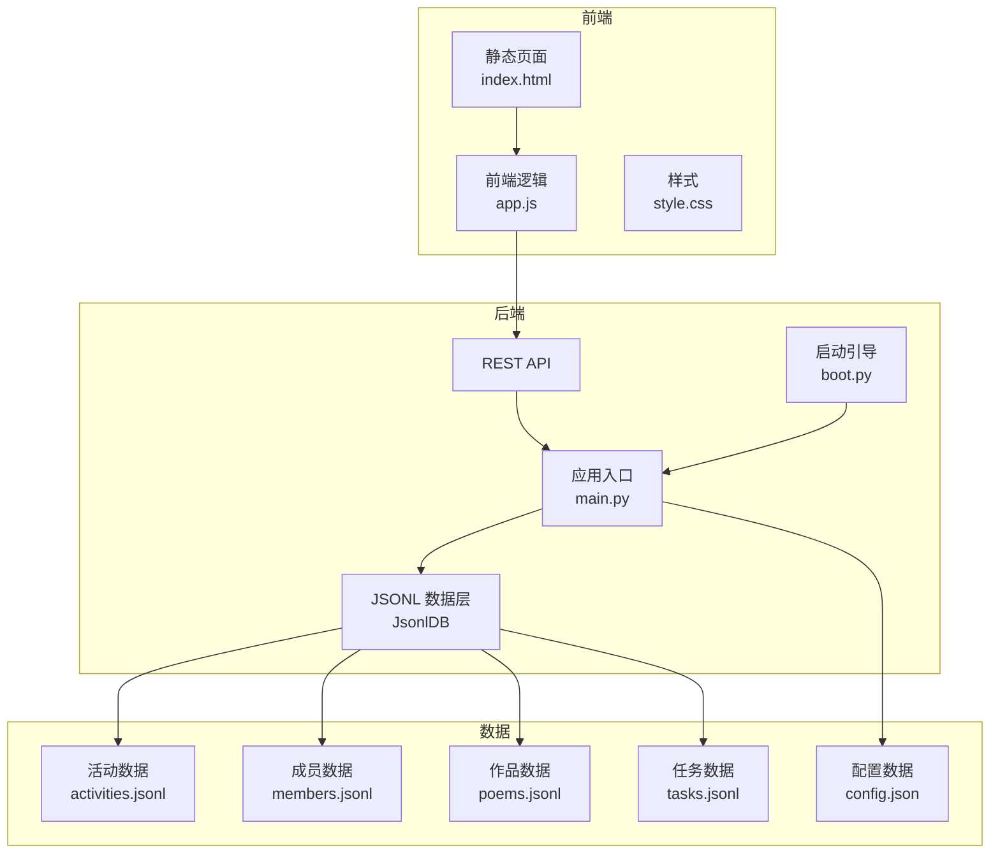
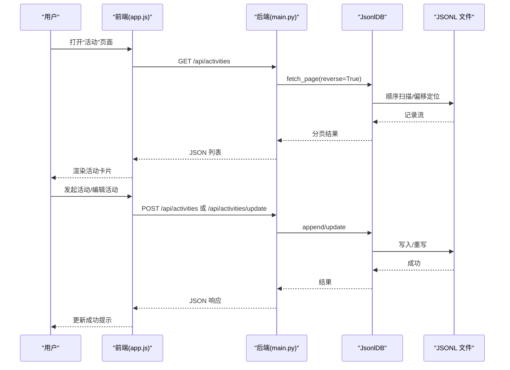
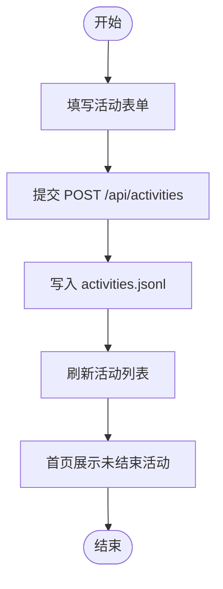
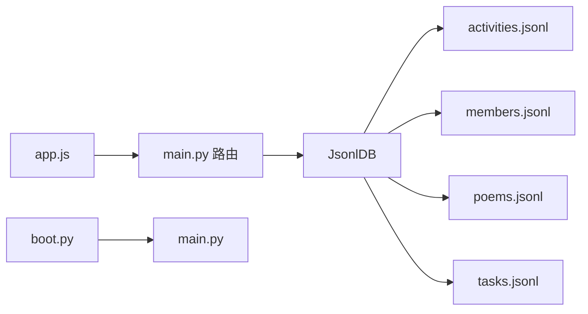

# 活动实体模型

<cite>
**本文引用的文件**
- [main.py](file://main.py)
- [boot.py](file://boot.py)
- [index.html](file://static/index.html)
- [app.js](file://static/app.js)
- [style.css](file://static/style.css)
- [activities.jsonl](file://data/activities.jsonl)
- [members.jsonl](file://data/members.jsonl)
- [tasks.jsonl](file://data/tasks.jsonl)
- [poems.jsonl](file://data/poems.jsonl)
- [config.json](file://data/config.json)
</cite>

## 目录
1. [简介](#简介)
2. [项目结构](#项目结构)
3. [核心组件](#核心组件)
4. [架构总览](#架构总览)
5. [详细组件分析](#详细组件分析)
6. [依赖关系分析](#依赖关系分析)
7. [性能考量](#性能考量)
8. [故障排查指南](#故障排查指南)
9. [结论](#结论)
10. [附录](#附录)

## 简介
本文件面向“围炉诗社·理事台”项目，围绕活动实体模型进行系统化梳理与说明。重点覆盖：
- 活动数据结构与字段规范
- 活动状态管理与状态转换规则
- 活动与成员、积分、任务等模块的关联机制
- 活动类型分类与特殊属性设置
- 发布、报名管理、执行跟踪的完整业务流程
- 查询优化与批量操作的最佳实践

## 项目结构
项目采用前后端分离的嵌入式Web应用模式：
- 后端：基于 MicroPython 的轻量 Web 框架，提供 REST 风格 API
- 前端：纯 HTML/CSS/JavaScript，通过 AJAX 调用后端接口
- 数据：以 JSON Lines 文件形式持久化存储，便于嵌入式部署与维护

图表来源
- [main.py](file://main.py#L1-L548)
- [boot.py](file://boot.py#L1-L122)
- [index.html](file://static/index.html#L1-L269)
- [app.js](file://static/app.js#L1-L1312)

章节来源
- [main.py](file://main.py#L1-L548)
- [boot.py](file://boot.py#L1-L122)
- [index.html](file://static/index.html#L1-L269)

## 核心组件
- 活动实体模型：活动记录的字段集合与约束
- JsonlDB 数据层：对 JSON Lines 文件的增删改查与分页检索
- REST API：活动相关接口（列表、创建、更新、删除）
- 前端界面：活动列表、详情、表单与全局搜索
- 关联模块：成员、积分、任务、作品等

章节来源
- [main.py](file://main.py#L53-L266)
- [app.js](file://static/app.js#L729-L1088)
- [index.html](file://static/index.html#L232-L263)

## 架构总览
活动实体在系统中的位置与交互如下：

图表来源
- [main.py](file://main.py#L371-L408)
- [app.js](file://static/app.js#L733-L849)

## 详细组件分析

### 活动实体模型与字段规范
- 字段清单与含义
  - id：活动唯一标识（整数型，自动递增）
  - title：活动主题（字符串，必填）
  - desc：活动详情/说明（字符串，支持多行）
  - date：活动时间（ISO 8601 日期时间字符串，如需时区可扩展）
  - location：活动地点（字符串，为空表示线上）
  - status：活动状态（字符串枚举）
  - publisher：发布人（字符串）
  - 其他：可根据需要扩展（如报名截止时间、最大参与人数等）

- 字段约束与默认值
  - id：由后端在创建时分配，确保唯一性
  - date：若未提供，默认值策略由后端决定（建议使用当前时间或显式校验）
  - status：默认值通常为“筹备中”，具体取决于前端表单默认选项
  - location：允许为空，渲染时统一显示“线上”

- 数据示例（来源于 activities.jsonl）
  - 示例记录包含：地点、时间、状态、发布人、描述、标题、id
  - 参考路径：[data/activities.jsonl](file://data/activities.jsonl#L1-L7)

章节来源
- [main.py](file://main.py#L384-L389)
- [main.py](file://main.py#L391-L402)
- [index.html](file://static/index.html#L240-L245)
- [activities.jsonl](file://data/activities.jsonl#L1-L7)

### 活动状态管理与状态转换规则
- 状态枚举
  - 筹备中
  - 报名中
  - 进行中
  - 已结束
- 状态转换规则（基于现有实现与界面）
  - 创建活动：默认状态为“筹备中”
  - 编辑活动：可在“筹备中/报名中/进行中/已结束”之间切换
  - 前端渲染：不同状态对应不同颜色标签，便于识别
- 注意事项
  - 当前后端未实现报名截止时间与最大参与人数字段
  - 若需实现报名管理与签到功能，应在活动模型中新增相应字段，并在后端与前端补充相应逻辑

章节来源
- [index.html](file://static/index.html#L240-L245)
- [app.js](file://static/app.js#L773-L779)
- [main.py](file://main.py#L396-L398)

### 活动与成员、积分、任务的关联机制
- 与成员的关系
  - 活动记录包含 publisher（发布人），可用于展示与追溯
  - 成员模块提供积分字段，可用于激励与奖励
- 与任务的关系
  - 任务模块提供积分奖励字段，完成任务可增加成员积分
  - 任务与活动无直接字段关联，可通过活动策划与任务发布联动
- 与作品的关系
  - 活动与作品分别独立存储，可通过活动主题与作品作者等维度进行关联展示

章节来源
- [main.py](file://main.py#L410-L449)
- [members.jsonl](file://data/members.jsonl#L1-L4)
- [tasks.jsonl](file://data/tasks.jsonl#L1-L2)
- [poems.jsonl](file://data/poems.jsonl#L1-L4)

### 活动类型分类与特殊属性设置
- 活动类型分类
  - 当前实现未提供专门的“活动类型”字段
  - 可通过活动主题与描述体现类型（如诗歌创作、文化讲座、户外采风等）
- 特殊属性设置
  - 建议新增字段：报名截止时间、最大参与人数、是否线上、报名名单等
  - 新增字段需同步到前端表单与后端接口

章节来源
- [index.html](file://static/index.html#L236-L246)
- [app.js](file://static/app.js#L786-L849)

### 完整业务流程（发布、报名管理、执行跟踪）
- 发布流程
  - 前端打开“发起活动”表单，填写主题、详情、时间、地点、状态
  - 提交后调用 POST /api/activities，后端写入 JSONL 文件
  - 刷新活动列表，展示最新活动
- 报名管理（建议扩展）
  - 新增报名截止时间与最大参与人数字段
  - 增加报名表单与报名列表，支持报名与取消报名
  - 在活动详情中展示报名状态与剩余名额
- 执行跟踪
  - 活动状态随执行进度推进（筹备中 → 报名中 → 进行中 → 已结束）
  - 前端首页展示最近未结束的活动，按时间排序取前若干条

图表来源
- [main.py](file://main.py#L383-L389)
- [app.js](file://static/app.js#L733-L849)
- [app.js](file://static/app.js#L1068-L1097)

章节来源
- [main.py](file://main.py#L371-L408)
- [app.js](file://static/app.js#L729-L1088)

### 查询优化与批量操作最佳实践
- 查询优化
  - 分页与倒序：后端 fetch_page 支持分页与倒序，适合按时间倒序展示最新活动
  - 搜索：支持按关键词搜索，搜索时遍历全文件，建议控制搜索范围与长度
  - 偏移定位：通过记录行偏移减少随机访问，提升大文件读取效率
- 批量操作
  - 删除与更新：采用临时文件重写策略，保证一致性
  - 建议：对频繁变更的活动列表，前端缓存最新页，避免重复请求
- 存储与性能
  - JSONL 文件体积增长时，建议定期归档与压缩
  - 对高频查询字段（如 date、status）可考虑索引化（当前实现为顺序扫描）

章节来源
- [main.py](file://main.py#L113-L186)
- [main.py](file://main.py#L187-L246)

## 依赖关系分析
- 组件耦合
  - 前端通过 app.js 调用后端 API，耦合点集中在路由与数据格式
  - 后端 JsonlDB 作为通用数据层，被多个模块复用
- 外部依赖
  - Microdot 框架提供路由与响应处理
  - ESP32 平台的文件系统与网络能力

图表来源
- [main.py](file://main.py#L261-L266)
- [boot.py](file://boot.py#L88-L121)
- [app.js](file://static/app.js#L1-L1312)

章节来源
- [main.py](file://main.py#L1-L548)
- [boot.py](file://boot.py#L1-L122)

## 性能考量
- 文件 I/O
  - 顺序扫描与偏移定位相结合，适合中小规模数据
  - 大量写入时建议合并请求，减少频繁重写
- 网络与前端
  - 前端分页与懒加载，降低一次性渲染压力
  - 搜索采用防抖与并发请求，避免阻塞
- 建议
  - 对高频字段建立二级索引（如内存中维护索引）
  - 对超大文件考虑分片存储与增量备份

## 故障排查指南
- 登录失败
  - 检查 members.jsonl 中是否存在匹配的手机号与密码
  - 前端 login 路由返回 401 时，提示账号或密码错误
- 活动创建/更新失败
  - 检查请求体 JSON 是否正确
  - 查看后端异常日志与返回码
- 活动列表为空
  - 确认 activities.jsonl 是否存在且可读
  - 检查分页参数 page/limit 是否合理
- WiFi 连接问题
  - 检查 config.json 中 SSID 与密码
  - 启动 AP 模式作为降级方案

章节来源
- [main.py](file://main.py#L485-L502)
- [main.py](file://main.py#L383-L389)
- [main.py](file://main.py#L391-L402)
- [config.json](file://data/config.json#L1-L6)
- [boot.py](file://boot.py#L22-L87)

## 结论
活动实体模型在当前版本中以简洁的字段集合与状态枚举为核心，配合 JsonlDB 的高效读取与前端的直观交互，实现了从发布到执行跟踪的基础闭环。为进一步完善，建议：
- 新增报名截止时间、最大参与人数等关键字段
- 引入报名名单与签到机制
- 扩展活动类型分类与特殊属性
- 加强查询与批量操作的性能优化

## 附录
- 前端界面元素
  - 活动表单：主题、详情、时间、地点、状态选择
  - 活动列表：卡片式展示，包含状态徽标
  - 活动详情：只读视图，展示时间、地点、发布人与描述
- 后端接口
  - GET /api/activities：分页获取活动列表
  - POST /api/activities：创建活动
  - POST /api/activities/update：更新活动
  - POST /api/activities/delete：删除活动

章节来源
- [index.html](file://static/index.html#L232-L263)
- [app.js](file://static/app.js#L729-L1088)
- [main.py](file://main.py#L371-L408)