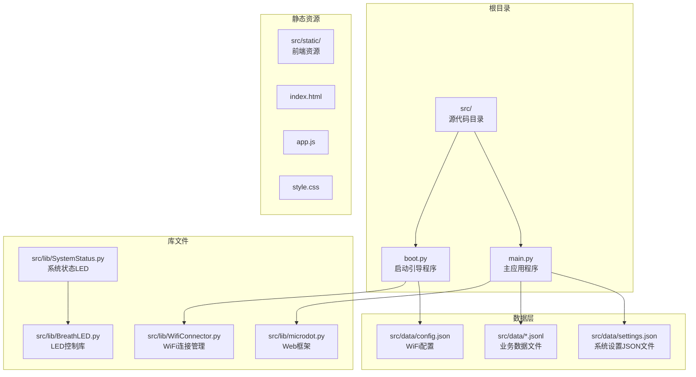
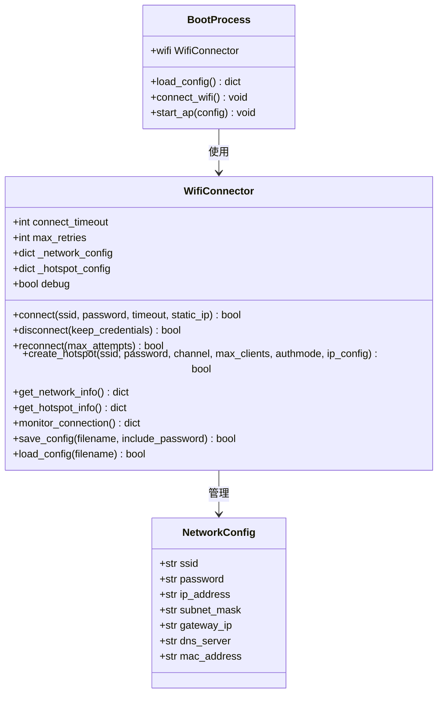
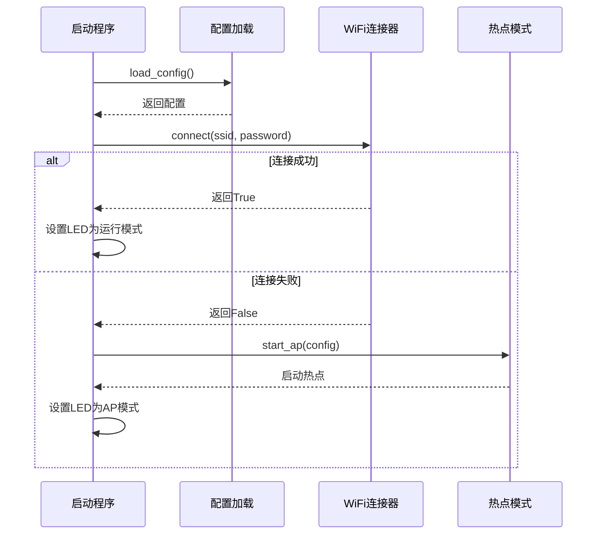
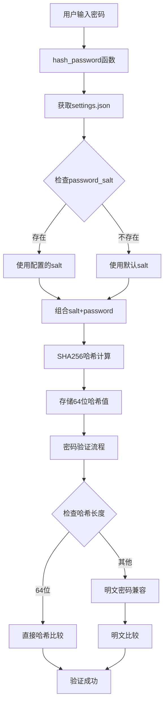
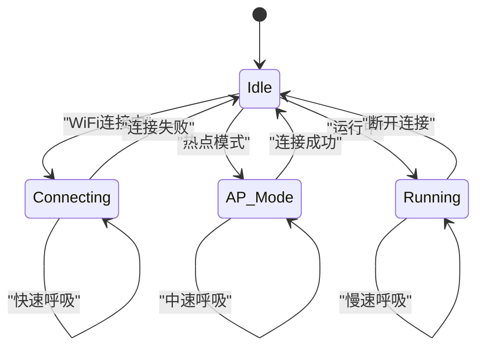
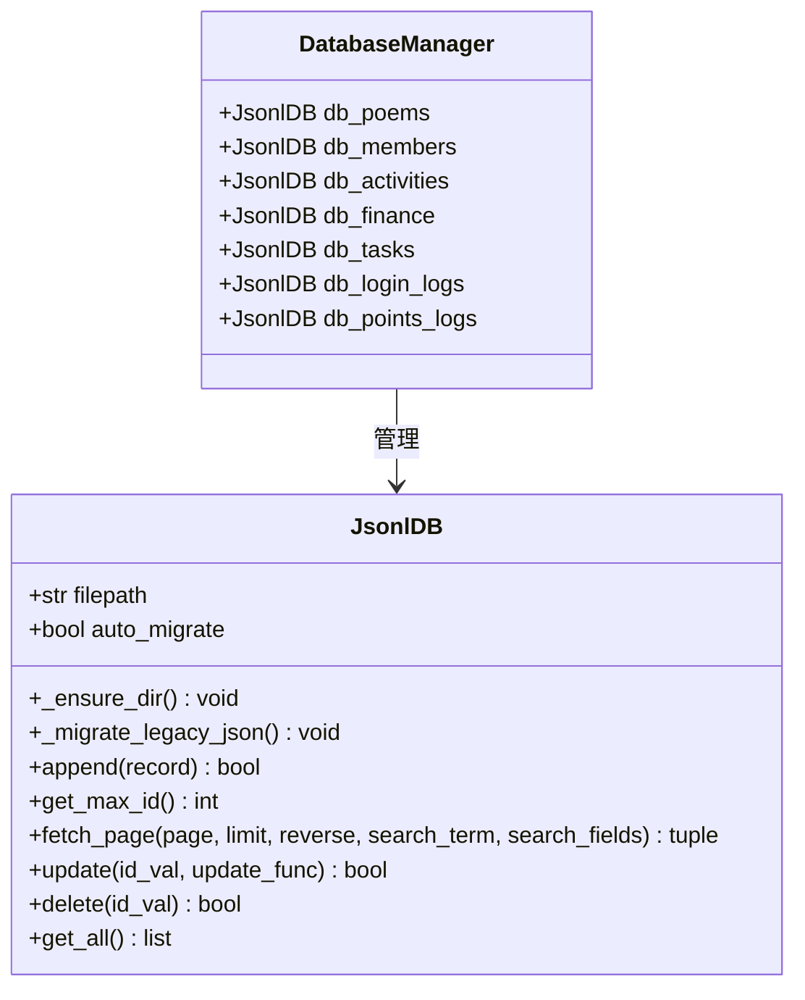
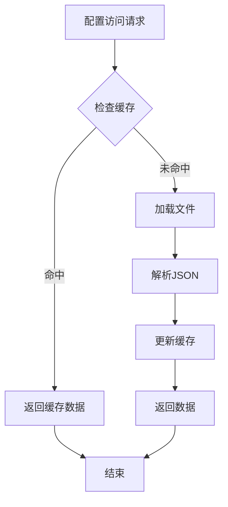
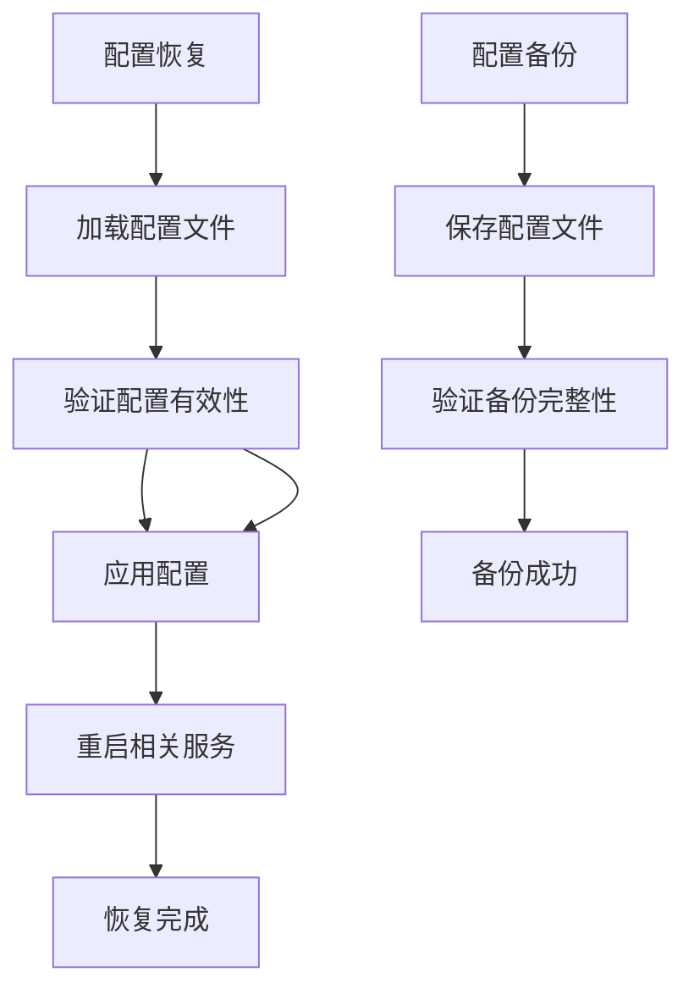

# 系统配置模型

<cite>
**本文档引用的文件**
- [boot.py](file://src/boot.py)
- [main.py](file://src/main.py)
- [config.json](file://src/data/config.json)
- [settings.json](file://src/data/settings.json)
- [WifiConnector.py](file://src/lib/WifiConnector.py)
- [WifiConnector_README.md](file://src/lib/WifiConnector_README.md)
- [SystemStatus.py](file://src/lib/SystemStatus.py)
- [BreathLED.py](file://src/lib/BreathLED.py)
- [microdot.py](file://src/lib/microdot.py)
- [wifi_connector_example.py](file://src/lib/wifi_connector_example.py)
- [breath_led_example.py](file://src/lib/breath_led_example.py)
</cite>

## 更新摘要
**所做更改**
- 更新系统配置模型以反映移除data/settings.json文件的变更
- 新增密码盐值配置和积分名称自定义功能的详细说明
- 更新配置管理架构图以体现主程序直接管理设置的模式
- 添加密码迁移接口和安全配置的最佳实践指导

## 目录
1. [简介](#简介)
2. [项目结构](#项目结构)
3. [核心配置组件](#核心配置组件)
4. [架构概览](#架构概览)
5. [详细组件分析](#详细组件分析)
6. [依赖关系分析](#依赖关系分析)
7. [性能考虑](#性能考虑)
8. [故障排除指南](#故障排除指南)
9. [结论](#结论)

## 简介

围炉诗社·理事台项目是一个基于ESP32的微控制器应用，提供诗歌管理、成员管理、活动管理和财务管理等功能。本项目的核心配置模型涵盖了系统运行参数、网络配置、功能开关、主题设置等多个方面，为开发者提供了完整的配置管理解决方案。

该项目采用MicroPython环境，通过JSON文件存储配置数据，结合WiFi连接管理、LED状态指示和Web服务框架，构建了一个完整的嵌入式管理系统。

**重要变更**：系统配置模型已更新，移除了独立的settings.json文件，改为在主程序中直接管理设置，新增了密码盐值配置和积分名称自定义功能。

## 项目结构

项目采用模块化的文件组织结构，主要分为以下几个部分：



**图表来源**
- [boot.py](file://src/boot.py#L1-L122)
- [main.py](file://src/main.py#L1-L867)

**章节来源**
- [boot.py](file://src/boot.py#L1-L122)
- [main.py](file://src/main.py#L1-L867)

## 核心配置组件

### WiFi网络配置

WiFi配置是系统最重要的网络参数，通过`src/data/config.json`文件进行管理：

| 配置项 | 数据类型 | 默认值 | 描述 | 验证规则 |
|--------|----------|--------|------|----------|
| wifi_ssid | 字符串 | - | 主WiFi网络名称 | 非空字符串，UTF-8编码 |
| wifi_password | 字符串 | - | 主WiFi网络密码 | 非空字符串，至少8位 |
| ap_ssid | 字符串 | "围炉诗社小热点" | 热点网络名称 | UTF-8编码，非空 |
| ap_password | 字符串 | "weilu2018" | 热点网络密码 | 非空字符串，至少8位 |

### 系统设置配置

系统设置通过主程序中的`get_settings()`和`save_settings()`函数管理，支持密码盐值和积分名称的动态配置：

```mermaid
flowchart TD
START[系统启动] --> LOAD_SETTINGS[调用get_settings()]
LOAD_SETTINGS --> CHECK_FILE{检查settings.json文件}
CHECK_FILE --> |存在| READ_FILE[读取文件内容]
CHECK_FILE --> |不存在| DEFAULT_CONFIG[使用空字典]
READ_FILE --> MERGE_CONFIG[合并配置]
DEFAULT_CONFIG --> MERGE_CONFIG
MERGE_CONFIG --> CREATE_DB[创建数据库]
CREATE_DB --> INIT_APP[初始化应用]
INIT_APP --> END[配置完成]
```

**图表来源**
- [main.py](file://src/main.py#L338-L347)

#### 新增配置项

系统现在支持以下配置项：

| 配置项 | 数据类型 | 默认值 | 描述 | 安全考虑 |
|--------|----------|--------|------|----------|
| custom_member_fields | 数组 | [] | 自定义成员字段配置 | 无 |
| password_salt | 字符串 | "weilu2018" | 密码加密盐值 | 高度敏感，需定期轮换 |
| points_name | 字符串 | "围炉值" | 积分名称显示 | 无 |

### 数据库配置

系统使用JSON Lines格式存储数据，每个业务实体对应一个独立的文件：

| 数据实体 | 文件路径 | 结构特征 | 访问模式 |
|----------|----------|----------|----------|
| 诗歌 | src/data/poems.jsonl | 行分隔JSON | 追加写入 |
| 成员 | src/data/members.jsonl | 行分隔JSON | 追加写入 |
| 活动 | src/data/activities.jsonl | 行分隔JSON | 追加写入 |
| 财务 | src/data/finance.jsonl | 行分隔JSON | 追加写入 |
| 任务 | src/data/tasks.jsonl | 行分隔JSON | 追加写入 |
| 登录日志 | src/data/login_logs.jsonl | 行分隔JSON | 追加写入 |
| 积分日志 | src/data/points_logs.jsonl | 行分隔JSON | 追加写入 |

**章节来源**
- [config.json](file://src/data/config.json#L1-L6)
- [settings.json](file://src/data/settings.json#L1-L5)
- [main.py](file://src/main.py#L284-L291)

## 架构概览

系统采用分层架构设计，各层职责明确，配置管理贯穿整个系统：

```mermaid
graph TB
subgraph "配置管理层"
BOOT_CONFIG[启动配置<br/>boot.py]
RUNTIME_CONFIG[运行时配置<br/>main.py]
PERSISTENT_CONFIG[持久化配置<br/>JSON文件]
MEMORY_CONFIG[内存配置<br/>主程序变量]
end
subgraph "网络管理层"
WIFI_CONNECTOR[WifiConnector<br/>网络连接]
AP_MODE[热点模式<br/>AP模式]
STATION_MODE[站点模式<br/>STA模式]
end
subgraph "应用管理层"
WEB_SERVER[Web服务器<br/>Microdot]
DATABASE[数据库管理<br/>JsonlDB]
LED_CONTROLLER[LED控制<br/>SystemStatus]
end
subgraph "业务管理层"
POEM_API[诗歌API]
MEMBER_API[成员API]
ACTIVITY_API[活动API]
FINANCE_API[财务API]
TASK_API[任务API]
LOGIN_LOG_API[登录日志API]
POINTS_LOG_API[积分日志API]
SETTINGS_API[设置管理API]
END
BOOT_CONFIG --> WIFI_CONNECTOR
RUNTIME_CONFIG --> WEB_SERVER
RUNTIME_CONFIG --> DATABASE
RUNTIME_CONFIG --> LED_CONTROLLER
RUNTIME_CONFIG --> MEMORY_CONFIG
WIFI_CONNECTOR --> AP_MODE
WIFI_CONNECTOR --> STATION_MODE
WEB_SERVER --> POEM_API
WEB_SERVER --> MEMBER_API
WEB_SERVER --> ACTIVITY_API
WEB_SERVER --> FINANCE_API
WEB_SERVER --> TASK_API
WEB_SERVER --> LOGIN_LOG_API
WEB_SERVER --> POINTS_LOG_API
WEB_SERVER --> SETTINGS_API
DATABASE --> PERSISTENT_CONFIG
MEMORY_CONFIG --> SETTINGS_API
```

**图表来源**
- [boot.py](file://src/boot.py#L1-L122)
- [main.py](file://src/main.py#L1-L867)
- [WifiConnector.py](file://src/lib/WifiConnector.py#L1-L1930)

## 详细组件分析

### WiFi连接管理组件

WifiConnector类提供了完整的WiFi连接管理功能，支持多种连接模式和配置选项：



**图表来源**
- [WifiConnector.py](file://src/lib/WifiConnector.py#L11-L1152)
- [boot.py](file://src/boot.py#L14-L87)

#### WiFi连接流程



**图表来源**
- [boot.py](file://src/boot.py#L22-L87)
- [WifiConnector.py](file://src/lib/WifiConnector.py#L595-L696)

**章节来源**
- [WifiConnector.py](file://src/lib/WifiConnector.py#L1-L1930)
- [boot.py](file://src/boot.py#L1-L122)

### Web应用配置组件

Microdot轻量级Web框架提供了RESTful API服务，支持多种HTTP方法和响应格式：

```mermaid
flowchart TD
REQUEST[HTTP请求] --> ROUTER[路由匹配]
ROUTER --> HANDLER[处理器]
HANDLER --> RESPONSE[HTTP响应]
RESPONSE --> CLIENT[客户端]
subgraph "路由定义"
GET_ROUTE[GET路由]
POST_ROUTE[POST路由]
PUT_ROUTE[PUT路由]
DELETE_ROUTE[DELETE路由]
END
subgraph "数据处理"
JSON_PARSER[JSON解析]
VALIDATOR[数据验证]
DATABASE_OP[数据库操作]
END
ROUTER --> GET_ROUTE
ROUTER --> POST_ROUTE
ROUTER --> PUT_ROUTE
ROUTER --> DELETE_ROUTE
GET_ROUTE --> JSON_PARSER
POST_ROUTE --> VALIDATOR
VALIDATOR --> DATABASE_OP
```

**图表来源**
- [microdot.py](file://src/lib/microdot.py#L94-L165)

#### API端点配置

系统提供以下主要API端点：

| 端点 | 方法 | 功能 | 请求体 | 响应 |
|------|------|------|--------|------|
| `/api/poems` | GET | 获取诗歌列表 | 无 | 诗歌数组 |
| `/api/poems` | POST | 创建新诗歌 | 诗歌数据 | 诗歌对象 |
| `/api/members` | GET | 获取成员列表 | 无 | 成员数组 |
| `/api/members` | POST | 创建新成员 | 成员数据 | 成员对象 |
| `/api/settings/fields` | GET/POST | 获取/设置自定义字段 | 字段配置 | 状态对象 |
| `/api/settings/system` | GET/POST | 获取/设置系统设置 | 系统配置 | 状态对象 |
| `/api/migrate_passwords` | POST | 密码迁移 | 无 | 迁移结果 |
| `/api/login` | POST | 用户登录 | 手机号和密码 | 用户信息 |
| `/api/login_logs` | GET | 获取登录日志 | 无 | 日志数组 |
| `/api/system/info` | GET | 获取系统信息 | 无 | 系统信息对象 |

**章节来源**
- [microdot.py](file://src/lib/microdot.py#L1-L183)
- [main.py](file://src/main.py#L368-L867)

### 密码安全配置组件

系统实现了增强的密码安全机制，包括盐值配置和密码迁移功能：



**图表来源**
- [main.py](file://src/main.py#L28-L47)

#### 密码安全特性

| 特性 | 实现方式 | 安全等级 |
|------|----------|----------|
| 密码盐值 | 可配置的salt值 | 高 |
| 哈希算法 | SHA256 | 高 |
| 兼容性 | 支持明文密码 | 中 |
| 迁移工具 | 一次性密码迁移 | 高 |
| 存储格式 | 64位十六进制 | 高 |

**章节来源**
- [main.py](file://src/main.py#L28-L47)
- [main.py](file://src/main.py#L827-L845)

### LED状态指示组件

SystemStatus类管理系统的LED状态指示，提供三种不同的运行模式：



**图表来源**
- [SystemStatus.py](file://src/lib/SystemStatus.py#L19-L61)

#### LED配置参数

| 模式 | 呼吸周期(ms) | LED类型 | 用途 |
|------|-------------|---------|------|
| 连接中 | 500 | 快速呼吸 | WiFi连接过程 |
| AP模式 | 1500 | 中速呼吸 | 热点等待连接 |
| 运行中 | 4000 | 慢速呼吸 | 系统稳定运行 |

**章节来源**
- [SystemStatus.py](file://src/lib/SystemStatus.py#L1-L61)
- [BreathLED.py](file://src/lib/BreathLED.py#L1-L633)

### 数据库配置组件

JsonlDB类提供了JSON Lines格式的数据库管理功能，支持高效的追加写入和随机访问：



**图表来源**
- [main.py](file://src/main.py#L76-L282)

#### 数据库性能优化

| 操作类型 | 时间复杂度 | 优化策略 |
|----------|------------|----------|
| 追加写入 | O(1) | 直接文件追加 |
| ID查找 | O(n) | 逐行扫描 |
| 分页查询 | O(k) | k为页面大小 |
| 搜索查询 | O(n) | 全文件扫描 |
| 更新操作 | O(n) | 重写文件 |

**章节来源**
- [main.py](file://src/main.py#L76-L282)

## 依赖关系分析

系统配置模型的依赖关系呈现层次化结构，从底层的硬件抽象到上层的应用逻辑：

```mermaid
graph TB
subgraph "硬件抽象层"
MACHINE[machine模块<br/>硬件控制]
NETWORK[network模块<br/>网络接口]
OS[os模块<br/>文件系统]
end
subgraph "系统库层"
WIFI_LIB[WifiConnector<br/>网络管理]
STATUS_LIB[SystemStatus<br/>LED控制]
LED_LIB[BreathLED<br/>LED算法]
MICRODOT[microdot<br/>Web框架]
end
subgraph "应用层"
BOOT[boot.py<br/>启动引导]
MAIN[main.py<br/>主应用]
CONFIG[配置文件<br/>JSON数据]
SETTINGS[设置管理<br/>主程序函数]
end
subgraph "业务层"
POEMS[诗歌管理]
MEMBERS[成员管理]
ACTIVITIES[活动管理]
FINANCE[财务管理]
TASKS[任务管理]
LOGIN_LOGS[登录日志管理]
POINTS_LOGS[积分日志管理]
SETTINGS_API[设置API管理]
END
MACHINE --> WIFI_LIB
NETWORK --> WIFI_LIB
OS --> BOOT
OS --> MAIN
WIFI_LIB --> BOOT
STATUS_LIB --> LED_LIB
MICRODOT --> MAIN
CONFIG --> BOOT
CONFIG --> MAIN
SETTINGS --> MAIN
MAIN --> POEMS
MAIN --> MEMBERS
MAIN --> ACTIVITIES
MAIN --> FINANCE
MAIN --> TASKS
MAIN --> LOGIN_LOGS
MAIN --> POINTS_LOGS
MAIN --> SETTINGS_API
```

**图表来源**
- [boot.py](file://src/boot.py#L1-L12)
- [main.py](file://src/main.py#L1-L17)
- [WifiConnector.py](file://src/lib/WifiConnector.py#L6-L11)

### 配置依赖链

系统配置的依赖关系形成了清晰的链式结构：

1. **启动阶段**：boot.py加载WiFi配置 → WifiConnector建立网络连接
2. **运行阶段**：main.py初始化Web服务 → 数据库连接建立 → 设置管理初始化
3. **状态阶段**：SystemStatus根据网络状态控制LED指示

**章节来源**
- [boot.py](file://src/boot.py#L14-L89)
- [main.py](file://src/main.py#L17-L29)

## 性能考虑

### 配置加载性能

系统采用了懒加载和缓存机制来优化配置访问性能：



### 内存管理

系统在内存受限的ESP32环境中采用了多项优化措施：

- **增量加载**：数据库采用流式读取，避免一次性加载大量数据
- **垃圾回收**：定期触发垃圾回收，释放不再使用的内存
- **对象复用**：重用网络连接对象，减少内存分配

### 网络性能优化

WiFi连接管理实现了多种优化策略：

- **连接重试**：自动重连机制，提高连接稳定性
- **超时控制**：可配置的连接超时，避免长时间阻塞
- **状态监控**：实时监控网络状态，及时发现连接问题

## 故障排除指南

### 常见配置问题

| 问题类型 | 症状 | 解决方案 |
|----------|------|----------|
| WiFi连接失败 | 设备无法连接到网络 | 检查src/data/config.json中的SSID和密码配置 |
| 热点创建失败 | AP模式无法启动 | 验证热点配置参数和权限 |
| 数据库写入失败 | 业务数据无法保存 | 检查文件系统权限和磁盘空间 |
| LED指示异常 | 状态指示不正确 | 检查LED引脚配置和硬件连接 |
| 配置文件访问错误 | 无法读取settings.json | 确认文件路径和权限设置 |
| 密码验证失败 | 用户无法登录 | 检查password_salt配置和密码迁移状态 |

### 调试工具

系统提供了多种调试工具来帮助诊断配置问题：

1. **WiFi诊断**：通过`get_diagnostics()`获取详细的网络状态信息
2. **配置验证**：使用参数验证功能检查配置的有效性
3. **日志输出**：启用调试模式获取详细的执行日志
4. **系统信息**：通过`/api/system/info`获取系统状态信息

### 配置备份与恢复



**图表来源**
- [WifiConnector.py](file://src/lib/WifiConnector.py#L1543-L1584)

### 密码安全配置

**重要安全提示**：
- 修改password_salt后必须执行密码迁移
- 建议定期轮换password_salt值
- 积分名称可以自由修改，不影响数据结构

**章节来源**
- [WifiConnector.py](file://src/lib/WifiConnector.py#L1543-L1584)
- [boot.py](file://src/boot.py#L18-L20)
- [main.py](file://src/main.py#L827-L845)

## 结论

围炉诗社·理事台项目的系统配置模型展现了嵌入式应用配置管理的最佳实践。通过模块化的架构设计、完善的配置验证机制和灵活的运行时更新能力，该系统为类似的应用场景提供了可靠的配置管理解决方案。

**主要变更总结**：
1. **配置管理模式升级**：从独立的settings.json文件改为在主程序中直接管理设置
2. **安全配置增强**：新增密码盐值配置和密码迁移功能
3. **用户体验改善**：支持积分名称自定义，提升系统个性化程度
4. **架构简化**：减少了配置文件的依赖关系，提高了系统的简洁性

系统的主要优势包括：

1. **模块化设计**：清晰的分层架构便于维护和扩展
2. **配置多样性**：支持网络、应用、硬件等多维度配置
3. **运行时灵活性**：支持配置的动态更新和热重载
4. **安全性保障**：完善的密码安全机制和迁移工具
5. **可靠性保障**：完善的错误处理和故障恢复机制
6. **性能优化**：针对嵌入式环境的内存和计算优化

该配置模型为开发者提供了完整的参考，可以在类似的嵌入式Web应用中直接应用或进行定制化改造。

**重要更新**：项目现已采用新的src/目录结构，所有配置文件路径已相应调整。建议开发者在部署时确保使用正确的文件路径，以避免配置文件访问错误。