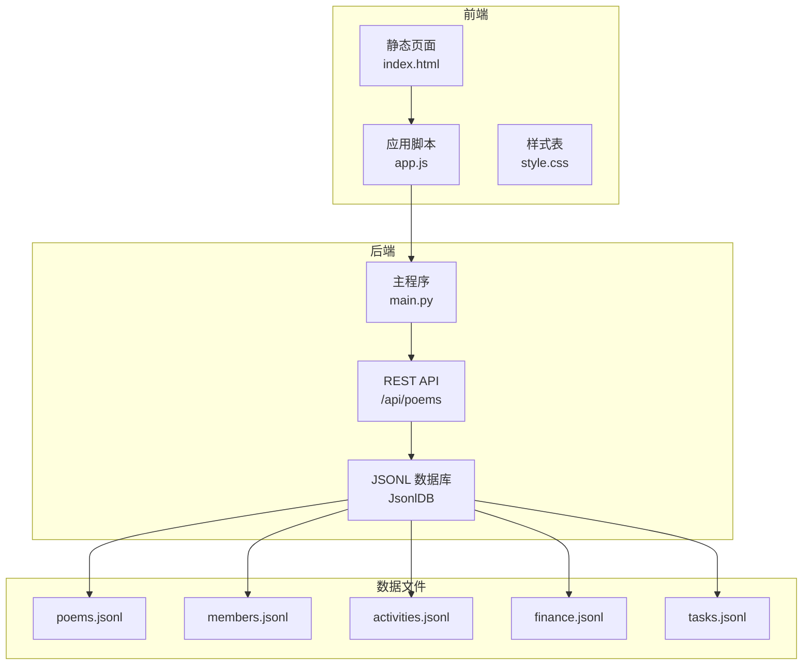
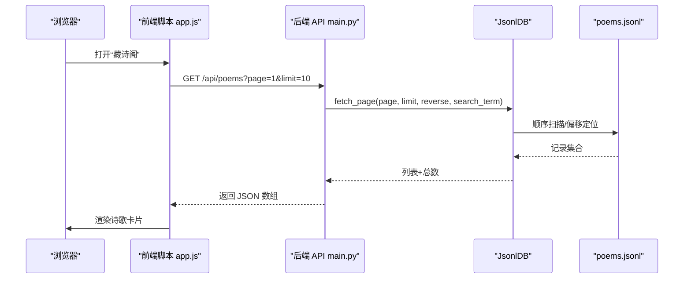
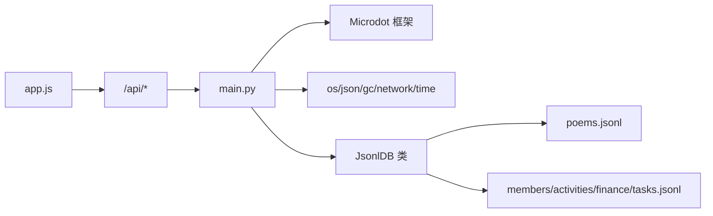

# 诗歌实体模型

<cite>
**本文档引用的文件**
- [main.py](file://main.py)
- [poems.jsonl](file://data/poems.jsonl)
- [members.jsonl](file://data/members.jsonl)
- [activities.jsonl](file://data/activities.jsonl)
- [finance.jsonl](file://data/finance.jsonl)
- [tasks.jsonl](file://data/tasks.jsonl)
- [index.html](file://static/index.html)
- [app.js](file://static/app.js)
- [style.css](file://static/style.css)
</cite>

## 目录
1. [简介](#简介)
2. [项目结构](#项目结构)
3. [核心组件](#核心组件)
4. [架构总览](#架构总览)
5. [详细组件分析](#详细组件分析)
6. [依赖关系分析](#依赖关系分析)
7. [性能考量](#性能考量)
8. [故障排查指南](#故障排查指南)
9. [结论](#结论)
10. [附录](#附录)

## 简介
本文件面向围炉诗社·理事台项目，系统化梳理“诗歌实体”的数据模型设计与实现细节，覆盖字段定义、类型约束、验证规则、不同诗歌类型的字段使用规范、实体间关系映射与引用机制，以及数据导入导出的最佳实践与性能优化建议。目标读者既包括开发者，也包括需要理解数据结构的业务人员。

## 项目结构
项目采用前后端分离的嵌入式Web架构：
- 后端：基于 MicroPython 的轻量 Web 服务，提供 REST API，负责数据持久化与业务逻辑。
- 前端：纯静态 HTML/CSS/JS，通过 fetch API 与后端交互，实现诗歌的增删改查、草稿管理与分页展示。
- 数据层：以 JSON Lines（.jsonl）文件作为轻量数据库，每行一条记录，便于增量写入与流式处理。

图表来源
- [main.py](file://main.py#L17-L548)
- [index.html](file://static/index.html#L1-L269)
- [app.js](file://static/app.js#L1-L800)

章节来源
- [main.py](file://main.py#L1-L548)
- [index.html](file://static/index.html#L1-L269)

## 核心组件
- 诗歌实体模型：定义诗歌记录的核心字段与类型约束，支持多种诗歌类型（如绝句、律诗、词、现代诗、文章）。
- JSONL 数据库（JsonlDB）：提供追加写入、分页读取、全文检索、更新与删除能力，适配嵌入式环境。
- REST API：提供诗歌的列表查询、新增、更新、删除接口，配合前端实现 CRUD 与草稿管理。
- 前端界面：提供“藏诗阁”页面，支持分页加载、草稿本地存储、类型标签样式区分、作者权限控制等。

章节来源
- [main.py](file://main.py#L53-L267)
- [main.py](file://main.py#L309-L370)
- [app.js](file://static/app.js#L165-L287)

## 架构总览
后端通过 JsonlDB 封装对 poems.jsonl 的访问，提供统一的 CRUD 接口；前端通过 app.js 发起请求，渲染“藏诗阁”页面。系统还包含成员、活动、财务、任务等实体，彼此通过 ID 或字段引用实现弱耦合。

图表来源
- [main.py](file://main.py#L309-L333)
- [main.py](file://main.py#L113-L186)
- [app.js](file://static/app.js#L165-L212)

## 详细组件分析

### 1) 诗歌实体数据模型
- 字段清单与含义
  - id：整数型唯一标识，自动生成，用于记录定位与更新/删除。
  - author：字符串，作者名称或雅号，来源于当前登录用户。
  - title：字符串，诗歌标题或诗名。
  - content：字符串，诗歌正文，支持多行文本与换行符。
  - type：字符串，诗歌类型，常见值包括“绝句”“律诗”“词”“现代诗”“文章”等。
  - date：字符串，ISO 8601 时间戳（本地时间格式），用于排序与展示。
- 字段类型与长度
  - id：整数（整型），建议范围 1..2^31-1。
  - author/title/content/type/date：字符串，长度无硬性上限，但受嵌入式平台内存与存储限制影响。
- 验证规则
  - 新增时若缺失 date，后端会填充默认值；若缺失 id，后端自动计算最大 id+1。
  - 更新时允许选择性更新 title、content、type、date。
  - 前端表单要求标题与正文必填，类型默认为“绝句”，日期默认为当前时间。
- 不同类型字段使用规范
  - 绝句/律诗：强调格律与对仗，适合传统近体诗风格。
  - 词：遵循词牌格律与韵部，字段中体现“按《词谱》《词林正韵》填写”的标注。
  - 现代诗：更注重自由表达与情感传达，格式相对宽松。
  - 文章：用于社务说明、序言、缘起等非韵文类内容，字段与正文结构可更灵活。
- 示例与样例
  - 参考 data/poems.jsonl 中的记录，包含“围炉诗社｜缘起”“围炉诗社序”“一剪梅”等条目，展示不同类型与正文结构。
  - 前端“撰写新作品”模态框提供类型选择与日期输入，便于规范录入。

章节来源
- [main.py](file://main.py#L334-L370)
- [main.py](file://main.py#L341-L342)
- [index.html](file://static/index.html#L175-L194)
- [app.js](file://static/app.js#L299-L341)
- [poems.jsonl](file://data/poems.jsonl#L1-L4)

### 2) JSONL 数据库（JsonlDB）
- 设计理念
  - 以行式存储替代传统关系型数据库，降低内存占用与写放大。
  - 支持分页读取与全文检索，兼顾性能与易用性。
- 关键方法
  - append(record)：追加写入，保证原子性（逐行写入）。
  - get_max_id()：扫描文件获取最大 id，确保自增唯一。
  - fetch_page(page, limit, reverse, search_term)：内存优化的分页读取，支持倒序与全文检索。
  - update(id, update_func)：重写文件实现更新，避免索引维护成本。
  - delete(id)：重写文件排除指定记录，实现删除。
  - get_all()：全量读取（仅适用于小数据集，如 members/settings）。
- 复杂度与性能
  - 追加写入 O(1)；更新/删除 O(n)（需重写文件）。
  - 分页读取通过行偏移定位，避免一次性加载全部内容。
  - 全文检索 O(n*m)（n 行，m 字段），建议配合分页与搜索字段限定。

章节来源
- [main.py](file://main.py#L53-L267)
- [main.py](file://main.py#L86-L94)
- [main.py](file://main.py#L96-L111)
- [main.py](file://main.py#L113-L186)
- [main.py](file://main.py#L187-L246)
- [main.py](file://main.py#L248-L258)

### 3) REST API：诗歌管理
- 列表查询
  - 方法：GET /api/poems
  - 参数：page（默认 1）、limit（默认 10）、q（可选，全文检索关键词）
  - 行为：按时间倒序返回分页结果，支持搜索 term。
- 新增诗歌
  - 方法：POST /api/poems
  - 行为：自动生成 id 与默认 date，写入 poems.jsonl。
- 更新诗歌
  - 方法：POST /api/poems/update
  - 行为：按 id 更新 title、content、type、date。
- 删除诗歌
  - 方法：POST /api/poems/delete
  - 行为：按 id 删除记录。
- 权限与校验
  - 前端根据用户角色显示“修订/撤回/删除”按钮，后端未做严格鉴权，建议在部署时增加认证与授权中间件。

章节来源
- [main.py](file://main.py#L309-L370)

### 4) 前端交互：藏诗阁
- 页面与功能
  - “藏诗阁”卡片列表，支持分页加载与草稿本地存储。
  - 类型标签样式区分不同诗歌类型，日期格式化展示。
  - 草稿：通过 IndexedDB 本地存储，支持保存草稿与发布到服务器。
  - 权限：仅作者或管理员可见“修订/撤回/删除”按钮。
- 数据流
  - 首次进入页面触发 fetchPoems，拉取服务器诗歌与本地草稿合并渲染。
  - 发布草稿：调用 POST /api/poems，成功后删除本地草稿。
  - 撤回：先保存为本地草稿，再调用 DELETE /api/poems/delete。

章节来源
- [index.html](file://static/index.html#L109-L121)
- [app.js](file://static/app.js#L165-L287)
- [app.js](file://static/app.js#L343-L402)
- [app.js](file://static/app.js#L428-L483)
- [style.css](file://static/style.css#L222-L250)

### 5) 实体关系与引用机制
- 与成员（members）的关系
  - 诗歌 author 字段通常对应成员的 name 或 alias，前端在模态框中默认带入当前用户信息。
  - 成员实体包含 id、phone、name、alias、role、points 等字段，与诗歌实体弱耦合。
- 与活动（activities）的关系
  - 活动实体包含 id、title、desc、date、location、status 等字段，与诗歌实体无直接字段引用，可通过外部链接或附件形式关联。
- 与财务（finance）/任务（tasks）的关系
  - 财务与任务实体分别包含 id、amount、summary、date、type、category、handler 等字段，与诗歌实体无直接字段引用，属于独立业务域。
- 引用建议
  - 若未来需要强关联，可在诗歌实体中引入 author_id 或 activity_id 等字段，或通过外部索引文件维护引用关系。

章节来源
- [members.jsonl](file://data/members.jsonl#L1-L4)
- [activities.jsonl](file://data/activities.jsonl#L1-L7)
- [finance.jsonl](file://data/finance.jsonl#L1-L3)
- [tasks.jsonl](file://data/tasks.jsonl#L1-L2)

## 依赖关系分析
- 后端依赖
  - Microdot：轻量 Web 框架，提供路由与响应处理。
  - os/json/gc/network/time：系统级模块，用于文件操作、序列化、内存与网络状态。
- 前端依赖
  - 无第三方库，完全基于原生 fetch 与 DOM API。
- 数据依赖
  - poems.jsonl 为核心数据源；其他 .jsonl 文件为辅助实体。

图表来源
- [main.py](file://main.py#L1-L16)
- [main.py](file://main.py#L53-L267)
- [app.js](file://static/app.js#L1-L10)

章节来源
- [main.py](file://main.py#L1-L16)
- [main.py](file://main.py#L53-L267)

## 性能考量
- 写入性能
  - 追加写入为 O(1)，适合高频写入场景；建议批量写入或合并请求以减少磁盘写放大。
- 读取性能
  - 分页读取通过行偏移定位，避免全量加载；建议 limit 控制在 10~20 以内，移动端体验更佳。
  - 全文检索为线性扫描，建议配合搜索字段限定与分页，避免超大数据集的全表扫描。
- 更新/删除性能
  - 采用重写文件策略，复杂度 O(n)；建议减少频繁更新/删除，或在低峰期执行。
- 存储与内存
  - 嵌入式平台内存有限，建议：
    - 使用 get_all() 仅在小数据集（如 members/settings）使用。
    - 对 poems.jsonl 采用分页与懒加载策略。
    - 合理设置 limit，避免一次性渲染过多卡片。
- 前端缓存
  - IndexedDB 本地草稿提升用户体验，注意清理过期草稿与同步状态。

章节来源
- [main.py](file://main.py#L113-L186)
- [main.py](file://main.py#L187-L246)
- [app.js](file://static/app.js#L165-L212)

## 故障排查指南
- 无法连接/启动
  - 检查 main.py 是否正常导入依赖与运行，关注端口绑定与网络状态输出。
- 诗歌列表为空
  - 确认 poems.jsonl 是否存在且非空；检查分页参数与搜索 term。
- 发布失败
  - 查看前端控制台网络错误；确认 /api/poems POST 请求是否被拦截或跨域问题。
- 更新/删除无效
  - 确认 id 是否正确；检查后端返回状态码与错误信息。
- 本地草稿无法保存
  - 检查浏览器 IndexedDB 支持与权限；确认 app.js 中 LocalDrafts 初始化是否成功。

章节来源
- [main.py](file://main.py#L13-L15)
- [main.py](file://main.py#L334-L370)
- [app.js](file://static/app.js#L343-L402)

## 结论
本项目以 JSONL 文件为核心数据存储，结合轻量 Web 服务与纯前端界面，实现了简洁高效的诗歌实体管理方案。通过明确的字段定义、类型约束与权限控制，满足了“藏诗阁”的基本需求。建议在未来版本中增强鉴权、引入索引与全文检索优化，并考虑将草稿与发布流程进一步自动化，以提升协作效率与数据一致性。

## 附录

### A. 字段定义与使用规范
- id：整数，自动生成，用于定位与更新/删除。
- author：字符串，建议与成员实体中的 name/alias 保持一致。
- title：字符串，建议简短明确，便于检索与展示。
- content：字符串，支持多行文本，注意换行符与空白字符处理。
- type：字符串，枚举值建议统一为“绝句”“律诗”“词”“现代诗”“文章”等。
- date：字符串，ISO 8601 本地时间格式，用于排序与展示。

章节来源
- [main.py](file://main.py#L334-L370)
- [index.html](file://static/index.html#L175-L194)
- [app.js](file://static/app.js#L299-L341)

### B. JSONL 示例与数据样本
- 完整记录示例（路径参考）
  - [poems.jsonl 第1条](file://data/poems.jsonl#L1)
  - [poems.jsonl 第2条](file://data/poems.jsonl#L2)
  - [poems.jsonl 第3条](file://data/poems.jsonl#L3)
- 其他实体示例（路径参考）
  - [members.jsonl](file://data/members.jsonl#L1-L4)
  - [activities.jsonl](file://data/activities.jsonl#L1-L7)
  - [finance.jsonl](file://data/finance.jsonl#L1-L3)
  - [tasks.jsonl](file://data/tasks.jsonl#L1-L2)

章节来源
- [poems.jsonl](file://data/poems.jsonl#L1-L4)
- [members.jsonl](file://data/members.jsonl#L1-L4)
- [activities.jsonl](file://data/activities.jsonl#L1-L7)
- [finance.jsonl](file://data/finance.jsonl#L1-L3)
- [tasks.jsonl](file://data/tasks.jsonl#L1-L2)

### C. 导入导出最佳实践与性能优化建议
- 导入
  - 使用批量写入：将多条记录按行写入 poems.jsonl，避免逐条请求带来的网络与磁盘开销。
  - 预校验：在导入前对字段进行基础校验（如 id 唯一性、type 合法性、date 格式）。
  - 分批处理：大文件建议分批导入，避免一次性写入导致的卡顿。
- 导出
  - 以 JSONL 为标准格式导出，便于跨平台迁移与备份。
  - 导出时可按日期范围筛选，减少数据量。
- 性能优化
  - 限制分页大小与并发请求数，避免阻塞 UI。
  - 使用本地草稿与 IndexedDB 缓存，减少服务器压力。
  - 对频繁更新的字段（如 content）采用延迟保存策略，合并多次变更。

章节来源
- [main.py](file://main.py#L86-L94)
- [main.py](file://main.py#L113-L186)
- [app.js](file://static/app.js#L343-L402)