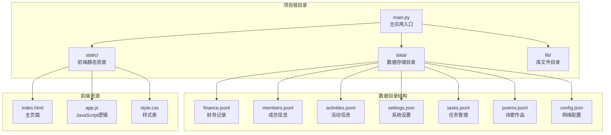
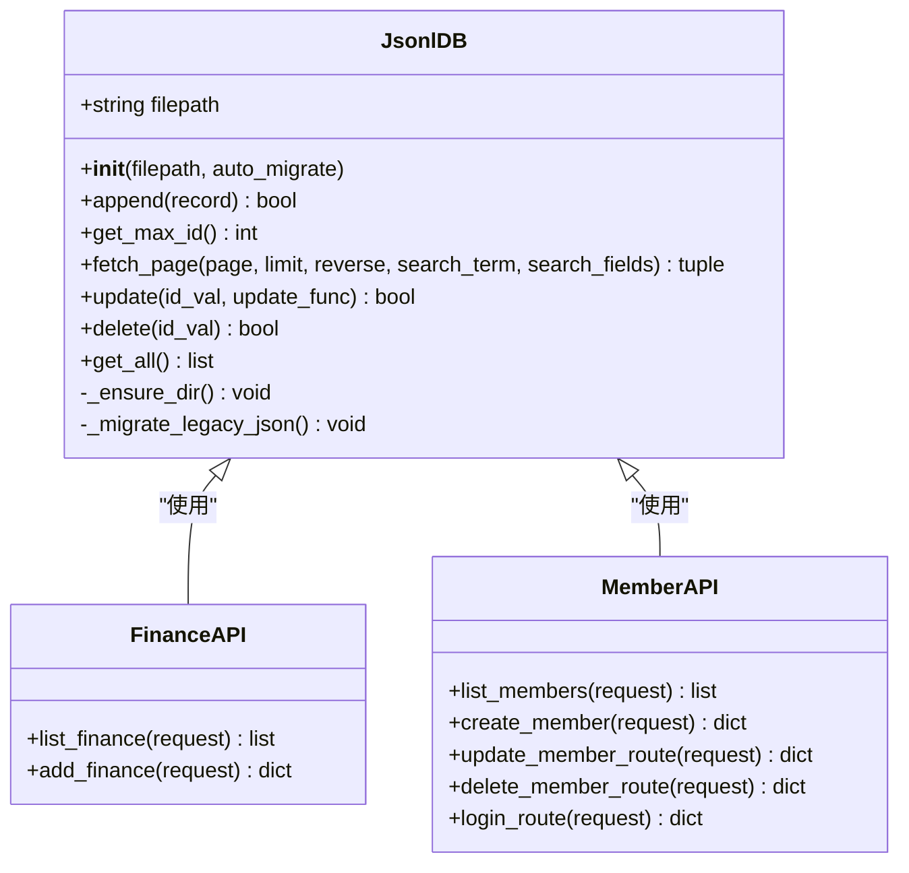
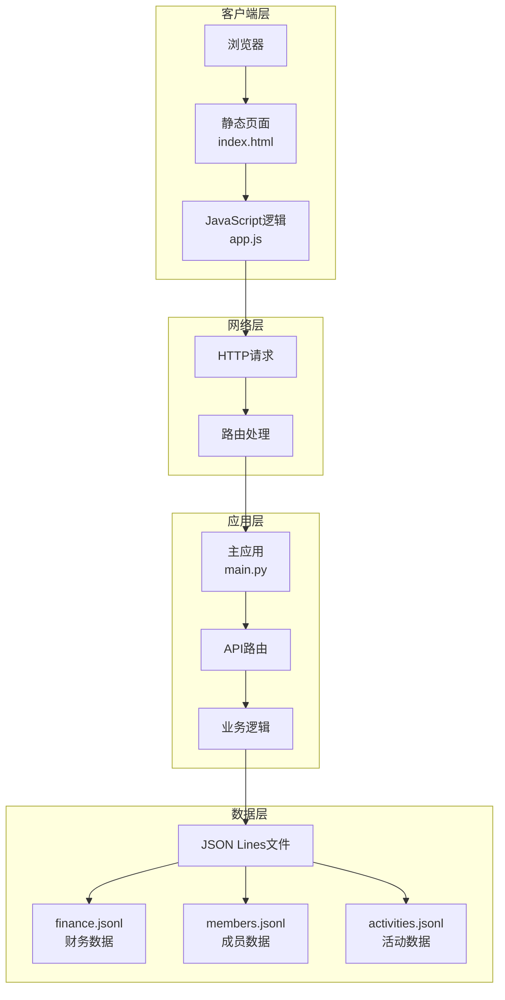
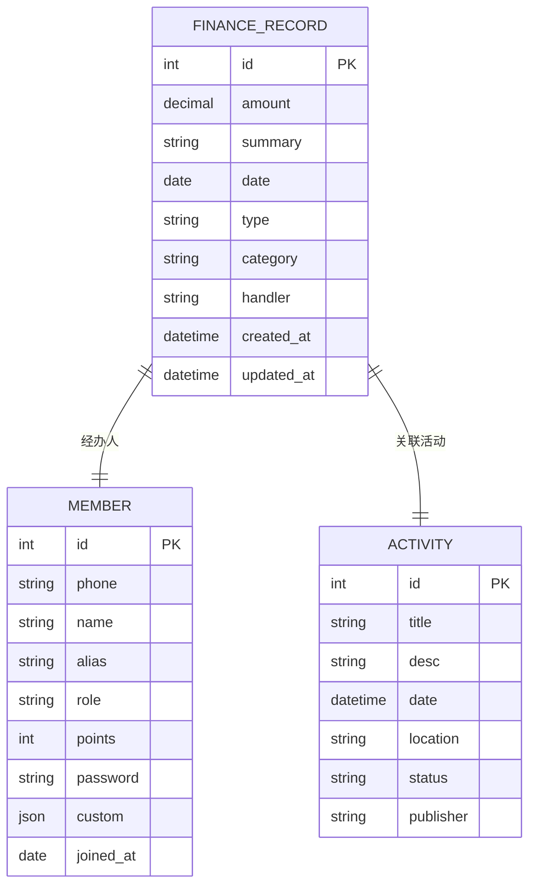
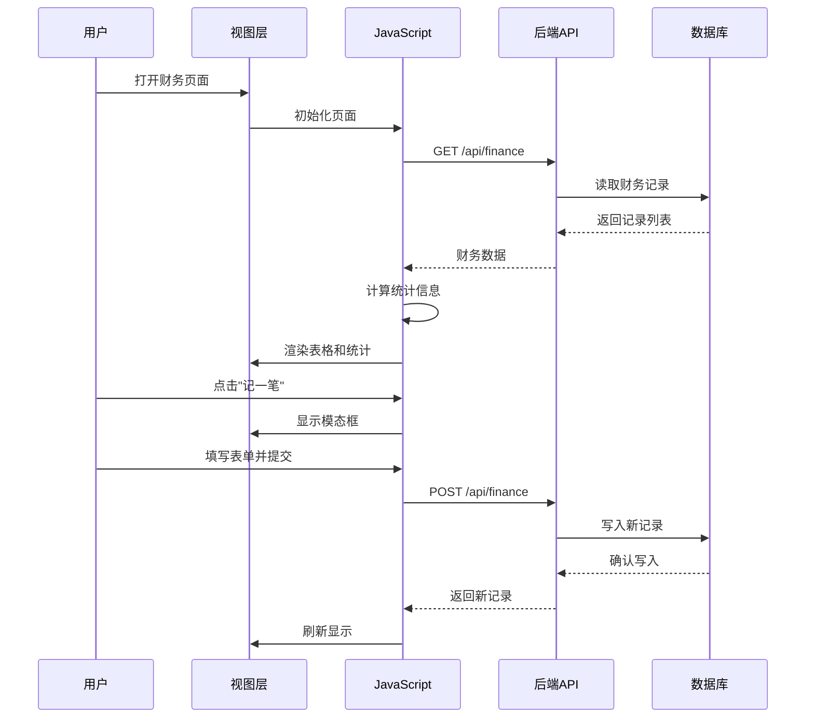
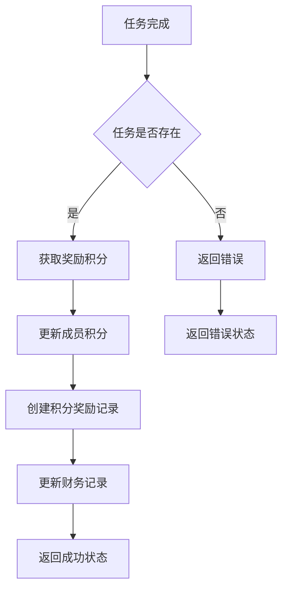
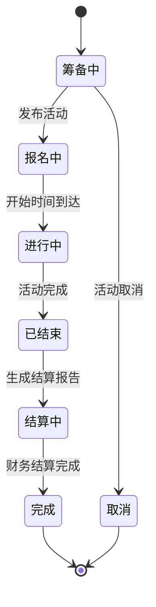
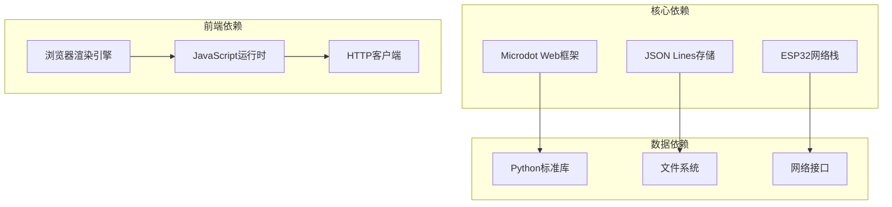
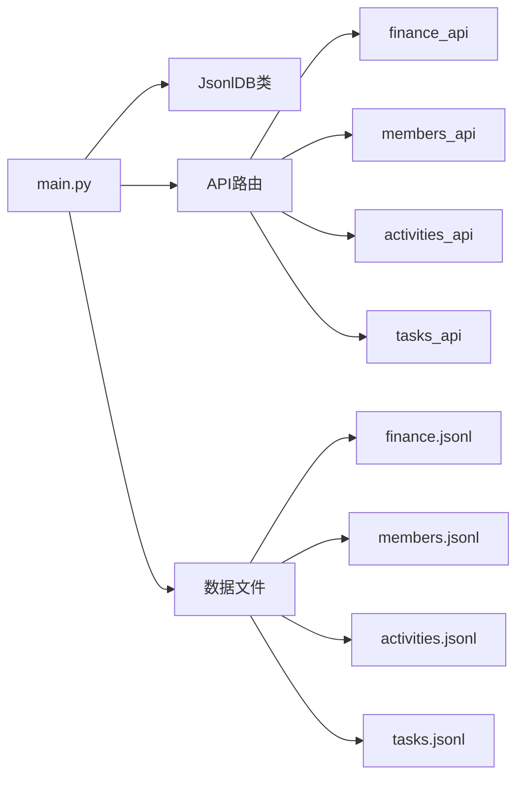
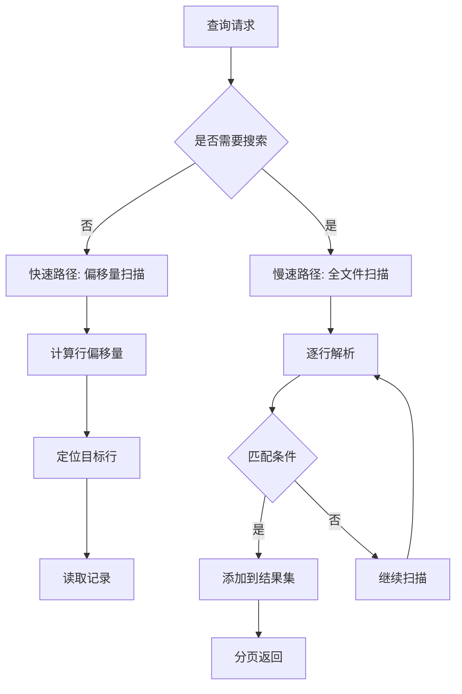

# 财务实体模型

<cite>
**本文档引用的文件**
- [main.py](file://main.py)
- [finance.jsonl](file://data/finance.jsonl)
- [members.jsonl](file://data/members.jsonl)
- [activities.jsonl](file://data/activities.jsonl)
- [settings.json](file://data/settings.json)
- [index.html](file://static/index.html)
- [app.js](file://static/app.js)
- [config.json](file://data/config.json)
</cite>

## 目录
1. [引言](#引言)
2. [项目结构](#项目结构)
3. [核心组件](#核心组件)
4. [架构概览](#架构概览)
5. [详细组件分析](#详细组件分析)
6. [依赖关系分析](#依赖关系分析)
7. [性能考虑](#性能考虑)
8. [故障排除指南](#故障排除指南)
9. [结论](#结论)

## 引言

围炉诗社·理事台项目是一个基于ESP32微控制器的社区管理系统，专门服务于围炉诗社的财务管理需求。本项目实现了完整的财务实体模型，包括收支记录管理、成员积分系统、活动费用跟踪等功能。本文档详细描述了财务数据结构的设计理念、实现方式以及与其他业务模块的集成关系。

## 项目结构

围炉诗社项目采用简洁的文件组织结构，主要包含以下核心目录：

**图表来源**
- [main.py](file://main.py#L1-L548)
- [finance.jsonl](file://data/finance.jsonl#L1-L3)
- [members.jsonl](file://data/members.jsonl#L1-L4)

**章节来源**
- [main.py](file://main.py#L1-L548)
- [finance.jsonl](file://data/finance.jsonl#L1-L3)

## 核心组件

### 财务数据库管理器

项目的核心是基于JSON Lines格式的轻量级数据库系统，专门为ESP32平台优化设计。JsonlDB类提供了完整的CRUD操作能力，支持内存优化的分页查询和全文搜索功能。

**图表来源**
- [main.py](file://main.py#L53-L267)

### 财务实体结构

财务系统的核心数据结构遵循统一的实体模型设计，确保数据的一致性和完整性：

| 字段名称 | 数据类型 | 必填 | 描述 | 示例值 |
|---------|---------|------|------|--------|
| id | 整数 | 是 | 唯一标识符 | 1, 2, 3 |
| amount | 数值 | 是 | 交易金额（元） | 500, 1500 |
| summary | 文本 | 是 | 交易摘要/说明 | "2026年春季会费收取" |
| date | 日期 | 是 | 交易日期 | "2026-01-20" |
| type | 枚举 | 是 | 交易类型 | "income" 或 "expense" |
| category | 文本 | 否 | 收支分类 | "会费", "设备", "活动" |
| handler | 文本 | 否 | 经办人 | "张社长", "社长" |

**章节来源**
- [main.py](file://main.py#L504-L515)
- [finance.jsonl](file://data/finance.jsonl#L1-L2)

## 架构概览

围炉诗社采用前后端分离的架构设计，后端基于Microdot框架提供RESTful API服务，前端使用纯HTML/CSS/JavaScript实现用户界面。

**图表来源**
- [main.py](file://main.py#L17-L548)
- [index.html](file://static/index.html#L132-L209)
- [app.js](file://static/app.js#L656-L958)

## 详细组件分析

### 财务记录管理

财务记录管理是系统的核心功能，提供了完整的收支记录生命周期管理。

#### 数据模型设计

财务记录采用标准化的数据模型，确保数据的完整性和一致性：

**图表来源**
- [finance.jsonl](file://data/finance.jsonl#L1-L2)
- [members.jsonl](file://data/members.jsonl#L1-L3)
- [activities.jsonl](file://data/activities.jsonl#L1-L3)

#### API接口设计

系统提供了标准的RESTful API接口，支持财务记录的增删改查操作：

| 接口路径 | 方法 | 功能 | 请求参数 | 响应数据 |
|---------|------|------|----------|----------|
| `/api/finance` | GET | 获取财务记录列表 | page, limit, q | 财务记录数组 |
| `/api/finance` | POST | 创建新的财务记录 | type, amount, summary, handler, date, category | 新记录详情 |
| `/api/finance` | PUT | 更新财务记录 | id, 更新字段 | 成功状态 |
| `/api/finance` | DELETE | 删除财务记录 | id | 成功状态 |

#### 前端交互流程

前端通过JavaScript实现财务数据的实时展示和交互：

**图表来源**
- [app.js](file://static/app.js#L656-L958)
- [main.py](file://main.py#L504-L515)

**章节来源**
- [main.py](file://main.py#L504-L515)
- [app.js](file://static/app.js#L656-L958)
- [index.html](file://static/index.html#L132-L209)

### 成员积分系统

成员积分系统与财务系统深度集成，实现了奖励机制与财务记录的自动关联。

#### 积分计算逻辑

#### 积分与财务关联

成员积分的增加与财务系统的收入记录形成关联，确保每笔积分奖励都有对应的财务凭证。

**章节来源**
- [main.py](file://main.py#L410-L450)
- [members.jsonl](file://data/members.jsonl#L1-L4)

### 活动费用管理

活动费用管理模块实现了活动成本的精细化控制和财务核算。

#### 活动生命周期

#### 费用分摊机制

活动产生的费用需要按照参与人数和贡献度进行合理分摊，财务系统支持复杂的费用分配算法。

**章节来源**
- [activities.jsonl](file://data/activities.jsonl#L1-L7)
- [main.py](file://main.py#L371-L409)

### 财务分类体系

系统实现了灵活的财务分类体系，支持自定义分类和多级分类管理。

#### 分类层次结构

| 分类级别 | 类型 | 说明 | 示例 |
|---------|------|------|------|
| 一级分类 | 收入 | 主要收入来源 | 会费、捐赠、活动收入 |
| 一级分类 | 支出 | 主要支出项目 | 设备、场地、材料 |
| 二级分类 | 收入细分 | 具体收入明细 | 年费、季度费、特殊捐赠 |
| 二级分类 | 支出细分 | 具体支出明细 | 设备维护、活动物料、交通费 |

#### 自定义字段支持

系统支持通过设置自定义成员字段，扩展财务记录的元数据信息。

**章节来源**
- [settings.json](file://data/settings.json#L1-L1)
- [main.py](file://main.py#L518-L526)

## 依赖关系分析

### 外部依赖

项目依赖于以下关键组件：

**图表来源**
- [main.py](file://main.py#L1-L16)

### 内部模块依赖

**图表来源**
- [main.py](file://main.py#L261-L267)

**章节来源**
- [main.py](file://main.py#L1-L548)

## 性能考虑

### 存储优化

系统采用JSON Lines格式存储数据，具有以下优势：

1. **内存友好**：支持流式读取，避免一次性加载整个文件
2. **并发安全**：文件级别的原子写入操作
3. **压缩效率**：适合嵌入式设备的存储空间限制

### 查询性能

### 内存管理

系统在ESP32平台上实现了严格的内存管理策略：

- **垃圾回收**：定期执行内存清理
- **对象池**：重用常用对象减少分配
- **流式处理**：避免大对象的频繁创建

## 故障排除指南

### 常见问题诊断

#### 数据库连接问题

**症状**：API请求返回错误或超时
**可能原因**：
- 文件权限不足
- 存储空间不足
- 文件损坏

**解决方案**：
1. 检查文件系统权限
2. 验证存储空间
3. 重建数据文件

#### 网络连接问题

**症状**：无法访问Web界面
**可能原因**：
- WiFi配置错误
- 网络接口故障
- IP地址冲突

**解决方案**：
1. 验证WiFi配置
2. 检查网络接口状态
3. 重新配置IP地址

#### 内存不足问题

**症状**：系统运行缓慢或崩溃
**可能原因**：
- 内存泄漏
- 对象过多
- 缓冲区溢出

**解决方案**：
1. 实施内存监控
2. 优化对象生命周期
3. 增加内存管理策略

**章节来源**
- [main.py](file://main.py#L13-L15)
- [main.py](file://main.py#L83-L84)

## 结论

围炉诗社·理事台项目的财务实体模型展现了现代嵌入式Web应用的最佳实践。通过精心设计的数据结构、优雅的API接口和高效的存储方案，系统成功实现了财务管理的核心需求。

### 主要成就

1. **架构简洁性**：基于JSON Lines的轻量级设计，适合嵌入式环境
2. **功能完整性**：覆盖了财务管理系统的主要业务场景
3. **用户体验**：直观的Web界面和流畅的交互体验
4. **扩展性**：支持自定义字段和灵活的分类体系

### 技术亮点

- **内存优化**：针对ESP32平台的内存限制进行了专门优化
- **并发安全**：文件级别的原子操作确保数据一致性
- **实时响应**：流式处理和缓存机制提升用户体验
- **安全考虑**：基本的输入验证和错误处理机制

### 未来发展方向

1. **增强审计功能**：添加完整的操作日志和审计追踪
2. **报表生成**：实现自动化财务报表生成功能
3. **移动端支持**：开发移动应用版本
4. **云端同步**：支持多设备间的数据同步
5. **高级分析**：集成数据挖掘和预测分析功能

这个财务实体模型为围炉诗社提供了坚实的技术基础，能够有效支撑社团的日常运营和长期发展需求。