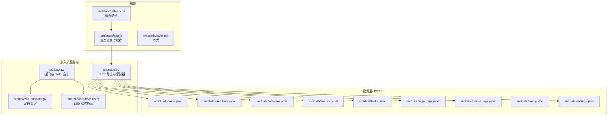
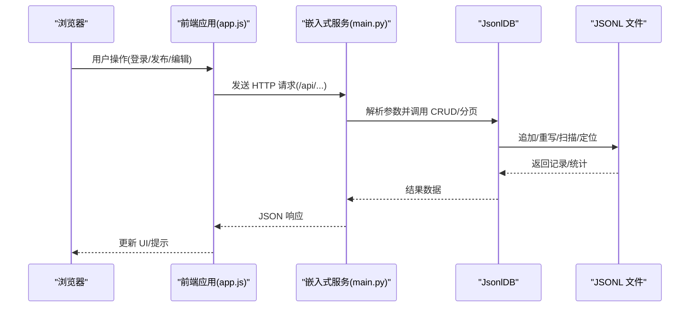
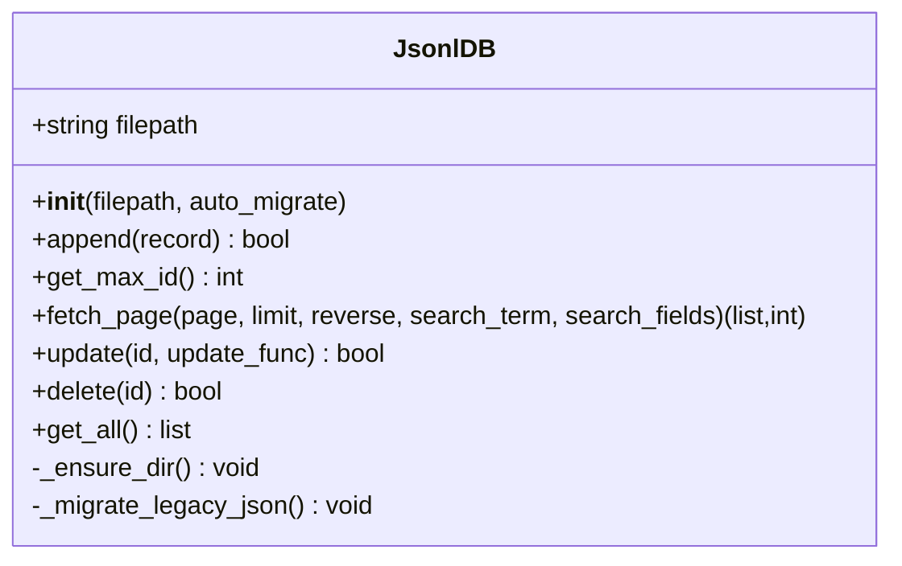
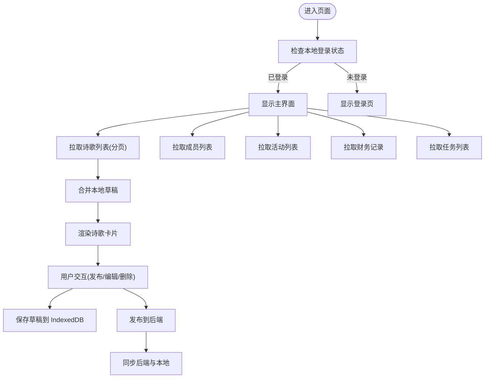
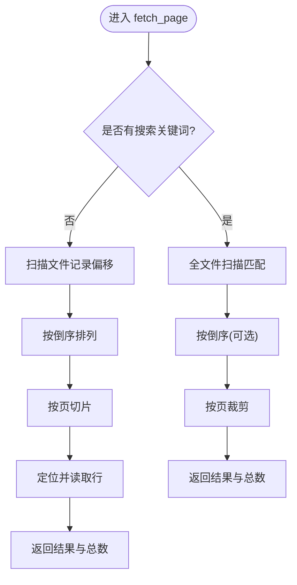
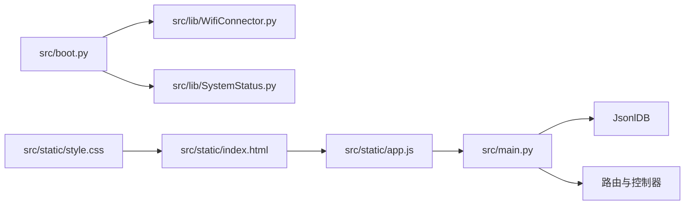

# 数据管理

<cite>
**本文引用的文件**
- [main.py](file://src/main.py)
- [boot.py](file://src/boot.py)
- [lib/WifiConnector.py](file://src/lib/WifiConnector.py)
- [lib/SystemStatus.py](file://src/lib/SystemStatus.py)
- [static/index.html](file://src/static/index.html)
- [static/app.js](file://src/static/app.js)
- [static/style.css](file://src/static/style.css)
- [data/config.json](file://src/data/config.json)
- [data/settings.json](file://src/data/settings.json)
- [data/poems.jsonl](file://src/data/poems.jsonl)
- [data/members.jsonl](file://src/data/members.jsonl)
- [data/activities.jsonl](file://src/data/activities.jsonl)
- [data/finance.jsonl](file://src/data/finance.jsonl)
- [data/tasks.jsonl](file://src/data/tasks.jsonl)
- [data/login_logs.jsonl](file://src/data/login_logs.jsonl)
- [data/points_logs.jsonl](file://src/data/points_logs.jsonl)
</cite>

## 目录
1. [简介](#简介)
2. [项目结构](#项目结构)
3. [核心组件](#核心组件)
4. [架构总览](#架构总览)
5. [详细组件分析](#详细组件分析)
6. [依赖分析](#依赖分析)
7. [性能考虑](#性能考虑)
8. [故障排查指南](#故障排查指南)
9. [结论](#结论)
10. [附录](#附录)

## 简介
本文件面向"围炉诗社·理事台"项目，围绕基于 JSONL 的流式数据存储系统，提供从数据模型、文件结构、访问模式到实现原理、CRUD 操作、性能优化、迁移与备份恢复、版本管理以及查询与缓存策略的系统化文档。重点覆盖诗歌、成员、活动、财务、事务等核心实体，以及 JsonlDB 类的设计与使用。

**更新** 项目现已重构，所有数据文件已移动到 `src/data/` 目录，提升了项目的组织性和可维护性。

## 项目结构
项目采用"嵌入式 Web 应用 + 本地 JSONL 文件数据库"的轻量架构：
- 服务端：MicroPython 环境下的嵌入式 HTTP 服务，路由与控制器集中于主程序文件。
- 数据层：以 JSONL 文本文件作为持久化存储，分别存放各类实体数据，现位于 `src/data/` 目录。
- 前端：静态 HTML/CSS/JS，通过 API 与后端交互，同时在浏览器侧使用 IndexedDB 缓存草稿。

**图表来源**
- [main.py](file://src/main.py#L1-L712)
- [boot.py](file://src/boot.py#L1-L122)
- [lib/WifiConnector.py](file://src/lib/WifiConnector.py#L1-L800)
- [lib/SystemStatus.py](file://src/lib/SystemStatus.py#L1-L61)
- [static/index.html](file://src/static/index.html#L1-L327)
- [static/app.js](file://src/static/app.js#L1-L1614)
- [static/style.css](file://src/static/style.css#L1-L385)
- [data/poems.jsonl](file://src/data/poems.jsonl#L1-L4)
- [data/members.jsonl](file://src/data/members.jsonl#L1-L4)
- [data/activities.jsonl](file://src/data/activities.jsonl#L1-L7)
- [data/finance.jsonl](file://src/data/finance.jsonl#L1-L3)
- [data/tasks.jsonl](file://src/data/tasks.jsonl#L1-L2)
- [data/login_logs.jsonl](file://src/data/login_logs.jsonl#L1-L2)
- [data/points_logs.jsonl](file://src/data/points_logs.jsonl#L1-L2)
- [data/config.json](file://src/data/config.json#L1-L6)
- [data/settings.json](file://src/data/settings.json#L1-L5)

**章节来源**
- [main.py](file://src/main.py#L1-L712)
- [boot.py](file://src/boot.py#L1-L122)
- [lib/WifiConnector.py](file://src/lib/WifiConnector.py#L1-L800)
- [lib/SystemStatus.py](file://src/lib/SystemStatus.py#L1-L61)
- [static/index.html](file://src/static/index.html#L1-L327)
- [static/app.js](file://src/static/app.js#L1-L1614)
- [static/style.css](file://src/static/style.css#L1-L385)
- [data/poems.jsonl](file://src/data/poems.jsonl#L1-L4)
- [data/members.jsonl](file://src/data/members.jsonl#L1-L4)
- [data/activities.jsonl](file://src/data/activities.jsonl#L1-L7)
- [data/finance.jsonl](file://src/data/finance.jsonl#L1-L3)
- [data/tasks.jsonl](file://src/data/tasks.jsonl#L1-L2)
- [data/login_logs.jsonl](file://src/data/login_logs.jsonl#L1-L2)
- [data/points_logs.jsonl](file://src/data/points_logs.jsonl#L1-L2)
- [data/config.json](file://src/data/config.json#L1-L6)
- [data/settings.json](file://src/data/settings.json#L1-L5)

## 核心组件
- JsonlDB：封装 JSONL 文件的 CRUD 与分页检索，支持增量追加、按 ID 更新/删除、全文检索与分页。
- 主程序路由：提供诗歌、成员、活动、财务、事务等 API，负责请求解析、参数校验与响应。
- 前端应用：负责用户交互、本地 IndexedDB 草稿缓存、与后端 API 通信。
- 启动与网络：引导 WiFi 连接、AP 备降、LED 状态指示。

**章节来源**
- [main.py](file://src/main.py#L53-L267)
- [main.py](file://src/main.py#L299-L540)
- [static/app.js](file://src/static/app.js#L6-L58)

## 架构总览
系统采用"嵌入式 Web 服务 + 本地 JSONL 数据库"的轻量方案，适合资源受限的嵌入式平台。前端通过 IndexedDB 在本地缓存草稿，减少频繁网络请求；后端通过 JsonlDB 提供稳定的 CRUD 与检索能力。

**图表来源**
- [main.py](file://src/main.py#L309-L370)
- [main.py](file://src/main.py#L456-L483)
- [main.py](file://src/main.py#L510-L516)
- [main.py](file://src/main.py#L415-L449)
- [static/app.js](file://src/static/app.js#L165-L221)
- [static/app.js](file://src/static/app.js#L369-L402)
- [static/app.js](file://src/static/app.js#L580-L644)
- [static/app.js](file://src/static/app.js#L683-L727)

## 详细组件分析

### JsonlDB 类设计与实现
- 设计目标：在嵌入式环境中提供最小化的 JSONL 数据库能力，支持高并发读场景下的稳定分页与搜索。
- 关键特性：
  - 自动目录创建与历史 .json 到 .jsonl 的迁移。
  - 追加写入 append，保证原子性（逐条写入）。
  - 分页检索 fetch_page：支持倒序、搜索、限制返回数量。
  - 按 ID 更新 update：全量重写文件，确保一致性。
  - 按 ID 删除 delete：全量重写文件，确保一致性。
  - 获取最大 ID get_max_id：扫描文件获取最大数值 ID。
  - 全量读取 get_all：适用于小数据集（如成员、设置）。

**图表来源**
- [main.py](file://src/main.py#L53-L267)

**章节来源**
- [main.py](file://src/main.py#L53-L267)

### 数据模型与文件结构规范
- 统一规范
  - 每条记录为一条 JSON 对象，占一行。
  - 所有实体均以 id 字段为主键，且为数值型。
  - 时间字段统一使用 ISO-8601 日期字符串（如 2026-01-23T00:00）。
  - 自定义字段统一放在 custom 字段内，键为唯一标识符（如 cf_1769341584847）。
- 实体定义
  - 诗歌 poems
    - 示例字段：author、type、content、date、id、title
    - 示例参考：[data/poems.jsonl](file://src/data/poems.jsonl#L1-L4)
  - 成员 members
    - 示例字段：id、phone、name、password、alias、role、points、joined_at、custom
    - 示例参考：[data/members.jsonl](file://src/data/members.jsonl#L1-L4)
  - 活动 activities
    - 示例字段：location、date、status、publisher、desc、title、id
    - 示例参考：[data/activities.jsonl](file://src/data/activities.jsonl#L1-L7)
  - 财务 finance
    - 示例字段：id、amount、summary、date、type、category、handler
    - 示例参考：[data/finance.jsonl](file://src/data/finance.jsonl#L1-L3)
  - 事务 tasks
    - 示例字段：reward、description、status、assignee、id、title
    - 示例参考：[data/tasks.jsonl](file://src/data/tasks.jsonl#L1-L2)
  - 登录日志 login_logs
    - 示例字段：id、member_id、member_name、phone、login_time、status
    - 示例参考：[data/login_logs.jsonl](file://src/data/login_logs.jsonl#L1-L2)
  - 积分日志 points_logs
    - 示例字段：id、member_id、member_name、change、reason、timestamp
    - 示例参考：[data/points_logs.jsonl](file://src/data/points_logs.jsonl#L1-L2)
  - 设置 settings
    - 示例字段：custom_member_fields（数组，每项含 id、type、label）、password_salt、points_name
    - 示例参考：[data/settings.json](file://src/data/settings.json#L1-L5)
  - 配置 config
    - 示例字段：wifi_ssid、wifi_password、ap_ssid、ap_password
    - 示例参考：[data/config.json](file://src/data/config.json#L1-L6)

**章节来源**
- [data/poems.jsonl](file://src/data/poems.jsonl#L1-L4)
- [data/members.jsonl](file://src/data/members.jsonl#L1-L4)
- [data/activities.jsonl](file://src/data/activities.jsonl#L1-L7)
- [data/finance.jsonl](file://src/data/finance.jsonl#L1-L3)
- [data/tasks.jsonl](file://src/data/tasks.jsonl#L1-L2)
- [data/login_logs.jsonl](file://src/data/login_logs.jsonl#L1-L2)
- [data/points_logs.jsonl](file://src/data/points_logs.jsonl#L1-L2)
- [data/settings.json](file://src/data/settings.json#L1-L5)
- [data/config.json](file://src/data/config.json#L1-L6)

### 数据访问模式与 API
- 诗歌 API
  - GET /api/poems：分页查询，支持 q 查询参数；默认倒序返回最新。
  - POST /api/poems：创建新作品，自动生成 id 并补全日期。
  - POST /api/poems/update：按 id 更新标题、内容、类型、日期。
  - POST /api/poems/delete：按 id 删除。
- 成员 API
  - GET /api/members：全量返回成员列表。
  - POST /api/members：创建成员，校验手机号唯一性。
  - POST /api/members/update：按 id 更新姓名、别名、电话、角色、积分、密码、自定义字段。
  - POST /api/members/delete：按 id 删除。
  - POST /api/login：按手机号与密码登录，返回脱敏用户信息。
- 活动 API
  - GET /api/activities：分页查询，支持 q 查询参数。
  - POST /api/activities：创建活动，自动生成 id。
  - POST /api/activities/update：按 id 更新标题、描述、日期、地点、状态。
  - POST /api/activities/delete：按 id 删除。
- 财务 API
  - GET /api/finance：返回最近若干条财务记录。
  - POST /api/finance：创建财务记录，自动生成 id。
- 事务 API
  - GET /api/tasks：全量返回任务列表。
  - POST /api/tasks/complete：认领并完成任务，更新任务状态与经办人，并给成员增加积分。
- 设置 API
  - GET/POST /api/settings/fields：读取或更新自定义成员字段定义。
  - GET/POST /api/settings/system：读取或更新系统设置（密码盐值、积分名称）。
- 日志 API
  - GET /api/login_logs：获取登录日志（最近20条）。
- 积分 API
  - GET /api/points/yearly_ranking：获取年度积分排行榜。
- 系统 API
  - GET /api/system/info：获取系统信息（存储、内存）。
  - POST /api/migrate_passwords：迁移密码（将明文密码转换为哈希）。

**章节来源**
- [main.py](file://src/main.py#L309-L370)
- [main.py](file://src/main.py#L371-L409)
- [main.py](file://src/main.py#L410-L450)
- [main.py](file://src/main.py#L451-L484)
- [main.py](file://src/main.py#L504-L516)
- [main.py](file://src/main.py#L517-L527)
- [main.py](file://src/main.py#L636-L641)
- [main.py](file://src/main.py#L644-L670)
- [main.py](file://src/main.py#L672-L690)
- [main.py](file://src/main.py#L692-L703)

### 前端数据缓存与草稿
- IndexedDB 草稿缓存
  - LocalDrafts 封装 IndexedDB，提供初始化、保存、读取、删除草稿的能力。
  - 草稿以对象形式存储，包含 id、title、type、content、author、date、isLocal 等字段。
- 前端渲染与交互
  - 登录后展示导航与功能模块；不同模块按需拉取数据。
  - 诗歌列表支持分页加载与搜索；本地草稿在首页刷新时合并展示。
  - 成员、活动、财务、事务模块提供增删改查与状态切换。
  - 任务完成时调用后端接口并更新本地积分显示。

**图表来源**
- [static/app.js](file://src/static/app.js#L6-L58)
- [static/app.js](file://src/static/app.js#L165-L221)
- [static/app.js](file://src/static/app.js#L369-L402)
- [static/app.js](file://src/static/app.js#L580-L644)
- [static/app.js](file://src/static/app.js#L683-L727)

**章节来源**
- [static/app.js](file://src/static/app.js#L6-L58)
- [static/app.js](file://src/static/app.js#L165-L221)
- [static/app.js](file://src/static/app.js#L369-L402)
- [static/app.js](file://src/static/app.js#L580-L644)
- [static/app.js](file://src/static/app.js#L683-L727)

### JsonlDB 的 CRUD 与分页算法
- 追加写入 append
  - 以追加方式写入单行 JSON，保证原子性。
- 获取最大 ID get_max_id
  - 扫描文件，提取所有记录的 id 并取最大值，用于自增主键。
- 分页检索 fetch_page
  - 无搜索：先扫描文件记录行偏移，构建倒序索引，再按页读取。
  - 有搜索：全文件扫描，匹配任意字段值，再按页裁剪。
- 按 ID 更新 update
  - 读取原文件，逐行解析并调用传入的更新函数，写入临时文件，最后替换原文件。
- 按 ID 删除 delete
  - 与更新类似，跳过匹配的记录，其余写入临时文件并替换原文件。
- 全量读取 get_all
  - 适用于小数据集，如成员、设置，一次性读取全部记录。

**图表来源**
- [main.py](file://src/main.py#L113-L186)

**章节来源**
- [main.py](file://src/main.py#L86-L94)
- [main.py](file://src/main.py#L96-L111)
- [main.py](file://src/main.py#L113-L186)
- [main.py](file://src/main.py#L187-L247)
- [main.py](file://src/main.py#L248-L258)

### 数据迁移、备份与版本管理
- 迁移策略
  - JsonlDB 支持自动检测历史 .json 文件并迁移到 .jsonl，避免数据丢失。
  - 迁移过程读取旧数据，逐条写入新格式，完成后可选择删除旧文件。
- 备份与恢复
  - 建议定期复制 `src/data/` 目录中的 JSONL 文件与 settings.json、config.json。
  - 恢复时将对应文件放回原路径，重启服务即可。
- 版本管理
  - 字段演进遵循向后兼容：新增字段不影响既有记录读取。
  - 自定义字段通过 settings.json 的 custom_member_fields 管理，便于扩展。

**章节来源**
- [main.py](file://src/main.py#L68-L84)
- [data/settings.json](file://src/data/settings.json#L1-L5)
- [data/config.json](file://src/data/config.json#L1-L6)

### 查询、索引与缓存
- 查询
  - 分页查询：支持 page、limit、q 参数；默认倒序返回最新。
  - 搜索：在无索引情况下进行全字段字符串匹配，注意性能影响。
- 索引
  - 当前未实现专用索引；可通过自定义字段键名与固定字段组合提升搜索效率。
- 缓存
  - 浏览器端：IndexedDB 本地草稿缓存，避免重复网络请求。
  - 服务端：未实现进程内缓存；建议在高频读场景下引入只读缓存或只在特定 API 使用。

**章节来源**
- [main.py](file://src/main.py#L309-L370)
- [static/app.js](file://src/static/app.js#L6-L58)
- [static/app.js](file://src/static/app.js#L165-L221)

## 依赖分析
- 启动与网络
  - boot.py 通过 WifiConnector 连接 WiFi，失败则启动 AP；SystemStatus 控制 LED 状态。
- 服务端
  - main.py 注入 Microdot，注册路由并实例化 JsonlDB；处理登录、CRUD、系统信息等。
- 前端
  - static/index.html 提供页面骨架；static/app.js 负责业务逻辑与 IndexedDB；static/style.css 提供样式。

**图表来源**
- [boot.py](file://src/boot.py#L1-L122)
- [lib/WifiConnector.py](file://src/lib/WifiConnector.py#L1-L800)
- [lib/SystemStatus.py](file://src/lib/SystemStatus.py#L1-L61)
- [main.py](file://src/main.py#L17-L267)
- [static/index.html](file://src/static/index.html#L1-L327)
- [static/app.js](file://src/static/app.js#L1-L1614)
- [static/style.css](file://src/static/style.css#L1-L385)

**章节来源**
- [boot.py](file://src/boot.py#L1-L122)
- [lib/WifiConnector.py](file://src/lib/WifiConnector.py#L1-L800)
- [lib/SystemStatus.py](file://src/lib/SystemStatus.py#L1-L61)
- [main.py](file://src/main.py#L17-L267)
- [static/index.html](file://src/static/index.html#L1-L327)
- [static/app.js](file://src/static/app.js#L1-L1614)
- [static/style.css](file://src/static/style.css#L1-L385)

## 性能考虑
- I/O 模式
  - JSONL 逐行存储，append 为顺序写，适合高写入吞吐。
  - 分页检索在无搜索时通过偏移定位，避免全量读取；有搜索时为全表扫描，建议控制搜索范围与字段。
- 内存与 CPU
  - 更新/删除采用全文件重写，注意在大数据量时的 I/O 峰值；可在业务侧降低频繁更新频率。
  - 前端 IndexedDB 仅缓存草稿，避免占用过多内存。
- 网络与并发
  - 嵌入式平台并发有限，建议合理设置分页大小与搜索条件，避免长时间阻塞。
- 存储空间
  - 定期清理历史数据与冗余记录，监控文件大小与剩余空间。

## 故障排查指南
- 登录失败
  - 检查 `src/data/members.jsonl` 中是否存在对应手机号与密码；确认请求体字段正确。
  - 参考：[main.py](file://src/main.py#L485-L503)
- 无法连接网络
  - 检查 `src/data/config.json` 的 SSID/密码；查看 boot.py 的连接日志与 AP 启动流程。
  - 参考：[boot.py](file://src/boot.py#L22-L87)，[lib/WifiConnector.py](file://src/lib/WifiConnector.py#L595-L799)
- 任务完成积分未更新
  - 检查 /api/tasks/complete 的调用参数与返回；确认成员列表中存在对应用户。
  - 参考：[main.py](file://src/main.py#L415-L449)，[static/app.js](file://src/static/app.js#L713-L727)
- 前端草稿无法保存
  - 检查浏览器 IndexedDB 支持与权限；查看 LocalDrafts 的初始化与 put/delete 调用。
  - 参考：[static/app.js](file://src/static/app.js#L6-L58)，[static/app.js](file://src/static/app.js#L343-L367)

**章节来源**
- [main.py](file://src/main.py#L485-L503)
- [boot.py](file://src/boot.py#L22-L87)
- [lib/WifiConnector.py](file://src/lib/WifiConnector.py#L595-L799)
- [main.py](file://src/main.py#L415-L449)
- [static/app.js](file://src/static/app.js#L713-L727)
- [static/app.js](file://src/static/app.js#L6-L58)
- [static/app.js](file://src/static/app.js#L343-L367)

## 结论
本项目以 JSONL 为核心的数据存储方案，结合嵌入式 Web 服务与前端 IndexedDB 草稿缓存，实现了轻量、可靠、易部署的诗社数据管理平台。JsonlDB 提供了必要的 CRUD 与分页检索能力，满足日常运营需求。项目现已重构，数据文件位于 `src/data/` 目录，提升了项目的组织性和可维护性。建议在后续迭代中引入更高效的索引与缓存策略，以进一步提升性能与用户体验。

## 附录
- 快速参考
  - 诗歌：/api/poems
  - 成员：/api/members
  - 活动：/api/activities
  - 财务：/api/finance
  - 事务：/api/tasks/complete
  - 登录：/api/login
  - 设置字段：/api/settings/fields
  - 系统设置：/api/settings/system
  - 登录日志：/api/login_logs
  - 年度积分排行：/api/points/yearly_ranking
  - 系统信息：/api/system/info
  - 密码迁移：/api/migrate_passwords