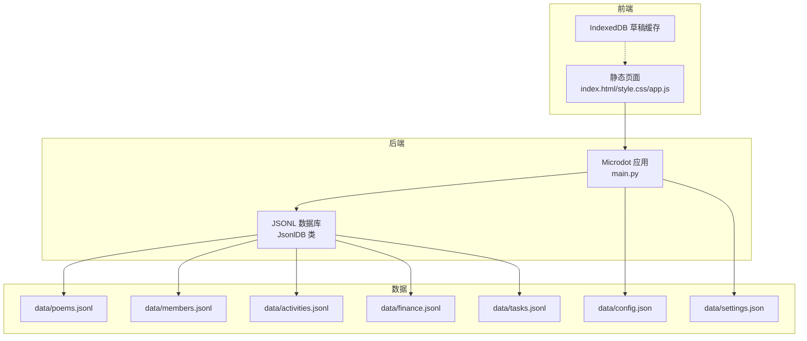
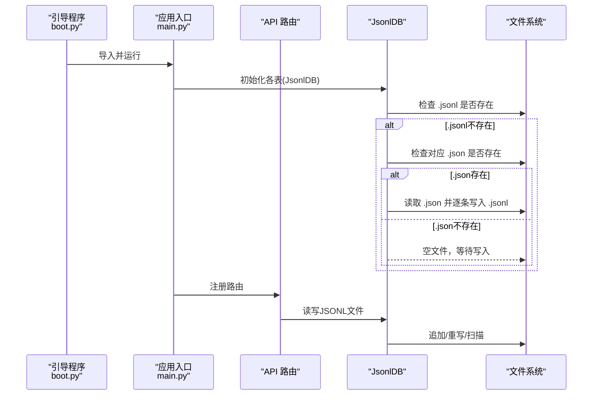
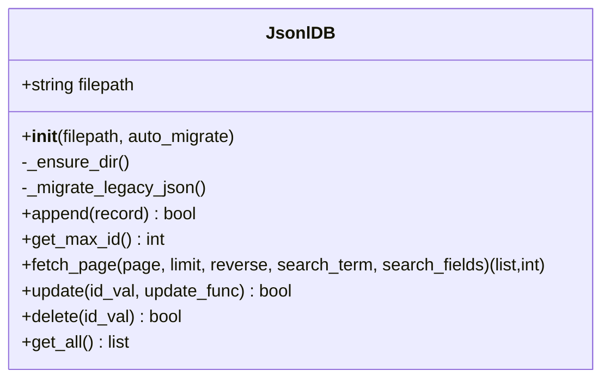
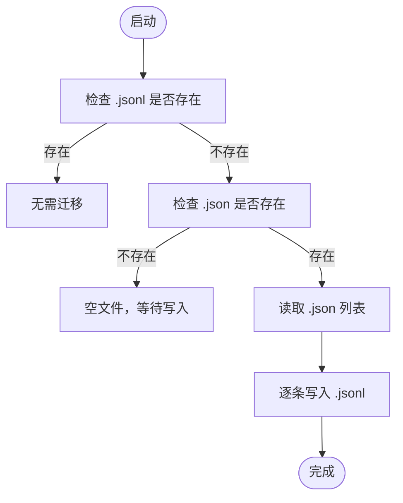
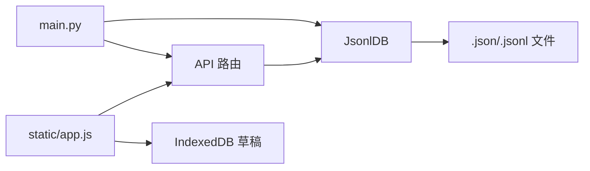

# 数据迁移与备份

<cite>
**本文引用的文件**
- [main.py](file://main.py)
- [boot.py](file://boot.py)
- [data/poems.jsonl](file://data/poems.jsonl)
- [data/members.jsonl](file://data/members.jsonl)
- [data/activities.jsonl](file://data/activities.jsonl)
- [data/finance.jsonl](file://data/finance.jsonl)
- [data/tasks.jsonl](file://data/tasks.jsonl)
- [data/config.json](file://data/config.json)
- [data/settings.json](file://data/settings.json)
- [lib/WifiConnector.py](file://lib/WifiConnector.py)
- [lib/SystemStatus.py](file://lib/SystemStatus.py)
- [static/app.js](file://static/app.js)
</cite>

## 目录
1. [简介](#简介)
2. [项目结构](#项目结构)
3. [核心组件](#核心组件)
4. [架构总览](#架构总览)
5. [详细组件分析](#详细组件分析)
6. [依赖关系分析](#依赖关系分析)
7. [性能考量](#性能考量)
8. [故障排查指南](#故障排查指南)
9. [结论](#结论)
10. [附录](#附录)

## 简介
本文件面向“围炉诗社·理事台”项目，围绕数据迁移与备份主题，系统性说明从旧版JSON格式到JSONL格式的数据迁移过程与自动化机制，阐述数据备份策略、备份频率与存储位置选择，明确数据恢复流程、灾难恢复计划与数据一致性保障措施，并给出版本升级时的数据兼容性与向后兼容策略，以及迁移脚本、备份工具与恢复工具的使用指南，确保数据的安全性与可靠性。

## 项目结构
项目采用“前端页面 + 后端服务 + 文件数据库”的轻量级架构：
- 前端：静态HTML/CSS/JS，使用IndexedDB本地缓存草稿，通过Microdot内置HTTP服务提供静态资源。
- 后端：基于Microdot框架的Web API，负责业务路由与数据访问。
- 数据层：以JSONL文件作为主要数据存储，每条记录一行，便于流式处理与追加写入；少量配置与设置仍采用JSON格式。

图表来源
- [main.py](file://main.py#L17-L267)
- [data/poems.jsonl](file://data/poems.jsonl#L1-L4)
- [data/members.jsonl](file://data/members.jsonl#L1-L4)
- [data/activities.jsonl](file://data/activities.jsonl#L1-L7)
- [data/finance.jsonl](file://data/finance.jsonl#L1-L3)
- [data/tasks.jsonl](file://data/tasks.jsonl#L1-L2)
- [data/config.json](file://data/config.json#L1-L6)
- [data/settings.json](file://data/settings.json#L1-L1)

章节来源
- [main.py](file://main.py#L17-L267)
- [boot.py](file://boot.py#L1-L122)

## 核心组件
- JSONL数据库管理器：负责JSONL文件的迁移、追加写入、分页读取、更新与删除，支持按ID查找最大值、全文检索与分页。
- Web API：提供Poems/Members/Activities/Finance/Tasks等资源的增删改查接口，以及登录、系统信息查询等。
- 配置与设置：WiFi配置、应用设置等以JSON文件形式存放，便于快速读写。
- 前端草稿缓存：使用IndexedDB在浏览器侧缓存草稿，提升离线体验与数据安全性。

章节来源
- [main.py](file://main.py#L53-L267)
- [data/config.json](file://data/config.json#L1-L6)
- [data/settings.json](file://data/settings.json#L1-L1)
- [static/app.js](file://static/app.js#L6-L58)

## 架构总览
系统启动流程与数据访问路径如下：

图表来源
- [boot.py](file://boot.py#L14-L98)
- [main.py](file://main.py#L53-L110)

## 详细组件分析

### JSONL数据库管理器（JsonlDB）
- 自动迁移：若目标.jsonl不存在而对应的.json存在，则自动将旧格式转换为JSONL格式，逐条写入。
- 追加写入：每次新增记录时，直接追加一行JSON，性能高、实现简单。
- 分页读取：支持按页读取与倒序展示；搜索时全文件扫描，适合中小规模数据。
- 更新与删除：采用“重写文件”策略，先读取旧文件，修改匹配项后写回新文件，保证原子性。
- ID管理：通过扫描文件获取最大ID，避免重复。

图表来源
- [main.py](file://main.py#L53-L267)

章节来源
- [main.py](file://main.py#L53-L267)

### 数据迁移与自动化机制
- 触发时机：应用启动时，JsonlDB构造函数会自动检查并迁移旧版JSON。
- 迁移流程：
  1) 若目标.jsonl已存在则跳过；
  2) 若目标.json存在则读取为列表；
  3) 将列表中的每条记录逐行写入.jsonl；
  4) 保留旧文件（可选删除）。
- 复杂度：O(n)逐条写入，n为旧JSON中的记录数。

图表来源
- [main.py](file://main.py#L68-L84)

章节来源
- [main.py](file://main.py#L68-L84)

### 数据备份策略
- 备份对象：data目录下的所有JSONL文件与JSON配置文件。
- 备份方式：推荐使用外部工具（如压缩归档、版本控制系统、云盘同步）对data目录进行周期性备份。
- 备份频率：建议每日增量备份 + 每周全量备份；重要节点（如财务结算、活动结束后）额外备份。
- 存储位置：本地磁盘、移动硬盘、云盘（私密空间）、异地备份，确保多重冗余。
- 备份清单：
  - data/poems.jsonl
  - data/members.jsonl
  - data/activities.jsonl
  - data/finance.jsonl
  - data/tasks.jsonl
  - data/config.json
  - data/settings.json

章节来源
- [data/poems.jsonl](file://data/poems.jsonl#L1-L4)
- [data/members.jsonl](file://data/members.jsonl#L1-L4)
- [data/activities.jsonl](file://data/activities.jsonl#L1-L7)
- [data/finance.jsonl](file://data/finance.jsonl#L1-L3)
- [data/tasks.jsonl](file://data/tasks.jsonl#L1-L2)
- [data/config.json](file://data/config.json#L1-L6)
- [data/settings.json](file://data/settings.json#L1-L1)

### 数据恢复流程
- 恢复步骤：
  1) 停止应用服务，确保无进程写入data目录；
  2) 从最近备份中恢复data目录；
  3) 启动应用，JsonlDB会自动检查并继续使用.jsonl文件；
  4) 如需从旧版JSON恢复，确保对应.json存在，JsonlDB会自动迁移。
- 验证要点：核对各表记录数量与关键字段（如ID、时间戳），确认登录与查询接口正常。

章节来源
- [main.py](file://main.py#L68-L84)

### 灾难恢复计划
- RTO/RPO目标：RTO<1小时，RPO<1天（每日增量+每周全量）。
- 触发条件：文件损坏、误删除、硬件故障、电源异常。
- 恢复优先级：财务数据 > 成员数据 > 活动数据 > 诗作数据 > 任务数据。
- 验证与演练：定期进行恢复演练，验证备份完整性与可恢复性。

章节来源
- [main.py](file://main.py#L68-L84)

### 数据一致性保证
- 追加写入：新增记录采用追加，避免并发写冲突。
- 更新/删除：采用临时文件重写策略，先读后写，失败时丢弃临时文件，保证原子性。
- ID管理：通过扫描文件获取最大ID，避免ID冲突。
- 前端草稿：使用IndexedDB缓存本地草稿，减少网络波动影响。

章节来源
- [main.py](file://main.py#L86-L110)
- [main.py](file://main.py#L187-L246)
- [static/app.js](file://static/app.js#L6-L58)

### 版本升级与兼容性
- 向前兼容：JsonlDB在构造时自动迁移旧版JSON，确保新版本无缝运行。
- 字段演进：新增字段时，读取时忽略未知字段；写入时仅写入已知字段，避免破坏旧客户端。
- 配置文件：config.json与settings.json采用键值结构，新增键不影响旧版本读取。
- 前端草稿：IndexedDB结构固定，升级时注意索引版本号变更与迁移逻辑。

章节来源
- [main.py](file://main.py#L68-L84)
- [data/config.json](file://data/config.json#L1-L6)
- [data/settings.json](file://data/settings.json#L1-L1)
- [static/app.js](file://static/app.js#L16-L26)

### 使用指南

#### 数据迁移脚本（手动）
- 适用场景：首次部署或手动迁移。
- 步骤：
  1) 准备旧版JSON文件（如members.json、poems.json等）；
  2) 确保目标.jsonl文件不存在；
  3) 启动应用，JsonlDB会自动将旧版JSON转换为JSONL；
  4) 验证目标.jsonl内容与记录数。

章节来源
- [main.py](file://main.py#L68-L84)

#### 备份工具（命令行示例）
- Linux/macOS示例（请根据实际路径调整）：
  - 增量备份：tar -czf backup_$(date +%Y%m%d_%H%M%S).tar.gz data/
  - 全量备份：cp -r data data_backup_$(date +%Y%m%d)
- Windows示例（PowerShell）：
  - 增量备份：Compress-Archive -Path .\data -DestinationPath .\backup_$(Get-Date -Format yyyyMMdd_HHmmss).zip
  - 全量备份：Copy-Item -Path .\data -Destination .\data_backup_$(Get-Date -Format yyyyMMdd) -Recurse

#### 恢复工具（命令行示例）
- 恢复步骤：
  1) 停止应用服务；
  2) 进入data目录，执行恢复操作（如解压/复制）；
  3) 启动应用，确认数据可用。

#### API使用要点
- 登录接口：POST /api/login，请求体包含phone与password，成功返回用户信息（不含密码）。
- 查询接口：GET /api/poems、/api/activities、/api/members、/api/finance、/api/tasks，支持分页与搜索。
- 新增接口：POST /api/poems、/api/activities、/api/members、/api/finance，自动分配ID并写入JSONL。
- 更新/删除：POST /api/*/update、/api/*/delete，按ID更新或删除记录。

章节来源
- [main.py](file://main.py#L485-L502)
- [main.py](file://main.py#L309-L370)
- [main.py](file://main.py#L371-L408)
- [main.py](file://main.py#L451-L483)
- [main.py](file://main.py#L504-L515)

## 依赖关系分析
- JsonlDB依赖文件系统进行读写，依赖JSON解析库进行序列化/反序列化。
- 主应用依赖JsonlDB提供数据访问能力，同时提供系统信息查询与登录接口。
- 前端通过IndexedDB缓存草稿，通过fetch与后端API交互。

图表来源
- [main.py](file://main.py#L17-L267)
- [static/app.js](file://static/app.js#L6-L58)

章节来源
- [main.py](file://main.py#L17-L267)
- [static/app.js](file://static/app.js#L6-L58)

## 性能考量
- JSONL优势：逐行存储，适合追加写入与流式读取；分页读取通过行偏移定位，内存友好。
- 搜索成本：搜索时需全文件扫描，建议控制单表规模或引入索引（如后续扩展）。
- 更新/删除：重写文件策略简单可靠，但对大文件更新成本较高，建议批量合并更新。
- 前端草稿：IndexedDB在浏览器侧缓存，减少网络压力，提升用户体验。

章节来源
- [main.py](file://main.py#L113-L185)
- [main.py](file://main.py#L187-L246)
- [static/app.js](file://static/app.js#L16-L36)

## 故障排查指南
- 迁移失败：检查旧版.json是否存在且格式正确；查看控制台输出的错误信息。
- 写入失败：确认data目录可写；检查磁盘空间；避免并发写入。
- 更新/删除异常：确认ID存在且类型匹配；查看临时文件是否残留。
- 登录失败：核对成员数据中的phone与password字段；确认密码正确。
- 系统信息：通过GET /api/system/info查看存储与内存信息，辅助定位问题。

章节来源
- [main.py](file://main.py#L86-L94)
- [main.py](file://main.py#L218-L221)
- [main.py](file://main.py#L485-L502)
- [main.py](file://main.py#L528-L539)

## 结论
本项目通过JsonlDB实现了从旧版JSON到JSONL的自动化迁移，配合前端IndexedDB草稿缓存与严格的更新/删除重写策略，确保了数据的一致性与可靠性。建议在现有基础上完善备份频率与存储位置策略，定期演练灾难恢复流程，并在后续版本中考虑引入索引与批量更新机制，进一步提升性能与可维护性。

## 附录
- 关键文件清单与用途
  - data/poems.jsonl：诗作数据
  - data/members.jsonl：成员数据
  - data/activities.jsonl：活动数据
  - data/finance.jsonl：财务数据
  - data/tasks.jsonl：任务数据
  - data/config.json：WiFi配置
  - data/settings.json：应用设置
  - static/app.js：前端草稿缓存与API交互
  - main.py：JsonlDB、API路由与系统信息
  - boot.py：引导启动与WiFi连接

章节来源
- [data/poems.jsonl](file://data/poems.jsonl#L1-L4)
- [data/members.jsonl](file://data/members.jsonl#L1-L4)
- [data/activities.jsonl](file://data/activities.jsonl#L1-L7)
- [data/finance.jsonl](file://data/finance.jsonl#L1-L3)
- [data/tasks.jsonl](file://data/tasks.jsonl#L1-L2)
- [data/config.json](file://data/config.json#L1-L6)
- [data/settings.json](file://data/settings.json#L1-L1)
- [static/app.js](file://static/app.js#L6-L58)
- [main.py](file://main.py#L53-L267)
- [boot.py](file://boot.py#L1-L122)