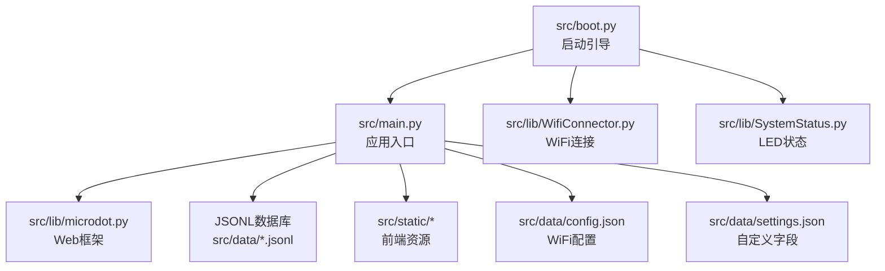
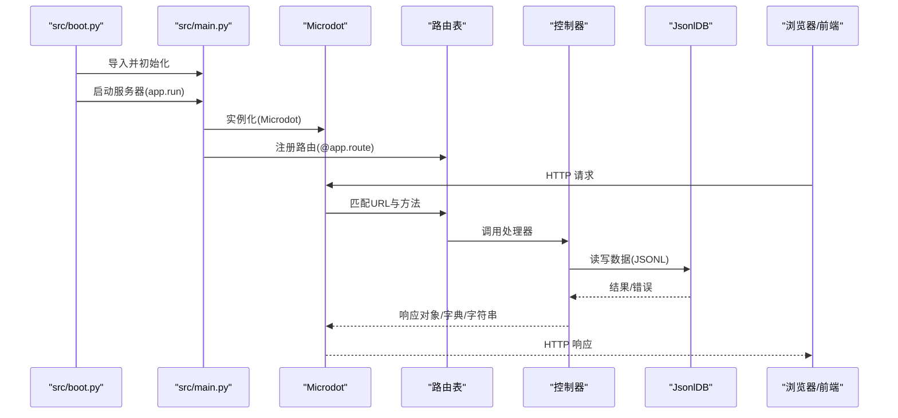
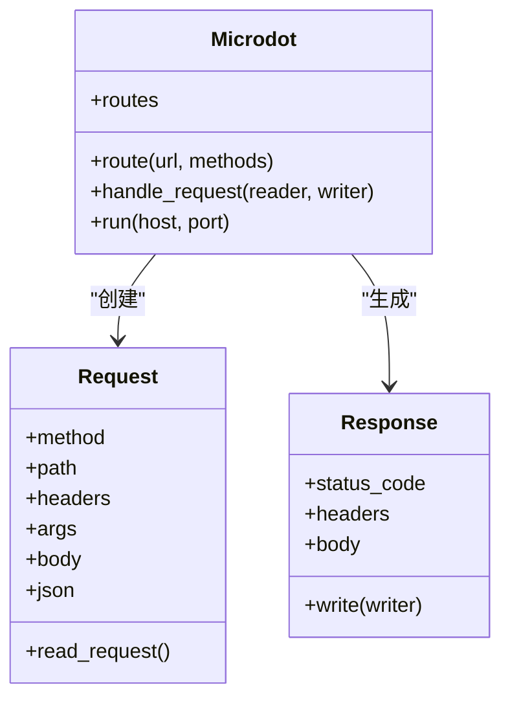
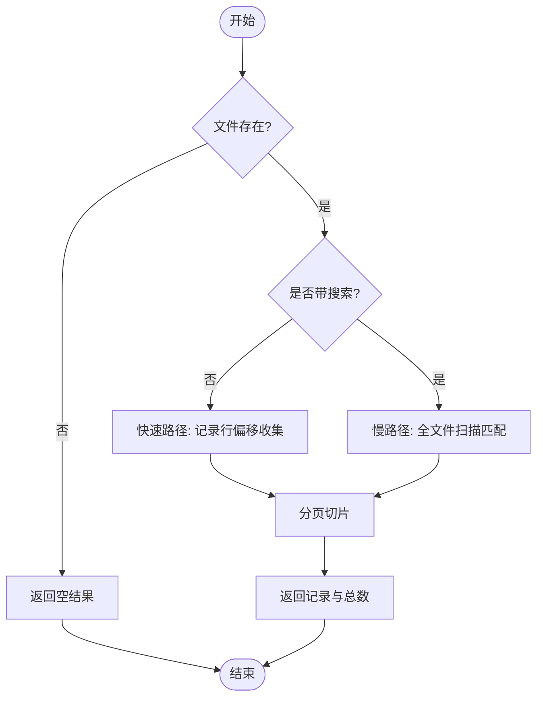
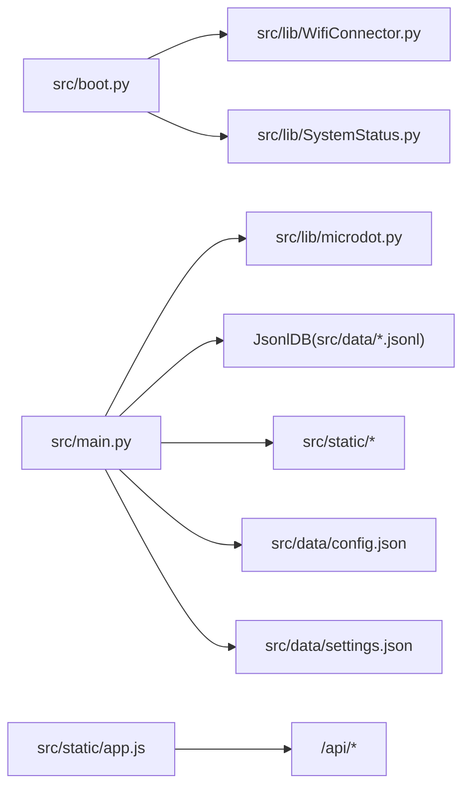

# Web服务框架

<cite>
**本文引用的文件**
- [src/main.py](file://src/main.py)
- [src/boot.py](file://src/boot.py)
- [src/lib/microdot.py](file://src/lib/microdot.py)
- [src/lib/WifiConnector.py](file://src/lib/WifiConnector.py)
- [src/lib/SystemStatus.py](file://src/lib/SystemStatus.py)
- [src/static/index.html](file://src/static/index.html)
- [src/static/app.js](file://src/static/app.js)
- [src/static/style.css](file://src/static/style.css)
- [src/data/config.json](file://src/data/config.json)
- [src/data/settings.json](file://src/data/settings.json)
</cite>

## 更新摘要
**变更内容**
- 更新所有文件路径引用，从根目录 main.py 更新到 src/main.py
- 更新项目结构图和依赖关系图，反映新的目录结构
- 更新启动流程说明，反映 boot.py 现在位于 src/ 目录

## 目录
1. [简介](#简介)
2. [项目结构](#项目结构)
3. [核心组件](#核心组件)
4. [架构总览](#架构总览)
5. [组件详解](#组件详解)
6. [依赖关系分析](#依赖关系分析)
7. [性能与并发](#性能与并发)
8. [故障排查指南](#故障排查指南)
9. [结论](#结论)
10. [附录](#附录)

## 简介
本项目基于 MicroPython 的轻量级 Web 服务框架，在 ESP32 设备上提供 RESTful API 与静态资源服务，支撑"围炉诗社·理事台"的前端交互与数据持久化。系统采用自研的微型 Web 框架 Microdot，结合 JSON Lines 数据库与前端 SPA 应用，实现低内存占用、高可用的嵌入式 Web 服务。

**更新** 项目结构已重构，所有源代码现位于 src/ 目录下，包括主应用、库模块和静态资源。

## 项目结构
- 源代码目录：src/
  - 启动引导：src/boot.py
  - 主应用：src/main.py
  - 配置：src/data/config.json、src/data/settings.json
- 库模块：
  - Web 框架：src/lib/microdot.py
  - WiFi 连接：src/lib/WifiConnector.py
  - 系统状态指示：src/lib/SystemStatus.py
- 前端资源：
  - HTML 页面：src/static/index.html
  - 样式表：src/static/style.css
  - 前端逻辑：src/static/app.js

**图表来源**
- [src/boot.py](file://src/boot.py#L1-L122)
- [src/main.py](file://src/main.py#L1-L712)
- [src/lib/microdot.py](file://src/lib/microdot.py#L1-L183)
- [src/lib/WifiConnector.py](file://src/lib/WifiConnector.py#L1-L1930)
- [src/lib/SystemStatus.py](file://src/lib/SystemStatus.py#L1-L61)
- [src/data/config.json](file://src/data/config.json#L1-L6)
- [src/data/settings.json](file://src/data/settings.json#L1-L1)

**章节来源**
- [src/main.py](file://src/main.py#L1-L712)
- [src/boot.py](file://src/boot.py#L1-L122)

## 核心组件
- Web 框架 Microdot
  - 提供请求解析、路由注册、响应生成与静态文件发送能力。
- JSON Lines 数据库 JsonlDB
  - 面向嵌入式场景的轻量数据层，支持追加、分页查询、全文检索、更新与删除。
- 前端 SPA 应用
  - 基于 fetch 的 REST 客户端，负责页面渲染、权限控制、离线草稿与分页加载。
- WiFi 与系统状态
  - WiFi 自动连接与 AP 备份、LED 状态指示，保障设备可访问性与可观测性。

**章节来源**
- [src/lib/microdot.py](file://src/lib/microdot.py#L1-L183)
- [src/main.py](file://src/main.py#L53-L267)

## 架构总览
系统启动顺序：src/boot.py 负责 WiFi 连接与 AP 备份，随后导入 src/main.py 并启动 Microdot 服务器；src/main.py 注册路由与控制器，提供 REST API 与静态资源服务；前端通过 SPA 与 API 交互。

**图表来源**
- [src/boot.py](file://src/boot.py#L105-L122)
- [src/main.py](file://src/main.py#L17-L120)
- [src/lib/microdot.py](file://src/lib/microdot.py#L94-L165)

## 组件详解

### Web 框架 Microdot
- 请求解析
  - 解析首行、头部、查询参数与 JSON 请求体。
- 路由与调度
  - 路由装饰器注册处理器，匹配方法与路径后调用。
- 响应生成
  - 支持字符串、字典/列表（自动序列化为 JSON）、文件流（send_file）。
- 服务器运行
  - 基于 uasyncio 的异步服务器，循环监听端口。

**图表来源**
- [src/lib/microdot.py](file://src/lib/microdot.py#L5-L183)

**章节来源**
- [src/lib/microdot.py](file://src/lib/microdot.py#L1-L183)

### JSON Lines 数据库 JsonlDB
- 文件组织
  - 每条记录占一行，便于顺序扫描与追加写入。
- 查询与分页
  - 无索引：快速路径按行偏移定位，慢路径全文件扫描。
- 更新与删除
  - 采用临时文件重写策略，保证一致性。
- 辅助工具
  - 自动迁移旧版 .json 至 .jsonl，确保平滑升级。

**图表来源**
- [src/main.py](file://src/main.py#L113-L186)

**章节来源**
- [src/main.py](file://src/main.py#L53-L267)

### 前端 SPA 与 API 协议
- 登录与导航
  - 登录成功后缓存用户信息，切换主界面并加载自定义字段。
- 分页与搜索
  - Poems 列表支持分页与关键词搜索，合并本地草稿与远端数据。
- 权限控制
  - 不同角色显示不同操作按钮（录入/编辑/删除）。
- API 调用
  - 使用 fetch 发送 JSON 请求，处理响应与错误提示。

**章节来源**
- [src/static/index.html](file://src/static/index.html#L1-L269)
- [src/static/app.js](file://src/static/app.js#L1-L800)
- [src/data/settings.json](file://src/data/settings.json#L1-L1)

### 路由与控制器
- 静态资源
  - 根路径与静态文件路由，通过 send_file 返回文件流。
- Poems API
  - GET /api/poems（分页、搜索）、POST /api/poems（新增）、POST /api/poems/update（更新）、POST /api/poems/delete（删除）。
- Activities API
  - GET /api/activities（分页、搜索）、POST /api/activities（新增）、POST /api/activities/update（更新）、POST /api/activities/delete（删除）。
- Tasks API
  - GET /api/tasks（全部）、POST /api/tasks/complete（完成并计分）。
- Members API
  - GET /api/members（全部）、POST /api/members（新增，校验手机号唯一）、POST /api/members/update（更新）、POST /api/members/delete（删除）。
- Finance API
  - GET /api/finance（最近若干条）、POST /api/finance（新增）。
- Settings API
  - GET/POST /api/settings/fields（自定义成员字段定义）、GET/POST /api/settings/system（系统设置）。
- System API
  - GET /api/system/info（平台、存储、内存信息）。
- 认证
  - POST /api/login（账号密码校验，返回脱敏用户信息）。
- 积分与日志
  - GET /api/points/yearly_ranking（年度积分排行榜）
  - GET /api/login_logs（登录日志）

**章节来源**
- [src/main.py](file://src/main.py#L299-L712)

### WebSocket 支持
- 当前实现未包含 WebSocket 支持。若需扩展，可在 Microdot 中引入 uasyncio 的 socket 协程与消息编解码逻辑，并在路由层提供升级握手与消息广播机制。

## 依赖关系分析
- 启动阶段
  - src/boot.py 依赖 WiFi 连接器与系统状态指示，负责网络可用性与 LED 状态反馈。
- 运行阶段
  - src/main.py 依赖 Microdot、JsonlDB 与静态资源；前端通过 SPA 与 API 交互。
- 配置与数据
  - src/data/config.json 提供 WiFi 凭据；src/data/settings.json 提供自定义字段定义；各业务数据以 JSONL 形式存放。

**图表来源**
- [src/boot.py](file://src/boot.py#L1-L122)
- [src/main.py](file://src/main.py#L1-L120)
- [src/lib/microdot.py](file://src/lib/microdot.py#L1-L183)
- [src/data/config.json](file://src/data/config.json#L1-L6)
- [src/data/settings.json](file://src/data/settings.json#L1-L1)

**章节来源**
- [src/boot.py](file://src/boot.py#L1-L122)
- [src/main.py](file://src/main.py#L1-L120)

## 性能与并发
- 异步模型
  - Microdot 基于 uasyncio，单线程事件循环处理多个并发连接，适合低并发嵌入式场景。
- I/O 优化
  - JsonlDB 采用顺序扫描与临时文件重写，避免频繁随机读写；分页与搜索分离快慢路径，降低内存占用。
- 前端缓存
  - SPA 对常用数据进行本地缓存，减少重复请求；分页加载与草稿合并提升体验。
- 内存管理
  - 定期触发垃圾回收，打印可用内存；合理控制响应体大小，避免一次性加载大文件。
- 并发策略
  - 建议限制并发连接数与请求体大小；对耗时操作（如搜索）设置超时；必要时拆分为多进程或外部协程池。

**章节来源**
- [src/lib/microdot.py](file://src/lib/microdot.py#L154-L165)
- [src/main.py](file://src/main.py#L279-L294)

## 故障排查指南
- WiFi 连接失败
  - 检查 src/data/config.json 中 SSID/密码；查看 src/boot.py 日志与 LED 状态；必要时进入 AP 模式。
- 服务器无法访问
  - 确认 app.run 已启动；检查端口占用；确认防火墙规则。
- API 返回 404 或 500
  - 核对路由定义与方法；查看控制器异常堆栈；检查 JsonlDB 文件是否存在与可读写。
- 前端无法登录
  - 确认 /api/login 的凭据正确；检查网络连通性与跨域问题；查看浏览器控制台错误。
- 存储空间不足
  - 清理历史数据；监控 /api/system/info 中剩余存储；考虑压缩或归档策略。

**章节来源**
- [src/boot.py](file://src/boot.py#L22-L87)
- [src/lib/microdot.py](file://src/lib/microdot.py#L133-L138)
- [src/main.py](file://src/main.py#L528-L540)

## 结论
本项目以 Microdot 为核心，结合 JsonlDB 与前端 SPA，构建了面向 ESP32 的轻量级 Web 服务。其设计强调低内存占用、简单可靠与易扩展，适用于小型组织的内部管理系统。项目结构已重构至 src/ 目录，便于更好的代码组织与维护。后续可在保持现有架构的前提下，逐步引入 WebSocket、缓存层与更完善的鉴权体系。

## 附录

### RESTful API 规范与示例
- 基础路径
  - /api
- Poems
  - GET /api/poems?page=&limit=&q=
  - POST /api/poems
  - POST /api/poems/update
  - POST /api/poems/delete
- Activities
  - GET /api/activities?page=&limit=&q=
  - POST /api/activities
  - POST /api/activities/update
  - POST /api/activities/delete
- Tasks
  - GET /api/tasks
  - POST /api/tasks/complete
- Members
  - GET /api/members
  - POST /api/members
  - POST /api/members/update
  - POST /api/members/delete
- Finance
  - GET /api/finance
  - POST /api/finance
- Settings
  - GET/POST /api/settings/fields
  - GET/POST /api/settings/system
- Points & Logs
  - GET /api/points/yearly_ranking
  - GET /api/login_logs
- System
  - GET /api/system/info
- Login
  - POST /api/login

**章节来源**
- [src/main.py](file://src/main.py#L299-L712)

### 请求参数与响应格式约定
- 请求体
  - 默认 JSON；非 JSON 请求体按字符串处理。
- 响应体
  - 字符串：纯文本响应。
  - 字典/列表：自动序列化为 JSON，Content-Type: application/json。
  - 文件：send_file 返回二进制流，设置 Content-Type 与 Content-Length。
- 状态码
  - 200 成功；400 参数错误；401 未授权；404 未找到；500 服务器错误。

**章节来源**
- [src/lib/microdot.py](file://src/lib/microdot.py#L51-L93)
- [src/lib/microdot.py](file://src/lib/microdot.py#L140-L144)

### 与主应用服务的集成与扩展
- 集成方式
  - 在 src/main.py 中注册新路由与控制器，复用 JsonlDB 与 send_file。
- 扩展开发
  - 新增业务模块：定义数据模型、路由与控制器，遵循现有命名与错误处理风格。
  - 引入中间件：在 Microdot.handle_request 前后插入通用逻辑（鉴权、日志、限流）。
  - 增强前端：在 src/static/app.js 中新增页面与 API 调用，注意分页与错误提示。

**章节来源**
- [src/main.py](file://src/main.py#L17-L120)
- [src/lib/microdot.py](file://src/lib/microdot.py#L104-L152)