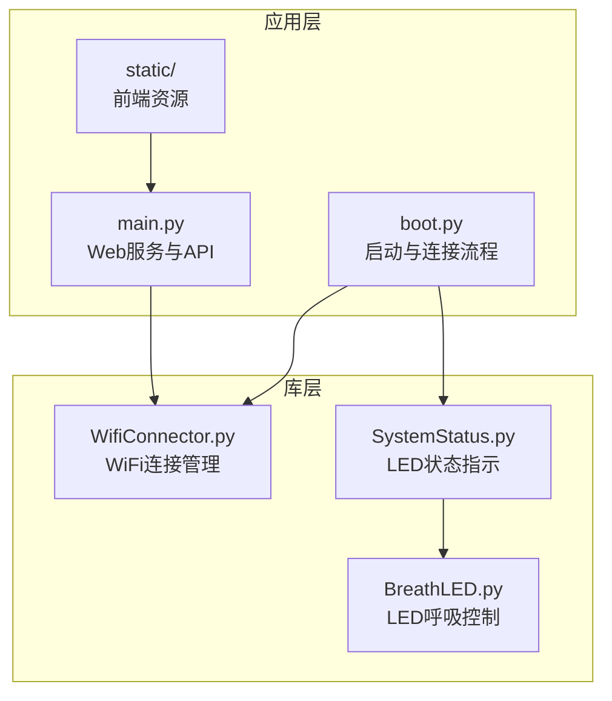
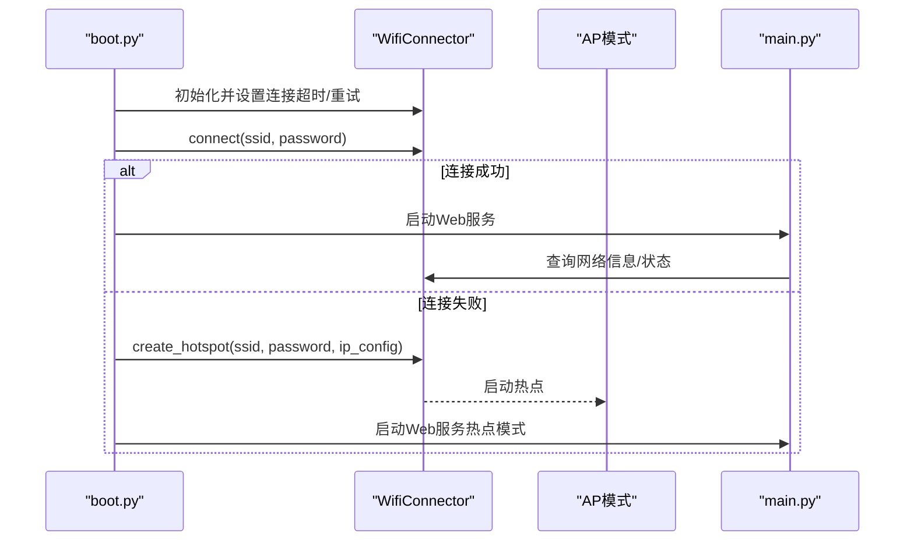
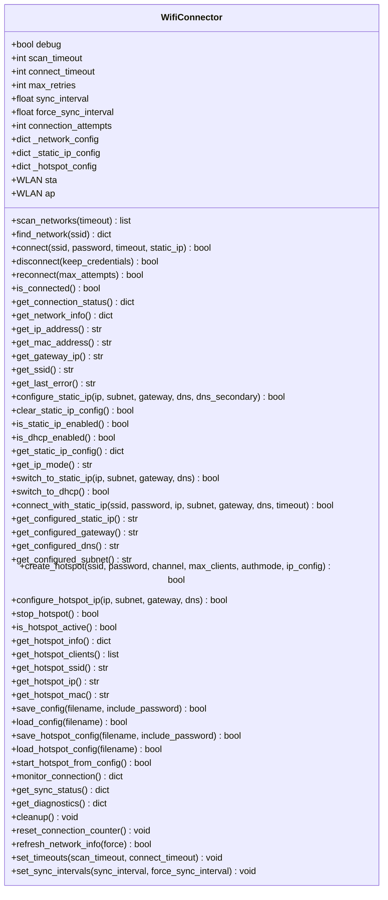
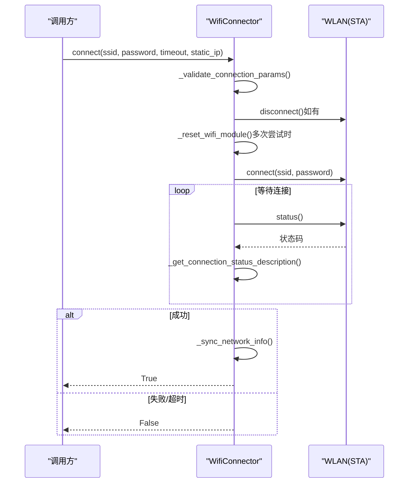
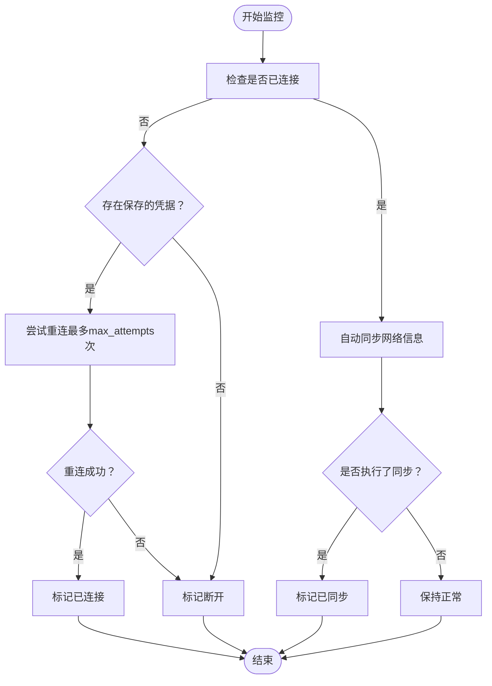
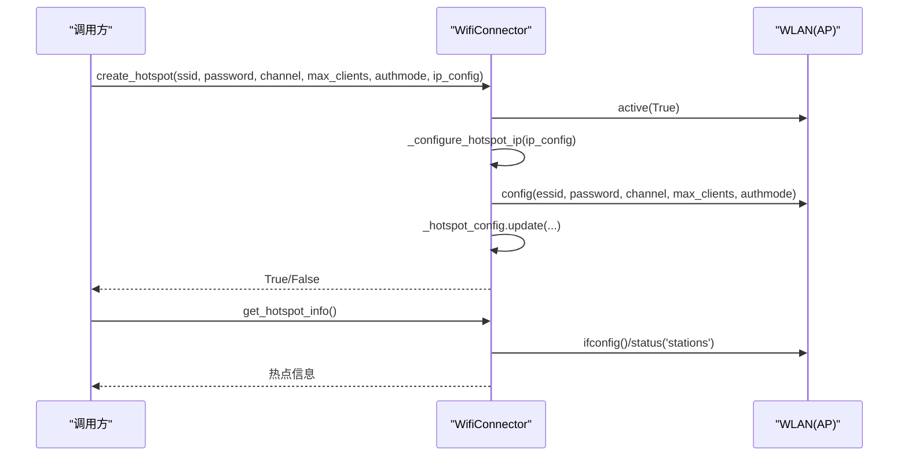
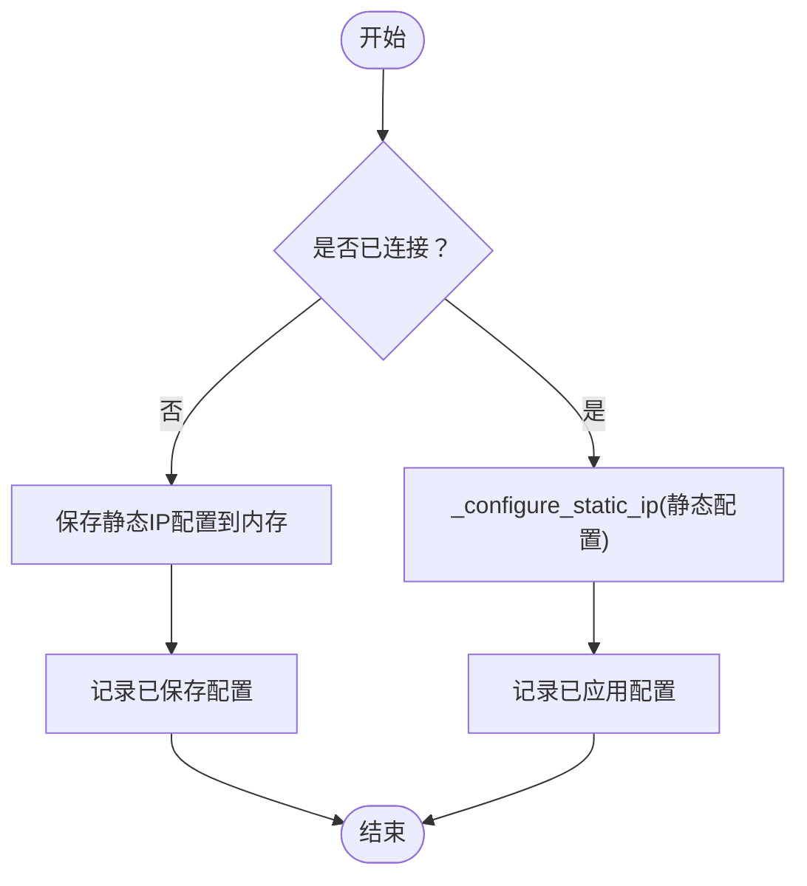
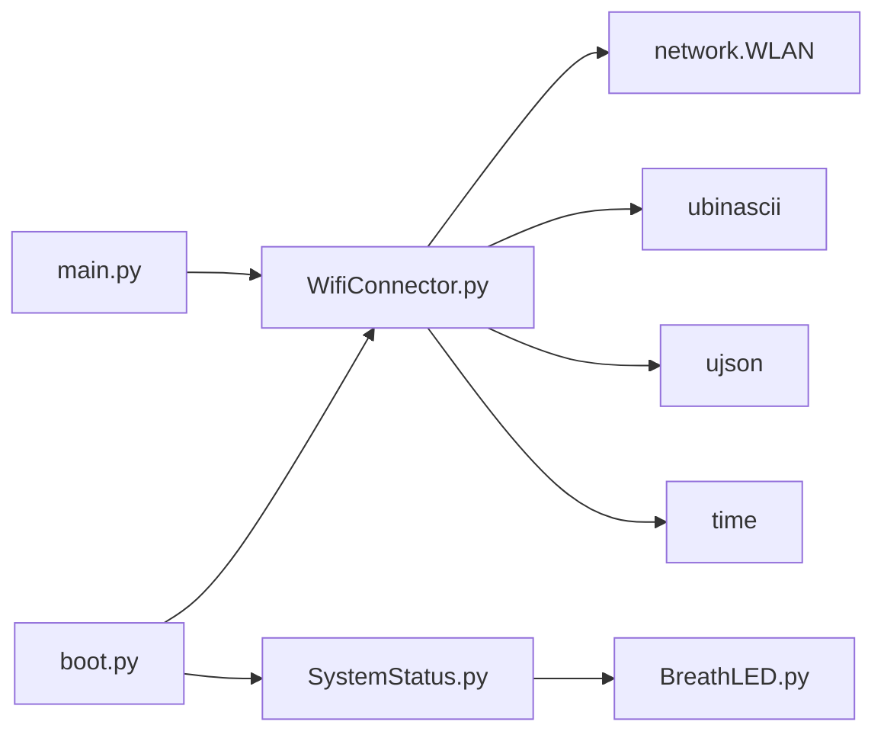

# WiFi连接管理

<cite>
**本文引用的文件**
- [WifiConnector.py](file://src/lib/WifiConnector.py)
- [boot.py](file://src/boot.py)
- [main.py](file://src/main.py)
- [SystemStatus.py](file://src/lib/SystemStatus.py)
- [BreathLED.py](file://src/lib/BreathLED.py)
</cite>

## 更新摘要
**变更内容**
- 更新以反映WifiConnector.py的实际完整功能实现
- 移除对简化版本的描述，基于真实代码重构文档
- 修正API接口文档以匹配实际实现
- 更新架构分析以反映完整的功能集

## 目录
1. [简介](#简介)
2. [项目结构](#项目结构)
3. [核心组件](#核心组件)
4. [架构总览](#架构总览)
5. [详细组件分析](#详细组件分析)
6. [依赖关系分析](#依赖关系分析)
7. [性能考量](#性能考量)
8. [故障排除指南](#故障排除指南)
9. [结论](#结论)
10. [附录](#附录)

## 简介
本技术文档围绕ESP32 MicroPython环境下的WiFi连接管理模块展开，重点解析WifiConnector类的设计架构、核心功能实现与使用模式。内容涵盖网络扫描、连接管理、自动重连、热点创建、静态IP配置等关键能力，并提供完整的API接口说明、参数与返回值类型、异常处理机制、实际代码示例与最佳实践指导。文档还解释了WiFi连接状态管理、错误诊断与故障排除方法，并说明模块的配置选项、性能优化与扩展能力。

## 项目结构
该仓库采用"模块化+示例"的组织方式：
- src/lib目录：核心库与示例代码
  - WifiConnector.py：WiFi连接管理主类，提供完整的网络管理功能
  - boot.py：系统启动流程，负责WiFi连接与AP模式切换
  - main.py：Web服务入口，提供REST API与前端资源
  - SystemStatus.py：系统LED状态指示
  - BreathLED.py：LED呼吸效果控制类
- data目录：应用数据与配置
- static目录：前端静态资源

**图表来源**
- [boot.py](file://src/boot.py#L1-L153)
- [main.py](file://src/main.py#L1-L800)
- [WifiConnector.py](file://src/lib/WifiConnector.py#L1-L1019)
- [SystemStatus.py](file://src/lib/SystemStatus.py#L1-L146)
- [BreathLED.py](file://src/lib/BreathLED.py#L1-L347)

**章节来源**
- [boot.py](file://src/boot.py#L1-L153)
- [main.py](file://src/main.py#L1-L800)

## 核心组件
- WifiConnector类：封装STA/AP模式、网络扫描、连接/断开、自动重连、静态IP配置、热点创建与管理、诊断与配置持久化等能力。
- SystemStatus与BreathLED：提供系统LED状态指示，区分连接中、AP模式、运行中三种状态。
- boot.py与main.py：系统启动与Web服务入口，集成WiFi连接与AP模式切换逻辑。

**章节来源**
- [WifiConnector.py](file://src/lib/WifiConnector.py#L5-L120)
- [SystemStatus.py](file://src/lib/SystemStatus.py#L27-L146)
- [BreathLED.py](file://src/lib/BreathLED.py#L5-L347)

## 架构总览
WifiConnector类通过ESP32的network.WLAN接口管理STA与AP两种模式，结合缓存与自动同步机制，提供稳定的网络状态查询与维护。系统启动阶段由boot.py负责加载配置、尝试连接、失败时进入AP模式；运行阶段由main.py提供HTTP服务，二者均依赖WifiConnector进行网络管理。

**图表来源**
- [boot.py](file://src/boot.py#L28-L105)
- [WifiConnector.py](file://src/lib/WifiConnector.py#L315-L376)
- [main.py](file://src/main.py#L534-L541)

## 详细组件分析

### WifiConnector类设计与职责
- 设计理念：围绕STA与AP双模式，提供统一的连接生命周期管理、状态缓存与自动同步、静态IP与DHCP动态切换、热点配置持久化与便捷访问器。
- 关键职责：
  - 网络扫描与连接：scan_networks/find_network/connect/disconnect/reconnect
  - 状态查询：is_connected/get_connection_status/get_network_info/便捷访问器
  - 静态IP管理：configure_static_ip/clear_static_ip_config/is_static_ip_enabled/is_dhcp_enabled/get_static_ip_config/get_ip_mode/switch_to_static_ip/switch_to_dhcp/connect_with_static_ip/便捷访问器
  - 热点管理：create_hotspot/configure_hotspot_ip/stop_hotspot/is_hotspot_active/get_hotspot_info/get_hotspot_clients/便捷访问器
  - 配置持久化：save_config/load_config/save_hotspot_config/load_hotspot_config/start_hotspot_from_config
  - 诊断与维护：monitor_connection/get_sync_status/get_diagnostics/cleanup/reset_connection_counter/refresh_network_info
  - 参数与超时：set_timeouts/set_sync_intervals

**图表来源**
- [WifiConnector.py](file://src/lib/WifiConnector.py#L5-L120)
- [WifiConnector.py](file://src/lib/WifiConnector.py#L130-L1019)

**章节来源**
- [WifiConnector.py](file://src/lib/WifiConnector.py#L5-L120)
- [WifiConnector.py](file://src/lib/WifiConnector.py#L130-L1019)

### 网络扫描与连接管理
- 网络扫描：scan_networks支持自定义超时，返回包含SSID、BSSID、信道、RSSI、认证模式、信号质量等信息的列表，并按RSSI降序排列。
- 连接管理：connect支持静态IP参数，内部自动验证参数、断开旧连接、必要时重置WiFi模块、配置静态IP（若提供）、等待连接完成并同步网络信息；disconnect支持保留凭据；reconnect基于已保存凭据自动重连。
- 状态查询：is_connected/get_connection_status/get_network_info提供连接状态、IP、子网、网关、DNS、MAC、信号强度等信息；便捷访问器简化常用字段获取。

**图表来源**
- [WifiConnector.py](file://src/lib/WifiConnector.py#L315-L376)
- [WifiConnector.py](file://src/lib/WifiConnector.py#L120-L129)

**章节来源**
- [WifiConnector.py](file://src/lib/WifiConnector.py#L276-L314)
- [WifiConnector.py](file://src/lib/WifiConnector.py#L315-L376)
- [WifiConnector.py](file://src/lib/WifiConnector.py#L414-L435)

### 自动重连与连接监控
- 自动重连：reconnect在无显式凭据时返回失败；有凭据时按max_attempts循环尝试，每次间隔2秒；成功后重置连接计数器。
- 连接监控：monitor_connection在断开时尝试重连并返回状态；get_sync_status返回上次同步时间、下次检查时间等信息；get_diagnostics提供STA/AP活动状态、连接尝试次数、错误信息、同步间隔等综合诊断。

**图表来源**
- [WifiConnector.py](file://src/lib/WifiConnector.py#L860-L882)
- [WifiConnector.py](file://src/lib/WifiConnector.py#L883-L891)

**章节来源**
- [WifiConnector.py](file://src/lib/WifiConnector.py#L414-L435)
- [WifiConnector.py](file://src/lib/WifiConnector.py#L860-L891)

### 热点创建与管理
- 热点创建：create_hotspot支持自定义SSID、密码（至少8位）、信道（1-13）、最大客户端数（1-10）、认证模式（开放/WEP/WPA/WPA2/WPA/WPA2-PSK）、IP配置（IP/子网/网关/DNS）。支持动态配置热点IP与持久化配置。
- 热点信息：get_hotspot_info返回激活状态、SSID、信道、认证模式、最大客户端数、IP/子网/网关/DNS、MAC、客户端数量；get_hotspot_clients返回已连接客户端列表。
- 热点控制：stop_hotspot停止热点；is_hotspot_active检查激活状态；便捷访问器get_hotspot_ssid/get_hotspot_ip/get_hotspot_mac。

**图表来源**
- [WifiConnector.py](file://src/lib/WifiConnector.py#L610-L676)
- [WifiConnector.py](file://src/lib/WifiConnector.py#L720-L763)

**章节来源**
- [WifiConnector.py](file://src/lib/WifiConnector.py#L610-L676)
- [WifiConnector.py](file://src/lib/WifiConnector.py#L720-L804)

### 静态IP配置与DHCP/静态IP动态切换
- 静态IP配置：configure_static_ip支持独立配置，connect_with_static_ip一步到位，_configure_static_ip内部实现，包含IP/子网/网关/DNS验证与自动推断网关。
- 模式切换：switch_to_static_ip在已连接状态下动态切换到静态IP；switch_to_dhcp在已连接状态下切换回DHCP并自动重连；is_static_ip_enabled/is_dhcp_enabled/get_ip_mode提供模式查询；get_static_ip_config返回当前静态IP配置；便捷访问器get_configured_static_ip/get_configured_gateway/get_configured_dns/get_configured_subnet。
- 配置持久化：save_config/load_config支持静态IP配置与连接参数持久化；clear_static_ip_config清除静态IP配置。

**图表来源**
- [WifiConnector.py](file://src/lib/WifiConnector.py#L498-L527)
- [WifiConnector.py](file://src/lib/WifiConnector.py#L553-L589)

**章节来源**
- [WifiConnector.py](file://src/lib/WifiConnector.py#L498-L589)
- [WifiConnector.py](file://src/lib/WifiConnector.py#L917-L982)

### 配置持久化与诊断
- 配置持久化：save_config保存SSID/密码、静态IP配置、连接参数、同步间隔；load_config加载配置；save_hotspot_config/load_hotspot_config/start_hotspot_from_config管理热点配置。
- 诊断：get_diagnostics返回STA/AP活动状态、连接状态、IP模式、连接尝试次数、错误信息、同步间隔、网络信息等；cleanup释放STA/AP资源。

**章节来源**
- [WifiConnector.py](file://src/lib/WifiConnector.py#L983-L1019)

### API接口文档（概览）
- 网络扫描与连接
  - scan_networks(timeout=None) -> list
  - find_network(ssid) -> dict or None
  - connect(ssid, password=None, timeout=None, static_ip=None) -> bool
  - disconnect(keep_credentials=True) -> bool
  - reconnect(max_attempts=None) -> bool
- 状态查询
  - is_connected() -> bool
  - get_connection_status() -> dict
  - get_network_info() -> dict
  - get_ip_address() -> str or None
  - get_mac_address() -> str or None
  - get_gateway_ip() -> str or None
  - get_ssid() -> str or None
  - get_last_error() -> str or None
- 静态IP管理（v1.3.0）
  - configure_static_ip(ip, subnet=None, gateway=None, dns=None, dns_secondary=None) -> bool
  - clear_static_ip_config() -> bool
  - is_static_ip_enabled() -> bool
  - is_dhcp_enabled() -> bool
  - get_static_ip_config() -> dict or None
  - get_ip_mode() -> str
  - switch_to_static_ip(ip, subnet=None, gateway=None, dns=None) -> bool
  - switch_to_dhcp() -> bool
  - connect_with_static_ip(ssid, password=None, ip=None, subnet=None, gateway=None, dns=None, timeout=None) -> bool
  - get_configured_static_ip() -> str or None
  - get_configured_gateway() -> str or None
  - get_configured_dns() -> str or None
  - get_configured_subnet() -> str or None
- 热点管理（v1.2.0起增强）
  - create_hotspot(ssid, password=None, channel=None, max_clients=None, authmode=None, ip_config=None) -> bool
  - configure_hotspot_ip(ip='192.168.4.1', subnet='255.255.255.0', gateway=None, dns=None) -> bool
  - stop_hotspot() -> bool
  - is_hotspot_active() -> bool
  - get_hotspot_info() -> dict
  - get_hotspot_clients() -> list
  - get_hotspot_ssid() -> str or None
  - get_hotspot_ip() -> str or None
  - get_hotspot_mac() -> str or None
- 配置持久化与维护
  - save_config(filename='wifi_config.json', include_password=False) -> bool
  - load_config(filename='wifi_config.json') -> bool
  - save_hotspot_config(filename='hotspot_config.json', include_password=False) -> bool
  - load_hotspot_config(filename='hotspot_config.json') -> bool
  - start_hotspot_from_config() -> bool
  - monitor_connection() -> dict
  - get_sync_status() -> dict
  - get_diagnostics() -> dict
  - cleanup() -> void
  - reset_connection_counter() -> void
  - refresh_network_info(force=False) -> bool
  - set_timeouts(scan_timeout=None, connect_timeout=None) -> void
  - set_sync_intervals(sync_interval=None, force_sync_interval=None) -> void

**章节来源**
- [WifiConnector.py](file://src/lib/WifiConnector.py#L276-L1019)

### 使用模式与最佳实践
- 启动流程：boot.py加载配置，设置较长连接超时与重试次数，尝试连接；失败则创建AP并进入热点模式。
- Web服务：main.py提供REST API与静态资源，系统状态通过SystemStatus与BreathLED反馈。
- 连接监控：在主循环中定期调用monitor_connection，结合get_sync_status与get_diagnostics进行健康检查。
- 静态IP：在需要固定IP的场景使用configure_static_ip或connect_with_static_ip；在运行中使用switch_to_static_ip/switch_to_dhcp动态切换。
- 配置持久化：save_config与save_hotspot_config分别保存WiFi与热点配置，避免重复输入。

**章节来源**
- [boot.py](file://src/boot.py#L28-L105)
- [main.py](file://src/main.py#L534-L541)
- [WifiConnector.py](file://src/lib/WifiConnector.py#L860-L891)

## 依赖关系分析
- WifiConnector依赖ESP32的network.WLAN接口管理STA/AP模式，依赖ubinascii/ujson进行数据处理，依赖time进行超时与同步控制。
- boot.py与main.py依赖WifiConnector进行网络管理；boot.py还依赖SystemStatus与BreathLED进行LED状态指示。

**图表来源**
- [WifiConnector.py](file://src/lib/WifiConnector.py#L1-L4)
- [boot.py](file://src/boot.py#L1-L8)
- [SystemStatus.py](file://src/lib/SystemStatus.py#L15-L17)
- [BreathLED.py](file://src/lib/BreathLED.py#L1-L4)
- [main.py](file://src/main.py#L1-L16)

**章节来源**
- [WifiConnector.py](file://src/lib/WifiConnector.py#L1-L4)
- [boot.py](file://src/boot.py#L1-L8)
- [main.py](file://src/main.py#L1-L16)

## 性能考量
- 缓存与自动同步：通过_get_auto_sync_network_info与_last_sync_time避免频繁查询底层ifconfig，降低CPU与内存压力。
- 超时与重试：合理设置scan_timeout/connect_timeout与max_retries，避免长时间阻塞；在多次失败后重置WiFi模块以恢复稳定性。
- 静态IP切换：在已连接状态下动态切换静态IP，避免不必要的断开重连。
- 资源清理：cleanup确保STA/AP接口释放，避免资源泄漏。

## 故障排除指南
- 连接失败
  - 检查SSID与密码是否正确；确认网络在扫描范围内；查看get_last_error获取详细错误信息。
  - 若出现"密码错误/未找到接入点/连接失败"，根据状态码定位原因。
- 连接不稳定
  - 启用monitor_connection进行周期性监控；检查信号强度；调整重连参数。
- IP地址获取失败
  - 手动刷新网络信息：refresh_network_info(force=True)；检查DHCP服务器状态。
- 热点问题
  - 确认信道与最大客户端数范围；检查认证模式与密码长度；使用get_hotspot_info与get_hotspot_clients诊断。
- 静态IP问题
  - 检查IP/子网/网关/DNS格式；使用get_configured_*便捷访问器核对配置；必要时clear_static_ip_config后重新配置。

**章节来源**
- [WifiConnector.py](file://src/lib/WifiConnector.py#L80-L105)
- [WifiConnector.py](file://src/lib/WifiConnector.py#L315-L376)
- [WifiConnector.py](file://src/lib/WifiConnector.py#L498-L527)

## 结论
WifiConnector类在ESP32 MicroPython环境下提供了完善的WiFi连接管理能力，覆盖网络扫描、连接/断开、自动重连、静态IP与DHCP动态切换、热点创建与管理、配置持久化与诊断等关键功能。通过缓存与自动同步机制、参数化超时与重试策略、便捷访问器与诊断接口，模块在易用性与可靠性方面表现优异。结合boot.py与main.py的启动与Web服务流程，可构建稳定可靠的物联网应用。

## 附录
- 快速开始示例路径：[boot.py](file://src/boot.py#L28-L105)
- Web服务入口路径：[main.py](file://src/main.py#L534-L541)
- API参考路径：[WifiConnector.py](file://src/lib/WifiConnector.py#L276-L1019)