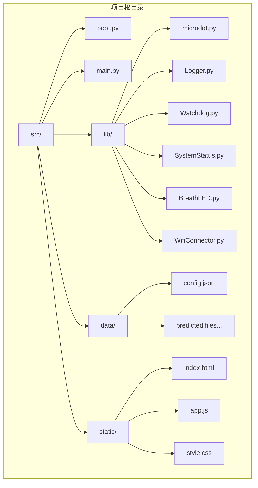
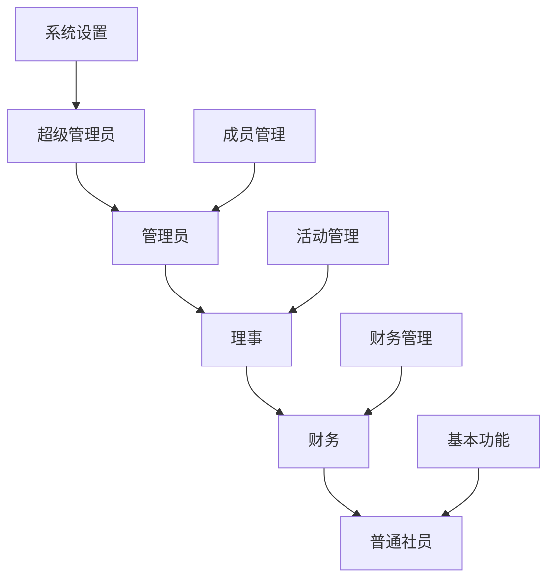
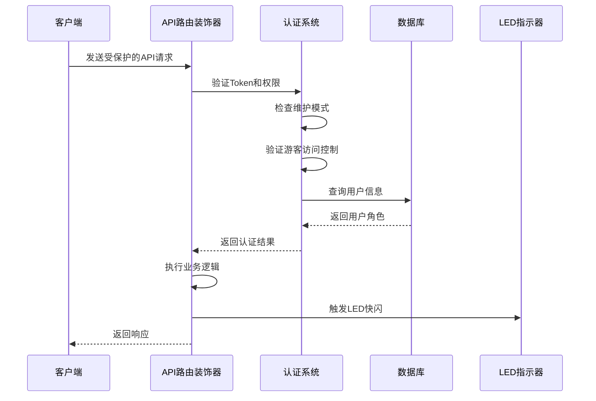
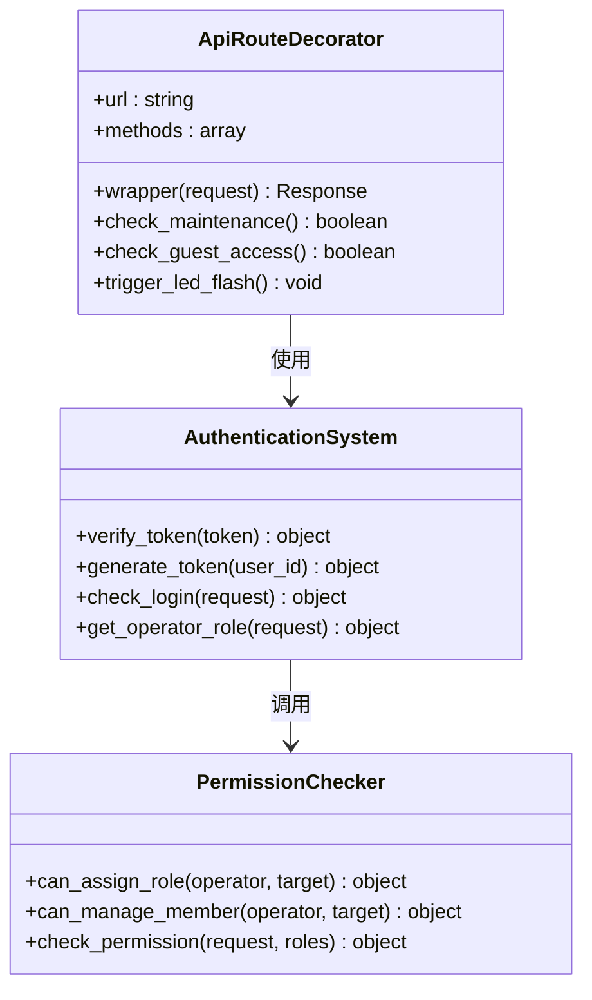
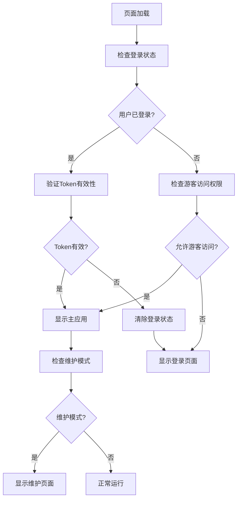
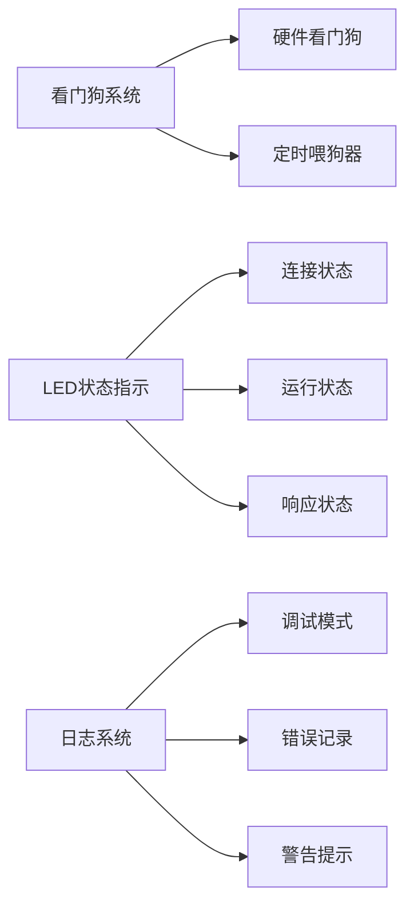
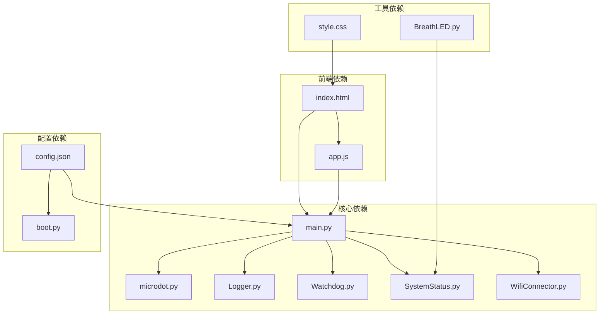

# 安全访问控制

<cite>
**本文档引用的文件**
- [README.md](file://README.md)
- [main.py](file://src/main.py)
- [boot.py](file://src/boot.py)
- [microdot.py](file://src/lib/microdot.py)
- [config.json](file://src/data/config.json)
- [Logger.py](file://src/lib/Logger.py)
- [Watchdog.py](file://src/lib/Watchdog.py)
- [SystemStatus.py](file://src/lib/SystemStatus.py)
- [WifiConnector.py](file://src/lib/WifiConnector.py)
- [index.html](file://src/static/index.html)
- [app.js](file://src/static/app.js)
- [style.css](file://src/static/style.css)
</cite>

## 目录
1. [简介](#简介)
2. [项目结构](#项目结构)
3. [核心组件](#核心组件)
4. [架构概览](#架构概览)
5. [详细组件分析](#详细组件分析)
6. [依赖关系分析](#依赖关系分析)
7. [性能考虑](#性能考虑)
8. [故障排除指南](#故障排除指南)
9. [结论](#结论)

## 简介

围炉诗社·理事台是一个专为诗社管理设计的嵌入式Web应用系统，基于ESP32-S2硬件平台和MicroPython开发环境。该系统实现了全面的安全访问控制机制，包括基于Token的身份认证、多级权限管理、游客访问控制和系统监控等功能。

系统的核心安全特性包括：
- **Token认证机制**：基于SHA256签名的令牌鉴权，支持动态有效期配置
- **五级权限体系**：超级管理员、管理员、理事、财务、普通社员
- **游客访问控制**：灵活的访问权限管理
- **系统监控**：看门狗和LED状态指示
- **网络安全**：WiFi连接管理和静态IP配置

## 项目结构

**图表来源**
- [boot.py](file://src/boot.py#L1-L153)
- [main.py](file://src/main.py#L1-L800)

**章节来源**
- [README.md](file://README.md#L43-L58)
- [boot.py](file://src/boot.py#L1-L153)

## 核心组件

### Token认证系统

系统实现了基于SHA256的Token认证机制，提供以下安全特性：

- **Token格式**：`user_id:expire_timestamp:signature`
- **签名算法**：SHA256哈希，使用password_salt作为密钥
- **有效期管理**：支持1-365天的动态配置
- **自动过期检测**：实时验证Token有效性

### 权限管理体系

系统采用五级权限模型，每级权限都有明确的职责边界：

**图表来源**
- [main.py](file://src/main.py#L545-L557)

### 访问控制机制

系统实现了多层次的访问控制：

- **维护模式检查**：管理员级别的特殊访问权限
- **游客访问控制**：通过allow_guest配置管理
- **公开数据白名单**：允许未登录用户访问特定接口
- **API路由装饰器**：统一的权限验证入口

**章节来源**
- [main.py](file://src/main.py#L69-L106)
- [main.py](file://src/main.py#L545-L557)

## 架构概览

**图表来源**
- [main.py](file://src/main.py#L69-L106)
- [main.py](file://src/main.py#L211-L229)

## 详细组件分析

### 认证装饰器系统

API路由装饰器提供了统一的认证入口：

**图表来源**
- [main.py](file://src/main.py#L69-L106)
- [main.py](file://src/main.py#L175-L229)
- [main.py](file://src/main.py#L596-L625)

### 前端安全控制

前端JavaScript实现了多层次的安全控制：

**图表来源**
- [app.js](file://src/static/app.js#L225-L261)

**章节来源**
- [app.js](file://src/static/app.js#L225-L261)
- [app.js](file://src/static/app.js#L1171-L1204)

### 系统监控与安全

系统集成了多重监控机制确保安全性：

**图表来源**
- [Watchdog.py](file://src/lib/Watchdog.py#L17-L105)
- [SystemStatus.py](file://src/lib/SystemStatus.py#L27-L145)
- [Logger.py](file://src/lib/Logger.py#L29-L127)

**章节来源**
- [Watchdog.py](file://src/lib/Watchdog.py#L17-L105)
- [SystemStatus.py](file://src/lib/SystemStatus.py#L27-L145)
- [Logger.py](file://src/lib/Logger.py#L29-L127)

## 依赖关系分析

**图表来源**
- [main.py](file://src/main.py#L1-L16)
- [boot.py](file://src/boot.py#L1-L8)

**章节来源**
- [main.py](file://src/main.py#L1-L16)
- [boot.py](file://src/boot.py#L1-L8)

## 性能考虑

系统在安全性的同时注重性能优化：

### 内存管理
- **垃圾回收**：在关键操作前后主动调用`gc.collect()`
- **流式处理**：JSONL数据库采用逐行读取，避免内存溢出
- **请求限制**：限制单次请求最大大小为600KB

### 网络优化
- **异步I/O**：使用uasyncio处理并发请求
- **连接池**：合理管理WiFi连接状态
- **缓存策略**：智能缓存系统设置和用户信息

### 硬件优化
- **看门狗**：防止系统死锁和异常
- **LED节能**：1分钟后自动关闭LED，节省CPU资源
- **定时喂狗**：30秒周期喂狗，确保系统稳定运行

## 故障排除指南

### 常见安全问题

| 问题 | 可能原因 | 解决方案 |
|------|----------|----------|
| Token验证失败 | Token格式错误或已过期 | 检查Token格式和有效期设置 |
| 权限不足 | 用户角色权限不够 | 确认用户角色和API权限配置 |
| 访问被拒绝 | 维护模式或游客访问限制 | 检查系统设置和访问控制配置 |
| WiFi连接问题 | 网络配置错误 | 验证WiFi配置和网络状态 |

### 调试技巧

1. **启用调试模式**：通过`debug_mode`配置查看详细日志
2. **检查系统状态**：使用系统监控功能查看运行状态
3. **验证配置**：确认`config.json`中的安全配置正确
4. **测试连接**：使用WiFi连接器测试网络连接

**章节来源**
- [Logger.py](file://src/lib/Logger.py#L48-L71)
- [config.json](file://src/data/config.json#L1-L1)

## 结论

围炉诗社·理事台系统实现了全面的安全访问控制机制，通过多层次的认证和授权体系，确保了系统的安全性和可靠性。系统的主要优势包括：

1. **完善的认证机制**：基于Token的强认证，支持动态有效期管理
2. **精细的权限控制**：五级权限体系，明确的职责边界
3. **灵活的访问控制**：支持维护模式和游客访问管理
4. **强大的监控能力**：看门狗和LED状态指示确保系统稳定
5. **性能优化**：内存管理和网络优化确保系统高效运行

该系统为小型组织提供了可靠的数字化管理解决方案，既保证了安全性，又保持了良好的用户体验。