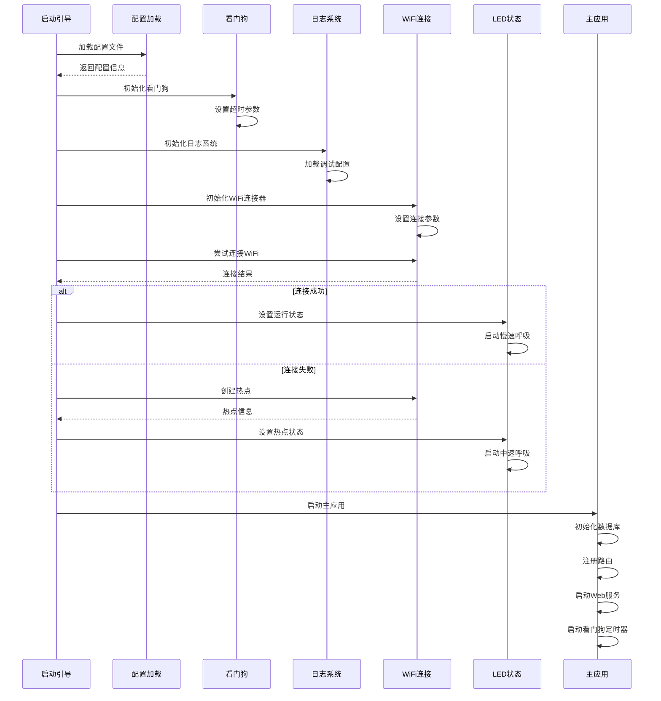
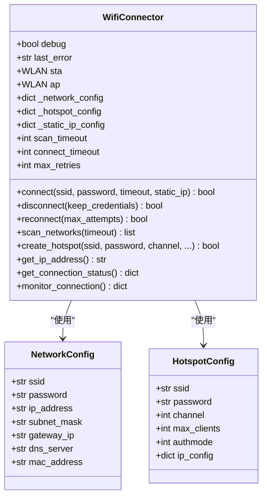
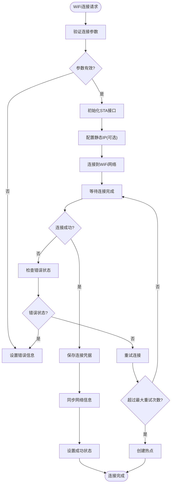
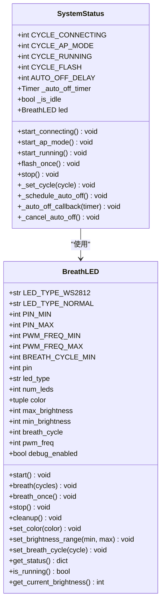
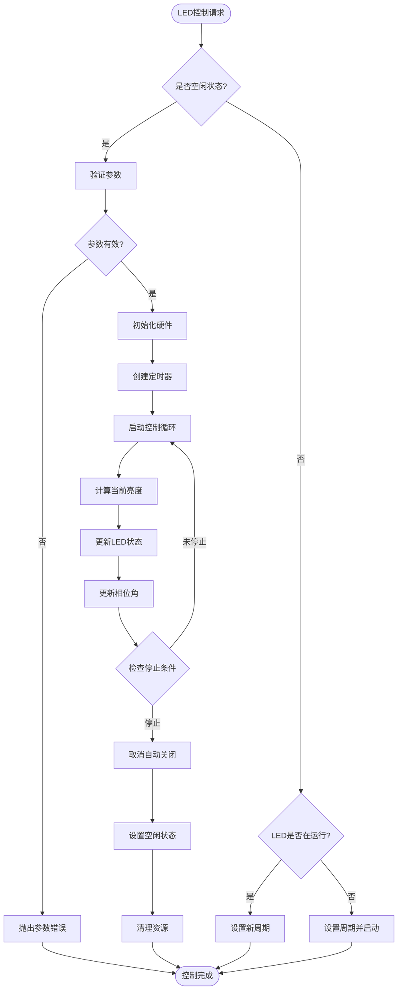
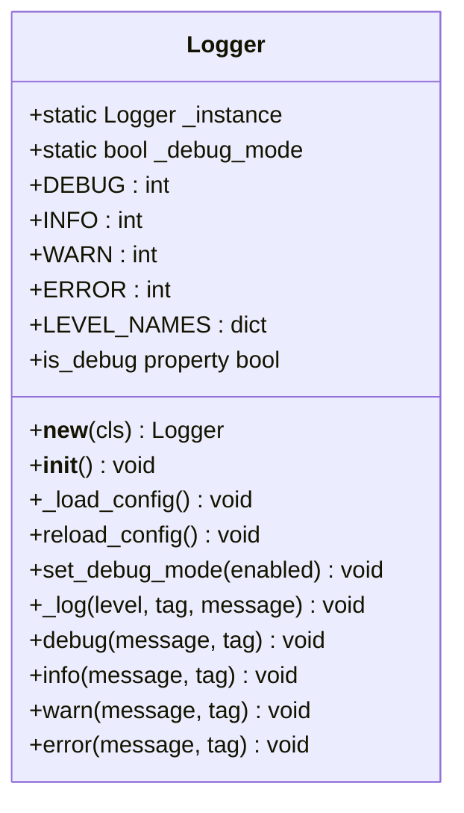
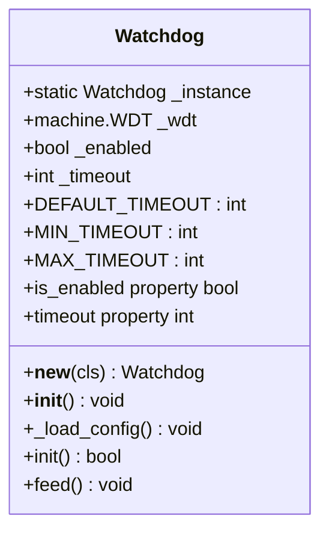
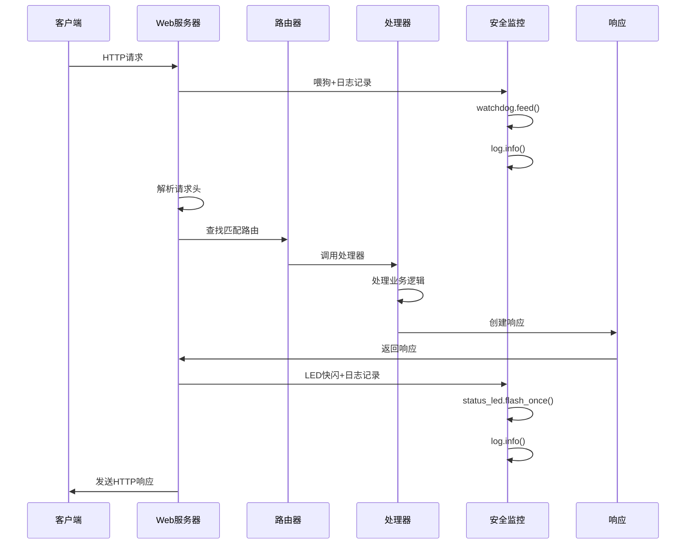
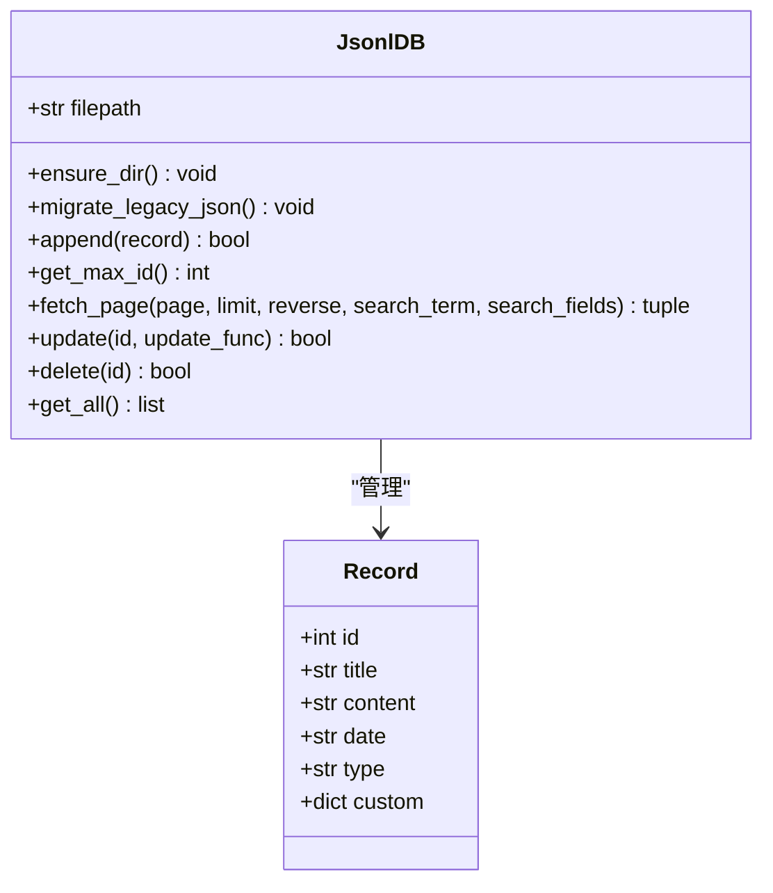
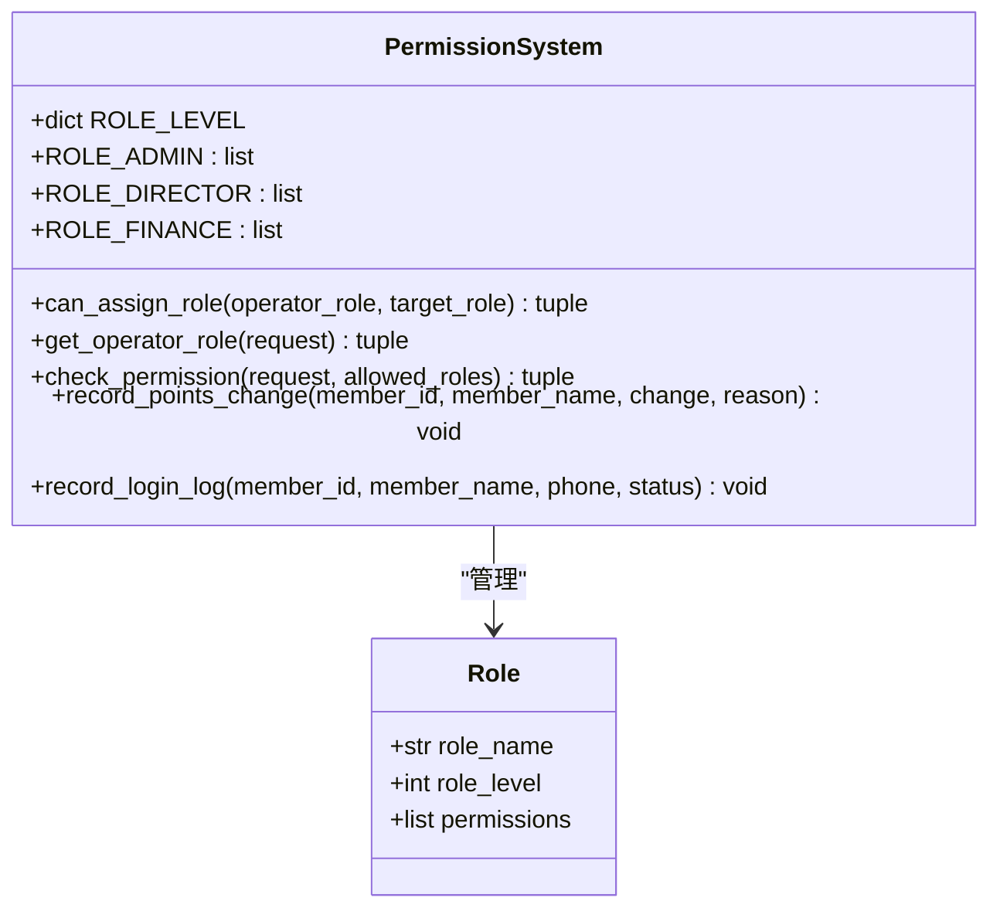

# 核心模块

<cite>
**本文档引用的文件**
- [boot.py](file://src/boot.py)
- [main.py](file://src/main.py)
- [WifiConnector.py](file://src/lib/WifiConnector.py)
- [SystemStatus.py](file://src/lib/SystemStatus.py)
- [Logger.py](file://src/lib/Logger.py)
- [Watchdog.py](file://src/lib/Watchdog.py)
- [BreathLED.py](file://src/lib/BreathLED.py)
- [microdot.py](file://src/lib/microdot.py)
- [config.json](file://src/data/config.json)
- [login_logs.jsonl](file://src/data/login_logs.jsonl)
- [members.jsonl](file://src/data/members.jsonl)
</cite>

## 目录
1. [简介](#简介)
2. [项目结构](#项目结构)
3. [核心组件](#核心组件)
4. [架构概览](#架构概览)
5. [详细组件分析](#详细组件分析)
6. [依赖关系分析](#依赖关系分析)
7. [性能考虑](#性能考虑)
8. [故障排除指南](#故障排除指南)
9. [结论](#结论)

## 简介

围炉诗社·理事台是一个基于ESP32的物联网项目，旨在为围炉诗社提供一个现代化的管理系统。该项目集成了WiFi连接管理、系统状态指示、LED控制、Web服务框架、日志管理和安全监控等多个核心模块，为用户提供了一个完整的解决方案。

该项目的核心特色包括：
- **智能WiFi连接管理**：支持自动重连、热点创建和网络监控
- **系统状态可视化**：通过LED呼吸效果直观显示系统状态
- **轻量级Web服务**：基于MicroPython的微型Web框架
- **数据持久化**：使用JSONL格式存储各类数据
- **日志管理系统**：提供多级别的日志记录和管理
- **看门狗安全机制**：防止系统死锁和异常停机
- **权限控制系统**：基于角色的访问控制和权限验证
- **增强的LED状态管理**：智能节能和状态指示

## 项目结构

项目采用模块化的组织方式，主要分为以下几个部分：

```mermaid
graph TB
subgraph "根目录"
BOOT[boot.py<br/>启动引导程序]
MAIN[main.py<br/>主应用程序]
end
subgraph "库文件 (src/lib/)"
WC[WifiConnector.py<br/>WiFi连接管理]
SS[SystemStatus.py<br/>系统状态指示]
BL[BreathLED.py<br/>LED控制]
MD[microdot.py<br/>Web框架]
LG[Logger.py<br/>日志管理]
WD[Watchdog.py<br/>看门狗安全]
end
subgraph "数据文件 (src/data/)"
CONFIG[config.json<br/>配置文件]
POEMS[poems.jsonl<br/>诗歌数据]
MEMBERS[members.jsonl<br/>成员数据]
ACTIVITIES[activities.jsonl<br/>活动数据]
FINANCE[finance.jsonl<br/>财务数据]
TASKS[tasks.jsonl<br/>任务数据]
LOGIN_LOGS[login_logs.jsonl<br/>登录日志]
POINTS_LOGS[points_logs.jsonl<br/>积分日志]
END
subgraph "静态资源 (src/static/)"
HTML[index.html<br/>主页]
JS[app.js<br/>前端逻辑]
CSS[style.css<br/>样式表]
END
BOOT --> WC
BOOT --> SS
BOOT --> LG
BOOT --> WD
MAIN --> MD
MAIN --> POEMS
MAIN --> MEMBERS
MAIN --> ACTIVITIES
MAIN --> FINANCE
MAIN --> TASKS
MAIN --> LOGIN_LOGS
MAIN --> POINTS_LOGS
MAIN --> CONFIG
```

**图表来源**
- [boot.py](file://src/boot.py#L1-L153)
- [main.py](file://src/main.py#L1-L1789)

**章节来源**
- [boot.py](file://src/boot.py#L1-L153)
- [main.py](file://src/main.py#L1-L1789)

## 核心组件

### WiFi连接管理模块

WiFi连接管理模块是整个系统的核心通信组件，负责处理所有网络相关的功能。

**主要功能**：
- WiFi网络扫描和连接
- 自动重连机制
- 热点创建和管理
- 静态IP配置管理
- 连接状态监控

**关键特性**：
- 支持多种认证模式（WPA2-PSK等）
- 智能错误处理和诊断
- 配置持久化功能
- 网络信息缓存和同步

**章节来源**
- [WifiConnector.py](file://src/lib/WifiConnector.py#L1-L1019)

### 系统状态指示模块

系统状态指示模块通过LED呼吸效果直观地显示系统的当前状态，并提供了增强的节能管理和状态切换功能。

**状态模式**：
- **快速呼吸**：WiFi连接中（周期500ms）
- **中速呼吸**：热点模式（周期1500ms）
- **慢速呼吸**：系统运行中（周期4000ms）
- **快闪**：API请求响应完成（周期200ms）

**节能策略**：
- 连接成功后1分钟自动关闭LED，节省CPU资源
- 空闲状态下LED自动休眠
- 智能状态切换避免闪烁干扰

**硬件集成**：
- 支持WS2812彩色LED和普通LED
- 基于ESP32-S2板载LED（GPIO 15）
- 高精度PWM控制

**性能优化**：
- 更新间隔最小值和除数优化
- 更好的异常处理和资源管理

**章节来源**
- [SystemStatus.py](file://src/lib/SystemStatus.py#L1-L146)

### 日志管理系统

日志管理系统提供了完整的日志记录和管理功能，支持多级别的日志输出控制。

**日志级别**：
- **DEBUG**：详细调试信息，仅在开发环境输出
- **INFO**：一般运行信息，始终输出
- **WARN**：警告信息，始终输出
- **ERROR**：错误信息，始终输出

**核心特性**：
- 单例模式确保全局唯一实例
- 动态配置加载和热更新
- 运行时调试模式切换
- 内存优化的日志输出

**章节来源**
- [Logger.py](file://src/lib/Logger.py#L1-L128)

### 看门狗安全机制

看门狗安全机制提供了硬件级别的系统保护，防止系统死锁和异常停机。

**核心功能**：
- 硬件看门狗初始化和配置
- 周期性喂狗机制
- 超时自动重启保护
- 配置文件驱动的启用控制

**安全特性**：
- 超时范围限制（10-300秒）
- 配置文件热加载
- 异常情况下的静默处理
- 与系统状态的深度集成

**章节来源**
- [Watchdog.py](file://src/lib/Watchdog.py#L1-L119)

### Web服务框架

Web服务框架基于MicroPython构建，提供轻量级的HTTP服务。

**核心功能**：
- 路由系统和请求处理
- 静态文件服务
- JSON API端点
- 异步事件处理

**API端点**：
- 诗歌管理API
- 成员管理API
- 活动管理API
- 财务管理API
- 任务管理API
- 登录日志API
- 积分日志API

**章节来源**
- [microdot.py](file://src/lib/microdot.py#L1-L204)
- [main.py](file://src/main.py#L534-L1789)

### 数据管理模块

数据管理模块负责处理各种业务数据的存储和检索，新增了专门的日志数据管理。

**数据格式**：
- JSONL（JSON Lines）格式用于大量数据
- 标准JSON格式用于配置和设置
- 支持数据迁移和兼容性处理

**数据库操作**：
- 分页查询和搜索
- 增删改查操作
- 内存优化的数据处理

**新增日志管理**：
- 登录日志记录和清理
- 积分变动日志追踪
- 自动日志轮转和容量控制

**章节来源**
- [main.py](file://src/main.py#L122-L345)

### 权限控制系统

权限控制系统提供了基于角色的访问控制和权限验证功能，确保系统的安全性和数据完整性。

**角色定义**：
- **超级管理员**：系统最高权限，可管理所有功能
- **管理员**：可管理大部分功能，但不能添加超级管理员
- **理事**：可管理活动和任务相关功能
- **财务**：可管理财务相关功能
- **成员**：基本的查看和参与权限

**权限验证**：
- 基于操作者身份的权限检查
- 角色层级验证
- 实时权限验证机制

**章节来源**
- [main.py](file://src/main.py#L358-L432)

## 架构概览

系统采用分层架构设计，各模块之间通过清晰的接口进行交互，新增了安全监控层和权限控制层。

```mermaid
graph TB
subgraph "应用层"
WEB[Web界面<br/>src/static/]
API[REST API<br/>/api/*]
LOG_API[日志API<br/>/api/login_logs, /api/points_logs]
PERMISSION_API[权限API<br/>/api/permissions]
end
subgraph "服务层"
MAIN[main.py<br/>主应用]
ROUTES[路由处理<br/>API端点]
DB[数据管理<br/>JSONL数据库]
SECURITY[安全监控<br/>日志+看门狗+权限]
end
subgraph "基础设施层"
BOOT[boot.py<br/>启动引导]
WIFI[WifiConnector<br/>WiFi管理]
STATUS[SystemStatus<br/>状态指示]
LED[BreathLED<br/>LED控制]
NET[Network<br/>ESP32网络]
end
subgraph "数据层"
DATA[src/data/目录<br/>JSONL文件]
CONFIG[src/data/config.json<br/>配置文件]
LOGIN_LOGS[login_logs.jsonl<br/>登录日志]
POINTS_LOGS[points_logs.jsonl<br/>积分日志]
MEMBERS[members.jsonl<br/>成员数据]
END
WEB --> MAIN
API --> MAIN
LOG_API --> MAIN
PERMISSION_API --> MAIN
MAIN --> ROUTES
MAIN --> DB
MAIN --> SECURITY
BOOT --> WIFI
BOOT --> STATUS
BOOT --> LG
BOOT --> WD
STATUS --> LED
WIFI --> NET
DB --> DATA
SECURITY --> LOGIN_LOGS
SECURITY --> POINTS_LOGS
SECURITY --> MEMBERS
CONFIG --> MAIN
```

**图表来源**
- [boot.py](file://src/boot.py#L1-L153)
- [main.py](file://src/main.py#L1-L1789)

### 初始化流程

系统启动遵循严格的初始化顺序，确保所有组件正确配置，新增了安全监控组件和权限控制的初始化。



**图表来源**
- [boot.py](file://src/boot.py#L13-L153)
- [main.py](file://src/main.py#L39-L48)

**章节来源**
- [boot.py](file://src/boot.py#L1-L153)
- [main.py](file://src/main.py#L1-L1789)

## 详细组件分析

### WiFi连接管理组件

WiFi连接管理组件是系统的核心通信枢纽，提供了完整的网络连接解决方案。

#### 类架构设计



**图表来源**
- [WifiConnector.py](file://src/lib/WifiConnector.py#L11-L120)

#### 连接管理流程



**图表来源**
- [WifiConnector.py](file://src/lib/WifiConnector.py#L595-L696)

#### 热点管理功能

WiFi连接器还提供了完整的热点管理功能：

**热点配置选项**：
- 自定义SSID和密码
- 信道选择（1-13）
- 最大客户端数量（1-8）
- 认证模式选择
- IP地址段配置

**热点状态监控**：
- 客户端连接状态
- 网络统计信息
- 性能监控指标

**章节来源**
- [WifiConnector.py](file://src/lib/WifiConnector.py#L318-L1019)

### LED控制系统

LED控制系统提供了灵活的LED控制功能，支持多种LED类型和控制模式。

#### SystemStatus类设计



**图表来源**
- [SystemStatus.py](file://src/lib/SystemStatus.py#L27-L146)
- [BreathLED.py](file://src/lib/BreathLED.py#L11-L347)

#### LED控制算法

SystemStatus采用了增强的状态管理和节能策略：

**算法特点**：
- 智能状态切换和热切换
- 自动关闭定时器管理
- 空闲状态检测和节能
- 异常情况下的安全处理

**控制流程**：



**图表来源**
- [SystemStatus.py](file://src/lib/SystemStatus.py#L96-L143)

#### 状态指示系统

系统状态指示通过不同的LED呼吸模式来反映系统状态：

**状态映射**：
- **快速呼吸 (500ms)**：WiFi连接中
- **中速呼吸 (1500ms)**：热点模式
- **慢速呼吸 (4000ms)**：系统运行中
- **快闪 (200ms)**：API请求响应完成

**节能机制**：
- 1分钟后自动关闭LED
- 空闲状态下的低功耗模式
- 智能定时器管理

**性能优化**：
- 更新间隔最小值和除数优化
- 更好的异常处理和资源管理

**章节来源**
- [SystemStatus.py](file://src/lib/SystemStatus.py#L1-L146)

### 日志管理系统

日志管理系统提供了完整的日志记录和管理功能，支持多级别的日志输出控制。

#### Logger类设计



**图表来源**
- [Logger.py](file://src/lib/Logger.py#L29-L128)

#### 日志级别控制

日志系统提供了精细的级别控制机制：

**级别定义**：
- DEBUG：仅在调试模式下输出
- INFO：始终输出的运行信息
- WARN：警告信息
- ERROR：错误信息

**配置管理**：
- 配置文件驱动的调试模式
- 运行时动态切换
- 全局单例实例管理

**章节来源**
- [Logger.py](file://src/lib/Logger.py#L1-L128)

### 看门狗安全机制

看门狗安全机制提供了硬件级别的系统保护，防止系统死锁和异常停机。

#### Watchdog类设计



**图表来源**
- [Watchdog.py](file://src/lib/Watchdog.py#L17-L119)

#### 安全监控流程

看门狗提供了完整的安全监控机制：

**初始化流程**：
- 配置文件加载和验证
- 超时参数范围检查
- 硬件看门狗启用
- 异常情况下的降级处理

**监控机制**：
- 定时器回调喂狗
- 周期性系统健康检查
- 超时自动重启保护
- 运行时状态监控

**章节来源**
- [Watchdog.py](file://src/lib/Watchdog.py#L1-L119)

### Web服务框架

Web服务框架基于MicroPython构建，提供了轻量级的HTTP服务功能。

#### 请求处理流程



**图表来源**
- [microdot.py](file://src/lib/microdot.py#L104-L152)

#### API端点设计

系统提供了完整的REST API端点，新增了专门的日志管理API和权限控制API：

**诗歌管理API**：
- GET `/api/poems` - 获取诗歌列表
- POST `/api/poems` - 创建新诗歌
- POST `/api/poems/update` - 更新诗歌
- POST `/api/poems/delete` - 删除诗歌

**成员管理API**：
- GET `/api/members` - 获取成员列表
- POST `/api/members` - 创建新成员
- POST `/api/members/update` - 更新成员信息
- POST `/api/members/delete` - 删除成员

**任务管理API**：
- GET `/api/tasks` - 获取任务列表
- POST `/api/tasks/complete` - 完成任务

**系统管理API**：
- GET `/api/system/info` - 获取系统信息
- GET `/api/settings/fields` - 获取自定义字段设置

**日志管理API**：
- GET `/api/login_logs` - 获取登录日志
- GET `/api/points_logs` - 获取积分日志

**权限控制API**：
- GET `/api/permissions/check` - 检查用户权限
- POST `/api/permissions/assign` - 分配用户角色

**章节来源**
- [main.py](file://src/main.py#L534-L1789)
- [microdot.py](file://src/lib/microdot.py#L1-L204)

### 数据管理模块

数据管理模块提供了高效的数据存储和检索功能，新增了专门的日志数据管理。

#### JSONL数据库设计



**图表来源**
- [main.py](file://src/main.py#L122-L345)

#### 数据存储策略

**文件格式选择**：
- JSONL格式用于大量数据（诗歌、活动、任务、日志）
- 标准JSON格式用于配置和设置
- 支持数据迁移和向后兼容

**性能优化**：
- 内存优化的分页查询
- 搜索功能的懒加载
- 文件偏移量缓存

**数据完整性**：
- 原子性写入操作
- 临时文件备份
- 错误恢复机制

**新增日志管理**：
- 登录日志自动清理（保留最近100条）
- 积分变动日志追踪
- 日志文件的自动轮转

**章节来源**
- [main.py](file://src/main.py#L122-L345)

### 权限控制系统

权限控制系统提供了基于角色的访问控制和权限验证功能，确保系统的安全性和数据完整性。

#### 角色权限设计



**图表来源**
- [main.py](file://src/main.py#L358-L432)

#### 权限验证流程

权限系统提供了完整的权限验证机制：

**角色层级**：
- 超级管理员（0）- 最高权限
- 管理员（1）- 系统管理
- 理事（2）- 活动管理
- 财务（2）- 财务管理
- 成员（3）- 基本权限

**验证流程**：
- 从请求中提取操作者身份
- 查询用户角色信息
- 比较角色层级和权限要求
- 返回验证结果和错误信息

**权限控制**：
- 角色分配限制
- 操作者权限检查
- 实时权限验证

**章节来源**
- [main.py](file://src/main.py#L358-L432)

## 依赖关系分析

系统模块之间的依赖关系清晰明确，新增了安全监控层和权限控制层的依赖关系。

```mermaid
graph TB
subgraph "外部依赖"
MICROPYTHON[MicroPython<br/>运行时环境]
NETWORK[network<br/>ESP32网络库]
OS[os<br/>文件系统]
TIME[time<br/>时间管理]
JSON[ujson<br/>JSON处理]
MACHINE[machine<br/>硬件控制]
ASYNCIO[uasyncio<br/>异步I/O]
END
subgraph "内部模块"
BOOT[boot.py]
MAIN[main.py]
WC[WifiConnector.py]
SS[SystemStatus.py]
BL[BreathLED.py]
MD[microdot.py]
LG[Logger.py]
WD[Watchdog.py]
END
subgraph "数据文件"
CONFIG[config.json]
DATA_FILES[data/*.jsonl]
LOGIN_LOGS[login_logs.jsonl]
POINTS_LOGS[points_logs.jsonl]
MEMBERS[members.jsonl]
END
BOOT --> WC
BOOT --> SS
BOOT --> LG
BOOT --> WD
BOOT --> MICROPYTHON
BOOT --> NETWORK
BOOT --> OS
BOOT --> TIME
MAIN --> MD
MAIN --> WC
MAIN --> DATA_FILES
MAIN --> JSON
MAIN --> MACHINE
MAIN --> ASYNCIO
SS --> BL
BL --> MICROPYTHON
BL --> NETWORK
BL --> TIME
WC --> NETWORK
WC --> JSON
WC --> TIME
LG --> JSON
LG --> OS
LG --> TIME
WD --> MACHINE
WD --> JSON
WD --> OS
CONFIG --> BOOT
DATA_FILES --> MAIN
LOGIN_LOGS --> MAIN
POINTS_LOGS --> MAIN
MEMBERS --> MAIN
```

**图表来源**
- [boot.py](file://src/boot.py#L1-L153)
- [main.py](file://src/main.py#L1-L1789)

### 模块耦合度分析

**低耦合设计**：
- 各模块职责明确，接口清晰
- 依赖关系单向，避免循环依赖
- 配置文件独立于业务逻辑

**接口抽象**：
- 统一的错误处理机制
- 标准化的返回值格式
- 明确的异常类型定义

**新增安全监控耦合**：
- 看门狗与主应用的深度集成
- 日志系统与各模块的松散耦合
- LED状态与安全监控的协调
- 权限系统与数据访问的集成

**可测试性**：
- 模块间依赖可通过依赖注入替换
- 硬件相关功能可通过模拟器测试
- 网络功能可通过本地测试环境验证

**章节来源**
- [boot.py](file://src/boot.py#L1-L153)
- [main.py](file://src/main.py#L1-L1789)

## 性能考虑

系统在设计时充分考虑了性能优化，特别是在资源受限的嵌入式环境中，新增了安全监控和权限控制的性能考量。

### 内存管理

**内存优化策略**：
- 使用生成器和迭代器减少内存占用
- 按需加载数据，避免一次性读取大文件
- 及时释放不再使用的对象

**垃圾回收**：
- 定期触发垃圾回收
- 在关键操作后清理内存
- 避免内存泄漏的编程模式

### 网络性能

**连接优化**：
- 连接池复用机制
- 智能重连策略
- 超时参数动态调整

**带宽管理**：
- 分页查询减少数据传输
- 压缩响应内容
- 缓存策略优化

### LED控制优化

**算法优化**：
- 预计算正弦查找表
- 自适应更新频率
- 低功耗模式设计

**定时器管理**：
- 多平台兼容的定时器实现
- 资源清理和重置
- 异常情况下的安全处理

**性能参数优化**：
- 更新间隔最小值：30ms
- 更新间隔除数：40
- 更好的资源管理

### 安全监控性能

**看门狗优化**：
- 定时器回调的最小化开销
- 喂狗频率的合理配置
- 异常情况下的静默处理

**日志系统优化**：
- 配置文件的缓存机制
- 日志级别的条件输出
- 内存使用的最小化

### 权限控制性能

**权限验证优化**：
- 角色层级快速比较
- 实时权限查询优化
- 缓存机制减少重复查询

**内存优化**：
- 权限数据的内存管理
- 角色信息的缓存策略
- 查询结果的临时存储优化

## 故障排除指南

### 常见问题及解决方案

**WiFi连接问题**：
- **问题**：无法连接到WiFi网络
- **原因**：配置错误、信号弱、网络不可用
- **解决**：检查配置文件、确认网络状态、重试连接

**LED控制问题**：
- **问题**：LED不工作或显示异常
- **原因**：引脚配置错误、硬件连接问题、参数超出范围
- **解决**：验证引脚设置、检查硬件连接、调整参数范围

**Web服务问题**：
- **问题**：Web界面无法访问
- **原因**：端口占用、网络配置错误、权限问题
- **解决**：检查端口状态、验证网络配置、确认权限设置

**看门狗问题**：
- **问题**：系统频繁重启
- **原因**：喂狗频率不足、超时时间过短、硬件故障
- **解决**：检查喂狗调用、调整超时配置、验证硬件状态

**日志系统问题**：
- **问题**：日志输出异常或丢失
- **原因**：配置文件损坏、磁盘空间不足、权限问题
- **解决**：检查配置文件、清理磁盘空间、验证文件权限

**权限控制问题**：
- **问题**：权限验证失败或权限不足
- **原因**：用户身份验证失败、角色信息错误、权限配置问题
- **解决**：检查用户身份、验证角色信息、确认权限配置

### 调试工具和技巧

**系统诊断**：
- 使用`print_system_status()`查看系统状态
- 检查内存使用情况
- 监控网络连接状态

**日志分析**：
- 启用调试模式获取详细日志
- 分析错误堆栈信息
- 跟踪异常发生位置

**性能监控**：
- 监控CPU使用率
- 检查内存碎片情况
- 分析网络延迟

**权限调试**：
- 检查用户角色信息
- 验证权限验证流程
- 分析权限分配结果

**章节来源**
- [boot.py](file://src/boot.py#L280-L294)
- [Logger.py](file://src/lib/Logger.py#L105-L128)

## 结论

围炉诗社·理事台项目展现了现代嵌入式系统开发的最佳实践。通过精心设计的模块化架构，项目实现了功能完整性与性能优化的平衡，并新增了完善的安全监控机制和权限控制系统。

**主要成就**：
- **完整的生态系统**：从硬件控制到Web服务的全栈解决方案
- **优雅的用户体验**：直观的状态指示和简洁的Web界面
- **可靠的稳定性**：完善的错误处理、故障恢复机制和安全监控
- **良好的可扩展性**：模块化设计便于功能扩展和定制
- **强大的安全性**：日志管理、看门狗保护和权限控制机制
- **智能化的权限管理**：基于角色的访问控制和实时权限验证

**技术亮点**：
- 基于ESP32的高性能嵌入式平台
- 轻量级但功能完备的Web框架
- 高效的数据存储和检索机制
- 灵活的LED控制和状态指示系统
- 完善的日志记录和安全管理
- 硬件级别的看门狗保护
- 基于角色的权限控制系统

**未来发展方向**：
- 增强的安全认证机制
- 更丰富的数据分析功能
- 移动端应用支持
- 云端同步和备份功能
- 更智能的自动化监控
- 更细粒度的权限控制

该项目为物联网应用开发提供了优秀的参考模板，展示了如何在资源受限的环境中构建功能丰富、性能优异且安全可靠的应用系统。