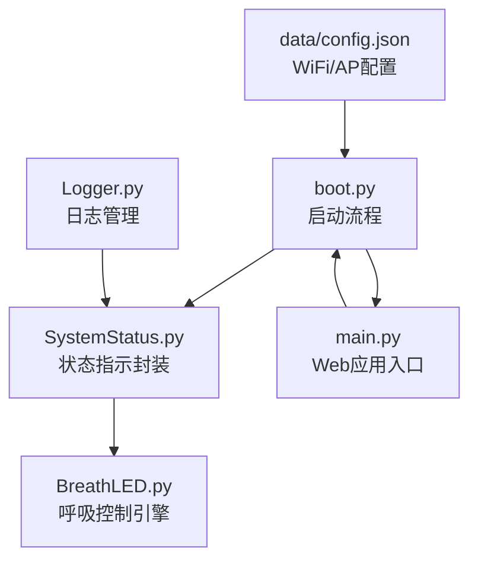
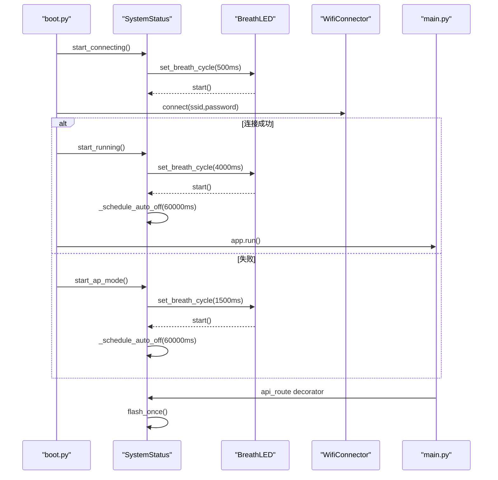
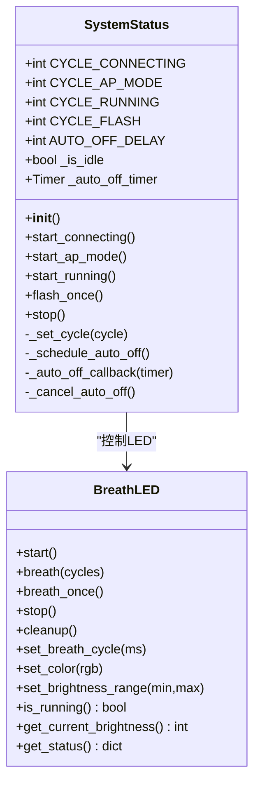
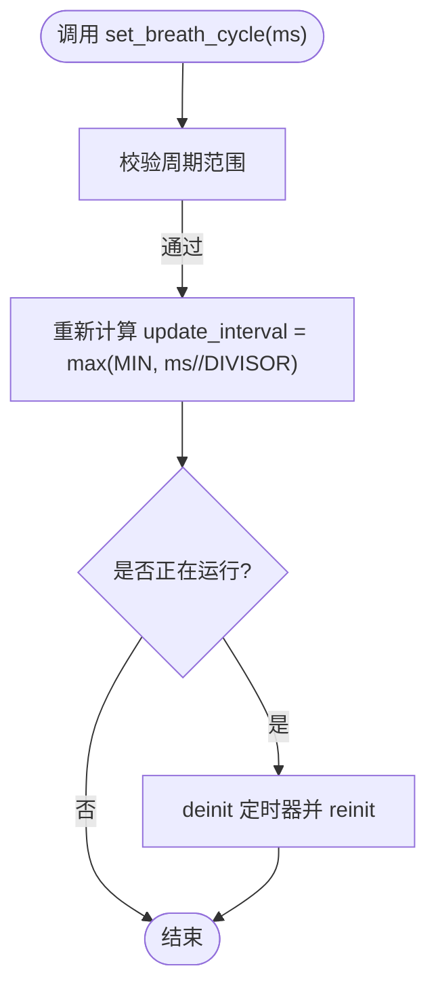
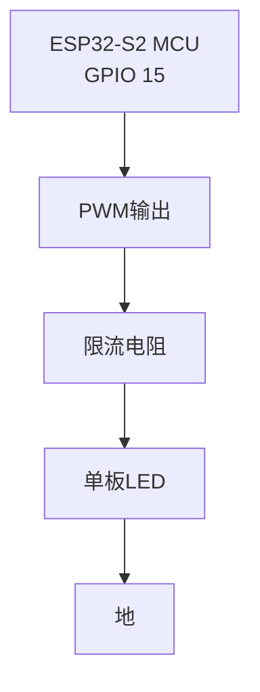
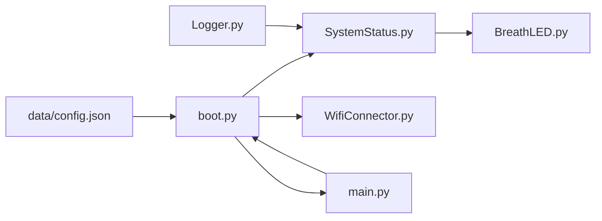

# 系统状态指示

<cite>
**本文引用的文件**
- [SystemStatus.py](file://src/lib/SystemStatus.py)
- [BreathLED.py](file://src/lib/BreathLED.py)
- [boot.py](file://src/boot.py)
- [main.py](file://src/main.py)
- [Logger.py](file://src/lib/Logger.py)
- [config.json](file://src/data/config.json)
</cite>

## 更新摘要
**变更内容**
- 新增LED快闪反馈机制，用于API请求响应后的视觉反馈
- 实现智能节能策略，1分钟后自动关闭LED以节省CPU资源
- 改进状态管理机制，增加空闲状态跟踪和智能切换逻辑
- 优化性能配置，提升系统响应速度和资源利用率

## 目录
1. [简介](#简介)
2. [项目结构](#项目结构)
3. [核心组件](#核心组件)
4. [架构总览](#架构总览)
5. [详细组件分析](#详细组件分析)
6. [依赖关系分析](#依赖关系分析)
7. [性能考量](#性能考量)
8. [故障排查指南](#故障排查指南)
9. [结论](#结论)
10. [附录](#附录)

## 简介
本文件面向"系统状态指示模块"的综合技术文档，重点介绍 SystemStatus 类与 BreathLED 类的设计理念、实现原理与应用场景。文档涵盖 LED 状态指示系统的硬件接口、控制逻辑与视觉反馈机制；解释不同系统状态对应的 LED 模式、颜色变化与闪烁规律；提供完整的 API 使用指南、参数配置选项与自定义扩展方法；并给出实际的硬件连接图与电路设计说明；最后阐述状态管理机制、错误处理与故障诊断方法。

**更新** 本次更新反映了SystemStatus.py的重大改进，包括LED快闪反馈机制、节能策略和智能LED状态指示系统。

## 项目结构
该项目围绕 ESP32-S2 的单板 LED（GPIO 15）实现系统状态指示，通过 SystemStatus 类封装状态切换逻辑，并委托底层 BreathLED 类完成 PWM 呼吸控制。启动流程由 boot.py 触发，根据 WiFi 连接状态或 AP 模式切换 LED 呼吸节奏；运行时 main.py 提供 Web 服务与系统状态打印。

**图表来源**
- [boot.py](file://src/boot.py#L1-L153)
- [SystemStatus.py](file://src/lib/SystemStatus.py#L1-L146)
- [BreathLED.py](file://src/lib/BreathLED.py#L1-L347)
- [main.py](file://src/main.py#L1-L800)
- [config.json](file://src/data/config.json#L1-L1)
- [Logger.py](file://src/lib/Logger.py#L1-L128)

**章节来源**
- [boot.py](file://src/boot.py#L1-L153)
- [main.py](file://src/main.py#L1-L800)

## 核心组件
- **SystemStatus**：封装 ESP32-S2 单板 LED 的状态指示逻辑，提供"正在连接""AP 热点模式""运行中""请求响应"四种状态，并通过 BreathLED 设置呼吸周期。新增快闪反馈机制和节能策略。
- **BreathLED**：通用 LED 呼吸控制引擎，支持 WS2812 彩色 LED 与普通 LED，提供呼吸周期、颜色、亮度范围、PWM 频率等配置，以及 start/breath/breath_once/stop/cleanup 等控制方法。

**章节来源**
- [SystemStatus.py](file://src/lib/SystemStatus.py#L1-L146)
- [BreathLED.py](file://src/lib/BreathLED.py#L1-L347)

## 架构总览
系统状态指示的整体架构如下：boot.py 在启动阶段根据配置决定连接 WiFi 或进入 AP 模式，并通过 SystemStatus 切换 LED 呼吸节奏；WiFi 成功后 main.py 启动 Web 服务并打印系统状态；SystemStatus 通过 BreathLED 的 set_breath_cycle 与 start/stop 控制 LED。新增的API装饰器在每次请求后自动触发LED快闪反馈。

**图表来源**
- [boot.py](file://src/boot.py#L28-L105)
- [SystemStatus.py](file://src/lib/SystemStatus.py#L47-L146)
- [BreathLED.py](file://src/lib/BreathLED.py#L191-L328)
- [main.py](file://src/main.py#L51-L65)

## 详细组件分析

### SystemStatus 类
- **设计目标**：以单板 LED（GPIO 15）直观反映系统状态，通过呼吸周期表达"忙碌/等待/稳定/反馈"四态，具备节能和智能管理能力。
- **关键行为**：
  - `start_connecting`：快速呼吸（500ms），指示正在连接 WiFi。
  - `start_ap_mode`：中速呼吸（1500ms），指示 AP 热点模式，1分钟后自动关闭。
  - `start_running`：极慢呼吸（4000ms），指示 WiFi 连接成功/稳定运行，1分钟后自动关闭。
  - `flash_once`：快闪一次（200ms），API请求响应后的视觉反馈。
  - `stop`：停止所有LED指示，立即关闭。
- **节能策略**：通过定时器在1分钟后自动关闭LED，节省CPU资源。
- **智能管理**：跟踪空闲状态，避免不必要的LED操作。

**图表来源**
- [SystemStatus.py](file://src/lib/SystemStatus.py#L27-L146)
- [BreathLED.py](file://src/lib/BreathLED.py#L191-L347)

**章节来源**
- [SystemStatus.py](file://src/lib/SystemStatus.py#L1-L146)

### BreathLED 类
- 支持两种 LED 类型：WS2812（RGB 彩色）与普通 LED（PWM 控制）。
- 核心能力：
  - 呼吸控制：start（无限循环）、breath（指定次数后自动停止）、breath_once（单次完整呼吸）。
  - 配置变更：动态设置颜色、亮度范围、呼吸周期，周期变化时自动重配置定时器。
  - 状态查询：is_running、get_current_brightness、get_status。
  - 资源管理：stop/cleanup，确保 PWM/NeoPixel 对象正确释放。
- **性能优化**：通过全局配置调整 UPDATE_INTERVAL_MIN 和 UPDATE_INTERVAL_DIVISOR 平衡效果与CPU占用。

**图表来源**
- [BreathLED.py](file://src/lib/BreathLED.py#L308-L328)

**章节来源**
- [BreathLED.py](file://src/lib/BreathLED.py#L1-L347)

### 状态与视觉反馈映射
- **正在连接（快速呼吸）**：500ms 周期，指示忙碌/连接中。
- **AP 热点模式（中速呼吸）**：1500ms 周期，指示等待客户端连接，1分钟后自动关闭。
- **运行中（极慢呼吸）**：4000ms 周期，指示系统稳定运行，1分钟后自动关闭。
- **请求响应（快闪）**：200ms 周期，API请求成功后的视觉反馈，避免中断正在进行的呼吸。

**章节来源**
- [SystemStatus.py](file://src/lib/SystemStatus.py#L28-L36)
- [boot.py](file://src/boot.py#L28-L105)

### API 使用指南与参数配置
- **SystemStatus**
  - 构造：自动在 GPIO 15 初始化单板 LED。
  - 方法：start_connecting/start_ap_mode/start_running/flash_once/stop。
  - 全局实例：status_led，供 boot.py/main.py 共享调用。
  - **新增**：节能配置（AUTO_OFF_DELAY=60000ms），空闲状态跟踪。
- **BreathLED**
  - 构造参数：pin、led_type、num_leds、color、max_brightness、min_brightness、breath_cycle、pwm_freq、debug。
  - 控制方法：start/breath(cycles)/breath_once/stop/cleanup。
  - 配置方法：set_color/set_brightness_range/set_breath_cycle。
  - 查询方法：is_running/get_current_brightness/get_status。
  - **性能配置**：UPDATE_INTERVAL_MIN=30，UPDATE_INTERVAL_DIVISOR=40。

**章节来源**
- [SystemStatus.py](file://src/lib/SystemStatus.py#L37-L146)
- [BreathLED.py](file://src/lib/BreathLED.py#L42-L82)

### 硬件接口与电路设计
- **单板 LED（GPIO 15）**：ESP32-S2 开发板自带 LED，通过 PWM 控制亮度实现呼吸效果。
- **电路连接（概念示意）**：
  - LED 正极经限流电阻连接至 GPIO 15，负极接地。
  - 若使用普通 LED，需注意 PWM 频率与人眼感知的关系，建议 1kHz 以上。
- **说明**
  - 本项目采用单板 LED 的"呼吸"模式，无需外部电路；若扩展为 WS2812，需额外数据线与电源设计。

**图表来源**
- [SystemStatus.py](file://src/lib/SystemStatus.py#L40-L45)
- [BreathLED.py](file://src/lib/BreathLED.py#L115-L124)

## 依赖关系分析
- **SystemStatus** 依赖 **BreathLED**，负责状态到呼吸周期的映射与启动/停止。
- **boot.py** 依赖 **SystemStatus** 与 **WifiConnector**，根据连接结果切换 LED 状态。
- **main.py** 依赖 **SystemStatus**（通过 boot.py 的全局实例）与网络状态，打印系统状态并启动 Web 服务。
- **Logger.py** 提供日志管理，支持调试模式控制。
- **config.json** 提供 WiFi 与 AP 的 SSID/密码配置，驱动 boot.py 的连接策略。

**图表来源**
- [boot.py](file://src/boot.py#L1-L153)
- [SystemStatus.py](file://src/lib/SystemStatus.py#L1-L146)
- [BreathLED.py](file://src/lib/BreathLED.py#L1-L347)
- [main.py](file://src/main.py#L1-L800)
- [config.json](file://src/data/config.json#L1-L1)
- [Logger.py](file://src/lib/Logger.py#L1-L128)

**章节来源**
- [boot.py](file://src/boot.py#L1-L153)
- [main.py](file://src/main.py#L1-L800)

## 性能考量
- **呼吸算法优化**：预计算正弦查找表，避免实时三角函数；自适应更新间隔，降低 CPU 占用。
- **资源管理**：stop/cleanup 确保 PWM/NeoPixel 对象释放，防止资源泄漏。
- **状态切换**：start() 与 breath(cycles) 的优先级管理，避免冲突；周期变化时自动重配置定时器。
- **内存与 GC**：清理资源后触发垃圾回收，保持运行时内存稳定。
- **节能策略**：1分钟后自动关闭LED，显著降低CPU占用和功耗。
- **智能反馈**：快闪机制避免中断正在进行的呼吸效果，提升用户体验。

**章节来源**
- [BreathLED.py](file://src/lib/BreathLED.py#L30-L41)
- [BreathLED.py](file://src/lib/BreathLED.py#L255-L266)
- [SystemStatus.py](file://src/lib/SystemStatus.py#L110-L142)

## 故障排查指南
- **LED 不亮或无反应**
  - 检查 GPIO 15 是否被其他外设占用；确认初始化是否成功。
  - 若硬件初始化失败，会抛出运行时错误，需检查引脚与供电。
- **呼吸异常或闪烁不均**
  - 检查呼吸周期是否过小（低于最小阈值）；确认 update_interval 计算合理。
  - 若周期变化导致定时器重配置失败，系统会尝试重启呼吸灯。
- **状态指示不正确**
  - 确认 boot.py 中根据 WiFi/AP 状态调用对应方法（start_connecting/start_ap_mode/start_running）。
  - 检查 config.json 的 SSID/密码是否正确，避免频繁切换 AP 模式。
- **节能功能失效**
  - 检查定时器是否正确初始化，确认 AUTO_OFF_DELAY 配置。
  - 查看日志输出，确认自动关闭回调是否正常执行。
- **快闪反馈异常**
  - 确认 flash_once 方法调用时机，避免与正在进行的呼吸冲突。
  - 检查 LED 当前状态，确保在空闲状态下执行快闪。
- **调试与诊断**
  - 启用 debug 模式查看详细运行日志（Logger模块）。
  - 使用 get_status() 获取当前配置与运行状态，定位问题。

**章节来源**
- [BreathLED.py](file://src/lib/BreathLED.py#L115-L127)
- [BreathLED.py](file://src/lib/BreathLED.py#L308-L328)
- [SystemStatus.py](file://src/lib/SystemStatus.py#L110-L142)
- [boot.py](file://src/boot.py#L28-L105)
- [Logger.py](file://src/lib/Logger.py#L48-L77)

## 结论
本系统通过 SystemStatus 与 BreathLED 的协同，实现了简洁而直观的系统状态可视化：快速呼吸指示忙碌、中速呼吸指示等待、慢速呼吸指示稳定运行、快闪反馈指示API响应。其设计兼顾性能与易用性，具备良好的扩展性与可维护性，通过节能策略显著降低了功耗，适合嵌入式设备的状态指示与用户反馈场景。

**更新** 本次重大改进引入了智能节能策略和快闪反馈机制，进一步提升了系统的实用性和用户体验。

## 附录

### API 参考（节选）
- **SystemStatus**
  - 构造：初始化单板 LED（GPIO 15），设置默认呼吸周期和节能配置。
  - 方法：start_connecting/start_ap_mode/start_running/flash_once/stop。
  - **新增**：节能配置（AUTO_OFF_DELAY=60000ms），空闲状态跟踪。
- **BreathLED**
  - 构造：pin、led_type、num_leds、color、max_brightness、min_brightness、breath_cycle、pwm_freq、debug。
  - 控制：start/breath(cycles)/breath_once/stop/cleanup。
  - 配置：set_color/set_brightness_range/set_breath_cycle。
  - 查询：is_running/get_current_brightness/get_status。
  - **性能**：UPDATE_INTERVAL_MIN=30，UPDATE_INTERVAL_DIVISOR=40。

**章节来源**
- [SystemStatus.py](file://src/lib/SystemStatus.py#L37-L146)
- [BreathLED.py](file://src/lib/BreathLED.py#L42-L82)
- [BreathLED.py](file://src/lib/BreathLED.py#L308-L328)

### 新增功能详解
- **LED快闪反馈机制**
  - `flash_once()`方法：在API请求成功后执行200ms快闪，提供即时视觉反馈。
  - 智能判断：如果LED正在运行无限呼吸模式，快闪会被跳过以避免中断。
  - 资源管理：快闪完成后自动停止，不占用系统资源。
- **节能策略**
  - `_schedule_auto_off()`：1分钟后自动关闭LED，节省CPU资源。
  - `_auto_off_callback()`：定时器回调函数，执行LED关闭操作。
  - 空闲状态跟踪：`_is_idle`变量标记LED是否处于空闲状态。
- **智能状态管理**
  - 状态切换优化：根据LED当前运行状态选择合适的切换策略。
  - 资源清理：自动取消定时器，防止资源泄漏。
  - 错误处理：完善的异常捕获和日志记录机制。

**章节来源**
- [SystemStatus.py](file://src/lib/SystemStatus.py#L68-L142)