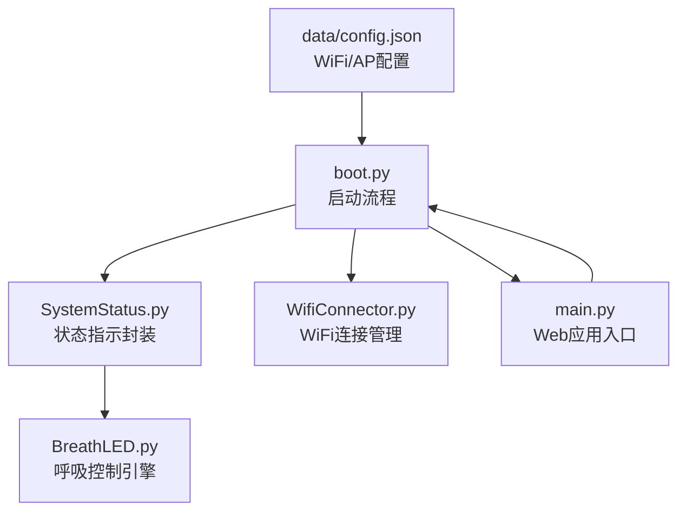
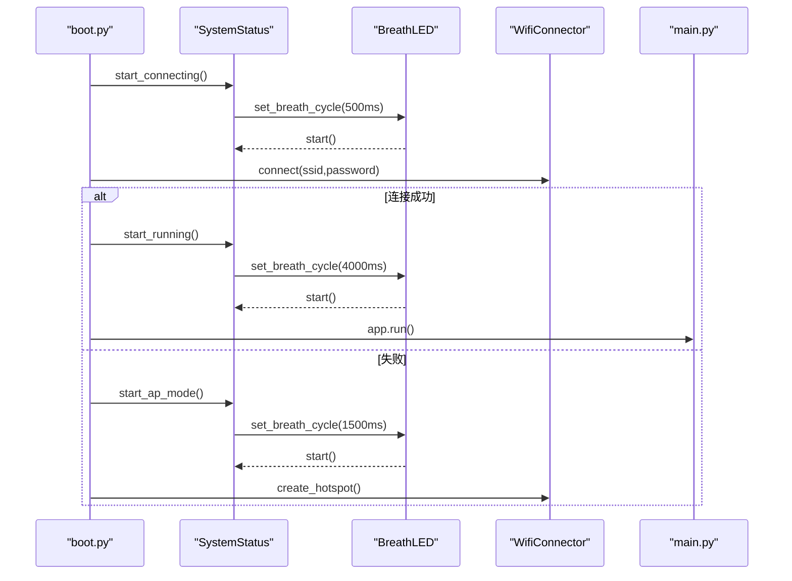
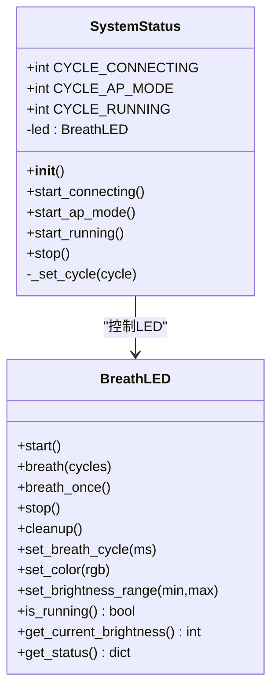
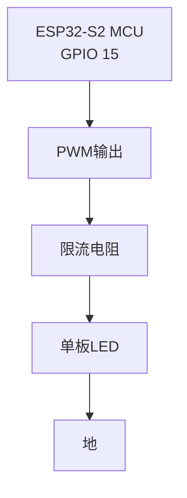
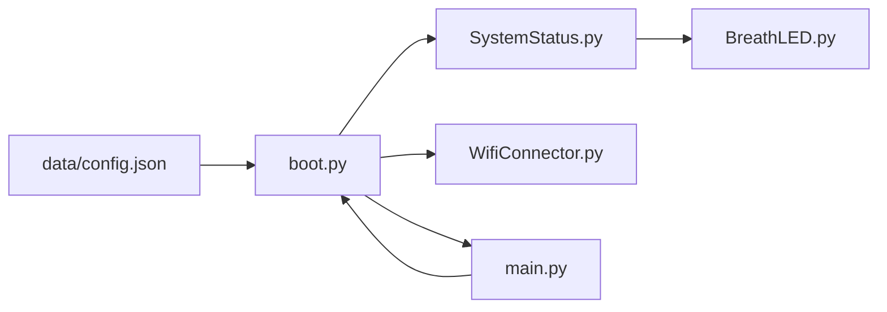

# 系统状态指示

<cite>
**本文引用的文件**
- [SystemStatus.py](file://lib/SystemStatus.py)
- [BreathLED.py](file://lib/BreathLED.py)
- [BreathLED_README.md](file://lib/BreathLED_README.md)
- [breath_led_example.py](file://lib/breath_led_example.py)
- [boot.py](file://boot.py)
- [main.py](file://main.py)
- [WifiConnector.py](file://lib/WifiConnector.py)
- [config.json](file://data/config.json)
</cite>

## 目录
1. [简介](#简介)
2. [项目结构](#项目结构)
3. [核心组件](#核心组件)
4. [架构总览](#架构总览)
5. [详细组件分析](#详细组件分析)
6. [依赖关系分析](#依赖关系分析)
7. [性能考量](#性能考量)
8. [故障排查指南](#故障排查指南)
9. [结论](#结论)
10. [附录](#附录)

## 简介
本文件面向“系统状态指示模块”的综合技术文档，重点介绍 SystemStatus 类与 BreathLED 类的设计理念、实现原理与应用场景。文档涵盖 LED 状态指示系统的硬件接口、控制逻辑与视觉反馈机制；解释不同系统状态对应的 LED 模式、颜色变化与闪烁规律；提供完整的 API 使用指南、参数配置选项与自定义扩展方法；并给出实际的硬件连接图与电路设计说明；最后阐述状态管理机制、错误处理与故障诊断方法。

## 项目结构
该项目围绕 ESP32-S2 的单板 LED（GPIO 15）实现系统状态指示，通过 SystemStatus 类封装状态切换逻辑，并委托底层 BreathLED 类完成 PWM 呼吸控制。启动流程由 boot.py 触发，根据 WiFi 连接状态或 AP 模式切换 LED 呼吸节奏；运行时 main.py 提供 Web 服务与系统状态打印。

图表来源
- [boot.py](file://boot.py#L1-L122)
- [SystemStatus.py](file://lib/SystemStatus.py#L1-L61)
- [BreathLED.py](file://lib/BreathLED.py#L1-L633)
- [WifiConnector.py](file://lib/WifiConnector.py#L1-L800)
- [main.py](file://main.py#L1-L548)
- [config.json](file://data/config.json#L1-L6)

章节来源
- [boot.py](file://boot.py#L1-L122)
- [main.py](file://main.py#L1-L548)

## 核心组件
- SystemStatus：封装 ESP32-S2 单板 LED 的状态指示逻辑，提供“正在连接”“AP 热点模式”“运行中”三种状态，并通过 BreathLED 设置呼吸周期。
- BreathLED：通用 LED 呼吸控制引擎，支持 WS2812 彩色 LED 与普通 LED，提供呼吸周期、颜色、亮度范围、PWM 频率等配置，以及 start/breath/breath_once/stop/cleanup 等控制方法。

章节来源
- [SystemStatus.py](file://lib/SystemStatus.py#L1-L61)
- [BreathLED.py](file://lib/BreathLED.py#L1-L633)

## 架构总览
系统状态指示的整体架构如下：boot.py 在启动阶段根据配置决定连接 WiFi 或进入 AP 模式，并通过 SystemStatus 切换 LED 呼吸节奏；WiFi 成功后 main.py 启动 Web 服务并打印系统状态；SystemStatus 通过 BreathLED 的 set_breath_cycle 与 start/stop 控制 LED。

图表来源
- [boot.py](file://boot.py#L22-L87)
- [SystemStatus.py](file://lib/SystemStatus.py#L33-L57)
- [BreathLED.py](file://lib/BreathLED.py#L344-L379)
- [WifiConnector.py](file://lib/WifiConnector.py#L595-L695)

## 详细组件分析

### SystemStatus 类
- 设计目标：以单板 LED（GPIO 15）直观反映系统状态，通过呼吸周期表达“忙碌/等待/稳定”三态。
- 关键行为：
  - start_connecting：快速呼吸（500ms），指示正在连接 WiFi。
  - start_ap_mode：中速呼吸（1500ms），指示 AP 热点模式。
  - start_running：极慢呼吸（4000ms），指示 WiFi 连接成功/稳定运行。
  - stop：停止 LED 指示。
- 性能优化：通过全局调整 BreathLED 的 UPDATE_INTERVAL_MIN 与 UPDATE_INTERVAL_DIVISOR 平衡效果与 CPU 占用。

图表来源
- [SystemStatus.py](file://lib/SystemStatus.py#L19-L60)
- [BreathLED.py](file://lib/BreathLED.py#L94-L633)

章节来源
- [SystemStatus.py](file://lib/SystemStatus.py#L1-L61)

### BreathLED 类
- 支持两种 LED 类型：WS2812（RGB 彩色）与普通 LED（PWM 控制）。
- 核心能力：
  - 呼吸控制：start（无限循环）、breath（指定次数后自动停止）、breath_once（单次完整呼吸）。
  - 配置变更：动态设置颜色、亮度范围、呼吸周期，周期变化时自动重配置定时器。
  - 状态查询：is_running、get_current_brightness、get_status。
  - 资源管理：stop/cleanup，确保 PWM/NeoPixel 对象正确释放。
- 算法与性能：
  - 使用预计算正弦查找表，避免实时三角函数运算。
  - 基于总更新次数的精确次数控制，适配任意呼吸周期。
  - 自适应更新间隔，兼顾效果与 CPU 占用。

图表来源
- [BreathLED.py](file://lib/BreathLED.py#L557-L589)

章节来源
- [BreathLED.py](file://lib/BreathLED.py#L1-L633)
- [BreathLED_README.md](file://lib/BreathLED_README.md#L1-L442)

### 状态与视觉反馈映射
- 正在连接（快速呼吸）：500ms 周期，指示忙碌/连接中。
- AP 热点模式（中速呼吸）：1500ms 周期，指示等待客户端连接。
- 运行中（极慢呼吸）：4000ms 周期，指示系统稳定运行。

章节来源
- [SystemStatus.py](file://lib/SystemStatus.py#L20-L23)
- [boot.py](file://boot.py#L22-L87)

### API 使用指南与参数配置
- SystemStatus
  - 构造：自动在 GPIO 15 初始化单板 LED。
  - 方法：start_connecting/start_ap_mode/start_running/stop。
  - 全局实例：status_led，供 boot.py/main.py 共享调用。
- BreathLED
  - 构造参数：pin、led_type、num_leds、color、max_brightness、min_brightness、breath_cycle、pwm_freq、debug。
  - 控制方法：start/breath(cycles)/breath_once/stop/cleanup。
  - 配置方法：set_color/set_brightness_range/set_breath_cycle。
  - 查询方法：is_running/get_current_brightness/get_status。
- 示例与演示
  - breath_led_example.py 展示基础用法、不同周期、颜色亮度、普通 LED、时间精度与高级功能。

章节来源
- [SystemStatus.py](file://lib/SystemStatus.py#L25-L60)
- [BreathLED.py](file://lib/BreathLED.py#L94-L633)
- [breath_led_example.py](file://lib/breath_led_example.py#L1-L199)
- [BreathLED_README.md](file://lib/BreathLED_README.md#L99-L139)

### 硬件接口与电路设计
- 单板 LED（GPIO 15）：ESP32-S2 开发板自带 LED，通过 PWM 控制亮度实现呼吸效果。
- 电路连接（概念示意）：
  - LED 正极经限流电阻连接至 GPIO 15，负极接地。
  - 若使用普通 LED，需注意 PWM 频率与人眼感知的关系，建议 1kHz 以上。
- 说明
  - 本项目采用单板 LED 的“呼吸”模式，无需外部电路；若扩展为 WS2812，需额外数据线与电源设计。

图表来源
- [SystemStatus.py](file://lib/SystemStatus.py#L28-L31)
- [BreathLED.py](file://lib/BreathLED.py#L228-L243)

## 依赖关系分析
- SystemStatus 依赖 BreathLED，负责状态到呼吸周期的映射与启动/停止。
- boot.py 依赖 SystemStatus 与 WifiConnector，根据连接结果切换 LED 状态。
- main.py 依赖 SystemStatus（通过 boot.py 的全局实例）与网络状态，打印系统状态并启动 Web 服务。
- config.json 提供 WiFi 与 AP 的 SSID/密码配置，驱动 boot.py 的连接策略。

图表来源
- [boot.py](file://boot.py#L1-L122)
- [SystemStatus.py](file://lib/SystemStatus.py#L1-L61)
- [BreathLED.py](file://lib/BreathLED.py#L1-L633)
- [WifiConnector.py](file://lib/WifiConnector.py#L1-L800)
- [main.py](file://main.py#L1-L548)
- [config.json](file://data/config.json#L1-L6)

章节来源
- [boot.py](file://boot.py#L1-L122)
- [main.py](file://main.py#L1-L548)

## 性能考量
- 呼吸算法优化：预计算正弦查找表，避免实时三角函数；自适应更新间隔，降低 CPU 占用。
- 资源管理：stop/cleanup 确保 PWM/NeoPixel 对象释放，防止资源泄漏。
- 状态切换：start() 与 breath(cycles) 的优先级管理，避免冲突；周期变化时自动重配置定时器。
- 内存与 GC：清理资源后触发垃圾回收，保持运行时内存稳定。

章节来源
- [BreathLED.py](file://lib/BreathLED.py#L71-L89)
- [BreathLED.py](file://lib/BreathLED.py#L482-L501)
- [BreathLED.py](file://lib/BreathLED.py#L571-L587)

## 故障排查指南
- LED 不亮或无反应
  - 检查 GPIO 15 是否被其他外设占用；确认初始化是否成功。
  - 若硬件初始化失败，会抛出运行时错误，需检查引脚与供电。
- 呼吸异常或闪烁不均
  - 检查呼吸周期是否过小（低于最小阈值）；确认 update_interval 计算合理。
  - 若周期变化导致定时器重配置失败，系统会尝试重启呼吸灯。
- 状态指示不正确
  - 确认 boot.py 中根据 WiFi/AP 状态调用对应方法（start_connecting/start_ap_mode/start_running）。
  - 检查 config.json 的 SSID/密码是否正确，避免频繁切换 AP 模式。
- 调试与诊断
  - 启用 debug 模式查看详细运行日志（BreathLED 构造参数 debug=True）。
  - 使用 get_status() 获取当前配置与运行状态，定位问题。

章节来源
- [BreathLED.py](file://lib/BreathLED.py#L184-L226)
- [BreathLED.py](file://lib/BreathLED.py#L241-L243)
- [BreathLED.py](file://lib/BreathLED.py#L571-L587)
- [boot.py](file://boot.py#L22-L87)
- [config.json](file://data/config.json#L1-L6)

## 结论
本系统通过 SystemStatus 与 BreathLED 的协同，实现了简洁而直观的系统状态可视化：快速呼吸指示忙碌、中速呼吸指示等待、慢速呼吸指示稳定运行。其设计兼顾性能与易用性，具备良好的扩展性与可维护性，适合嵌入式设备的状态指示与用户反馈场景。

## 附录

### API 参考（节选）
- SystemStatus
  - 构造：初始化单板 LED（GPIO 15），设置默认呼吸周期。
  - 方法：start_connecting/start_ap_mode/start_running/stop。
- BreathLED
  - 构造：pin、led_type、num_leds、color、max_brightness、min_brightness、breath_cycle、pwm_freq、debug。
  - 控制：start/breath(cycles)/breath_once/stop/cleanup。
  - 配置：set_color/set_brightness_range/set_breath_cycle。
  - 查询：is_running/get_current_brightness/get_status。

章节来源
- [SystemStatus.py](file://lib/SystemStatus.py#L25-L60)
- [BreathLED.py](file://lib/BreathLED.py#L94-L633)
- [BreathLED_README.md](file://lib/BreathLED_README.md#L99-L139)