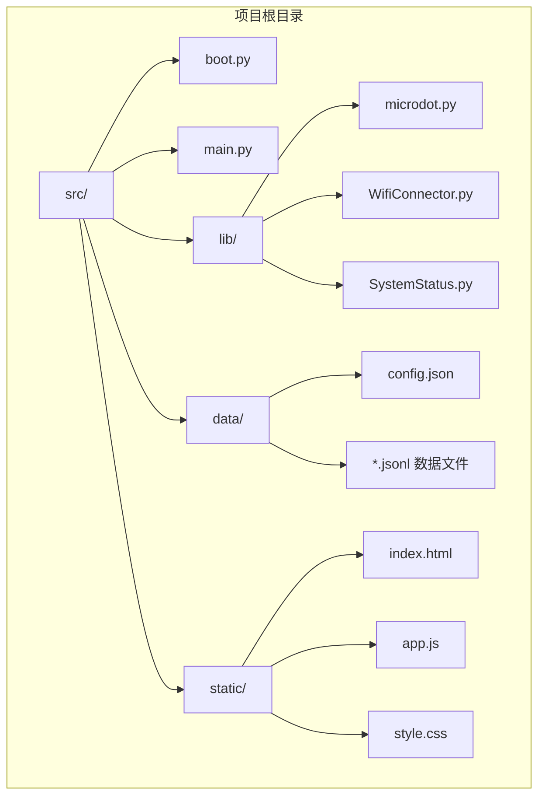
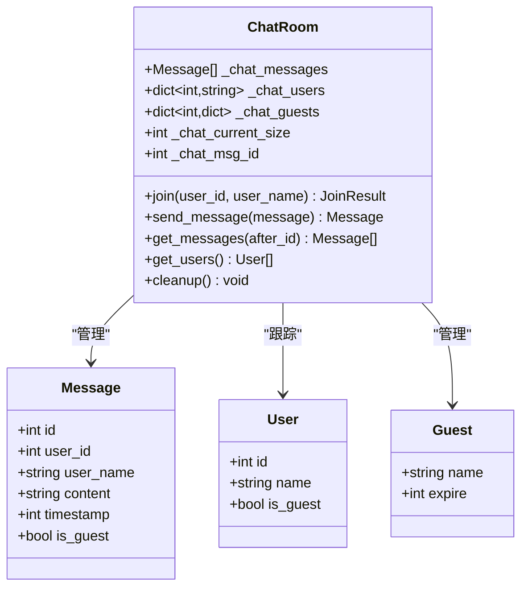
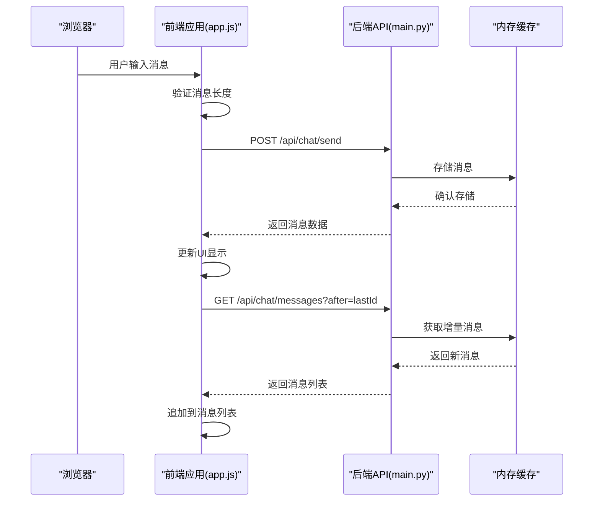
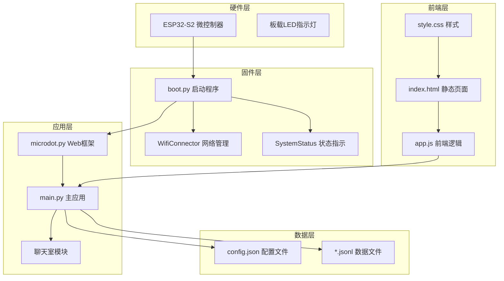
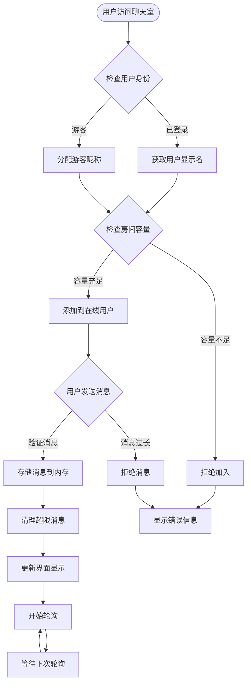
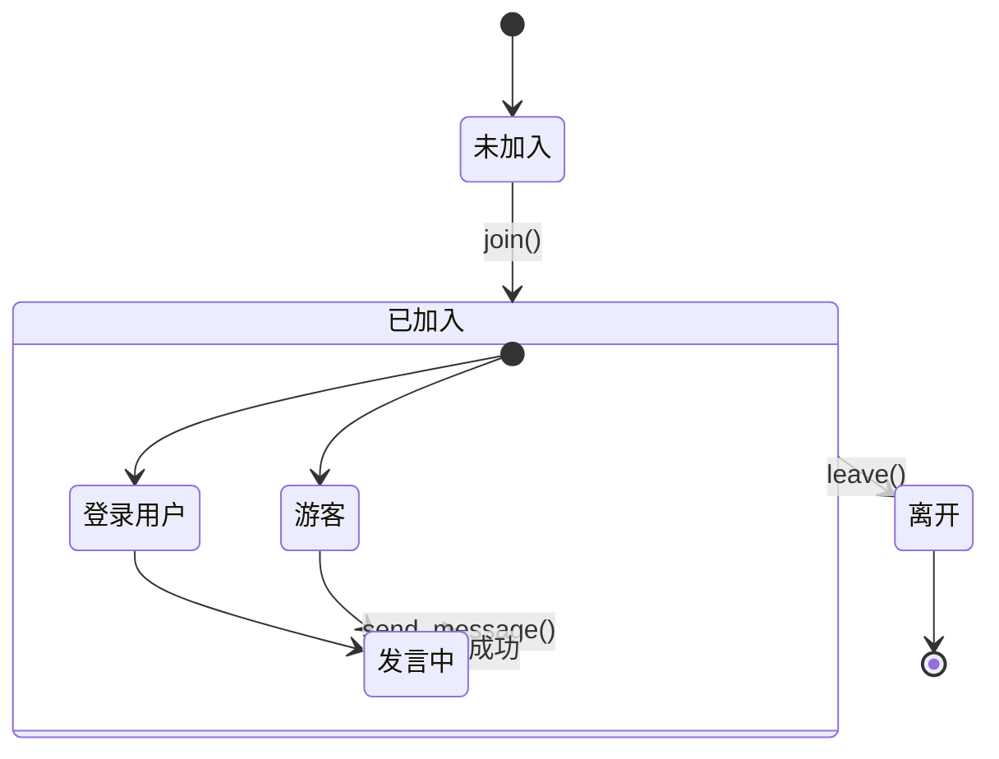
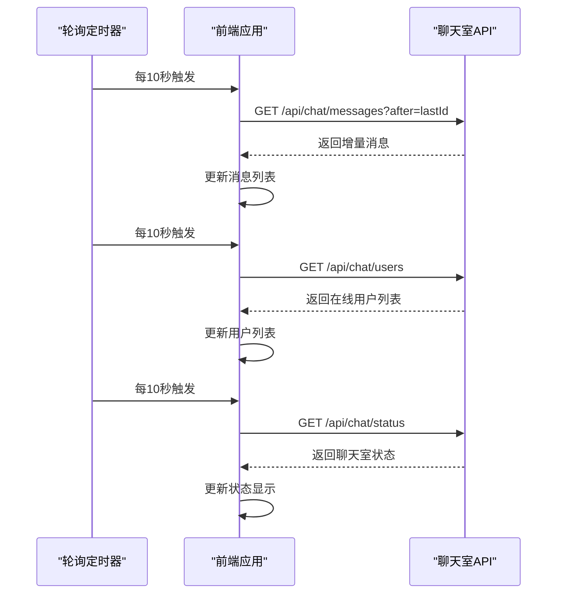
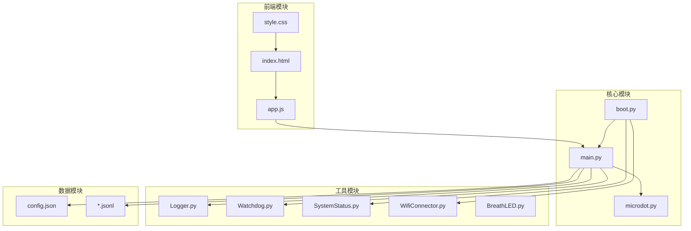

# 聊天室系统

<cite>
**本文档引用的文件**
- [README.md](file://README.md)
- [main.py](file://src/main.py)
- [boot.py](file://src/boot.py)
- [index.html](file://src/static/index.html)
- [app.js](file://src/static/app.js)
- [microdot.py](file://src/lib/microdot.py)
- [WifiConnector.py](file://src/lib/WifiConnector.py)
- [SystemStatus.py](file://src/lib/SystemStatus.py)
- [config.json](file://src/data/config.json)
</cite>

## 目录
1. [简介](#简介)
2. [项目结构](#项目结构)
3. [核心组件](#核心组件)
4. [架构概览](#架构概览)
5. [详细组件分析](#详细组件分析)
6. [依赖关系分析](#依赖关系分析)
7. [性能考虑](#性能考虑)
8. [故障排除指南](#故障排除指南)
9. [结论](#结论)

## 简介

围炉诗社·理事台是一个专为诗社管理设计的嵌入式 Web 应用系统。该项目基于 ESP32-S2 硬件平台和 MicroPython 开发环境，集成了多个核心功能模块，其中聊天室系统是重要的组成部分之一。

聊天室系统采用内存缓存机制，支持实时消息传递，具有以下特点：
- **内存缓存**：消息存储在 RAM 中，容量可配置（默认 128KB）
- **游客支持**：最多支持 10 名游客同时在线（可配置）
- **实时通信**：前端通过轮询机制获取最新消息
- **安全认证**：基于 Token 的用户身份验证
- **限流保护**：防止内存溢出和过度占用

## 项目结构

项目采用模块化的目录结构，主要包含以下组件：

**图表来源**
- [main.py](file://src/main.py#L1-L50)
- [boot.py](file://src/boot.py#L1-L50)

**章节来源**
- [README.md](file://README.md#L43-L58)
- [main.py](file://src/main.py#L1-L100)

## 核心组件

### 聊天室核心数据结构

聊天室系统使用内存中的数据结构来管理用户和消息：

**图表来源**
- [main.py](file://src/main.py#L2332-L2337)

### 前端聊天室架构

前端采用单页应用架构，通过 AJAX 轮询实现消息同步：

**图表来源**
- [app.js](file://src/static/app.js#L3734-L3789)
- [main.py](file://src/main.py#L2490-L2562)

**章节来源**
- [main.py](file://src/main.py#L2310-L2603)
- [app.js](file://src/static/app.js#L3382-L3996)

## 架构概览

### 系统整体架构

**图表来源**
- [boot.py](file://src/boot.py#L1-L153)
- [main.py](file://src/main.py#L1-L100)
- [microdot.py](file://src/lib/microdot.py#L1-L200)

### 聊天室数据流

**图表来源**
- [main.py](file://src/main.py#L2442-L2562)

**章节来源**
- [README.md](file://README.md#L9-L20)
- [boot.py](file://src/boot.py#L1-L153)

## 详细组件分析

### 后端聊天室实现

#### 消息存储与管理

聊天室系统采用内存缓存机制来存储消息，具有以下特性：

- **消息结构**：每条消息包含唯一 ID、用户 ID、用户名、内容、时间戳和是否为游客标记
- **内存限制**：默认 128KB 缓存大小，超出时自动清理最早的消息
- **消息清理**：按 FIFO（先进先出）原则清理，同时维护用户在线状态

#### 用户管理机制

**图表来源**
- [main.py](file://src/main.py#L2442-L2582)

#### API 接口设计

聊天室系统提供以下核心 API 接口：

| 接口 | 方法 | 描述 | 参数 |
|------|------|------|------|
| `/api/chat/join` | POST | 加入聊天室 | 无 |
| `/api/chat/send` | POST | 发送消息 | content, user_id |
| `/api/chat/messages` | GET | 获取消息 | after (可选) |
| `/api/chat/users` | GET | 获取在线用户 | 无 |
| `/api/chat/leave` | POST | 离开聊天室 | user_id (可选) |
| `/api/chat/status` | GET | 获取聊天室状态 | 无 |

**章节来源**
- [main.py](file://src/main.py#L2414-L2603)

### 前端聊天室实现

#### 轮询机制

前端采用定时轮询机制来获取最新消息：

**图表来源**
- [app.js](file://src/static/app.js#L3484-L3505)

#### 消息渲染

前端负责消息的实时渲染和用户交互：

- **消息格式化**：支持 HTML 转义，防止 XSS 攻击
- **时间显示**：智能时间格式化，当天显示时间，否则显示日期
- **用户标识**：区分登录用户和游客，显示不同的样式
- **输入验证**：限制消息长度为 256 字符

**章节来源**
- [app.js](file://src/static/app.js#L3580-L3621)
- [app.js](file://src/static/app.js#L3734-L3789)

### 系统集成组件

#### 网络连接管理

WiFi 连接管理器提供了完整的网络配置和连接功能：

- **STA 模式**：连接到现有 WiFi 网络
- **AP 模式**：创建热点供设备配置
- **自动重连**：支持多次重试和错误处理
- **静态 IP**：支持手动配置网络参数

#### 系统状态指示

LED 指示灯系统提供了直观的系统状态反馈：

- **连接状态**：快速呼吸指示正在连接
- **AP 模式**：中速呼吸指示热点模式
- **运行状态**：慢速呼吸指示稳定运行
- **请求响应**：快闪一次指示处理完成

**章节来源**
- [WifiConnector.py](file://src/lib/WifiConnector.py#L1-L200)
- [SystemStatus.py](file://src/lib/SystemStatus.py#L1-L146)

## 依赖关系分析

### 模块依赖图

**图表来源**
- [main.py](file://src/main.py#L1-L20)
- [boot.py](file://src/boot.py#L1-L20)

### 外部依赖

项目的主要外部依赖包括：

- **MicroPython 标准库**：网络、时间、加密等基础功能
- **第三方库**：uasyncio（异步支持）、ubinascii（编码转换）
- **硬件抽象层**：ESP32-S2 特定的 GPIO 和定时器功能

**章节来源**
- [microdot.py](file://src/lib/microdot.py#L1-L200)
- [main.py](file://src/main.py#L1-L20)

## 性能考虑

### 内存管理策略

聊天室系统采用了多种内存管理策略来确保在有限的硬件资源下稳定运行：

#### 内存限制与清理

- **缓存大小限制**：默认 128KB，可通过配置调整
- **FIFO 清理机制**：超出限制时自动删除最早的消息
- **用户状态维护**：清理消息时同步清理用户在线状态

#### 性能优化措施

- **增量消息获取**：前端只获取新增消息，减少网络传输
- **内存回收**：及时释放不再使用的对象引用
- **定时器管理**：合理使用定时器，避免资源泄漏

### 网络性能优化

- **请求大小限制**：防止恶意或意外的大请求
- **轮询间隔优化**：10 秒间隔平衡实时性和资源消耗
- **错误处理**：完善的错误处理机制，避免连接中断

**章节来源**
- [main.py](file://src/main.py#L2343-L2364)
- [microdot.py](file://src/lib/microdot.py#L40-L83)

## 故障排除指南

### 常见问题诊断

#### 聊天室无法访问

**症状**：用户无法加入聊天室或收到"龙门阵已关闭"错误

**可能原因**：
1. 聊天室功能被管理员关闭
2. 系统维护模式启用
3. 配置文件中 chat_enabled 设置为 False

**解决方法**：
1. 检查系统设置中的聊天室开关
2. 确认维护模式状态
3. 验证配置文件设置

#### 消息发送失败

**症状**：用户发送消息后没有显示或收到错误

**可能原因**：
1. 消息内容为空或过长
2. 用户身份验证失败
3. 内存缓存已满

**解决方法**：
1. 检查消息长度限制（256 字符）
2. 验证用户登录状态
3. 清理内存缓存或增加缓存大小

#### 用户加入受限

**症状**：用户无法加入聊天室，提示"人数已满"

**可能原因**：
1. 总在线用户数达到上限
2. 游客数量达到上限
3. 房间容量配置过小

**解决方法**：
1. 检查 chat_max_users 配置
2. 验证游客上限设置
3. 调整房间容量配置

### 调试技巧

#### 日志分析

系统提供了详细的日志记录功能：

- **调试模式**：通过 debug_mode 配置启用详细日志
- **错误分类**：区分不同类型的错误和警告
- **性能监控**：记录内存使用和处理时间

#### 状态监控

- **聊天室状态**：通过 `/api/chat/status` 接口获取实时状态
- **系统资源**：监控内存使用和用户连接数
- **网络状态**：检查 WiFi 连接质量和信号强度

**章节来源**
- [main.py](file://src/main.py#L2584-L2603)
- [config.json](file://src/data/config.json#L1-L1)

## 结论

围炉诗社·理事台的聊天室系统是一个设计精良的嵌入式实时通信解决方案。系统的主要优势包括：

### 技术优势

1. **高效内存管理**：采用内存缓存机制，在有限资源下提供流畅的用户体验
2. **实时性保证**：通过轮询机制确保消息的及时传递
3. **安全性设计**：基于 Token 的身份验证和严格的权限控制
4. **可扩展性**：模块化设计便于功能扩展和维护

### 架构特点

- **简洁性**：避免复杂的 WebSocket 实现，降低系统复杂度
- **可靠性**：完善的错误处理和状态管理机制
- **可维护性**：清晰的代码结构和详细的注释说明

### 应用价值

聊天室系统为围炉诗社提供了：
- **即时沟通**：成员间的实时交流平台
- **社区建设**：促进诗社成员之间的互动和联系
- **文化传承**：为诗歌创作和交流提供便利条件

该系统展示了如何在嵌入式环境中实现复杂的 Web 应用功能，为类似项目的开发提供了宝贵的参考经验。