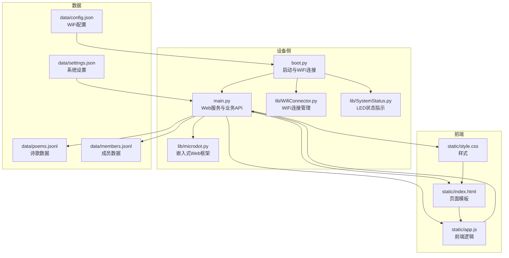
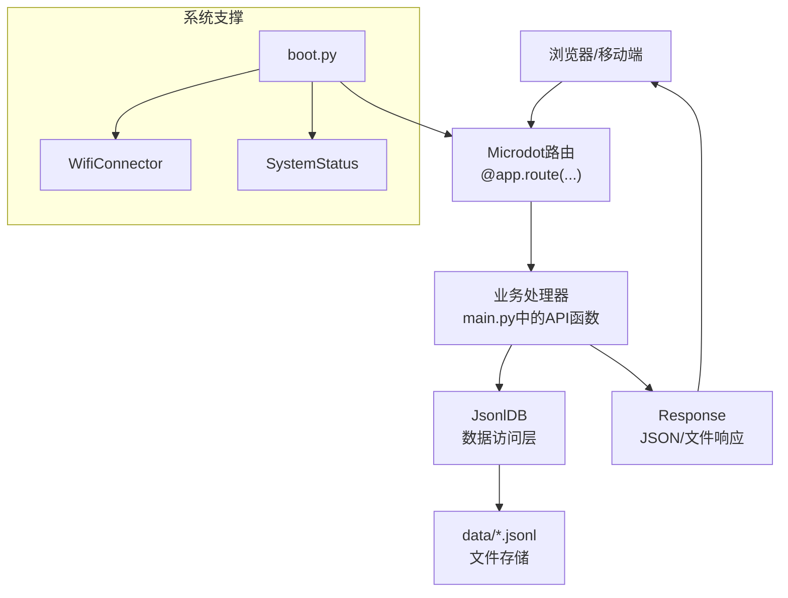
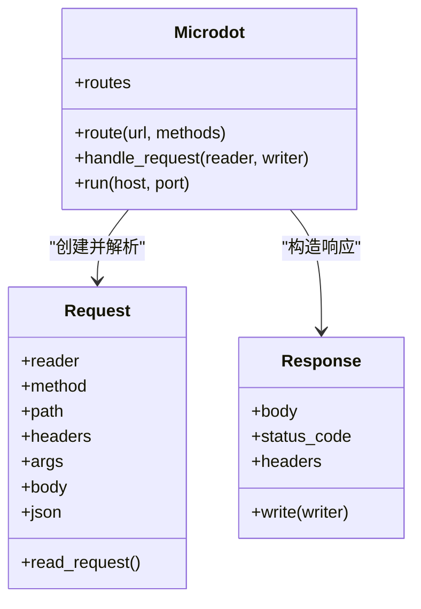
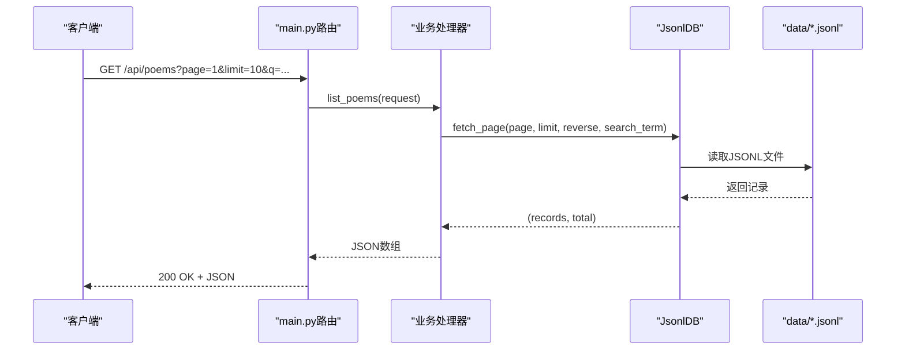
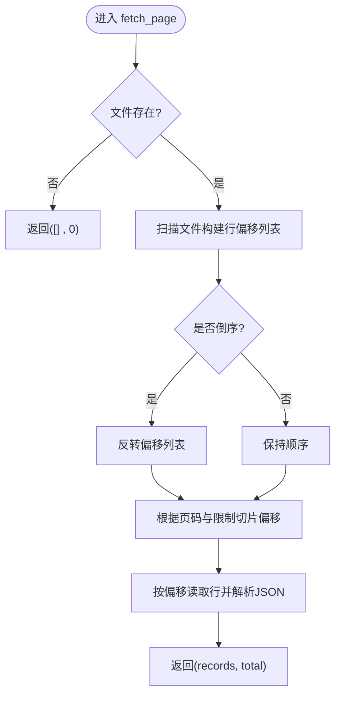
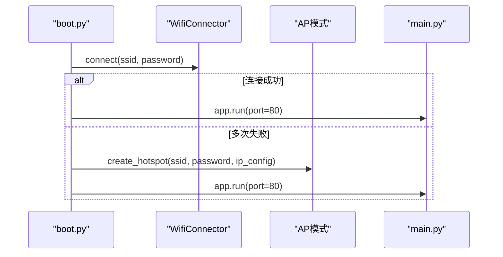
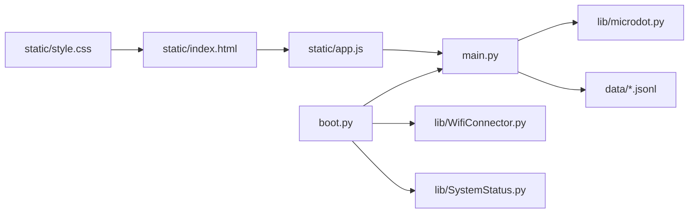

# Web服务架构

<cite>
**本文引用的文件**
- [main.py](file://main.py)
- [boot.py](file://boot.py)
- [lib/microdot.py](file://lib/microdot.py)
- [lib/WifiConnector.py](file://lib/WifiConnector.py)
- [lib/SystemStatus.py](file://lib/SystemStatus.py)
- [static/index.html](file://static/index.html)
- [static/app.js](file://static/app.js)
- [static/style.css](file://static/style.css)
- [data/config.json](file://data/config.json)
- [data/settings.json](file://data/settings.json)
- [data/poems.jsonl](file://data/poems.jsonl)
- [data/members.jsonl](file://data/members.jsonl)
</cite>

## 目录
1. [简介](#简介)
2. [项目结构](#项目结构)
3. [核心组件](#核心组件)
4. [架构总览](#架构总览)
5. [详细组件分析](#详细组件分析)
6. [依赖关系分析](#依赖关系分析)
7. [性能考量](#性能考量)
8. [故障排查指南](#故障排查指南)
9. [结论](#结论)
10. [附录](#附录)

## 简介
本文件面向围炉诗社·理事台项目的Web服务架构，围绕基于Microdot框架的嵌入式Web服务器展开，重点覆盖：
- 路由配置与请求处理
- 异步事件驱动模型
- 中间件机制（通过装饰器与请求/响应对象）
- main.py中的Web服务初始化、API端点定义与静态资源服务
- Microdot在ESP32环境下的特性与限制（内存管理、并发处理、性能优化）
- 服务架构图、请求响应流程与错误处理机制
- Web服务配置与调试最佳实践

## 项目结构
项目采用“应用层 + 库层 + 数据层 + 静态资源”的分层组织方式：
- 应用入口：main.py负责路由注册、业务API与静态资源服务
- 框架库：lib/microdot.py提供轻量级嵌入式Web框架（Request/Response/Microdot）
- 系统支撑：boot.py负责WiFi连接与启动流程；lib/WifiConnector.py提供WiFi连接管理；lib/SystemStatus.py提供LED状态指示
- 数据持久化：data目录下以JSONL格式存储诗歌、成员、活动、财务、任务等数据
- 前端界面：static目录提供HTML/CSS/JS静态资源，前端通过REST API与后端交互

图表来源
- [main.py](file://main.py#L1-L548)
- [boot.py](file://boot.py#L1-L122)
- [lib/microdot.py](file://lib/microdot.py#L1-L183)
- [lib/WifiConnector.py](file://lib/WifiConnector.py#L1-L800)
- [lib/SystemStatus.py](file://lib/SystemStatus.py#L1-L61)
- [static/index.html](file://static/index.html#L1-L269)
- [static/app.js](file://static/app.js#L1-L800)
- [static/style.css](file://static/style.css#L1-L385)
- [data/config.json](file://data/config.json#L1-L6)
- [data/settings.json](file://data/settings.json#L1-L1)
- [data/poems.jsonl](file://data/poems.jsonl#L1-L4)
- [data/members.jsonl](file://data/members.jsonl#L1-L4)

章节来源
- [main.py](file://main.py#L1-L548)
- [boot.py](file://boot.py#L1-L122)
- [lib/microdot.py](file://lib/microdot.py#L1-L183)

## 核心组件
- 嵌入式Web框架（Microdot）：提供Request/Response对象与路由装饰器，支持异步事件驱动与文件发送
- Web服务入口（main.py）：注册静态资源路由与业务API，封装数据库访问与业务逻辑
- 启动与网络（boot.py + WifiConnector）：负责WiFi连接、AP模式与LED状态指示
- 前端界面（static）：HTML/CSS/JS构成的单页应用，通过REST API与后端交互
- 数据层（data）：JSONL文件存储，提供增删改查与分页检索能力

章节来源
- [lib/microdot.py](file://lib/microdot.py#L1-L183)
- [main.py](file://main.py#L17-L548)
- [boot.py](file://boot.py#L1-L122)
- [lib/WifiConnector.py](file://lib/WifiConnector.py#L1-L800)
- [static/index.html](file://static/index.html#L1-L269)
- [static/app.js](file://static/app.js#L1-L800)
- [static/style.css](file://static/style.css#L1-L385)
- [data/poems.jsonl](file://data/poems.jsonl#L1-L4)
- [data/members.jsonl](file://data/members.jsonl#L1-L4)

## 架构总览
整体架构采用“嵌入式Web服务器 + 单页前端应用 + 文件数据库”的轻量方案，适用于ESP32等资源受限设备。

图表来源
- [lib/microdot.py](file://lib/microdot.py#L94-L165)
- [main.py](file://main.py#L299-L540)
- [boot.py](file://boot.py#L1-L122)
- [lib/WifiConnector.py](file://lib/WifiConnector.py#L1-L800)
- [lib/SystemStatus.py](file://lib/SystemStatus.py#L1-L61)

## 详细组件分析

### Microdot嵌入式Web框架
- 请求解析：Request.read_request解析HTTP首行、头部与Body，支持查询参数与JSON解析
- 响应生成：Response.write支持字符串、字典/列表（自动转JSON）、文件流（send_file）
- 路由注册：Microdot.route装饰器注册URL与方法到路由表
- 请求处理：Microdot.handle_request匹配路由、调用处理器、异常捕获、写出响应
- 服务器运行：Microdot.run启动uasyncio事件循环，监听TCP端口

图表来源
- [lib/microdot.py](file://lib/microdot.py#L5-L183)

章节来源
- [lib/microdot.py](file://lib/microdot.py#L1-L183)

### Web服务初始化与静态资源服务（main.py）
- 应用实例：创建Microdot实例app
- 静态资源路由：注册/index、/static/*路径，使用send_file返回静态文件
- 系统状态路由：/api/system/info返回平台、存储与内存信息
- 启动入口：if __name__条件内调用app.run(port=80, debug=True)

章节来源
- [main.py](file://main.py#L17-L30)
- [main.py](file://main.py#L299-L306)
- [main.py](file://main.py#L528-L540)
- [main.py](file://main.py#L541-L548)

### API端点定义与业务逻辑
- 诗歌API：/api/poems(GET/POST/PUT/DELETE)，支持分页、搜索、增删改
- 活动API：/api/activities(GET/POST/PUT/DELETE)，支持分页与搜索
- 任务API：/api/tasks(GET)，/api/tasks/complete(POST)
- 成员API：/api/members(GET/POST/PUT/DELETE)，含登录校验
- 财务API：/api/finance(GET/POST)
- 设置API：/api/settings/fields(GET/POST)
- 登录API：/api/login(POST)

图表来源
- [main.py](file://main.py#L309-L333)
- [main.py](file://main.py#L113-L186)
- [main.py](file://main.py#L262-L266)

章节来源
- [main.py](file://main.py#L309-L370)
- [main.py](file://main.py#L371-L409)
- [main.py](file://main.py#L410-L450)
- [main.py](file://main.py#L451-L484)
- [main.py](file://main.py#L504-L516)
- [main.py](file://main.py#L518-L527)
- [main.py](file://main.py#L528-L540)

### 数据访问层（JsonlDB）
- 目录与迁移：确保目录存在，必要时将历史JSON迁移到JSONL
- 追加写入：append将新记录追加到文件末尾
- 分页检索：fetch_page扫描文件计算偏移，支持倒序与搜索
- 更新与删除：通过临时文件重写实现，保证一致性
- 全量读取：get_all用于小数据集（如Members/Settings）

图表来源
- [main.py](file://main.py#L113-L186)

章节来源
- [main.py](file://main.py#L53-L266)

### 前端交互与路由（static/app.js）
- 登录与导航：登录成功后切换显示区域，按需拉取数据
- 列表与分页：Poems/Activities/Members/Finance/Tasks分别拉取数据并渲染
- 本地草稿：使用IndexedDB缓存草稿，避免丢失
- 权限控制：根据用户角色显示/隐藏编辑按钮
- 搜索：全局搜索框触发Poems/Activities/Tasks的搜索

章节来源
- [static/app.js](file://static/app.js#L61-L147)
- [static/app.js](file://static/app.js#L165-L221)
- [static/app.js](file://static/app.js#L486-L727)

### 启动流程与网络连接（boot.py + WifiConnector）
- CPU频率提升：将ESP32 CPU频率提升至240MHz
- WiFi连接：优先连接配置中的WiFi，失败则进入AP模式
- AP模式：创建热点，提供固定IP与DNS
- LED状态：根据连接状态切换LED呼吸周期

图表来源
- [boot.py](file://boot.py#L22-L87)
- [lib/WifiConnector.py](file://lib/WifiConnector.py#L595-L696)

章节来源
- [boot.py](file://boot.py#L1-L122)
- [lib/WifiConnector.py](file://lib/WifiConnector.py#L1-L800)
- [lib/SystemStatus.py](file://lib/SystemStatus.py#L1-L61)

## 依赖关系分析
- main.py依赖lib/microdot.py提供的框架能力，同时依赖os、gc、network、time等内置模块
- boot.py依赖lib/WifiConnector.py与lib/SystemStatus.py，负责系统启动与网络状态
- 前端index.html依赖app.js与style.css，app.js通过fetch与main.py的API交互
- 数据层通过data/*.jsonl文件提供持久化存储

图表来源
- [main.py](file://main.py#L1-L16)
- [lib/microdot.py](file://lib/microdot.py#L1-L183)
- [boot.py](file://boot.py#L1-L122)
- [lib/WifiConnector.py](file://lib/WifiConnector.py#L1-L800)
- [lib/SystemStatus.py](file://lib/SystemStatus.py#L1-L61)
- [static/index.html](file://static/index.html#L1-L269)
- [static/app.js](file://static/app.js#L1-L800)
- [static/style.css](file://static/style.css#L1-L385)

章节来源
- [main.py](file://main.py#L1-L16)
- [boot.py](file://boot.py#L1-L122)

## 性能考量
- 内存管理
  - 使用gc.collect主动回收内存，减少碎片化
  - 在系统信息接口中返回可用RAM，便于监控
- 并发处理
  - Microdot基于uasyncio事件循环，单线程事件驱动，适合低并发场景
  - 避免长时间阻塞操作，保持请求处理的快速返回
- I/O优化
  - JsonlDB采用文件偏移定位与顺序读取，减少全文件扫描
  - 对小数据集使用get_all一次性读取，避免频繁I/O
- 静态资源
  - send_file直接以文件句柄作为响应体，降低内存占用
- 前端体验
  - IndexedDB本地草稿避免网络波动导致的数据丢失
  - 分页与搜索减少一次性传输的数据量

章节来源
- [main.py](file://main.py#L279-L294)
- [main.py](file://main.py#L528-L540)
- [lib/microdot.py](file://lib/microdot.py#L166-L183)
- [main.py](file://main.py#L113-L186)
- [static/app.js](file://static/app.js#L6-L58)

## 故障排查指南
- 无法访问Web界面
  - 检查WiFi连接状态与IP分配
  - 确认boot.py已成功连接或进入AP模式
- API返回404或500
  - 检查路由是否正确注册（@app.route装饰器）
  - 查看处理器内部异常日志（print输出）
- 静态资源404
  - 确认static目录存在且文件名正确
  - 检查send_file返回的Content-Type与Content-Length
- 内存不足
  - 观察系统信息接口返回的free_ram
  - 减少一次性读取的数据量，使用分页与搜索
- 前端无法登录
  - 检查/data/members.jsonl中是否存在对应账号
  - 确认前端登录请求的Content-Type为application/json

章节来源
- [boot.py](file://boot.py#L22-L87)
- [lib/microdot.py](file://lib/microdot.py#L104-L152)
- [main.py](file://main.py#L299-L306)
- [main.py](file://main.py#L528-L540)
- [data/members.jsonl](file://data/members.jsonl#L1-L4)

## 结论
本项目以Microdot为核心，结合ESP32的嵌入式能力与JSONL文件存储，构建了一个轻量、易部署、低资源消耗的Web服务。通过清晰的路由与数据访问层设计，以及前端单页应用的交互体验，实现了围炉诗社日常运营所需的核心功能。在资源受限环境下，遵循异步事件驱动、内存与I/O优化的原则，可进一步提升稳定性与性能。

## 附录

### Web服务配置与调试最佳实践
- 配置WiFi
  - 在data/config.json中设置ssid与password，首次运行将尝试连接
  - 若连接失败，自动进入AP模式，便于本地调试
- 调试建议
  - 启用main.py中的debug参数查看请求处理细节
  - 使用系统信息接口监控平台、存储与内存
  - 在boot.py中适当延长连接超时与重试次数
- 数据迁移
  - 当历史数据为.json时，JsonlDB会自动迁移至.jsonl
- 前端开发
  - 使用本地IndexedDB缓存草稿，提升离线体验
  - 合理使用分页与搜索，避免一次性加载过多数据

章节来源
- [data/config.json](file://data/config.json#L1-L6)
- [main.py](file://main.py#L541-L548)
- [main.py](file://main.py#L528-L540)
- [boot.py](file://boot.py#L22-L87)
- [main.py](file://main.py#L68-L84)
- [static/app.js](file://static/app.js#L6-L58)