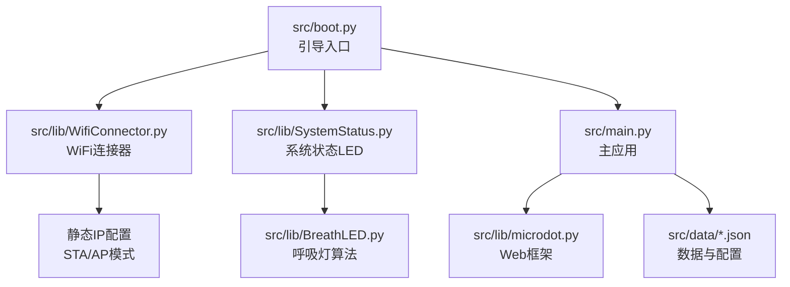
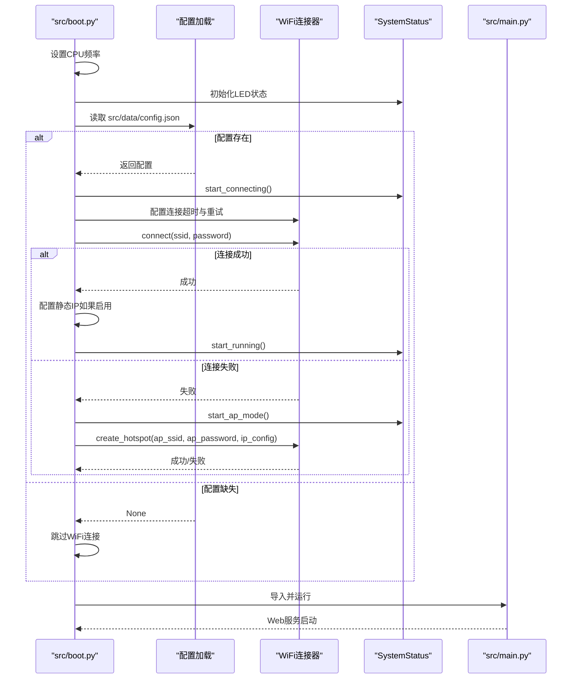
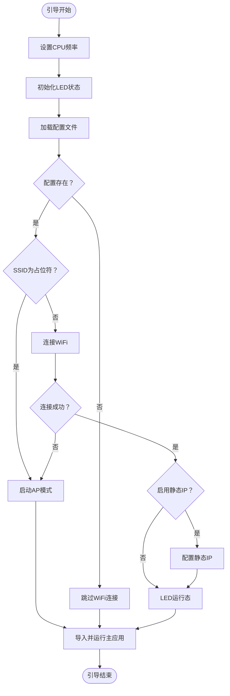
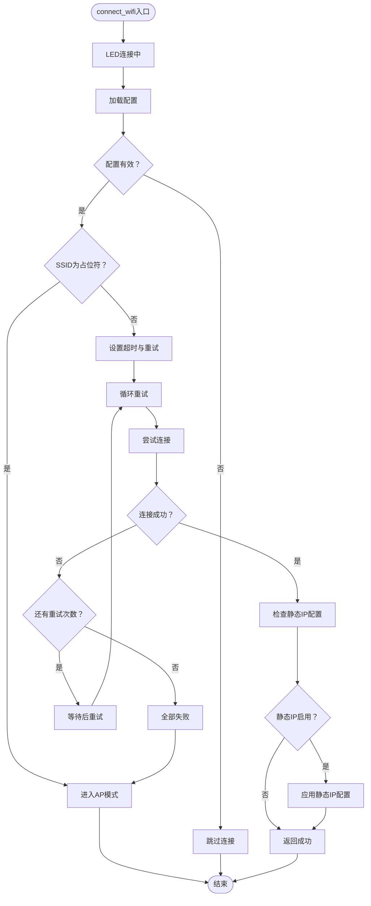
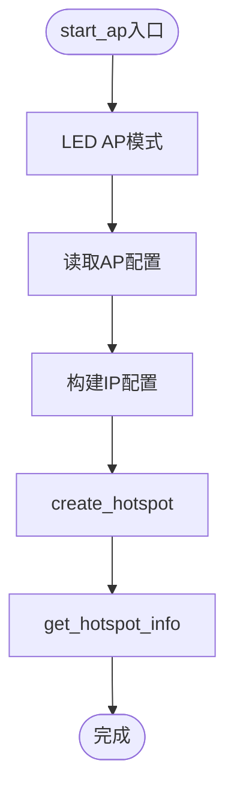
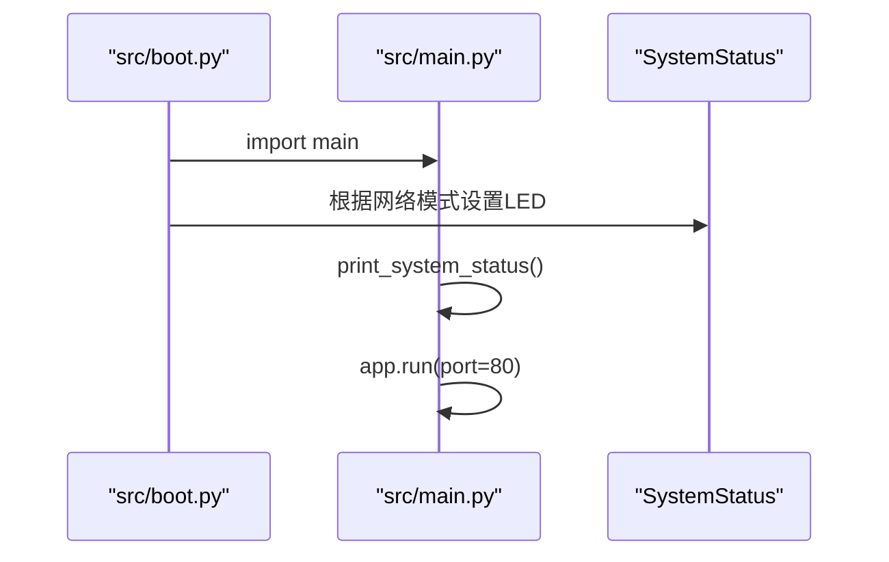
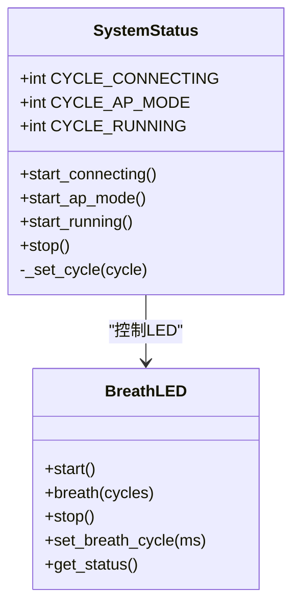
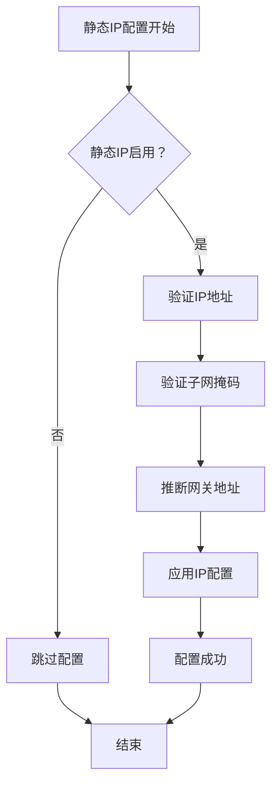
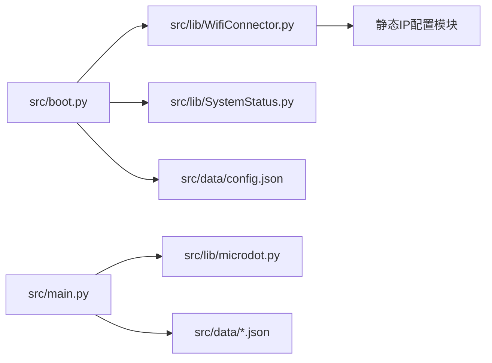

# 引导系统

<cite>
**本文引用的文件**
- [src/boot.py](file://src/boot.py)
- [src/main.py](file://src/main.py)
- [src/lib/WifiConnector.py](file://src/lib/WifiConnector.py)
- [src/lib/SystemStatus.py](file://src/lib/SystemStatus.py)
- [src/lib/BreathLED.py](file://src/lib/BreathLED.py)
- [src/data/config.json](file://src/data/config.json)
- [src/data/settings.json](file://src/data/settings.json)
</cite>

## 更新摘要
**变更内容**
- 新增STA和AP模式的静态IP配置支持
- 增强WiFi连接管理的验证和错误处理机制
- 改进网络初始化流程和IP配置验证
- 优化引导程序的异常处理策略

## 目录
1. [简介](#简介)
2. [项目结构](#项目结构)
3. [核心组件](#核心组件)
4. [架构总览](#架构总览)
5. [详细组件分析](#详细组件分析)
6. [依赖关系分析](#依赖关系分析)
7. [性能考量](#性能考量)
8. [故障排查指南](#故障排查指南)
9. [结论](#结论)
10. [附录](#附录)

## 简介
本文件面向围炉诗社·理事台项目的引导系统，聚焦 src/boot.py 的启动流程与异常处理策略，涵盖硬件初始化、WiFi连接尝试、AP模式切换、主应用启动、CPU频率设置、配置文件加载、连接超时与重试机制、状态指示逻辑以及调试技巧。文档以循序渐进的方式呈现，既适合开发者深入理解实现细节，也便于非技术读者把握整体流程。

**更新** 本版本重点介绍了引导系统的增强功能，包括改进的WiFi连接管理、支持STA和AP模式的静态IP配置、更好的网络初始化和错误处理机制。

## 项目结构
项目采用"引导层 + 应用层 + 库模块 + 数据配置"的分层组织方式：
- 引导层：src/boot.py 负责系统启动、WiFi连接与AP模式决策、LED状态指示、主应用启动
- 应用层：src/main.py 提供Web服务与业务API
- 库模块：src/lib/WifiConnector.py 提供WiFi连接与热点管理；src/lib/SystemStatus.py 控制LED状态；src/lib/BreathLED.py 实现呼吸灯算法
- 数据配置：src/data/config.json 存放WiFi与AP配置；src/data/settings.json 存放系统设置

**图表来源**
- [src/boot.py](file://src/boot.py#L1-L137)
- [src/main.py](file://src/main.py#L1-L712)
- [src/lib/WifiConnector.py](file://src/lib/WifiConnector.py#L1-L1930)
- [src/lib/SystemStatus.py](file://src/lib/SystemStatus.py#L1-L61)
- [src/lib/BreathLED.py](file://src/lib/BreathLED.py#L1-L633)

**章节来源**
- [src/boot.py](file://src/boot.py#L1-L137)
- [src/main.py](file://src/main.py#L1-L712)

## 核心组件
- CPU频率设置：引导阶段将CPU频率提升至240 MHz，以获得更佳性能
- 配置加载：从 src/data/config.json 读取WiFi与AP配置，若缺失则跳过连接尝试
- WiFi连接器：封装连接、重连、热点创建、状态查询等能力，支持静态IP配置
- 状态指示：通过 SystemStatus 控制单LED呼吸周期，区分连接中、AP模式、运行中三种状态
- 主应用启动：引导完成后导入 main 并运行Web服务

**更新** 核心组件现在包括增强的静态IP配置支持，能够在STA和AP模式下配置固定IP地址。

**章节来源**
- [src/boot.py](file://src/boot.py#L8-L137)
- [src/lib/WifiConnector.py](file://src/lib/WifiConnector.py#L1-L1930)
- [src/lib/SystemStatus.py](file://src/lib/SystemStatus.py#L1-L61)

## 架构总览
引导系统以 src/boot.py 为核心，串联配置加载、WiFi连接、AP模式与主应用启动。其关键流程如下：

**图表来源**
- [src/boot.py](file://src/boot.py#L8-L137)
- [src/lib/WifiConnector.py](file://src/lib/WifiConnector.py#L595-L696)
- [src/lib/WifiConnector.py](file://src/lib/WifiConnector.py#L1243-L1299)
- [src/lib/SystemStatus.py](file://src/lib/SystemStatus.py#L33-L46)

## 详细组件分析

### 引导流程与状态指示
- CPU频率设置：在引导初期设置为240 MHz，并打印当前频率
- LED初始化：SystemStatus 在GPIO 15上初始化单LED呼吸，周期分别为快速（连接中）、中速（AP模式）、极慢（运行中）
- 配置加载：尝试读取 src/data/config.json，若失败则记录错误并跳过连接
- WiFi连接：若配置中SSID仍为占位符，则直接进入AP模式；否则使用 WifiConnector 进行连接，设置较长超时与重试次数
- **新增** 静态IP配置：连接成功后检查配置中的静态IP设置，如果启用则配置固定IP地址
- AP模式：若连接失败，启动热点，使用自定义IP段，打印启动信息
- 主应用启动：导入 main 并运行Web服务，同时根据当前网络模式设置LED状态

**图表来源**
- [src/boot.py](file://src/boot.py#L8-L137)
- [src/lib/SystemStatus.py](file://src/lib/SystemStatus.py#L33-L46)

**章节来源**
- [src/boot.py](file://src/boot.py#L8-L137)
- [src/lib/SystemStatus.py](file://src/lib/SystemStatus.py#L1-L61)

### WiFi连接与重试机制
- 超时与重试：引导阶段将连接超时设为30秒，最大重试5次
- 连接循环：逐次尝试，失败时打印错误并短暂等待后重试
- 失败回退：全部失败后进入AP模式
- **增强** 静态IP集成：连接成功后自动配置静态IP（如果配置中启用）
- 连接器能力：WifiConnector 提供参数校验、状态描述、错误记录、自动重连、热点创建、IP配置等

**图表来源**
- [src/boot.py](file://src/boot.py#L22-L78)
- [src/lib/WifiConnector.py](file://src/lib/WifiConnector.py#L595-L696)

**章节来源**
- [src/boot.py](file://src/boot.py#L22-L78)
- [src/lib/WifiConnector.py](file://src/lib/WifiConnector.py#L1-L1930)

### AP模式启动与热点配置
- AP参数：从配置读取SSID与密码，若缺失使用默认值
- **增强** IP配置：使用自定义IP段（网关与DNS指向同一地址），支持静态IP配置
- 启动流程：激活AP接口、配置认证模式（开放或WPA2）、应用IP配置、记录信息
- 信息查询：提供热点完整信息与客户端数量查询

**图表来源**
- [src/boot.py](file://src/boot.py#L80-L102)
- [src/lib/WifiConnector.py](file://src/lib/WifiConnector.py#L1243-L1299)
- [src/lib/WifiConnector.py](file://src/lib/WifiConnector.py#L1392-L1463)

**章节来源**
- [src/boot.py](file://src/boot.py#L80-L102)
- [src/lib/WifiConnector.py](file://src/lib/WifiConnector.py#L1243-L1463)

### 主应用启动与状态联动
- 导入与运行：引导完成后导入 main 并运行Web服务
- 状态联动：根据当前网络模式（STA/AP）设置LED状态
- 系统状态：打印系统状态（WiFi IP、内存等）

**图表来源**
- [src/boot.py](file://src/boot.py#L120-L137)
- [src/main.py](file://src/main.py#L349-L364)

**章节来源**
- [src/boot.py](file://src/boot.py#L120-L137)
- [src/main.py](file://src/main.py#L349-L364)

### 状态指示逻辑（LED）
- 快速呼吸：连接中（GPIO 15）
- 中速呼吸：AP模式
- 极慢呼吸：运行中（WiFi连接成功）

**图表来源**
- [src/lib/SystemStatus.py](file://src/lib/SystemStatus.py#L19-L61)
- [src/lib/BreathLED.py](file://src/lib/BreathLED.py#L1-L633)

**章节来源**
- [src/lib/SystemStatus.py](file://src/lib/SystemStatus.py#L1-L61)
- [src/lib/BreathLED.py](file://src/lib/BreathLED.py#L1-L633)

### 静态IP配置增强功能
**新增** 引导系统现在支持STA和AP模式的静态IP配置：

- **STA模式静态IP**：连接成功后自动配置固定IP地址
- **AP模式静态IP**：热点启动时使用自定义IP段
- **IP配置验证**：验证IP地址格式、子网掩码、网关地址的有效性
- **自动推断**：根据IP地址自动推断网关地址
- **配置持久化**：支持静态IP配置的保存和加载

**图表来源**
- [src/boot.py](file://src/boot.py#L57-L70)
- [src/lib/WifiConnector.py](file://src/lib/WifiConnector.py#L432-L502)

**章节来源**
- [src/boot.py](file://src/boot.py#L57-L70)
- [src/lib/WifiConnector.py](file://src/lib/WifiConnector.py#L432-L502)

## 依赖关系分析
- src/boot.py 依赖：
  - src/lib/WifiConnector.py：WiFi连接与热点管理，支持静态IP配置
  - src/lib/SystemStatus.py：LED状态控制
  - src/data/config.json：WiFi与AP配置，包括静态IP设置
- src/main.py 依赖：
  - src/lib/microdot.py：Web框架
  - src/data/*.json：业务数据与系统设置

**图表来源**
- [src/boot.py](file://src/boot.py#L1-L137)
- [src/main.py](file://src/main.py#L1-L712)

**章节来源**
- [src/boot.py](file://src/boot.py#L1-L137)
- [src/main.py](file://src/main.py#L1-L712)

## 性能考量
- CPU频率：引导阶段提升至240 MHz，有助于更快完成网络初始化与后续任务
- LED更新：BreathLED 的更新间隔与周期可调，兼顾视觉效果与CPU占用
- 连接超时与重试：引导阶段适度延长超时与重试次数，提升在弱信号或繁忙网络下的成功率
- **新增** 静态IP配置：IP地址验证和推断功能在连接成功后执行，不影响主要启动流程
- 资源清理：WiFi连接器提供清理与断开能力，避免资源泄漏

**章节来源**
- [src/boot.py](file://src/boot.py#L8-L137)
- [src/lib/WifiConnector.py](file://src/lib/WifiConnector.py#L1-L1930)
- [src/lib/BreathLED.py](file://src/lib/BreathLED.py#L1-L633)

## 故障排查指南
- 配置缺失或格式错误
  - 现象：引导跳过WiFi连接
  - 处理：检查 src/data/config.json 是否存在且格式正确
  - 参考路径：[src/boot.py](file://src/boot.py#L14-L21)
- WiFi连接失败
  - 现象：多次重试后进入AP模式
  - 处理：确认SSID/密码正确、信号强度足够；查看 WifiConnector 的错误信息
  - 参考路径：[src/boot.py](file://src/boot.py#L46-L78)、[src/lib/WifiConnector.py](file://src/lib/WifiConnector.py#L690-L696)
- **新增** 静态IP配置失败
  - 现象：连接成功但静态IP配置失败
  - 处理：检查配置中的IP地址、子网掩码、网关格式是否正确；查看引导日志中的错误信息
  - 参考路径：[src/boot.py](file://src/boot.py#L68-L70)、[src/lib/WifiConnector.py](file://src/lib/WifiConnector.py#L452-L502)
- AP模式启动失败
  - 现象：热点创建失败
  - 处理：检查AP配置、IP段合法性；查看 WifiConnector 的错误信息
  - 参考路径：[src/boot.py](file://src/boot.py#L96-L102)、[src/lib/WifiConnector.py](file://src/lib/WifiConnector.py#L1297-L1299)
- LED无响应
  - 现象：LED不闪烁
  - 处理：确认GPIO 15可用、SystemStatus 初始化成功；检查 BreathLED 的硬件初始化
  - 参考路径：[src/lib/SystemStatus.py](file://src/lib/SystemStatus.py#L25-L32)、[src/lib/BreathLED.py](file://src/lib/BreathLED.py#L228-L244)
- 主应用无法启动
  - 现象：引导结束后Web服务未运行
  - 处理：检查 main.py 导入与运行逻辑；查看引导日志与异常
  - 参考路径：[src/boot.py](file://src/boot.py#L120-L137)、[src/main.py](file://src/main.py#L705-L712)

**章节来源**
- [src/boot.py](file://src/boot.py#L14-L21)
- [src/boot.py](file://src/boot.py#L46-L78)
- [src/boot.py](file://src/boot.py#L68-L70)
- [src/boot.py](file://src/boot.py#L96-L102)
- [src/lib/SystemStatus.py](file://src/lib/SystemStatus.py#L25-L32)
- [src/lib/BreathLED.py](file://src/lib/BreathLED.py#L228-L244)
- [src/main.py](file://src/main.py#L705-L712)

## 结论
引导系统通过明确的启动步骤、完善的异常处理与可视化状态指示，实现了从硬件初始化到主应用运行的平滑过渡。其关键优势在于：
- 可靠的WiFi连接与AP回退策略
- 清晰的状态指示与调试日志
- 可扩展的配置与模块化设计
- **新增** 支持STA和AP模式的静态IP配置，提供更稳定的网络连接

**更新** 本次增强显著提升了系统的网络配置灵活性和稳定性，特别是在需要固定IP地址的企业网络环境中。

## 附录

### 配置文件说明
- src/data/config.json
  - 字段：wifi_ssid、wifi_password、ap_ssid、ap_password
  - 作用：WiFi与AP的SSID与密码
  - 参考路径：[src/data/config.json](file://src/data/config.json#L1-L6)
- src/data/settings.json
  - 字段：custom_member_fields 等
  - 作用：系统设置项
  - 参考路径：[src/data/settings.json](file://src/data/settings.json#L1-L5)

**新增** 静态IP配置选项：
- `sta_use_static_ip`：启用STA模式静态IP配置
- `sta_ip`：STA模式静态IP地址
- `sta_subnet`：STA模式子网掩码
- `sta_gateway`：STA模式网关地址
- `sta_dns`：STA模式DNS服务器地址

### 关键实现路径参考
- 引导流程与LED控制：[src/boot.py](file://src/boot.py#L8-L137)、[src/lib/SystemStatus.py](file://src/lib/SystemStatus.py#L1-L61)
- WiFi连接与AP模式：[src/lib/WifiConnector.py](file://src/lib/WifiConnector.py#L595-L696)、[src/lib/WifiConnector.py](file://src/lib/WifiConnector.py#L1243-L1299)
- 静态IP配置管理：[src/lib/WifiConnector.py](file://src/lib/WifiConnector.py#L432-L502)、[src/lib/WifiConnector.py](file://src/lib/WifiConnector.py#L905-L1037)
- 主应用启动与状态打印：[src/main.py](file://src/main.py#L349-L364)、[src/main.py](file://src/main.py#L705-L712)