# 引导系统

<cite>
**本文引用的文件**
- [src/boot.py](file://src/boot.py)
- [src/main.py](file://src/main.py)
- [src/lib/WifiConnector.py](file://src/lib/WifiConnector.py)
- [src/lib/SystemStatus.py](file://src/lib/SystemStatus.py)
- [src/lib/BreathLED.py](file://src/lib/BreathLED.py)
- [src/lib/Watchdog.py](file://src/lib/Watchdog.py)
- [src/data/config.json](file://src/data/config.json)
</cite>

## 更新摘要
**变更内容**
- 集成看门狗安全机制，防止系统锁死
- 增强WiFi连接稳定性，改进超时和重试机制
- 添加致命错误检测，避免不必要的重试
- 优化AP模式启动流程，确保STA接口正确关闭
- 增强看门狗配置管理，支持动态超时调整
- **新增** 系统状态LED优化：增加性能优化配置和自动关闭功能
- **新增** 权限控制：实现API路由装饰器和密码验证机制
- **新增** 看门狗监控：在引导程序和主应用中实现多点监控

## 目录
1. [简介](#简介)
2. [项目结构](#项目结构)
3. [核心组件](#核心组件)
4. [架构总览](#架构总览)
5. [详细组件分析](#详细组件分析)
6. [依赖关系分析](#依赖关系分析)
7. [性能考量](#性能考量)
8. [故障排查指南](#故障排查指南)
9. [结论](#结论)
10. [附录](#附录)

## 简介
本文件面向围炉诗社·理事台项目的引导系统，聚焦 src/boot.py 的启动流程与异常处理策略，涵盖硬件初始化、WiFi连接尝试、AP模式切换、主应用启动、CPU频率设置、配置文件加载、连接超时与重试机制、状态指示逻辑以及调试技巧。文档以循序渐进的方式呈现，既适合开发者深入理解实现细节，也便于非技术读者把握整体流程。

**更新** 本版本重点介绍了引导系统的增强功能，包括集成看门狗安全机制、改进的WiFi连接稳定性、支持STA和AP模式的静态IP配置、更好的网络初始化和错误处理机制，以及新增的系统状态LED优化和权限控制系统。

## 项目结构
项目采用"引导层 + 应用层 + 库模块 + 数据配置"的分层组织方式：
- 引导层：src/boot.py 负责系统启动、WiFi连接与AP模式决策、LED状态指示、看门狗初始化、主应用启动
- 应用层：src/main.py 提供Web服务与业务API，集成看门狗定时喂狗器和权限控制
- 库模块：src/lib/WifiConnector.py 提供WiFi连接与热点管理；src/lib/SystemStatus.py 控制LED状态；src/lib/BreathLED.py 实现呼吸灯算法；src/lib/Watchdog.py 实现硬件看门狗机制
- 数据配置：src/data/config.json 存放WiFi、AP配置和看门狗设置

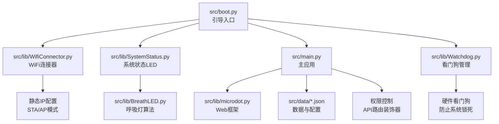

**图表来源**
- [src/boot.py](file://src/boot.py#L1-L153)
- [src/main.py](file://src/main.py#L1-L1789)
- [src/lib/WifiConnector.py](file://src/lib/WifiConnector.py#L1-L1019)
- [src/lib/SystemStatus.py](file://src/lib/SystemStatus.py#L1-L146)
- [src/lib/BreathLED.py](file://src/lib/BreathLED.py#L1-L347)
- [src/lib/Watchdog.py](file://src/lib/Watchdog.py#L1-L119)

**章节来源**
- [src/boot.py](file://src/boot.py#L1-L153)
- [src/main.py](file://src/main.py#L1-L1789)

## 核心组件
- CPU频率设置：引导阶段将CPU频率提升至240 MHz，以获得更佳性能
- 配置加载：从 src/data/config.json 读取WiFi、AP和看门狗配置，若缺失则跳过相应功能
- WiFi连接器：封装连接、重连、热点创建、状态查询等能力，支持静态IP配置和致命错误检测
- 看门狗管理：实现硬件看门狗机制，防止系统锁死，支持动态超时配置
- 状态指示：通过 SystemStatus 控制单LED呼吸周期，区分连接中、AP模式、运行中三种状态，具备性能优化和自动关闭功能
- 主应用启动：引导完成后导入 main 并运行Web服务，集成定时喂狗器和权限控制系统
- **新增** 权限控制：通过API路由装饰器实现统一的权限验证和访问控制

**更新** 核心组件现在包括集成的看门狗安全机制，能够在系统长时间无响应时自动重启，以及增强的WiFi连接稳定性，能够智能识别致命错误并停止不必要的重试。系统状态LED经过优化，增加了性能配置和自动关闭功能，权限控制系统提供了API级别的安全防护。

**章节来源**
- [src/boot.py](file://src/boot.py#L8-L153)
- [src/lib/WifiConnector.py](file://src/lib/WifiConnector.py#L1-L1019)
- [src/lib/SystemStatus.py](file://src/lib/SystemStatus.py#L1-L146)
- [src/lib/Watchdog.py](file://src/lib/Watchdog.py#L1-L119)
- [src/main.py](file://src/main.py#L51-L65)

## 架构总览
引导系统以 src/boot.py 为核心，串联配置加载、WiFi连接、AP模式、看门狗管理和主应用启动。其关键流程如下：

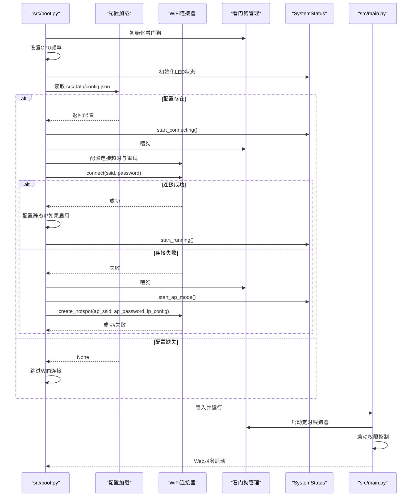

**图表来源**
- [src/boot.py](file://src/boot.py#L13-L153)
- [src/lib/WifiConnector.py](file://src/lib/WifiConnector.py#L315-L375)
- [src/lib/Watchdog.py](file://src/lib/Watchdog.py#L57-L80)
- [src/lib/SystemStatus.py](file://src/lib/SystemStatus.py#L33-L46)

## 详细组件分析

### 引导流程与状态指示
- CPU频率设置：在引导初期设置为240 MHz，并打印当前频率
- 看门狗初始化：在引导开始时初始化看门狗，支持从配置文件加载超时设置
- LED初始化：SystemStatus 在GPIO 15上初始化单LED呼吸，周期分别为快速（连接中）、中速（AP模式）、极慢（运行中），具备性能优化和自动关闭功能
- 配置加载：尝试读取 src/data/config.json，若失败则记录错误并跳过连接
- WiFi连接：若配置中SSID仍为占位符，则直接进入AP模式；否则使用 WifiConnector 进行连接，设置较长超时与重试次数
- **新增** 看门狗集成：在每次连接尝试前和关键节点喂狗，确保系统不会因长时间阻塞而锁死
- **新增** 致命错误检测：连接失败时检查是否为密码错误或找不到AP等致命错误，避免无意义的重试
- AP模式：若连接失败，启动热点，使用自定义IP段，打印启动信息
- 主应用启动：导入 main 并运行Web服务，同时根据当前网络模式设置LED状态

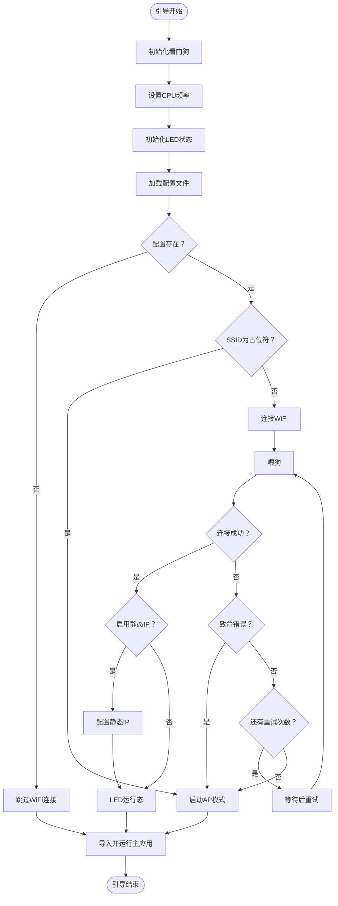

**图表来源**
- [src/boot.py](file://src/boot.py#L13-L153)
- [src/lib/SystemStatus.py](file://src/lib/SystemStatus.py#L33-L46)

**章节来源**
- [src/boot.py](file://src/boot.py#L13-L153)
- [src/lib/SystemStatus.py](file://src/lib/SystemStatus.py#L1-L146)

### 看门狗安全机制
- **硬件看门狗**：集成ESP32硬件看门狗，防止系统长时间无响应导致锁死
- **配置管理**：支持从配置文件加载看门狗启用状态和超时时间，超时范围10-300秒
- **定时喂狗**：在引导程序的关键节点和主应用运行期间定期喂狗
- **单例模式**：看门狗采用单例模式，确保全局唯一实例
- **自动重启**：当系统超过设定超时时间未喂狗时，硬件看门狗会自动重启系统
- **多点监控**：引导程序在连接尝试、AP启动、主应用启动等关键节点都进行喂狗操作

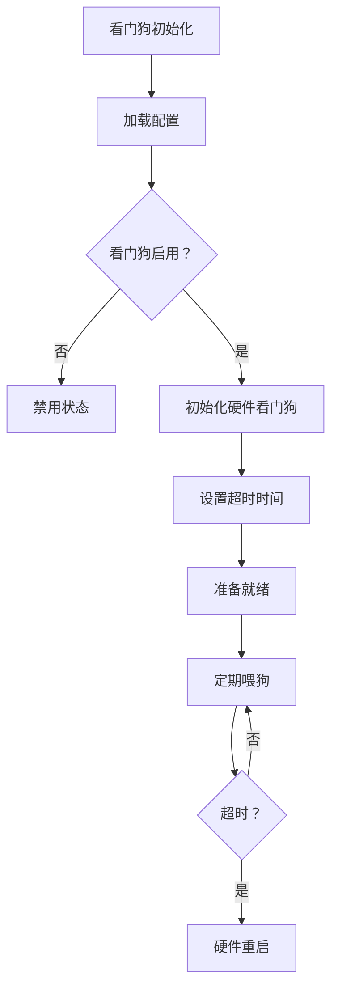

**图表来源**
- [src/lib/Watchdog.py](file://src/lib/Watchdog.py#L42-L80)
- [src/lib/Watchdog.py](file://src/lib/Watchdog.py#L82-L101)

**章节来源**
- [src/lib/Watchdog.py](file://src/lib/Watchdog.py#L1-L119)

### WiFi连接与重试机制
- 超时与重试：引导阶段将连接超时设为30秒，最大重试5次
- **新增** 致命错误检测：连接失败时检查是否为密码错误或找不到AP，若是则停止重试
- **新增** WiFi模块重置：多次重连失败时自动重置WiFi模块，解决固件问题
- 连接循环：逐次尝试，失败时打印错误并短暂等待后重试
- 失败回退：全部失败后进入AP模式
- **增强** 静态IP集成：连接成功后自动配置静态IP（如果配置中启用）
- 连接器能力：WifiConnector 提供参数校验、状态描述、错误记录、自动重连、热点创建、IP配置等

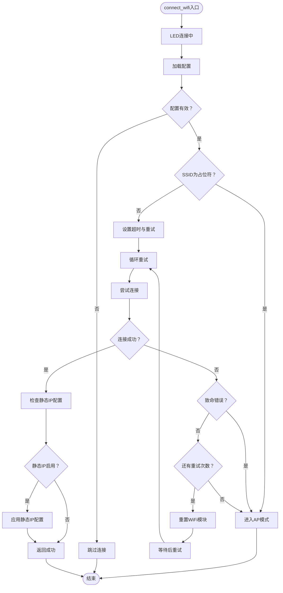

**图表来源**
- [src/boot.py](file://src/boot.py#L28-L104)
- [src/lib/WifiConnector.py](file://src/lib/WifiConnector.py#L315-L375)

**章节来源**
- [src/boot.py](file://src/boot.py#L28-L104)
- [src/lib/WifiConnector.py](file://src/lib/WifiConnector.py#L1-L1019)

### AP模式启动与热点配置
- AP参数：从配置读取SSID与密码，若缺失使用默认值
- **增强** IP配置：使用自定义IP段（网关与DNS指向同一地址），支持静态IP配置
- **新增** STA接口管理：启动AP前先关闭STA接口，确保AP能正常启动
- 启动流程：激活AP接口、配置认证模式（开放或WPA2）、应用IP配置、记录信息
- 信息查询：提供热点完整信息与客户端数量查询

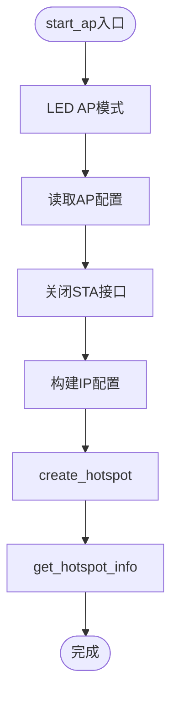

**图表来源**
- [src/boot.py](file://src/boot.py#L106-L129)
- [src/lib/WifiConnector.py](file://src/lib/WifiConnector.py#L610-L676)

**章节来源**
- [src/boot.py](file://src/boot.py#L106-L129)
- [src/lib/WifiConnector.py](file://src/lib/WifiConnector.py#L610-L763)

### 主应用启动与状态联动
- 导入与运行：引导完成后导入 main 并运行Web服务
- **新增** 定时喂狗器：启动后启动定时喂狗器，每30秒喂狗一次
- **新增** 权限控制系统：通过API路由装饰器实现统一的权限验证
- 状态联动：根据当前网络模式（STA/AP）设置LED状态
- 系统状态：打印系统状态（WiFi IP、内存等）

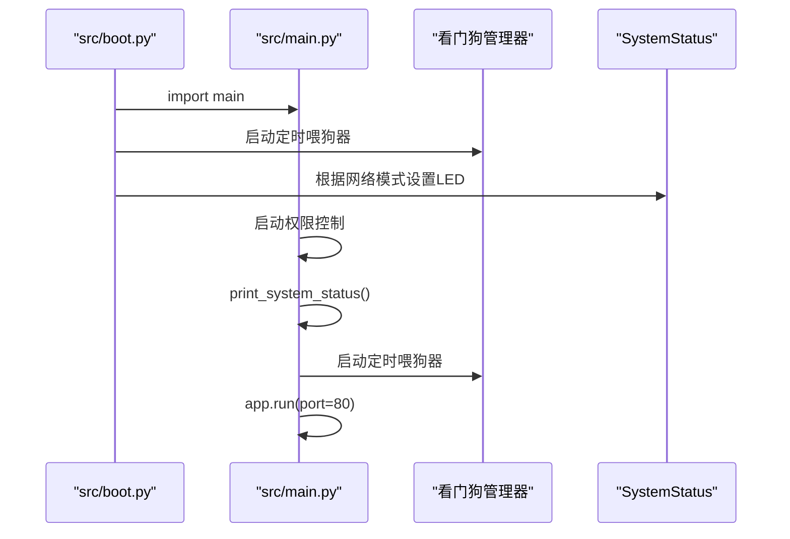

**图表来源**
- [src/boot.py](file://src/boot.py#L130-L153)
- [src/main.py](file://src/main.py#L39-L48)

**章节来源**
- [src/boot.py](file://src/boot.py#L130-L153)
- [src/main.py](file://src/main.py#L1-L1789)

### 状态指示逻辑（LED）
- 快速呼吸：连接中（GPIO 15）
- 中速呼吸：AP模式
- 极慢呼吸：运行中（WiFi连接成功）
- **新增** 性能优化：通过UPDATE_INTERVAL_MIN和UPDATE_INTERVAL_DIVISOR参数平衡视觉效果与CPU占用
- **新增** 自动关闭：连接成功后1分钟自动关闭LED，节省CPU资源

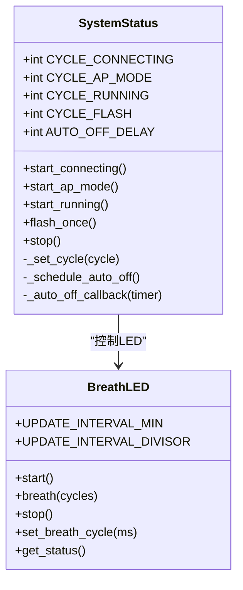

**图表来源**
- [src/lib/SystemStatus.py](file://src/lib/SystemStatus.py#L19-L146)
- [src/lib/BreathLED.py](file://src/lib/BreathLED.py#L1-L347)

**章节来源**
- [src/lib/SystemStatus.py](file://src/lib/SystemStatus.py#L1-L146)
- [src/lib/BreathLED.py](file://src/lib/BreathLED.py#L1-L347)

### 权限控制与API安全
- **新增** API路由装饰器：通过api_route装饰器实现统一的权限验证和访问控制
- **新增** 密码验证：支持SHA256哈希密码验证，兼容旧版明文密码
- **新增** 看门狗集成：每次API请求时自动喂狗，防止系统因长时间无响应而重启
- **新增** LED反馈：API响应后LED快闪一次，提供视觉反馈
- **新增** 安全机制：通过装饰器实现请求处理前后的安全检查和状态更新

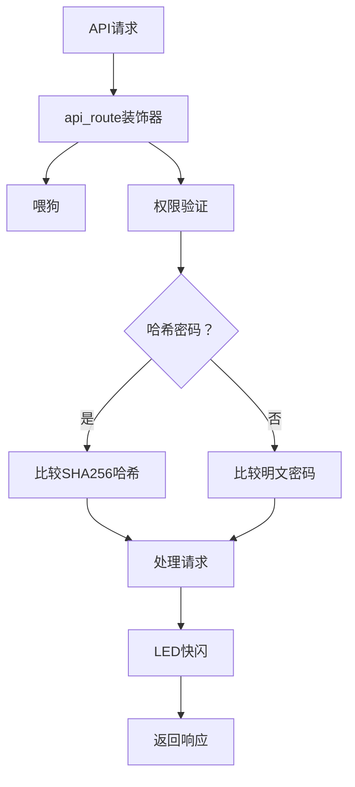

**图表来源**
- [src/main.py](file://src/main.py#L51-L65)
- [src/main.py](file://src/main.py#L74-L93)

**章节来源**
- [src/main.py](file://src/main.py#L51-L65)
- [src/main.py](file://src/main.py#L74-L93)

### 静态IP配置增强功能
**新增** 引导系统现在支持STA和AP模式的静态IP配置：

- **STA模式静态IP**：连接成功后自动配置固定IP地址
- **AP模式静态IP**：热点启动时使用自定义IP段
- **IP配置验证**：验证IP地址格式、子网掩码、网关地址的有效性
- **自动推断**：根据IP地址自动推断网关地址
- **配置持久化**：支持静态IP配置的保存和加载

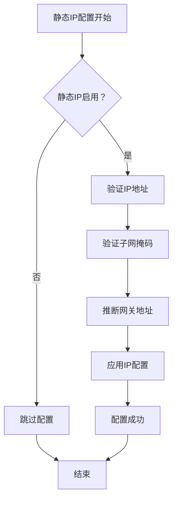

**图表来源**
- [src/boot.py](file://src/boot.py#L65-L78)
- [src/lib/WifiConnector.py](file://src/lib/WifiConnector.py#L226-L266)

**章节来源**
- [src/boot.py](file://src/boot.py#L65-L78)
- [src/lib/WifiConnector.py](file://src/lib/WifiConnector.py#L226-L266)

## 依赖关系分析
- src/boot.py 依赖：
  - src/lib/WifiConnector.py：WiFi连接与热点管理，支持静态IP配置和致命错误检测
  - src/lib/SystemStatus.py：LED状态控制，具备性能优化和自动关闭功能
  - src/lib/Watchdog.py：硬件看门狗管理
  - src/data/config.json：WiFi、AP和看门狗配置
- src/main.py 依赖：
  - src/lib/microdot.py：Web框架
  - src/lib/Watchdog.py：定时喂狗器
  - src/lib/SystemStatus.py：LED状态控制
  - src/data/*.json：业务数据与系统设置

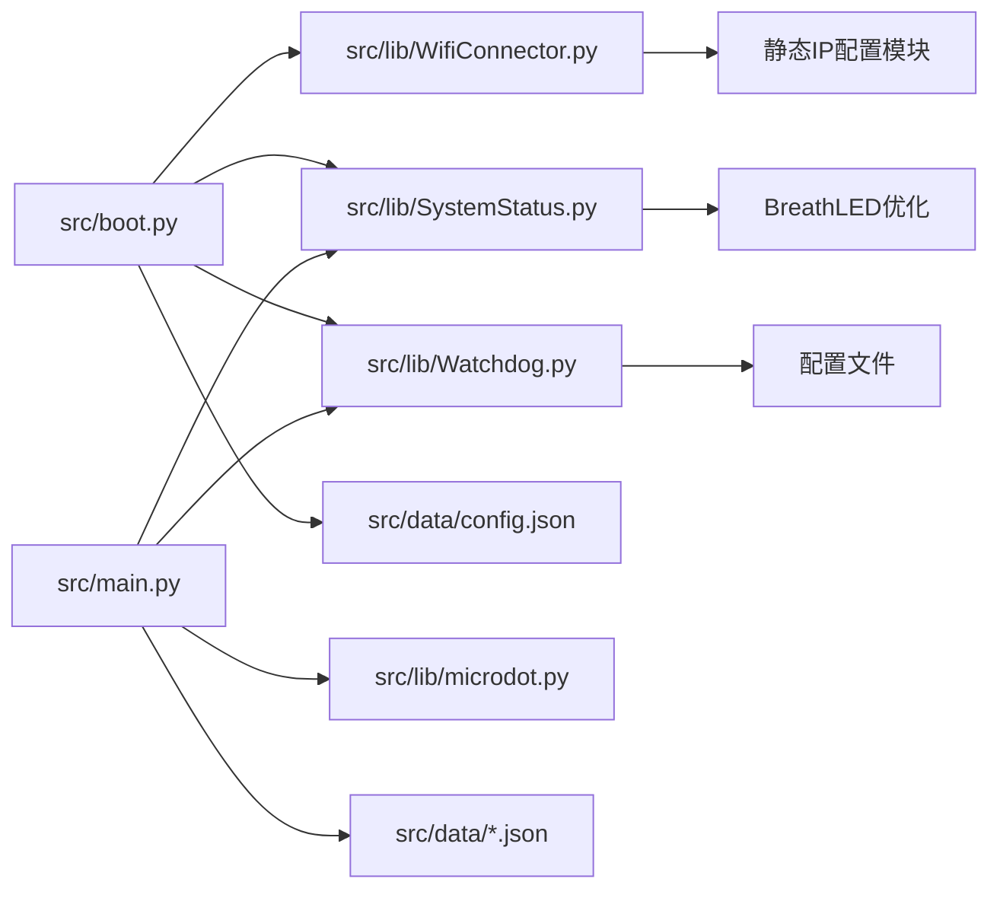

**图表来源**
- [src/boot.py](file://src/boot.py#L1-L153)
- [src/main.py](file://src/main.py#L1-L1789)

**章节来源**
- [src/boot.py](file://src/boot.py#L1-L153)
- [src/main.py](file://src/main.py#L1-L1789)

## 性能考量
- CPU频率：引导阶段提升至240 MHz，有助于更快完成网络初始化与后续任务
- LED更新：BreathLED 的更新间隔与周期可调，兼顾视觉效果与CPU占用，SystemStatus中增加了性能优化配置
- 连接超时与重试：引导阶段适度延长超时与重试次数，提升在弱信号或繁忙网络下的成功率
- **新增** 看门狗机制：硬件看门狗提供可靠的系统保护，防止死锁和无限阻塞，在多个关键节点进行喂狗操作
- **新增** 定时喂狗器：主应用启动后每30秒喂狗一次，确保长时间运行的稳定性
- **新增** 致命错误检测：避免对无法连接的网络进行无意义的重试，节省系统资源
- **新增** WiFi模块重置：当连接问题持续出现时自动重置WiFi模块，恢复网络功能
- **新增** 权限控制优化：API路由装饰器提供高效的权限验证机制，减少重复代码
- **新增** LED节能策略：连接成功后1分钟自动关闭LED，节省CPU资源
- 静态IP配置：IP地址验证和推断功能在连接成功后执行，不影响主要启动流程
- 资源清理：WiFi连接器提供清理与断开能力，避免资源泄漏

**章节来源**
- [src/boot.py](file://src/boot.py#L10-L153)
- [src/lib/WifiConnector.py](file://src/lib/WifiConnector.py#L1-L1019)
- [src/lib/Watchdog.py](file://src/lib/Watchdog.py#L1-L119)
- [src/lib/SystemStatus.py](file://src/lib/SystemStatus.py#L21-L26)
- [src/lib/BreathLED.py](file://src/lib/BreathLED.py#L1-L347)
- [src/main.py](file://src/main.py#L51-L65)

## 故障排查指南
- 配置缺失或格式错误
  - 现象：引导跳过WiFi连接
  - 处理：检查 src/data/config.json 是否存在且格式正确
  - 参考路径：[src/boot.py](file://src/boot.py#L19-L26)
- WiFi连接失败
  - 现象：多次重试后进入AP模式
  - 处理：确认SSID/密码正确、信号强度足够；查看 WifiConnector 的错误信息
  - **新增** 致命错误：检查是否为密码错误或找不到AP，这些错误会停止重试
  - 参考路径：[src/boot.py](file://src/boot.py#L53-L104)、[src/lib/WifiConnector.py](file://src/lib/WifiConnector.py#L347-L355)
- **新增** 看门狗相关问题
  - 现象：系统频繁重启或无法启动
  - 处理：检查配置文件中的 watchdog_enabled 和 watchdog_timeout 设置；查看看门狗初始化日志
  - 参考路径：[src/lib/Watchdog.py](file://src/lib/Watchdog.py#L42-L55)、[src/lib/Watchdog.py](file://src/lib/Watchdog.py#L72-L80)
- **新增** 定时喂狗器问题
  - 现象：主应用运行一段时间后系统重启
  - 处理：检查定时喂狗器是否正确启动；确认看门狗启用状态
  - 参考路径：[src/main.py](file://src/main.py#L39-L48)、[src/main.py](file://src/main.py#L27-L29)
- **新增** WiFi模块重置问题
  - 现象：连接问题持续存在，多次重试无效
  - 处理：检查WiFi模块重置逻辑是否正常工作；查看重置后的连接尝试
  - 参考路径：[src/lib/WifiConnector.py](file://src/lib/WifiConnector.py#L325-L327)
- **新增** 静态IP配置失败
  - 现象：连接成功但静态IP配置失败
  - 处理：检查配置中的IP地址、子网掩码、网关格式是否正确；查看引导日志中的错误信息
  - 参考路径：[src/boot.py](file://src/boot.py#L65-L78)、[src/lib/WifiConnector.py](file://src/lib/WifiConnector.py#L226-L266)
- **新增** 权限控制问题
  - 现象：API请求被拒绝或权限验证失败
  - 处理：检查密码哈希配置；确认api_route装饰器正确使用；验证盐值设置
  - 参考路径：[src/main.py](file://src/main.py#L51-L65)、[src/main.py](file://src/main.py#L74-L93)
- **新增** LED性能问题
  - 现象：LED闪烁异常或CPU占用过高
  - 处理：检查SystemStatus的性能优化配置；确认UPDATE_INTERVAL_MIN和UPDATE_INTERVAL_DIVISOR设置合理
  - 参考路径：[src/lib/SystemStatus.py](file://src/lib/SystemStatus.py#L21-L26)、[src/lib/BreathLED.py](file://src/lib/BreathLED.py#L20-L21)
- **新增** LED自动关闭问题
  - 现象：LED在连接成功后立即关闭
  - 处理：检查AUTO_OFF_DELAY配置；确认LED状态切换逻辑正常
  - 参考路径：[src/lib/SystemStatus.py](file://src/lib/SystemStatus.py#L34-L36)
- AP模式启动失败
  - 现象：热点创建失败
  - 处理：检查AP配置、IP段合法性；查看 WifiConnector 的错误信息
  - **新增** STA接口管理：确认STA接口已正确关闭
  - 参考路径：[src/boot.py](file://src/boot.py#L93-L104)、[src/lib/WifiConnector.py](file://src/lib/WifiConnector.py#L634-L676)
- LED无响应
  - 现象：LED不闪烁
  - 处理：确认GPIO 15可用、SystemStatus 初始化成功；检查 BreathLED 的硬件初始化
  - **新增** 性能优化：检查UPDATE_INTERVAL_MIN和UPDATE_INTERVAL_DIVISOR配置
  - 参考路径：[src/lib/SystemStatus.py](file://src/lib/SystemStatus.py#L40-L46)、[src/lib/BreathLED.py](file://src/lib/BreathLED.py#L228-L244)
- 主应用无法启动
  - 现象：引导结束后Web服务未运行
  - 处理：检查 main.py 导入与运行逻辑；查看引导日志与异常
  - **新增** 定时喂狗器：确认定时喂狗器已正确启动
  - **新增** 权限控制：确认API路由装饰器正确初始化
  - 参考路径：[src/boot.py](file://src/boot.py#L130-L153)、[src/main.py](file://src/main.py#L1-L1789)

**章节来源**
- [src/boot.py](file://src/boot.py#L19-L26)
- [src/boot.py](file://src/boot.py#L53-L104)
- [src/lib/Watchdog.py](file://src/lib/Watchdog.py#L42-L55)
- [src/lib/Watchdog.py](file://src/lib/Watchdog.py#L72-L80)
- [src/main.py](file://src/main.py#L39-L48)
- [src/lib/WifiConnector.py](file://src/lib/WifiConnector.py#L325-L327)
- [src/boot.py](file://src/boot.py#L65-L78)
- [src/lib/WifiConnector.py](file://src/lib/WifiConnector.py#L226-L266)
- [src/main.py](file://src/main.py#L51-L65)
- [src/main.py](file://src/main.py#L74-L93)
- [src/lib/SystemStatus.py](file://src/lib/SystemStatus.py#L21-L26)
- [src/lib/BreathLED.py](file://src/lib/BreathLED.py#L228-L244)
- [src/main.py](file://src/main.py#L1-L1789)

## 结论
引导系统通过明确的启动步骤、完善的异常处理与可视化状态指示，实现了从硬件初始化到主应用运行的平滑过渡。其关键优势在于：
- 可靠的WiFi连接与AP回退策略
- 清晰的状态指示与调试日志
- 可扩展的配置与模块化设计
- **新增** 集成看门狗安全机制，提供硬件级系统保护
- **新增** 改进的WiFi连接稳定性，智能检测致命错误并优化重试策略
- **新增** 支持STA和AP模式的静态IP配置，提供更稳定的网络连接
- **新增** 系统状态LED优化，具备性能优化和自动关闭功能
- **新增** 权限控制系统，通过API路由装饰器实现统一的安全防护

**更新** 本次增强显著提升了系统的安全性和稳定性，看门狗机制提供了硬件级的系统保护，致命错误检测和WiFi模块重置功能大幅改善了连接可靠性，特别是在需要固定IP地址的企业网络环境中。系统状态LED经过优化，不仅提供了更好的视觉效果，还具备了节能特性。权限控制系统的引入为Web服务提供了多层次的安全保障。

## 附录

### 配置文件说明
- src/data/config.json
  - 字段：wifi_ssid、wifi_password、ap_ssid、ap_password、sta_use_static_ip、sta_ip、sta_subnet、sta_gateway、sta_dns、ap_ip、watchdog_enabled、watchdog_timeout
  - 作用：WiFi、AP、静态IP和看门狗配置
  - 参考路径：[src/data/config.json](file://src/data/config.json#L1-L1)

**新增** 看门狗配置选项：
- `watchdog_enabled`：启用看门狗机制（默认true）
- `watchdog_timeout`：看门狗超时时间（10-300秒，默认300秒）

**新增** 静态IP配置选项：
- `sta_use_static_ip`：启用STA模式静态IP配置
- `sta_ip`：STA模式静态IP地址
- `sta_subnet`：STA模式子网掩码
- `sta_gateway`：STA模式网关地址
- `sta_dns`：STA模式DNS服务器地址

**新增** 系统状态LED配置选项：
- `UPDATE_INTERVAL_MIN`：LED更新间隔最小值（默认30ms）
- `UPDATE_INTERVAL_DIVISOR`：LED更新间隔除数（默认40）
- `AUTO_OFF_DELAY`：LED自动关闭延迟（默认60000ms）

### 关键实现路径参考
- 引导流程与LED控制：[src/boot.py](file://src/boot.py#L13-L153)、[src/lib/SystemStatus.py](file://src/lib/SystemStatus.py#L1-L146)
- 看门狗管理：[src/lib/Watchdog.py](file://src/lib/Watchdog.py#L42-L101)
- WiFi连接与AP模式：[src/lib/WifiConnector.py](file://src/lib/WifiConnector.py#L315-L375)、[src/lib/WifiConnector.py](file://src/lib/WifiConnector.py#L610-L676)
- 静态IP配置管理：[src/lib/WifiConnector.py](file://src/lib/WifiConnector.py#L226-L266)、[src/lib/WifiConnector.py](file://src/lib/WifiConnector.py#L498-L527)
- 主应用启动与状态打印：[src/main.py](file://src/main.py#L39-L48)、[src/main.py](file://src/main.py#L1-L1789)
- **新增** 权限控制与API安全：[src/main.py](file://src/main.py#L51-L65)、[src/main.py](file://src/main.py#L74-L93)
- **新增** LED性能优化：[src/lib/SystemStatus.py](file://src/lib/SystemStatus.py#L21-L26)、[src/lib/BreathLED.py](file://src/lib/BreathLED.py#L20-L21)