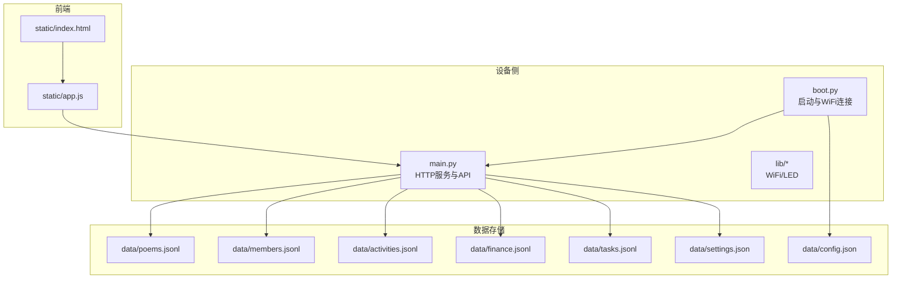
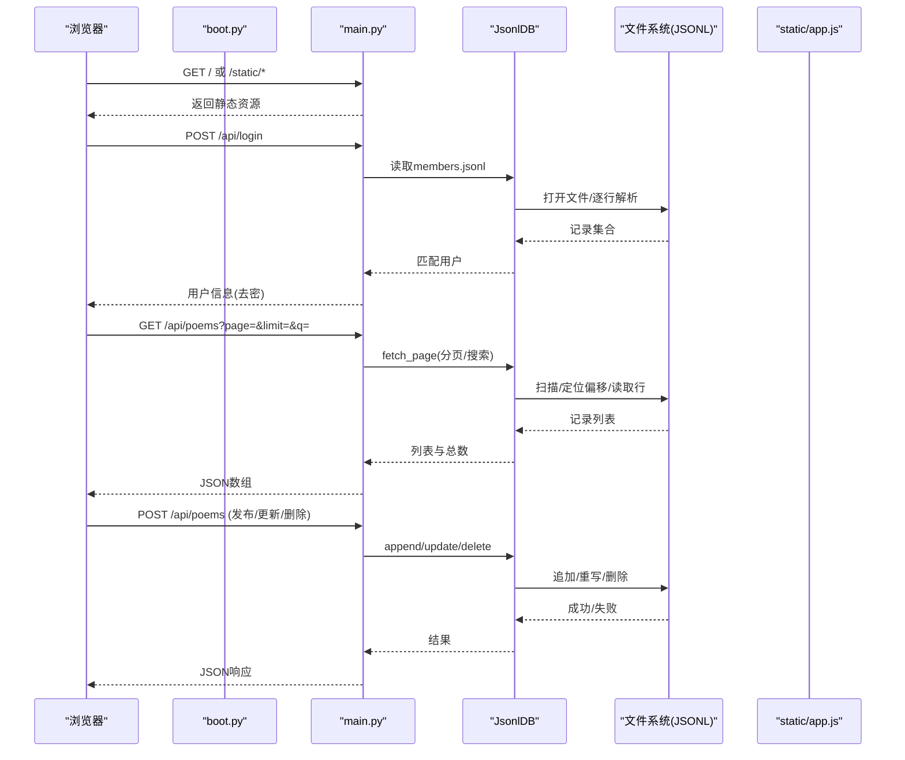
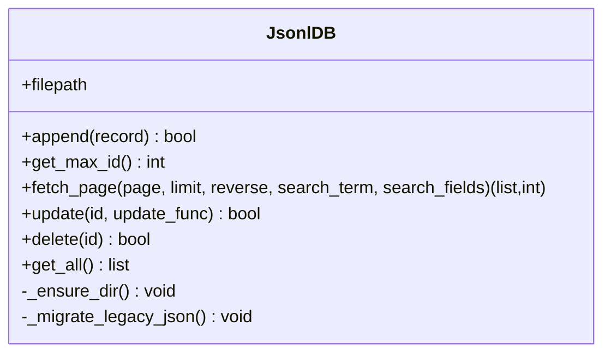
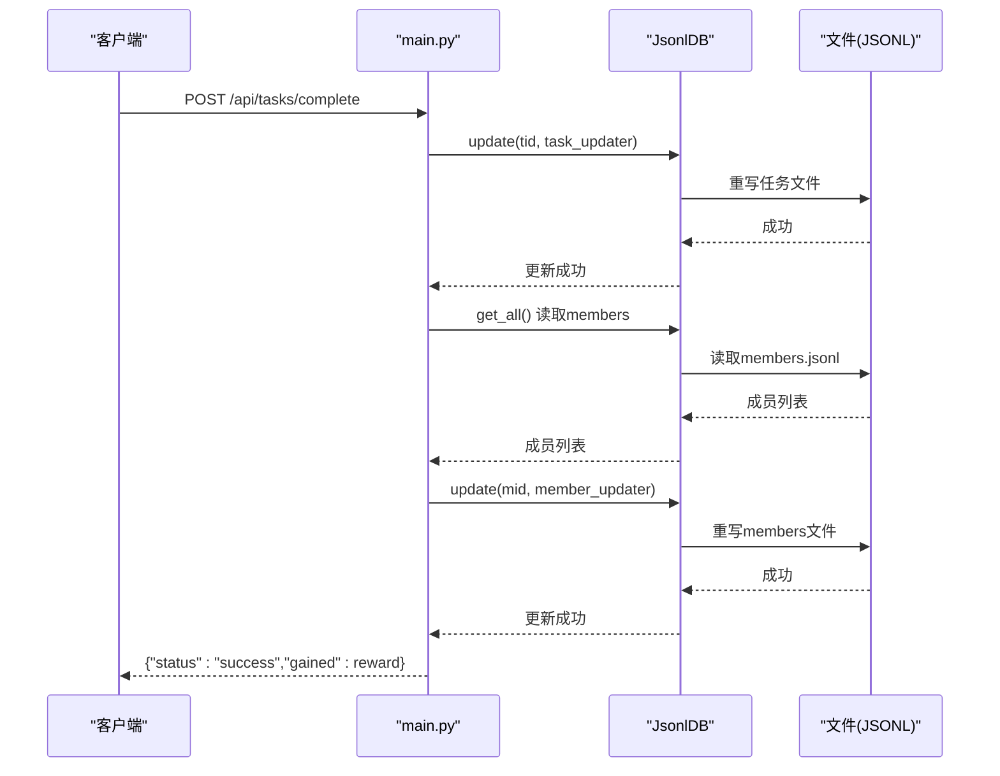
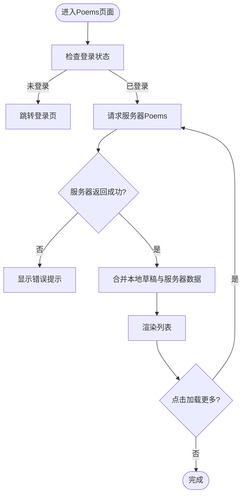
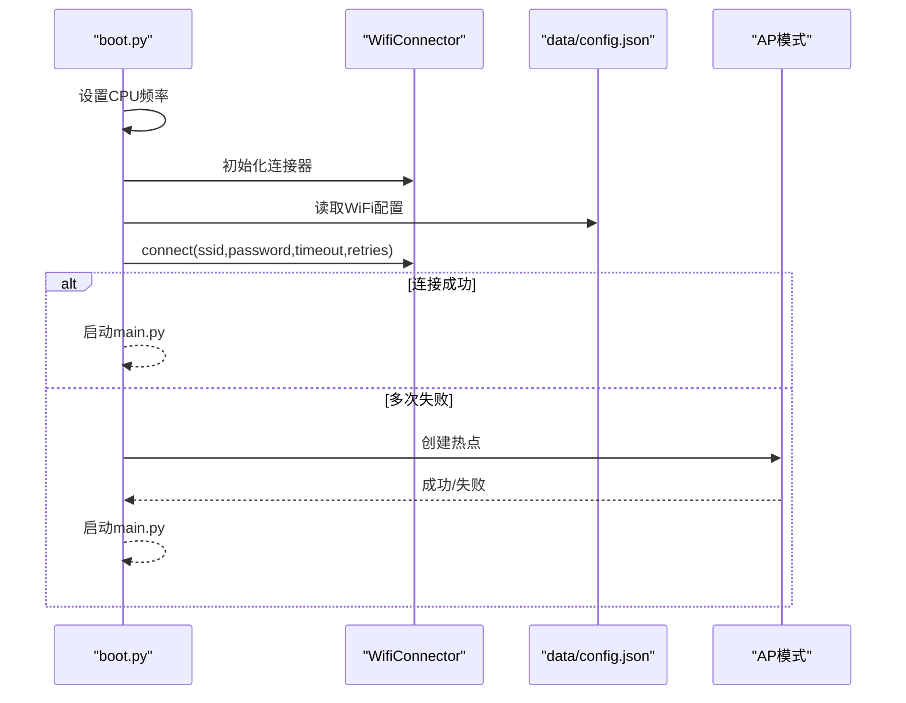
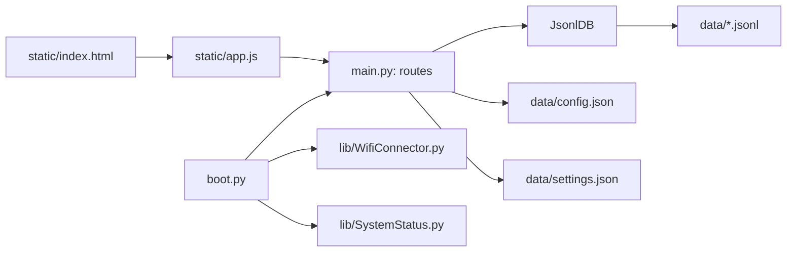

# 数据流架构

<cite>
**本文引用的文件**
- [main.py](file://main.py)
- [boot.py](file://boot.py)
- [data/config.json](file://data/config.json)
- [data/settings.json](file://data/settings.json)
- [static/app.js](file://static/app.js)
- [static/index.html](file://static/index.html)
- [lib/WifiConnector.py](file://lib/WifiConnector.py)
- [lib/SystemStatus.py](file://lib/SystemStatus.py)
- [data/poems.jsonl](file://data/poems.jsonl)
- [data/members.jsonl](file://data/members.jsonl)
- [data/activities.jsonl](file://data/activities.jsonl)
- [data/tasks.jsonl](file://data/tasks.jsonl)
- [data/finance.jsonl](file://data/finance.jsonl)
</cite>

## 目录
1. [简介](#简介)
2. [项目结构](#项目结构)
3. [核心组件](#核心组件)
4. [架构总览](#架构总览)
5. [详细组件分析](#详细组件分析)
6. [依赖关系分析](#依赖关系分析)
7. [性能考量](#性能考量)
8. [故障排查指南](#故障排查指南)
9. [结论](#结论)
10. [附录](#附录)

## 简介
本文件面向“围炉诗社·理事台”项目，系统梳理从用户请求到数据处理再到响应返回的完整数据流，重点覆盖：
- 请求解析与路由分发
- 业务逻辑处理与跨表联动
- JSONL文件存储系统的数据流向、缓存策略与一致性保证
- 配置文件加载顺序、优先级与热更新机制
- 数据流图、状态转换图与性能瓶颈分析
- 数据流优化与监控最佳实践

## 项目结构
项目采用“嵌入式Web服务 + 本地JSONL数据库”的轻量架构：
- 启动层：boot.py 负责WiFi连接与应用启动
- 服务层：main.py 提供HTTP API与前端静态资源
- 前端层：static/ 下的HTML/CSS/JS
- 存储层：data/ 下的JSONL文件与settings.json
- 外设与状态：lib/ 下的WiFi与LED状态指示

图表来源
- [boot.py](file://boot.py#L1-L122)
- [main.py](file://main.py#L1-L548)
- [static/index.html](file://static/index.html#L1-L269)
- [static/app.js](file://static/app.js#L1-L800)
- [data/config.json](file://data/config.json#L1-L6)
- [data/settings.json](file://data/settings.json#L1-L1)
- [data/poems.jsonl](file://data/poems.jsonl#L1-L4)
- [data/members.jsonl](file://data/members.jsonl#L1-L4)
- [data/activities.jsonl](file://data/activities.jsonl#L1-L7)
- [data/tasks.jsonl](file://data/tasks.jsonl#L1-L2)
- [data/finance.jsonl](file://data/finance.jsonl#L1-L3)

章节来源
- [boot.py](file://boot.py#L1-L122)
- [main.py](file://main.py#L1-L548)
- [static/index.html](file://static/index.html#L1-L269)
- [static/app.js](file://static/app.js#L1-L800)
- [data/config.json](file://data/config.json#L1-L6)
- [data/settings.json](file://data/settings.json#L1-L1)

## 核心组件
- HTTP服务与路由：基于Microdot框架，提供静态资源与REST API
- JSONL数据库：封装文件读写、分页、搜索、更新与删除
- 前端应用：SPA页面，使用IndexedDB做本地草稿缓存
- 配置与状态：WiFi配置、系统LED状态指示
- 数据模型：poems、members、activities、finance、tasks

章节来源
- [main.py](file://main.py#L17-L548)
- [static/app.js](file://static/app.js#L1-L800)
- [lib/WifiConnector.py](file://lib/WifiConnector.py#L1-L800)
- [lib/SystemStatus.py](file://lib/SystemStatus.py#L1-L61)

## 架构总览
整体数据流从浏览器发起HTTP请求，经由boot.py引导启动，main.py解析请求并路由到对应API，API调用JsonlDB进行文件读写，最终返回JSON响应。前端通过app.js与API交互，同时利用IndexedDB进行本地草稿持久化。

图表来源
- [main.py](file://main.py#L299-L548)
- [static/app.js](file://static/app.js#L165-L402)
- [data/poems.jsonl](file://data/poems.jsonl#L1-L4)

## 详细组件分析

### 组件A：JsonlDB（JSONL数据库）
- 设计目标：以纯文本行记录形式存储，支持追加、分页、搜索、更新（重写）、删除（重写）
- 关键能力
  - 追加：每次写入一行JSON，适合写多读少场景
  - 分页：扫描文件记录行偏移，支持倒序（最新在前）
  - 搜索：全量扫描匹配（适用于中小规模数据）
  - 更新/删除：通过临时文件重写实现，保证原子性
  - 兼容迁移：若缺失.jsonl则尝试迁移.json
- 复杂度与性能
  - 分页：O(n)扫描，n为文件行数；通过偏移定位减少重复读取
  - 搜索：O(n*m)，m为字段数量；建议限制搜索范围或字段
  - 更新/删除：O(n)重写；大文件慎用
- 一致性与并发
  - 单进程写入，避免并发冲突
  - 重写过程使用临时文件，失败时清理临时文件，降低损坏风险

图表来源
- [main.py](file://main.py#L53-L267)

章节来源
- [main.py](file://main.py#L53-L267)

### 组件B：API控制器（Poems/Members/Activities/Finance/Tasks）
- Poems API
  - GET /api/poems：分页+可选全文搜索，支持URL解码查询参数
  - POST /api/poems：新增作品，自增id与默认日期
  - POST /api/poems/update：按id更新字段
  - POST /api/poems/delete：按id删除
- Members API
  - GET /api/members：一次性返回全部成员（适合小数据集）
  - POST /api/members：新增成员，校验手机号唯一
  - POST /api/members/update：按id更新字段
  - POST /api/members/delete：按id删除
- Activities API
  - GET /api/activities：分页+可选搜索
  - POST /api/activities：新增活动
  - POST /api/activities/update：按id更新字段
  - POST /api/activities/delete：按id删除
- Finance API
  - GET /api/finance：最近若干条记录
  - POST /api/finance：新增财务记录
- Tasks API
  - GET /api/tasks：一次性返回全部任务
  - POST /api/tasks/complete：完成任务并给成员加分（跨表联动）

图表来源
- [main.py](file://main.py#L410-L450)

章节来源
- [main.py](file://main.py#L309-L450)

### 组件C：前端应用（SPA + IndexedDB本地草稿）
- 登录与导航：登录成功后切换主界面，按需拉取数据
- 分页与搜索：支持分页加载与关键词搜索
- 本地草稿：首次加载合并本地IndexedDB草稿与服务器数据
- 发布/更新/撤回：发布成功后删除本地草稿；撤回时先保存为本地草稿再删除服务器记录

图表来源
- [static/app.js](file://static/app.js#L165-L212)

章节来源
- [static/app.js](file://static/app.js#L1-L800)
- [static/index.html](file://static/index.html#L1-L269)

### 组件D：配置与启动（boot.py + WiFi）
- 启动流程：设置CPU频率、初始化WiFi连接器、加载config.json、尝试连接WiFi，失败则进入AP模式
- WiFi连接器：支持扫描、连接、断开、重连、静态IP配置、网络信息同步
- LED状态：根据连接状态切换呼吸周期

图表来源
- [boot.py](file://boot.py#L14-L89)
- [lib/WifiConnector.py](file://lib/WifiConnector.py#L595-L800)

章节来源
- [boot.py](file://boot.py#L1-L122)
- [lib/WifiConnector.py](file://lib/WifiConnector.py#L1-L800)
- [lib/SystemStatus.py](file://lib/SystemStatus.py#L1-L61)

### 组件E：数据模型与一致性
- Poems：作者、类型、内容、日期、id、标题
- Members：id、手机号、姓名、密码、昵称、角色、积分、加入日期、自定义字段
- Activities：标题、描述、日期、地点、状态、发布者
- Finance：金额、摘要、日期、类型(income/expense)、分类、经办人
- Tasks：标题、描述、状态(open/completed)、奖励、经办人

一致性保障策略
- 写入：append为追加写，写入失败不影响已有记录
- 更新/删除：通过临时文件重写，失败时清理临时文件，避免半写入
- 跨表联动：任务完成时先更新任务，再更新成员积分，失败时可回滚（建议在应用层记录变更日志）

章节来源
- [data/poems.jsonl](file://data/poems.jsonl#L1-L4)
- [data/members.jsonl](file://data/members.jsonl#L1-L4)
- [data/activities.jsonl](file://data/activities.jsonl#L1-L7)
- [data/finance.jsonl](file://data/finance.jsonl#L1-L3)
- [data/tasks.jsonl](file://data/tasks.jsonl#L1-L2)

## 依赖关系分析
- main.py 依赖 Microdot、os、gc、network、json、time 等
- boot.py 依赖 lib.WifiConnector 与 lib.SystemStatus
- 前端通过 /static/* 提供静态资源
- API依赖JsonlDB与data目录下的JSONL文件

图表来源
- [main.py](file://main.py#L1-L548)
- [boot.py](file://boot.py#L1-L122)
- [static/app.js](file://static/app.js#L1-L800)
- [static/index.html](file://static/index.html#L1-L269)
- [lib/WifiConnector.py](file://lib/WifiConnector.py#L1-L800)
- [lib/SystemStatus.py](file://lib/SystemStatus.py#L1-L61)
- [data/config.json](file://data/config.json#L1-L6)
- [data/settings.json](file://data/settings.json#L1-L1)

章节来源
- [main.py](file://main.py#L1-L548)
- [boot.py](file://boot.py#L1-L122)

## 性能考量
- 分页与搜索
  - 分页：通过行偏移定位，避免全量读取，复杂度O(n)
  - 搜索：全量扫描，复杂度O(n*m)，建议限制字段或使用索引字段
- 更新/删除
  - 重写文件，复杂度O(n)，大文件慎用；可考虑批量写入或延迟写
- 前端缓存
  - IndexedDB本地草稿：首次加载合并，减少服务器压力
  - 局部刷新：更新/删除后局部渲染，避免整页刷新
- 存储与IO
  - JSONL逐行读写，写入频繁时注意文件系统磨损
  - 建议定期备份重要JSONL文件
- 并发与一致性
  - 单进程写入，避免并发冲突
  - 重写过程使用临时文件，失败清理，降低损坏风险

[本节为通用性能讨论，无需特定文件来源]

## 故障排查指南
- WiFi连接失败
  - 检查 data/config.json 的SSID与密码是否正确
  - 观察 boot.py 输出与LED状态指示
  - 尝试增加连接超时与重试次数
- API返回空或错误
  - 确认JSONL文件存在且格式正确
  - 检查请求参数（page/limit/q）与编码
  - 查看main.py中的异常打印
- 任务完成未加分
  - 确认任务状态为open且存在
  - 检查成员是否存在且id匹配
- 前端草稿无法保存
  - IndexedDB不可用时会降级为警告
  - 检查浏览器隐私设置与存储配额

章节来源
- [boot.py](file://boot.py#L14-L89)
- [main.py](file://main.py#L309-L450)
- [static/app.js](file://static/app.js#L343-L402)

## 结论
本项目以极简架构实现了诗社管理的核心功能：作品、活动、财务、成员与事务。通过JsonlDB与前端IndexedDB的组合，兼顾了易部署与用户体验。建议后续在以下方面持续优化：
- 对大文件引入索引或分片策略
- 在API层增加速率限制与幂等性
- 增加审计日志与增量备份
- 前端增加离线模式与冲突解决

[本节为总结性内容，无需特定文件来源]

## 附录

### 配置文件加载顺序与优先级
- 启动阶段：boot.py 读取 data/config.json，决定WiFi连接或AP模式
- 运行阶段：main.py 读取 data/settings.json，用于自定义成员字段
- 优先级：config.json影响网络可达性，settings.json影响UI与数据结构

章节来源
- [boot.py](file://boot.py#L14-L21)
- [main.py](file://main.py#L269-L277)
- [data/config.json](file://data/config.json#L1-L6)
- [data/settings.json](file://data/settings.json#L1-L1)

### 热更新机制
- 配置热更新：config.json变更后需重启应用以重新加载
- 设置热更新：settings.json变更后，main.py立即生效（GET/POST接口直接读写）
- 建议：在生产环境通过OTA或文件替换方式更新配置，确保原子性

章节来源
- [boot.py](file://boot.py#L14-L21)
- [main.py](file://main.py#L518-L526)

### 数据流优化与监控最佳实践
- 优化
  - 为高频搜索字段建立索引或缓存
  - 批量写入与延迟写策略
  - 前端分页与虚拟滚动
- 监控
  - 记录API耗时与错误率
  - 监控文件系统空间与写入失败
  - 前端IndexedDB存储上限与清理策略

[本节为通用指导，无需特定文件来源]