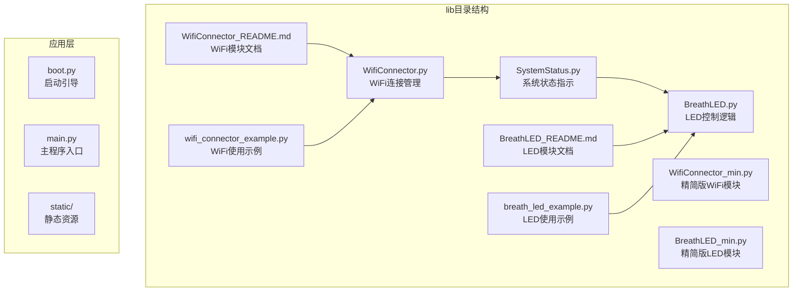
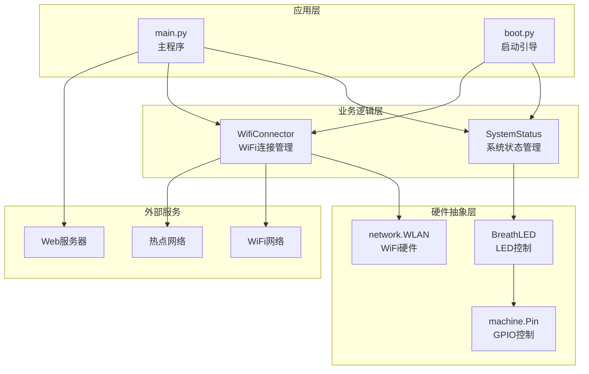
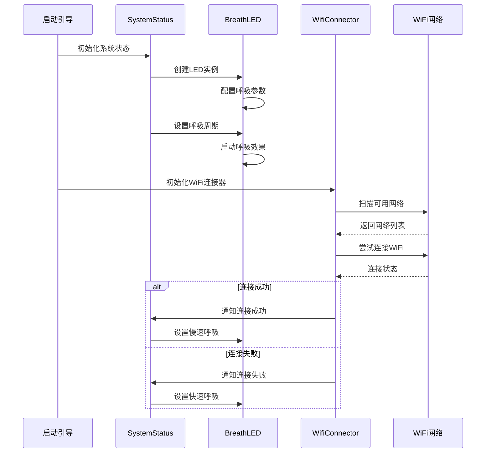
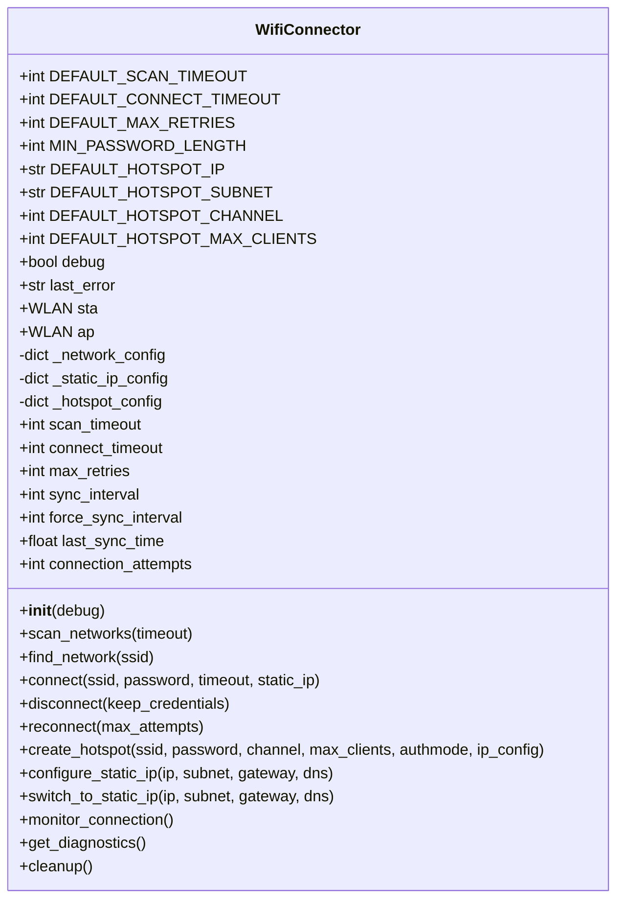
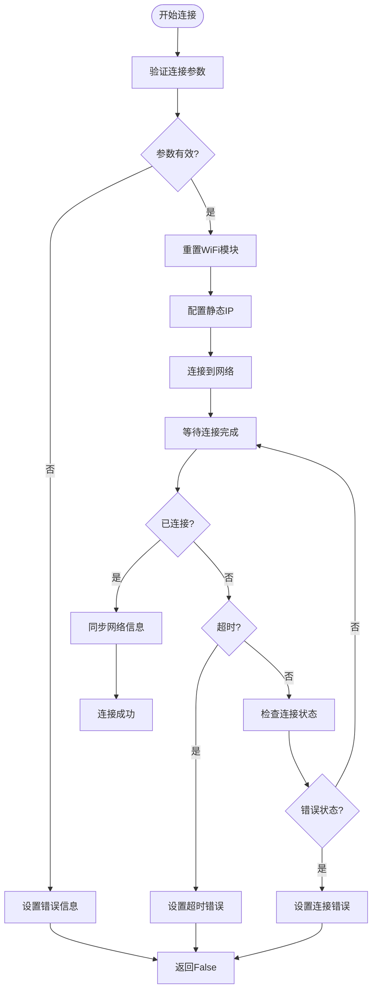
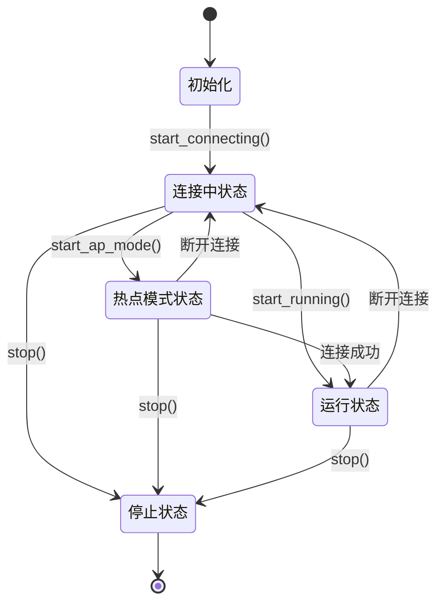
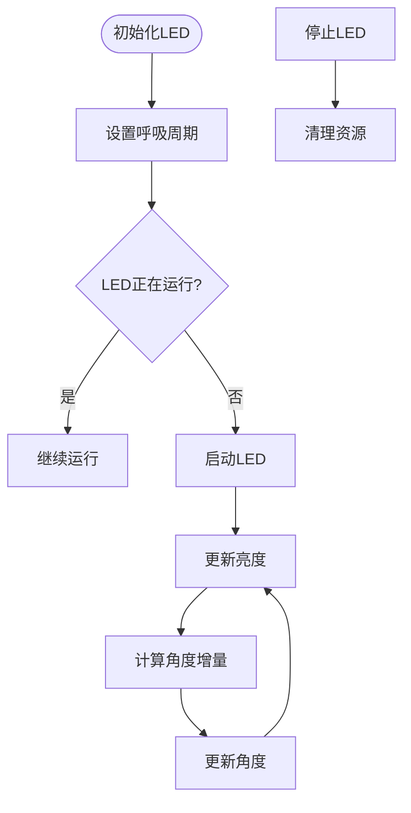
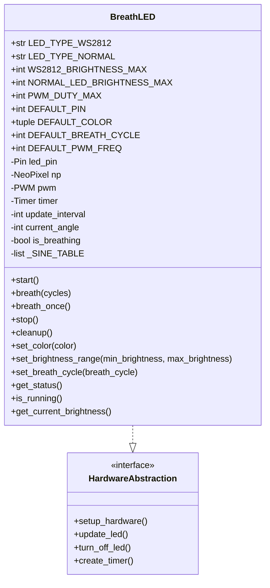
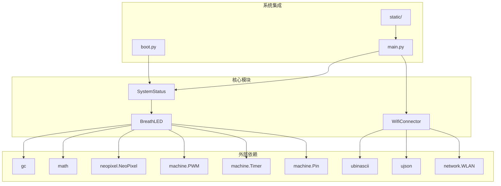

# 模块化设计

<cite>
**本文档引用的文件**
- [WifiConnector.py](file://lib/WifiConnector.py)
- [SystemStatus.py](file://lib/SystemStatus.py)
- [BreathLED.py](file://lib/BreathLED.py)
- [WifiConnector_README.md](file://lib/WifiConnector_README.md)
- [BreathLED_README.md](file://lib/BreathLED_README.md)
- [wifi_connector_example.py](file://lib/wifi_connector_example.py)
- [breath_led_example.py](file://lib/breath_led_example.py)
- [WifiConnector_min.py](file://lib/WifiConnector_min.py)
- [BreathLED_min.py](file://lib/BreathLED_min.py)
</cite>

## 目录
1. [项目概述](#项目概述)
2. [项目结构](#项目结构)
3. [核心组件](#核心组件)
4. [架构概览](#架构概览)
5. [详细组件分析](#详细组件分析)
6. [依赖关系分析](#依赖关系分析)
7. [性能考虑](#性能考虑)
8. [故障排除指南](#故障排除指南)
9. [结论](#结论)

## 项目概述

围炉诗社·理事台项目是一个基于ESP32的物联网设备，专注于模块化设计和可复用性。该项目的核心是lib目录下的三个关键模块：WifiConnector（WiFi连接管理）、SystemStatus（系统状态指示）和BreathLED（LED控制逻辑）。这些模块共同构成了设备的网络连接和状态可视化功能。

项目采用了高度模块化的架构设计，每个模块都有明确的职责边界和清晰的接口定义，支持独立开发、测试和部署。

## 项目结构

项目采用功能驱动的模块化组织方式，lib目录包含了所有核心功能模块：



**图表来源**
- [WifiConnector.py](file://lib/WifiConnector.py#L1-L800)
- [SystemStatus.py](file://lib/SystemStatus.py#L1-L61)
- [BreathLED.py](file://lib/BreathLED.py#L1-L633)

**章节来源**
- [WifiConnector.py](file://lib/WifiConnector.py#L1-L800)
- [SystemStatus.py](file://lib/SystemStatus.py#L1-L61)
- [BreathLED.py](file://lib/BreathLED.py#L1-L633)

## 核心组件

### WifiConnector模块

WifiConnector是ESP32 WiFi连接管理的核心模块，提供了完整的WiFi连接生命周期管理功能。该模块支持多种连接模式，包括标准STA模式、热点AP模式，以及静态IP配置管理。

#### 主要功能特性

1. **网络扫描与连接管理**
   - WiFi网络扫描和搜索
   - 自动重连机制
   - 连接状态监控和诊断

2. **静态IP配置管理**（v1.3.0新增）
   - 完整的静态IP配置验证
   - DHCP/静态IP动态切换
   - 静态IP便捷访问器

3. **热点管理**（v1.2.0增强）
   - 热点创建和管理
   - 热点IP配置和客户端管理
   - 热点配置持久化

#### 设计理念

模块采用面向对象设计，通过封装WiFi相关的复杂操作，提供简洁易用的接口。所有网络配置都通过内部状态管理，确保数据一致性和可靠性。

**章节来源**
- [WifiConnector.py](file://lib/WifiConnector.py#L11-L120)
- [WifiConnector_README.md](file://lib/WifiConnector_README.md#L1-L418)

### SystemStatus模块

SystemStatus模块负责管理系统的LED状态指示，专门为ESP32-S2开发板设计，使用GPIO 15引脚控制单个板载LED。

#### 设计理念

该模块采用了状态机的设计模式，通过不同的呼吸周期来表示系统的不同状态：
- 快速呼吸（500ms）：表示正在连接WiFi
- 中速呼吸（1500ms）：表示处于AP热点模式
- 慢速呼吸（4000ms）：表示系统稳定运行

模块还实现了性能优化配置，通过调整UPDATE_INTERVAL_MIN和UPDATE_INTERVAL_DIVISOR参数来平衡效果与CPU占用。

**章节来源**
- [SystemStatus.py](file://lib/SystemStatus.py#L1-L61)

### BreathLED模块

BreathLED模块是功能强大的LED呼吸效果控制类，支持WS2812彩色LED和普通LED两种类型。该模块提供了精确的呼吸控制算法和丰富的配置选项。

#### 核心特性

1. **双LED类型支持**
   - WS2812彩色LED：支持RGB颜色和多LED同步控制
   - 普通LED：使用高精度PWM控制

2. **精确次数控制**（v2.1.0新增）
   - `breath(cycles)`方法：执行指定次数的呼吸后自动停止
   - `breath_once()`方法：执行一次完整呼吸的快捷方式
   - 基于总更新次数的极简算法

3. **智能优先级管理**
   - 自动处理无限循环与有限次数的优先级冲突
   - 智能次数累加功能
   - 自动停止机制

#### 算法设计

模块采用了预计算正弦查找表技术，通过360个预计算值避免实时三角函数计算，提高了性能和响应速度。更新间隔根据呼吸周期自适应调整，确保各种周期长度的精确控制。

**章节来源**
- [BreathLED.py](file://lib/BreathLED.py#L11-L66)
- [BreathLED_README.md](file://lib/BreathLED_README.md#L1-L442)

## 架构概览

项目采用了分层架构设计，各模块之间通过清晰的接口进行通信：



**图表来源**
- [SystemStatus.py](file://lib/SystemStatus.py#L19-L61)
- [WifiConnector.py](file://lib/WifiConnector.py#L66-L118)
- [BreathLED.py](file://lib/BreathLED.py#L6-L10)

### 模块间交互流程



**图表来源**
- [SystemStatus.py](file://lib/SystemStatus.py#L25-L58)
- [WifiConnector.py](file://lib/WifiConnector.py#L595-L696)
- [BreathLED.py](file://lib/BreathLED.py#L344-L380)

## 详细组件分析

### WifiConnector类详细分析

#### 类结构设计



**图表来源**
- [WifiConnector.py](file://lib/WifiConnector.py#L11-L120)
- [WifiConnector.py](file://lib/WifiConnector.py#L518-L800)

#### 连接管理算法



**图表来源**
- [WifiConnector.py](file://lib/WifiConnector.py#L315-L375)
- [WifiConnector.py](file://lib/WifiConnector.py#L648-L695)

**章节来源**
- [WifiConnector.py](file://lib/WifiConnector.py#L518-L800)
- [WifiConnector_min.py](file://lib/WifiConnector_min.py#L315-L435)

### SystemStatus类详细分析

#### 状态管理模式



**图表来源**
- [SystemStatus.py](file://lib/SystemStatus.py#L33-L58)

#### LED控制逻辑

SystemStatus模块通过BreathLED类实现LED控制，采用了呼吸效果算法：



**图表来源**
- [SystemStatus.py](file://lib/SystemStatus.py#L52-L58)
- [BreathLED.py](file://lib/BreathLED.py#L304-L339)

**章节来源**
- [SystemStatus.py](file://lib/SystemStatus.py#L19-L61)

### BreathLED类详细分析

#### 精确次数控制算法

```mermaid
flowchart TD
Start([开始breath(cycles)]) --> CheckPriority{"检查优先级"}
CheckPriority --> |start()高优先级| IgnoreCall["忽略调用"]
CheckPriority --> |breath()高优先级| CalcUpdates["计算更新次数"]
CalcUpdates --> AddUpdates["累加剩余次数"]
AddUpdates --> CheckRunning{"是否正在运行?"}
CheckRunning --> |是| UpdateCount["更新计数"]
CheckRunning --> |否| SetupHardware["设置硬件"]
SetupHardware --> CreateTimer["创建定时器"]
CreateTimer --> StartTimer["启动定时器"]
StartTimer --> UpdateLED["更新LED状态"]
UpdateLED --> DecrementCount["减少剩余次数"]
DecrementCount --> CheckZero{"剩余次数为0?"}
CheckZero --> |是| StopLED["停止LED"]
CheckZero --> |否| UpdateLED
StopLED --> Cleanup["清理资源"]
IgnoreCall --> End([结束])
UpdateCount --> End
Cleanup --> End
```

**图表来源**
- [BreathLED.py](file://lib/BreathLED.py#L213-L252)
- [BreathLED.py](file://lib/BreathLED.py#L381-L451)

#### 硬件抽象层设计



**图表来源**
- [BreathLED.py](file://lib/BreathLED.py#L11-L66)
- [BreathLED.py](file://lib/BreathLED.py#L228-L284)

**章节来源**
- [BreathLED.py](file://lib/BreathLED.py#L94-L169)
- [BreathLED_min.py](file://lib/BreathLED_min.py#L42-L82)

## 依赖关系分析

### 模块依赖图



**图表来源**
- [WifiConnector.py](file://lib/WifiConnector.py#L6-L10)
- [SystemStatus.py](file://lib/SystemStatus.py#L10)
- [BreathLED.py](file://lib/BreathLED.py#L6-L9)

### 接口设计规范

#### WifiConnector接口规范

| 方法名 | 参数 | 返回值 | 描述 |
|--------|------|--------|------|
| `connect` | ssid, password=None, timeout=None, static_ip=None | bool | 连接到WiFi网络 |
| `disconnect` | keep_credentials=True | bool | 断开WiFi连接 |
| `reconnect` | max_attempts=None | bool | 使用已保存凭据重连 |
| `scan_networks` | timeout=None | list | 扫描可用WiFi网络 |
| `find_network` | ssid | dict or None | 查找指定网络 |
| `create_hotspot` | ssid, password=None, channel=None, max_clients=None, authmode=None, ip_config=None | bool | 创建WiFi热点 |
| `configure_static_ip` | ip, subnet=None, gateway=None, dns=None, dns_secondary=None | bool | 配置静态IP |
| `switch_to_static_ip` | ip, subnet=None, gateway=None, dns=None | bool | 切换到静态IP模式 |
| `monitor_connection` |  | dict | 监控连接状态 |

#### SystemStatus接口规范

| 方法名 | 参数 | 返回值 | 描述 |
|--------|------|--------|------|
| `start_connecting` |  | void | 设置连接中状态指示 |
| `start_ap_mode` |  | void | 设置热点模式指示 |
| `start_running` |  | void | 设置运行中状态指示 |
| `stop` |  | void | 停止所有LED指示 |
| `_set_cycle` | cycle | void | 内部方法：设置LED呼吸周期 |

#### BreathLED接口规范

| 方法名 | 参数 | 返回值 | 描述 |
|--------|------|--------|------|
| `start` |  | void | 开始无限循环呼吸效果 |
| `breath` | cycles=1 | void | 执行指定次数的呼吸后自动停止 |
| `breath_once` |  | void | 执行一次完整呼吸的快捷方法 |
| `stop` |  | void | 停止呼吸效果 |
| `cleanup` |  | void | 清理所有资源 |
| `set_color` | color | void | 设置颜色（WS2812有效） |
| `set_brightness_range` | min_brightness, max_brightness | void | 设置亮度范围 |
| `set_breath_cycle` | breath_cycle | void | 设置呼吸周期 |
| `get_status` |  | dict | 获取完整状态信息 |
| `is_running` |  | bool | 检查是否正在运行 |
| `get_current_brightness` |  | int | 获取当前亮度值 |

**章节来源**
- [WifiConnector.py](file://lib/WifiConnector.py#L595-L800)
- [SystemStatus.py](file://lib/SystemStatus.py#L25-L58)
- [BreathLED.py](file://lib/BreathLED.py#L344-L633)

## 性能考虑

### 内存优化策略

1. **正弦查找表优化**
   - 预计算360个正弦值，避免实时三角函数计算
   - 类级别共享查找表，减少内存占用
   - 支持双重检查锁定模式的线程安全初始化

2. **资源管理优化**
   - 智能硬件初始化：延迟初始化以避免Timer资源冲突
   - 完整的资源清理机制，防止内存泄漏
   - GC垃圾回收触发，确保内存及时释放

3. **算法优化**
   - 基于总更新次数的精确控制算法
   - 自适应更新间隔计算
   - 16位PWM精度控制，提高亮度调节精度

### CPU使用率优化

1. **定时器优化**
   - 兼容不同硬件平台的定时器创建策略
   - 智能优先级管理，避免不必要的计算
   - 最小更新间隔保护，防止过度刷新

2. **状态缓存**
   - 网络信息智能缓存和自动同步
   - 连接状态查询优化
   - 配置参数缓存机制

**章节来源**
- [BreathLED.py](file://lib/BreathLED.py#L71-L89)
- [BreathLED.py](file://lib/BreathLED.py#L261-L284)
- [WifiConnector.py](file://lib/WifiConnector.py#L253-L326)

## 故障排除指南

### 常见问题及解决方案

#### WiFi连接问题

1. **连接超时**
   - 检查网络参数配置
   - 调整连接超时设置
   - 验证WiFi信号强度

2. **密码错误**
   - 确认密码长度至少8位
   - 检查字符编码问题
   - 验证网络认证模式

3. **IP地址获取失败**
   - 手动刷新网络信息
   - 检查DHCP服务器状态
   - 验证静态IP配置

#### LED控制问题

1. **LED不工作**
   - 检查引脚配置是否正确
   - 验证LED类型设置
   - 确认硬件连接

2. **呼吸效果异常**
   - 检查呼吸周期设置
   - 验证亮度范围配置
   - 确认定时器初始化

3. **内存不足**
   - 调用cleanup()清理资源
   - 减少LED数量
   - 优化更新频率

#### 系统状态问题

1. **状态指示异常**
   - 检查SystemStatus初始化
   - 验证LED实例创建
   - 确认GPIO权限

2. **状态切换失败**
   - 检查状态转换逻辑
   - 验证LED控制命令
   - 确认系统时钟

**章节来源**
- [WifiConnector_README.md](file://lib/WifiConnector_README.md#L355-L379)
- [BreathLED_README.md](file://lib/BreathLED_README.md#L337-L357)

## 结论

围炉诗社·理事台项目的模块化设计展现了优秀的软件工程实践。通过精心设计的三个核心模块，项目实现了：

1. **清晰的职责分离**：每个模块都有明确的功能边界和接口定义
2. **高度的可复用性**：模块设计支持独立开发、测试和部署
3. **良好的扩展性**：模块接口设计支持未来功能扩展
4. **优秀的性能表现**：通过算法优化和资源管理确保系统稳定运行

项目采用的模块化架构为类似物联网设备开发提供了宝贵的参考经验，特别是在WiFi连接管理和LED状态指示方面的最佳实践值得推广和学习。