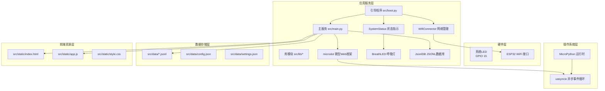
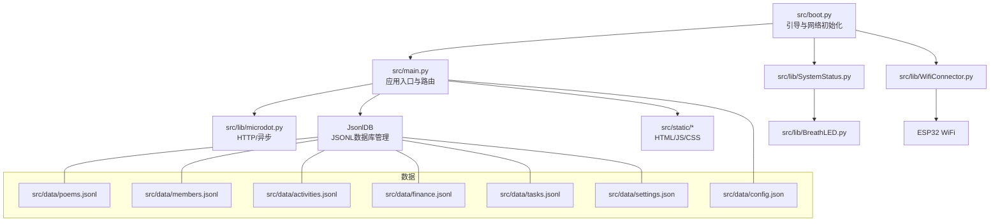
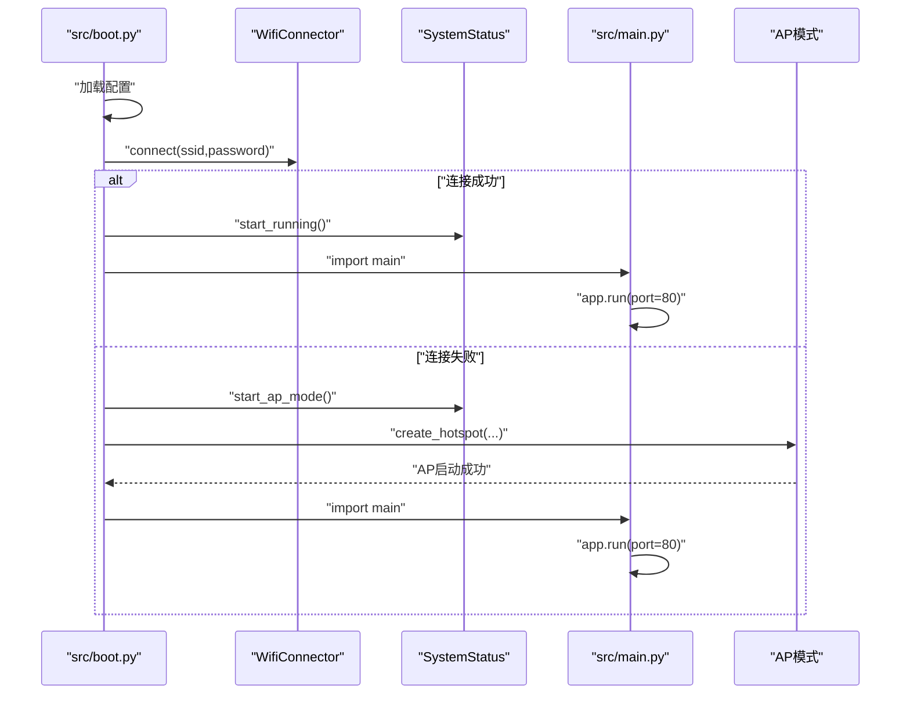
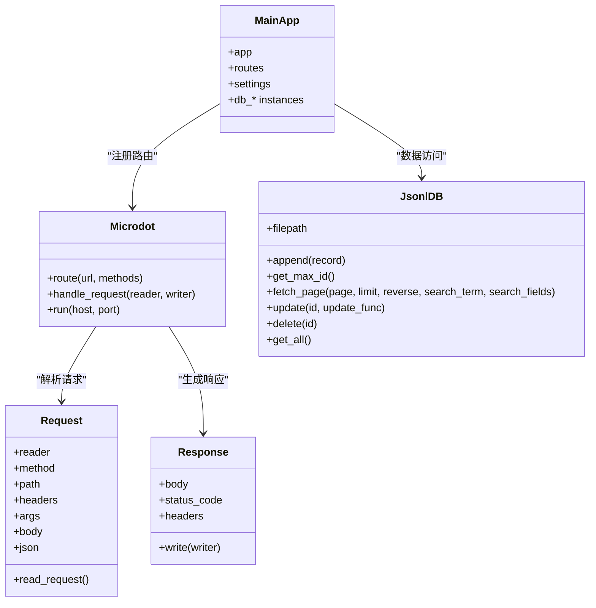
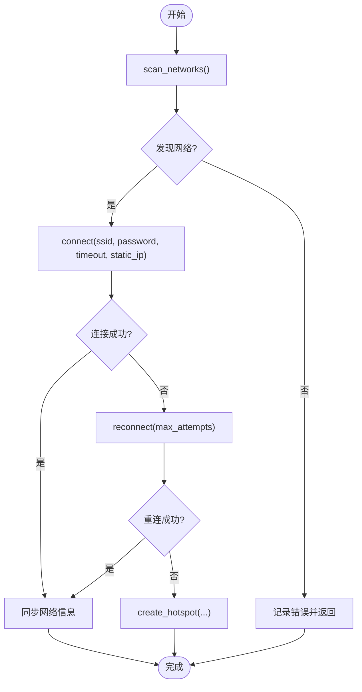
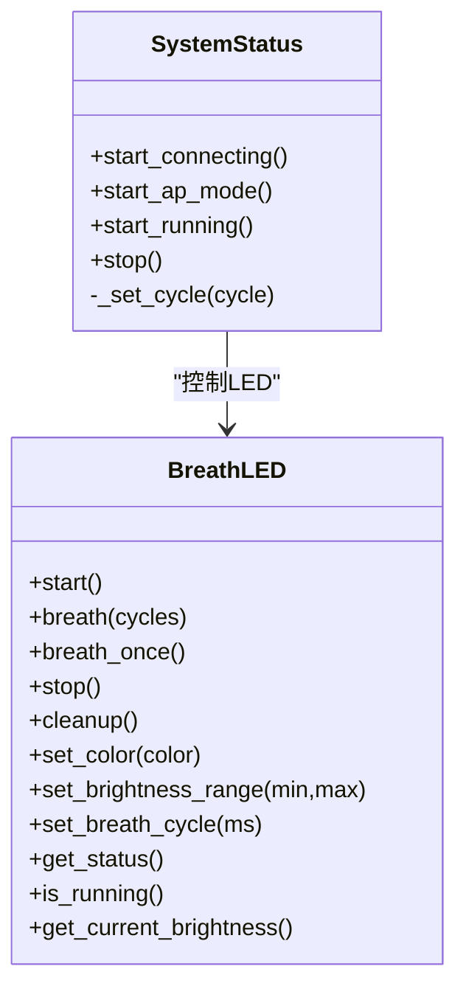
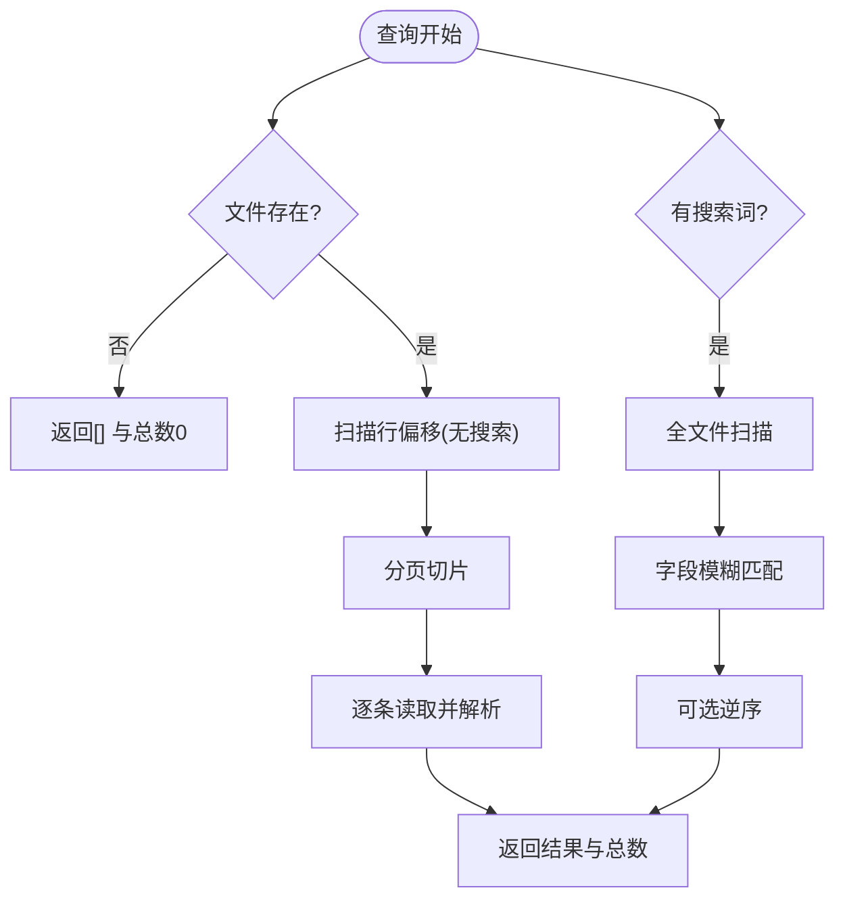
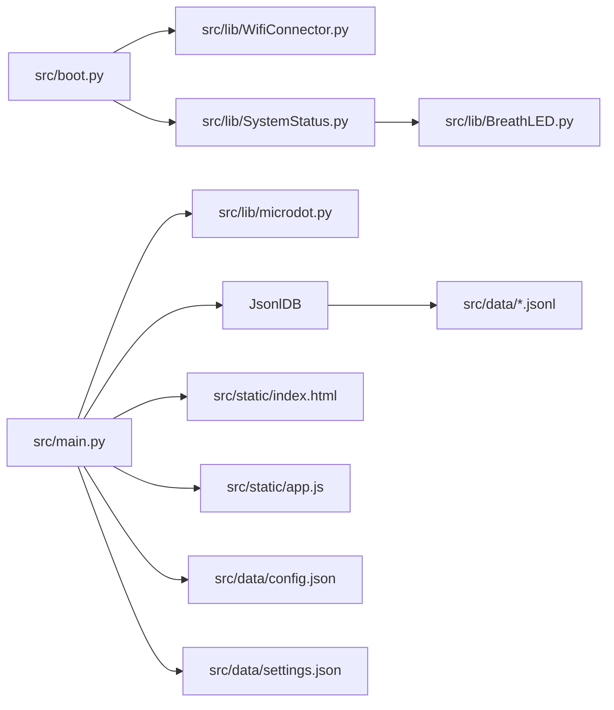

# 系统架构

<cite>
**本文引用的文件**
- [src/boot.py](file://src/boot.py)
- [src/main.py](file://src/main.py)
- [src/lib/microdot.py](file://src/lib/microdot.py)
- [src/lib/WifiConnector.py](file://src/lib/WifiConnector.py)
- [src/lib/SystemStatus.py](file://src/lib/SystemStatus.py)
- [src/lib/BreathLED.py](file://src/lib/BreathLED.py)
- [src/lib/wifi_connector_example.py](file://src/lib/wifi_connector_example.py)
- [src/lib/breath_led_example.py](file://src/lib/breath_led_example.py)
- [src/data/config.json](file://src/data/config.json)
- [src/data/settings.json](file://src/data/settings.json)
- [src/data/poems.jsonl](file://src/data/poems.jsonl)
- [src/data/members.jsonl](file://src/data/members.jsonl)
- [src/static/index.html](file://src/static/index.html)
- [src/static/app.js](file://src/static/app.js)
</cite>

## 更新摘要
**变更内容**
- 项目结构重组：所有源文件迁移到src/目录，符合现代软件工程规范
- 新增JsonlDB类架构设计：提供完整的JSONL数据库管理功能
- 标准化组件组织：引导程序、主服务、库模块、数据存储、前端资源均位于src/目录下

## 目录
1. [简介](#简介)
2. [项目结构](#项目结构)
3. [核心组件](#核心组件)
4. [架构总览](#架构总览)
5. [详细组件分析](#详细组件分析)
6. [依赖分析](#依赖分析)
7. [性能考量](#性能考量)
8. [故障排查指南](#故障排查指南)
9. [结论](#结论)
10. [附录](#附录)

## 简介
本项目为"围炉诗社·理事台"的嵌入式Web应用，基于ESP32与MicroPython运行时，采用异步事件驱动与模块化设计，提供活动、藏诗阁、事务、财务、社员等管理能力，并内置静态文件服务与JSONL数据库。系统通过引导程序完成网络初始化与LED状态指示，随后启动微型Web框架提供REST API与前端页面。

**更新** 项目结构已重构为src/目录结构，所有核心组件现位于src/目录下，符合现代软件工程的组织规范。新增的JsonlDB类架构设计提供了完整的JSONL数据库管理功能，支持增删改查、分页检索、全文搜索等操作。

## 项目结构
项目采用"分层+模块化"组织方式，现已标准化到src/目录结构：
- 硬件层：ESP32引脚、LED、WiFi接口
- 操作系统层：MicroPython运行时（uasyncio、network、uos等）
- 应用服务层：src/boot.py引导、src/main.py主服务、src/lib/模块库
- 数据存储层：src/data/目录下的JSONL文件与settings.json
- 前端资源层：src/static/目录下的HTML/CSS/JS文件

**图表来源**
- [src/boot.py](file://src/boot.py#L1-L122)
- [src/main.py](file://src/main.py#L1-L16)
- [src/lib/microdot.py](file://src/lib/microdot.py#L1-L183)
- [src/lib/WifiConnector.py](file://src/lib/WifiConnector.py#L1-L120)
- [src/lib/SystemStatus.py](file://src/lib/SystemStatus.py#L1-L61)
- [src/lib/BreathLED.py](file://src/lib/BreathLED.py#L1-L120)
- [src/data/config.json](file://src/data/config.json#L1-L6)
- [src/data/settings.json](file://src/data/settings.json#L1-L1)
- [src/static/index.html](file://src/static/index.html#L1-L269)
- [src/static/app.js](file://src/static/app.js#L1-L800)

**章节来源**
- [src/boot.py](file://src/boot.py#L1-L122)
- [src/main.py](file://src/main.py#L1-L16)

## 核心组件
- 引导程序 src/boot.py：负责CPU频率设置、加载配置、WiFi连接与AP降级、启动主服务与LED状态指示。
- 主服务 src/main.py：构建Microdot应用，注册路由，实现JSONL数据库访问与业务API，提供静态文件服务。
- 微型Web框架 src/lib/microdot.py：轻量HTTP请求解析、响应写入、路由装饰器、异步服务器。
- 网络管理 src/lib/WifiConnector.py：WiFi扫描、连接、重连、热点创建、静态IP配置、诊断与持久化。
- 系统状态 src/lib/SystemStatus.py：基于BreathLED的LED状态指示（连接/AP/运行）。
- 呼吸灯 src/lib/BreathLED.py：WS2812与普通LED的呼吸效果控制，定时器驱动。
- JSONL数据库 src/main.py中的JsonlDB类：提供完整的JSONL文件数据库管理功能。
- 数据层 src/data/*.jsonl：以JSONL形式存储诗歌、成员、活动、财务、任务等数据。
- 前端资源 src/static/index.html + src/static/app.js：SPA页面与IndexedDB草稿、API交互。

**章节来源**
- [src/boot.py](file://src/boot.py#L1-L122)
- [src/main.py](file://src/main.py#L17-L548)
- [src/lib/microdot.py](file://src/lib/microdot.py#L94-L183)
- [src/lib/WifiConnector.py](file://src/lib/WifiConnector.py#L11-L120)
- [src/lib/SystemStatus.py](file://src/lib/SystemStatus.py#L19-L61)
- [src/lib/BreathLED.py](file://src/lib/BreathLED.py#L11-L120)
- [src/data/poems.jsonl](file://src/data/poems.jsonl#L1-L4)
- [src/data/members.jsonl](file://src/data/members.jsonl#L1-L4)
- [src/static/index.html](file://src/static/index.html#L1-L269)
- [src/static/app.js](file://src/static/app.js#L1-L800)

## 架构总览
系统采用"引导-服务-库-数据-前端"的分层架构，现已标准化到src/目录结构：
- 引导层：src/boot.py在系统启动时完成网络初始化与LED状态提示，随后导入并启动src/main.py。
- 服务层：src/main.py构建Microdot应用，注册路由，提供REST API与静态文件服务。
- 库层：src/lib/microdot.py提供HTTP协议与异步处理；src/lib/WifiConnector.py提供网络能力；src/lib/SystemStatus.py与src/lib/BreathLED.py提供LED指示。
- 数据层：src/data/*.jsonl作为轻量数据库，src/main.py封装JsonlDB类提供增删改查与分页检索。
- 前端层：src/static/index.html与src/static/app.js提供SPA界面与IndexedDB草稿能力。

**图表来源**
- [src/boot.py](file://src/boot.py#L1-L122)
- [src/main.py](file://src/main.py#L53-L267)
- [src/lib/microdot.py](file://src/lib/microdot.py#L94-L183)
- [src/lib/WifiConnector.py](file://src/lib/WifiConnector.py#L11-L120)
- [src/lib/SystemStatus.py](file://src/lib/SystemStatus.py#L19-L61)
- [src/lib/BreathLED.py](file://src/lib/BreathLED.py#L11-L120)
- [src/data/poems.jsonl](file://src/data/poems.jsonl#L1-L4)
- [src/data/members.jsonl](file://src/data/members.jsonl#L1-L4)
- [src/data/config.json](file://src/data/config.json#L1-L6)
- [src/data/settings.json](file://src/data/settings.json#L1-L1)
- [src/static/index.html](file://src/static/index.html#L1-L269)
- [src/static/app.js](file://src/static/app.js#L1-L800)

## 详细组件分析

### 组件A：引导与启动流程（src/boot.py）
- 职责：设置CPU频率、加载配置、连接WiFi、失败时进入AP模式、导入并启动src/main.py、LED状态指示。
- 关键流程：
  - 读取src/data/config.json，判断是否配置WiFi；
  - 若未配置或连接失败，创建自定义AP（IP段可配置）；
  - 成功连接后，根据网络模式设置LED状态；
  - 导入src/main.py并启动HTTP服务。
- 设计要点：容错与降级（连接失败进入AP）、调试等待、LED状态反馈。

**图表来源**
- [src/boot.py](file://src/boot.py#L22-L122)
- [src/lib/WifiConnector.py](file://src/lib/WifiConnector.py#L595-L696)
- [src/lib/SystemStatus.py](file://src/lib/SystemStatus.py#L33-L57)
- [src/main.py](file://src/main.py#L541-L548)

**章节来源**
- [src/boot.py](file://src/boot.py#L1-L122)

### 组件B：主服务与路由（src/main.py）
- 职责：构建Microdot应用，注册静态文件与API路由，实现业务逻辑与数据访问。
- 核心模块：
  - JsonlDB：封装JSONL文件的增删改查、分页、搜索、迁移与临时文件写入策略。
  - 路由：首页与静态文件、各业务API（诗歌、活动、任务、成员、财务、登录、系统信息）。
  - 静态文件：send_file封装，自动识别Content-Type与Content-Length。
- 设计要点：路由装饰器、协程处理、错误转响应、内存友好分页与搜索。

**图表来源**
- [src/lib/microdot.py](file://src/lib/microdot.py#L5-L183)
- [src/main.py](file://src/main.py#L53-L267)

**章节来源**
- [src/main.py](file://src/main.py#L17-L548)
- [src/lib/microdot.py](file://src/lib/microdot.py#L94-L183)

### 组件C：网络管理（src/lib/WifiConnector.py）
- 职责：WiFi扫描、连接、重连、断开、热点创建、静态IP配置、诊断与持久化。
- 关键能力：
  - 连接参数校验、连接状态描述、错误日志；
  - 静态IP配置（含校验与推断网关/DNS）、DHCP/静态IP切换；
  - 热点创建与客户端管理、配置持久化；
  - 连接监控与网络信息同步。
- 设计要点：参数验证、状态机描述、错误隔离、可选调试输出。

**图表来源**
- [src/lib/WifiConnector.py](file://src/lib/WifiConnector.py#L518-L800)

**章节来源**
- [src/lib/WifiConnector.py](file://src/lib/WifiConnector.py#L11-L120)

### 组件D：系统状态与LED指示（src/lib/SystemStatus.py + src/lib/BreathLED.py）
- 职责：通过GPIO 15控制LED呼吸周期，区分连接中、AP模式、运行中三种状态。
- 关键实现：
  - SystemStatus持有BreathLED实例，设置不同呼吸周期；
  - BreathLED使用Timer与正弦查找表实现平滑亮度变化，支持WS2812与普通LED。
- 设计要点：极简算法、更新间隔与周期的平衡、资源清理与异常保护。

**图表来源**
- [src/lib/SystemStatus.py](file://src/lib/SystemStatus.py#L19-L61)
- [src/lib/BreathLED.py](file://src/lib/BreathLED.py#L11-L120)

**章节来源**
- [src/lib/SystemStatus.py](file://src/lib/SystemStatus.py#L1-L61)
- [src/lib/BreathLED.py](file://src/lib/BreathLED.py#L1-L120)

### 组件E：数据模型与存储（JsonlDB与JSONL）
- 职责：以JSONL文件作为轻量数据库，提供增删改查、分页、全文搜索、ID自增与临时文件写入策略。
- 关键实现：
  - 分页扫描文件记录偏移，避免一次性加载；
  - 搜索遍历文件，支持字段模糊匹配；
  - 更新/删除采用临时文件重写策略，保证一致性；
  - 迁移旧版JSON到JSONL。
- 设计要点：内存友好、顺序写入、原子替换、错误回滚。

**图表来源**
- [src/main.py](file://src/main.py#L53-L267)

**章节来源**
- [src/main.py](file://src/main.py#L53-L267)

### 组件F：前端交互与草稿（src/static/index.html + src/static/app.js）
- 职责：SPA页面、导航、权限控制、数据渲染、IndexedDB本地草稿、API调用。
- 关键实现：
  - 登录/登出、角色权限、全局搜索；
  - 诗歌列表分页加载、本地草稿保存与发布；
  - 社员/活动/财务/任务等模块的数据增删改查；
  - IndexedDB草稿持久化与离线体验。
- 设计要点：模块化函数、错误提示、状态管理、权限控制。

**章节来源**
- [src/static/index.html](file://src/static/index.html#L1-L269)
- [src/static/app.js](file://src/static/app.js#L1-L800)

## 依赖分析
- 组件耦合：
  - src/boot.py依赖WifiConnector与SystemStatus，间接依赖BreathLED；
  - src/main.py依赖microdot、JsonlDB与静态文件；
  - JsonlDB依赖os与json；
  - SystemStatus依赖BreathLED；
  - 前端通过API与src/main.py交互。
- 外部依赖：
  - MicroPython标准库（uos、network、machine、uasyncio等）；
  - 文件系统与磁盘空间（os.statvfs）。

**图表来源**
- [src/boot.py](file://src/boot.py#L1-L122)
- [src/main.py](file://src/main.py#L17-L548)
- [src/lib/microdot.py](file://src/lib/microdot.py#L1-L183)
- [src/lib/WifiConnector.py](file://src/lib/WifiConnector.py#L1-L120)
- [src/lib/SystemStatus.py](file://src/lib/SystemStatus.py#L1-L61)
- [src/lib/BreathLED.py](file://src/lib/BreathLED.py#L1-L120)
- [src/data/config.json](file://src/data/config.json#L1-L6)
- [src/data/settings.json](file://src/data/settings.json#L1-L1)
- [src/static/index.html](file://src/static/index.html#L1-L269)
- [src/static/app.js](file://src/static/app.js#L1-L800)

**章节来源**
- [src/boot.py](file://src/boot.py#L1-L122)
- [src/main.py](file://src/main.py#L17-L548)

## 性能考量
- 异步事件驱动：基于uasyncio的事件循环，避免阻塞，提升并发处理能力。
- 内存友好：JsonlDB分页扫描与临时文件重写，避免大文件一次性加载；前端IndexedDB草稿减少服务器压力。
- LED控制：BreathLED使用正弦查找表与定时器，更新间隔与周期可调，平衡效果与CPU占用。
- 网络优化：连接超时与重试次数可配置，静态IP可降低DHCP波动带来的不稳定。
- 存储策略：JSONL顺序写入与原子替换，适合嵌入式环境；settings.json与config.json轻量配置。

## 故障排查指南
- 启动无响应或LED不亮
  - 检查src/boot.py是否成功导入src/main.py与app.run；
  - 确认SystemStatus初始化与GPIO 15可用；
  - 观察连接流程是否进入AP模式。
- WiFi连接失败
  - 检查src/data/config.json配置项；
  - 使用WifiConnector诊断接口查看最后错误；
  - 尝试重连或断开后重连。
- API返回异常
  - 检查src/main.py路由与JsonlDB写入逻辑；
  - 关注500/404/400响应与异常日志；
  - 确认文件存在与权限。
- 前端无法加载或报错
  - 检查静态文件路径与Content-Type；
  - 确认跨域与缓存问题；
  - IndexedDB不可用时的降级逻辑。

**章节来源**
- [src/boot.py](file://src/boot.py#L88-L122)
- [src/lib/WifiConnector.py](file://src/lib/WifiConnector.py#L140-L148)
- [src/main.py](file://src/main.py#L528-L548)
- [src/static/app.js](file://src/static/app.js#L1-L800)

## 结论
本项目以MicroPython为核心，结合引导程序、微型Web框架、模块化库与JSONL存储，构建了轻量、可维护、可扩展的嵌入式Web应用。通过异步事件驱动与LED状态指示，提升了用户体验与可运维性；通过模块化设计与清晰的分层，便于后续功能扩展与维护。

**更新** 项目结构已标准化到src/目录，符合现代软件工程实践，提高了代码组织性和可维护性。新增的JsonlDB类架构设计提供了完整的JSONL数据库管理功能，支持增删改查、分页检索、全文搜索等操作，为系统的数据存储提供了坚实的基础。

## 附录
- 示例参考：
  - WifiConnector使用示例：src/lib/wifi_connector_example.py
  - BreathLED使用示例：src/lib/breath_led_example.py
- 数据样例：
  - poems.jsonl、members.jsonl等JSONL文件
  - config.json与settings.json

**章节来源**
- [src/lib/wifi_connector_example.py](file://src/lib/wifi_connector_example.py#L1-L787)
- [src/lib/breath_led_example.py](file://src/lib/breath_led_example.py#L1-L199)
- [src/data/poems.jsonl](file://src/data/poems.jsonl#L1-L4)
- [src/data/members.jsonl](file://src/data/members.jsonl#L1-L4)
- [src/data/config.json](file://src/data/config.json#L1-L6)
- [src/data/settings.json](file://src/data/settings.json#L1-L1)