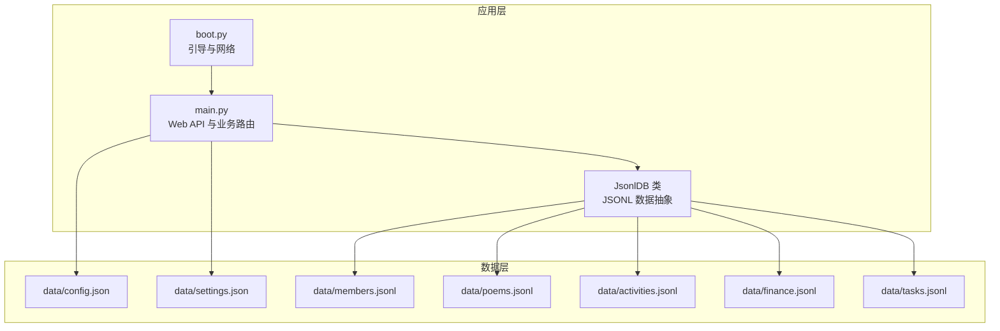
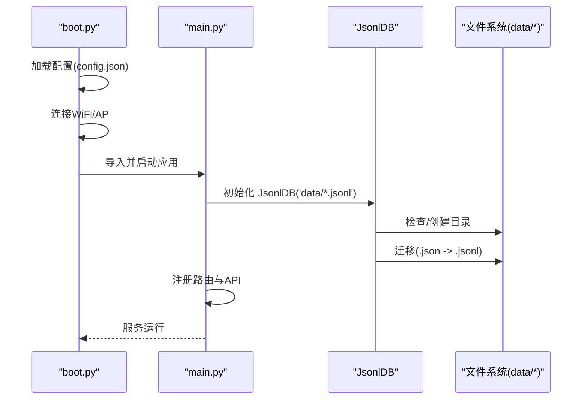
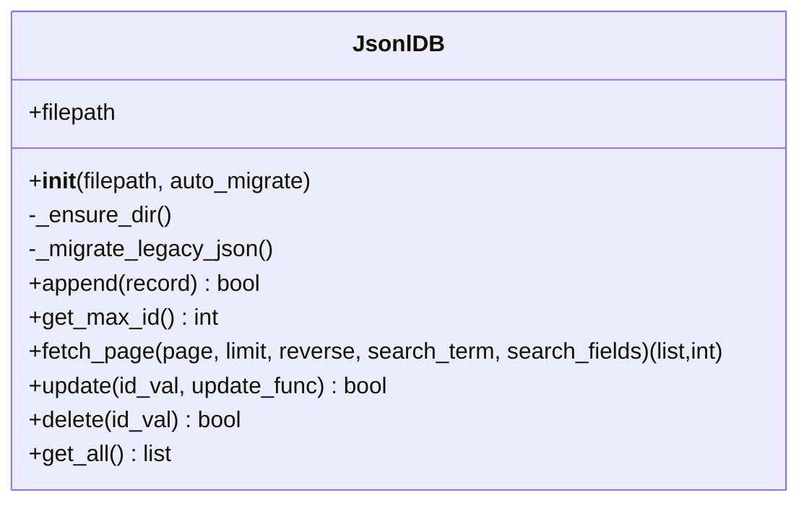
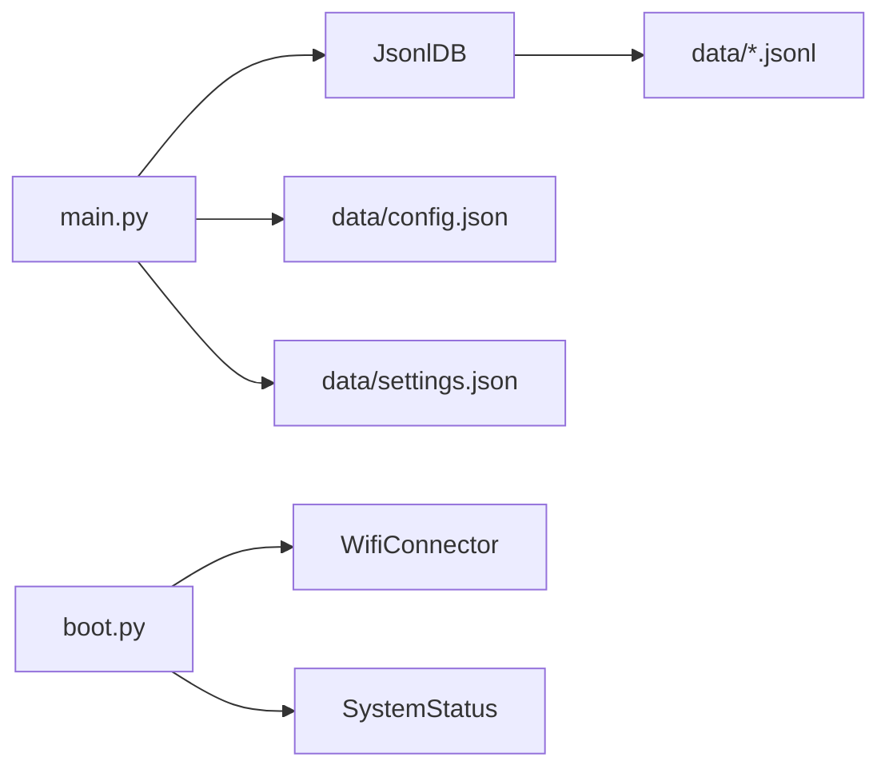

# 备份恢复

<cite>
**本文引用的文件**
- [boot.py](file://boot.py)
- [main.py](file://main.py)
- [config.json](file://data/config.json)
- [settings.json](file://data/settings.json)
- [members.jsonl](file://data/members.jsonl)
- [poems.jsonl](file://data/poems.jsonl)
- [activities.jsonl](file://data/activities.jsonl)
- [finance.jsonl](file://data/finance.jsonl)
- [tasks.jsonl](file://data/tasks.jsonl)
</cite>

## 目录
1. [简介](#简介)
2. [项目结构](#项目结构)
3. [核心组件](#核心组件)
4. [架构总览](#架构总览)
5. [详细组件分析](#详细组件分析)
6. [依赖分析](#依赖分析)
7. [性能考虑](#性能考虑)
8. [故障排查指南](#故障排查指南)
9. [结论](#结论)
10. [附录](#附录)

## 简介
本指南面向“围炉诗社·理事台”项目，聚焦数据备份与恢复，围绕 JSONL 数据文件的结构特点、备份策略、迁移方法、灾难恢复流程、数据安全与版本管理最佳实践展开。文档旨在帮助在更换设备或系统升级时，确保数据完整性与可恢复性。

## 项目结构
项目采用“数据文件 + 应用服务”的轻量架构：
- 数据层：data 目录下包含若干 JSONL 文件（成员、诗歌、活动、财务、任务）以及少量 JSON 配置文件（config、settings）。
- 应用层：main.py 提供 Web API 服务，boot.py 负责引导与网络连接；JsonlDB 抽象封装了 JSONL 的增删改查与迁移逻辑。

图表来源
- [boot.py](file://boot.py#L1-L122)
- [main.py](file://main.py#L53-L267)
- [config.json](file://data/config.json#L1-L6)
- [settings.json](file://data/settings.json#L1-L1)

章节来源
- [boot.py](file://boot.py#L1-L122)
- [main.py](file://main.py#L53-L267)

## 核心组件
- JsonlDB：负责 JSONL 文件的目录创建、遗留 .json 到 .jsonl 的迁移、追加写入、按页读取、基于 id 的更新与删除、全量读取等。
- 各业务 API：围绕 poems、members、activities、finance、tasks 提供 CRUD 与查询接口。
- 配置与设置：config.json 保存 WiFi 与 AP 凭据；settings.json 保存自定义字段配置。

章节来源
- [main.py](file://main.py#L53-L267)
- [config.json](file://data/config.json#L1-L6)
- [settings.json](file://data/settings.json#L1-L1)

## 架构总览
应用启动后，boot.py 读取配置并尝试连接 WiFi；随后 main.py 初始化 JsonlDB 实例并挂载路由。所有数据均以 JSONL 文件形式持久化在 data 目录。

图表来源
- [boot.py](file://boot.py#L14-L89)
- [main.py](file://main.py#L262-L267)
- [main.py](file://main.py#L68-L84)

## 详细组件分析

### JsonlDB 组件分析
JsonlDB 是数据持久化的关键抽象，具备以下能力：
- 目录确保：自动创建 data 子目录（如不存在）。
- 迁移逻辑：若 .jsonl 缺失但存在同名 .json，则将数组逐条写入 .jsonl。
- 追加写入：每次新增记录以换行分隔的 JSON 行写入。
- 分页读取：通过记录偏移定位实现内存友好分页；支持全文检索（遍历扫描）。
- 基于 id 的更新/删除：通过临时文件重写实现原子性更新/删除。
- 全量读取：适用于小型文件（如 members、settings）。

图表来源
- [main.py](file://main.py#L53-L267)

章节来源
- [main.py](file://main.py#L53-L267)

### 数据文件结构与迁移
- 结构特征：每行一条 JSON 记录，以换行分隔；常见字段包含 id、title、content、date、status、author、summary 等，具体以各业务实体为准。
- 迁移策略：当 .jsonl 不存在但存在同名 .json 时，JsonlDB 会自动将 .json 数组逐条转换为 .jsonl。
- 迁移注意事项：迁移过程不会删除旧文件，建议在确认 .jsonl 正常后手动清理历史文件。

章节来源
- [main.py](file://main.py#L68-L84)

### API 与数据一致性
- 新增：各 API 在写入前会计算并填充 id，保证唯一性。
- 更新/删除：基于 id 的原子性重写，避免并发写入导致的损坏。
- 查询：分页读取与可选全文检索，兼顾性能与可用性。

章节来源
- [main.py](file://main.py#L309-L370)
- [main.py](file://main.py#L371-L408)
- [main.py](file://main.py#L410-L450)
- [main.py](file://main.py#L451-L483)
- [main.py](file://main.py#L504-L515)

## 依赖分析
- JsonlDB 依赖文件系统与 JSON 解析；对 data 目录具有读写权限。
- main.py 依赖 microdot 提供 Web 服务；boot.py 依赖 WifiConnector 与 SystemStatus 控制 LED。
- 配置与设置：config.json 与 settings.json 作为纯文本配置文件，不参与 JSONL 的迁移流程。

图表来源
- [main.py](file://main.py#L53-L267)
- [boot.py](file://boot.py#L1-L122)

章节来源
- [main.py](file://main.py#L53-L267)
- [boot.py](file://boot.py#L1-L122)

## 性能考虑
- 分页读取：通过记录偏移定位实现内存友好分页，适合较大规模数据。
- 全文检索：采用全文件扫描，复杂度 O(N)；建议在高频场景下限制搜索范围或引入索引。
- 更新/删除：采用临时文件重写，避免并发写入冲突；在大文件上可能产生额外磁盘 IO。
- 配置与设置：settings.json 为纯 JSON，读写简单；config.json 由 boot.py 读取，注意路径与权限。

章节来源
- [main.py](file://main.py#L113-L185)
- [main.py](file://main.py#L187-L246)
- [main.py](file://main.py#L269-L277)
- [boot.py](file://boot.py#L14-L20)

## 故障排查指南
- JSONL 文件损坏
  - 现象：读取报错、分页异常、查询为空。
  - 处理：检查文件末尾换行、逐行校验 JSON 语法；必要时使用备份恢复。
- 更新/删除失败
  - 现象：返回失败或 id 不存在。
  - 处理：确认 id 类型与格式；检查临时文件是否被中断；重试或从备份恢复。
- 配置加载失败
  - 现象：boot.py 无法读取 config.json。
  - 处理：检查路径、权限与 JSON 语法；必要时回退到默认 AP 模式。
- 网络连接问题
  - 现象：无法连接 WiFi，进入 AP 模式。
  - 处理：核对 config.json 中的 SSID/密码；检查信号强度与超时设置。

章节来源
- [main.py](file://main.py#L86-L94)
- [main.py](file://main.py#L187-L221)
- [main.py](file://main.py#L223-L246)
- [boot.py](file://boot.py#L14-L20)
- [boot.py](file://boot.py#L22-L63)

## 结论
本项目以 JSONL 文件为核心数据载体，配合 JsonlDB 的迁移与原子更新机制，实现了轻量可靠的数据持久化。通过规范的备份策略、灾难恢复流程与版本管理实践，可在设备更换与系统升级中保障数据完整性与可恢复性。

## 附录

### JSONL 数据文件备份策略
- 备份内容
  - data 目录下的所有 .jsonl 文件与必要的 .json 配置文件（config.json、settings.json）。
- 备份频率
  - 建议每日增量备份 + 每周全量备份；关键节点（如财务结算、成员变更）即时备份。
- 存储位置
  - 本地：项目根目录外的独立备份目录（如 backups/）。
  - 远程：云盘/对象存储（如阿里云 OSS、OneDrive、Google Drive）。
- 命名规范
  - 采用“YYYYMMDD_HHMMSS_数据类型.jsonl”命名，便于排序与检索。
- 版本管理
  - 使用 Git 管理源码与配置；数据文件不纳入版本控制，仅保留关键配置文件。

章节来源
- [config.json](file://data/config.json#L1-L6)
- [settings.json](file://data/settings.json#L1-L1)

### JSONL 文件结构与迁移方法
- 结构要点
  - 每行一条 JSON 记录；常见字段包含 id、title、content、date、status、author、summary 等。
  - 迁移：若 .jsonl 缺失但存在 .json，JsonlDB 会自动将数组逐条写入 .jsonl。
- 迁移步骤
  - 确认 .jsonl 不存在；
  - 确认同名 .json 存在且为数组；
  - 启动应用触发迁移；
  - 校验 .jsonl 写入成功；
  - 如需，删除历史 .json。

章节来源
- [main.py](file://main.py#L68-L84)

### 灾难恢复操作流程
- 快速评估
  - 确认数据文件是否可读、是否存在损坏行；
  - 核对最近备份时间戳与文件完整性。
- 恢复步骤
  - 停止应用进程；
  - 将备份文件覆盖到 data 目录（注意权限）；
  - 启动应用，检查 API 返回与页面显示；
  - 如遇更新/删除失败，检查 id 与临时文件残留，必要时重试。
- 验证清单
  - 成员登录正常；
  - 诗歌/活动/财务/任务列表可分页加载；
  - 配置文件（config.json、settings.json）正确加载。

章节来源
- [main.py](file://main.py#L187-L246)
- [boot.py](file://boot.py#L14-L20)

### 数据安全与版本管理最佳实践
- 数据安全
  - 限制 data 目录访问权限；
  - 备份文件加密存储（本地与远程）；
  - 定期校验备份文件完整性（哈希校验）。
- 版本管理
  - 源码与配置文件纳入版本控制；
  - 数据文件不纳入版本控制，仅保留关键配置；
  - 迁移前保留历史 .json，迁移后确认无误再清理。

章节来源
- [main.py](file://main.py#L68-L84)
- [config.json](file://data/config.json#L1-L6)
- [settings.json](file://data/settings.json#L1-L1)