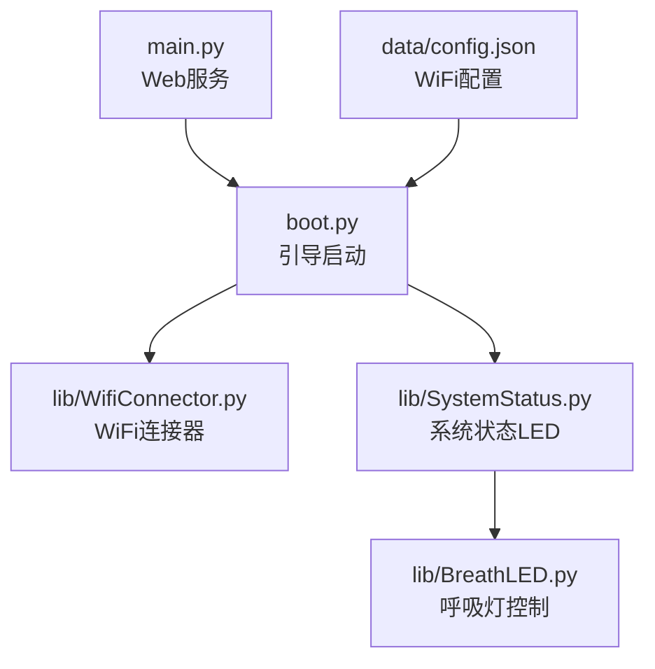
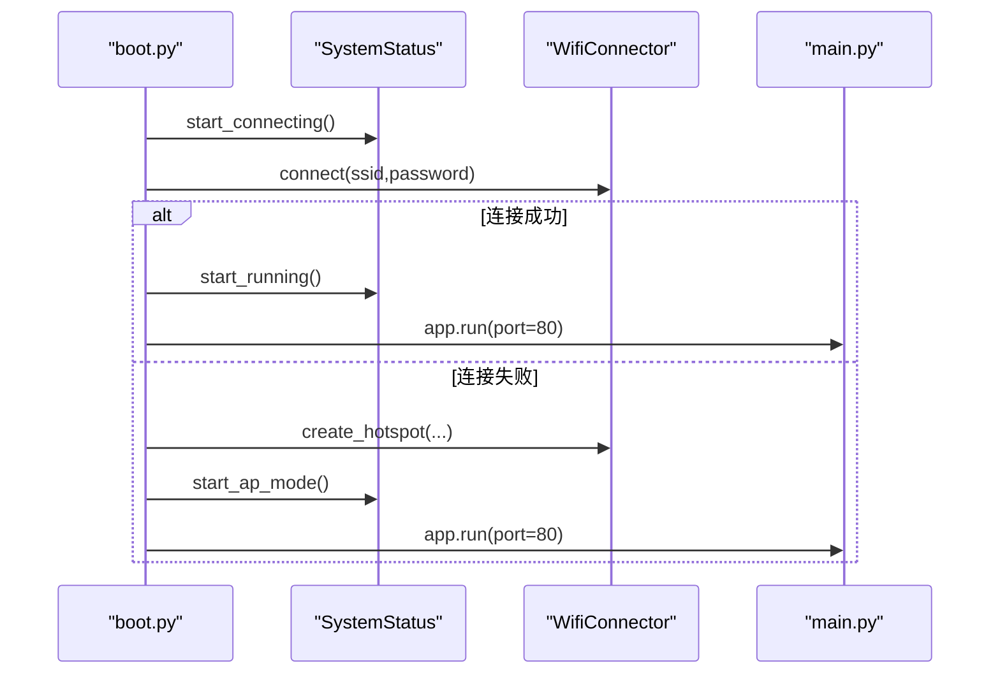
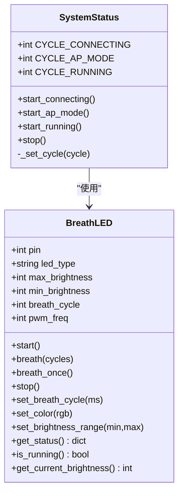
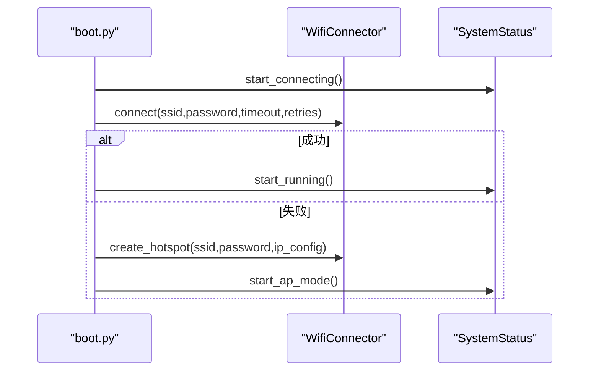
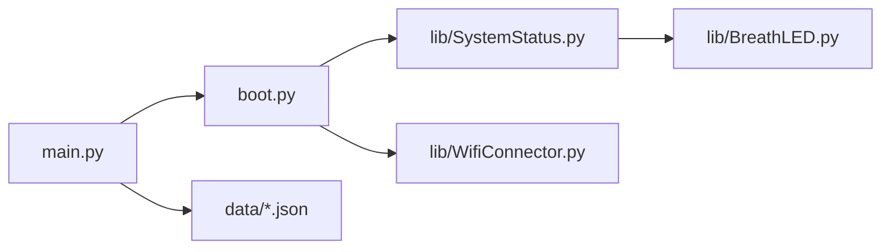

# 硬件部署

<cite>
**本文引用的文件**
- [boot.py](file://boot.py)
- [main.py](file://main.py)
- [lib/BreathLED.py](file://lib/BreathLED.py)
- [lib/SystemStatus.py](file://lib/SystemStatus.py)
- [lib/WifiConnector.py](file://lib/WifiConnector.py)
- [lib/breath_led_example.py](file://lib/breath_led_example.py)
- [lib/wifi_connector_example.py](file://lib/wifi_connector_example.py)
- [data/config.json](file://data/config.json)
</cite>

## 目录
1. [简介](#简介)
2. [项目结构](#项目结构)
3. [核心组件](#核心组件)
4. [架构总览](#架构总览)
5. [详细组件分析](#详细组件分析)
6. [依赖关系分析](#依赖关系分析)
7. [性能考量](#性能考量)
8. [故障排查指南](#故障排查指南)
9. [结论](#结论)
10. [附录](#附录)

## 简介
本指南面向“围炉诗社·理事台”项目的硬件部署，聚焦于ESP32开发板的物理连接、系统状态LED（GPIO 15）的呼吸灯效果实现、硬件初始化流程、GPIO引脚配置与电源管理最佳实践，并提供针对LED不亮、WiFi模块无法启动等常见问题的诊断步骤。文档内容严格基于仓库中的源码与配置文件，帮助开发者快速完成从硬件到软件的完整部署。

## 项目结构
项目采用“应用层 + 库层”的组织方式：
- 应用入口：boot.py（引导启动）、main.py（Web服务）
- 硬件状态与LED：lib/SystemStatus.py（封装系统状态LED）、lib/BreathLED.py（通用呼吸灯控制）
- 网络连接：lib/WifiConnector.py（WiFi连接与热点管理）
- 示例与配置：lib/breath_led_example.py、lib/wifi_connector_example.py、data/config.json

图表来源
- [boot.py](file://boot.py#L1-L122)
- [main.py](file://main.py#L1-L548)
- [lib/SystemStatus.py](file://lib/SystemStatus.py#L1-L61)
- [lib/BreathLED.py](file://lib/BreathLED.py#L1-L633)
- [lib/WifiConnector.py](file://lib/WifiConnector.py#L1-L800)
- [data/config.json](file://data/config.json#L1-L6)

章节来源
- [boot.py](file://boot.py#L1-L122)
- [main.py](file://main.py#L1-L548)
- [lib/SystemStatus.py](file://lib/SystemStatus.py#L1-L61)
- [lib/BreathLED.py](file://lib/BreathLED.py#L1-L633)
- [lib/WifiConnector.py](file://lib/WifiConnector.py#L1-L800)
- [data/config.json](file://data/config.json#L1-L6)

## 核心组件
- 系统状态LED（GPIO 15）：由SystemStatus封装，使用BreathLED实现呼吸灯效果，分别在“正在连接”“AP模式”“运行中”三种状态使用不同呼吸周期。
- WiFi连接器：负责STA/AP模式切换、热点创建、网络配置与诊断。
- Web服务：基于Microdot提供REST API与静态页面服务。

章节来源
- [lib/SystemStatus.py](file://lib/SystemStatus.py#L1-L61)
- [lib/BreathLED.py](file://lib/BreathLED.py#L1-L633)
- [lib/WifiConnector.py](file://lib/WifiConnector.py#L1-L800)
- [main.py](file://main.py#L1-L548)

## 架构总览
系统启动流程如下：
- boot.py加载配置，初始化WiFi连接器，根据配置尝试连接WiFi；若失败则进入AP模式。
- 在不同阶段通过SystemStatus控制GPIO 15的LED呼吸周期，直观反映系统状态。
- main.py启动Web服务，提供REST API与静态资源。

图表来源
- [boot.py](file://boot.py#L22-L87)
- [lib/SystemStatus.py](file://lib/SystemStatus.py#L33-L46)
- [lib/WifiConnector.py](file://lib/WifiConnector.py#L595-L695)
- [main.py](file://main.py#L541-L548)

## 详细组件分析

### 系统状态LED（GPIO 15）与呼吸灯机制
- 状态映射
  - 正在连接：快速呼吸（周期约500ms）
  - AP模式：中速呼吸（周期约1500ms）
  - 运行中：极慢呼吸（周期约4000ms）
- 实现要点
  - 使用普通LED模式（led_type='normal'），通过PWM调节占空比实现亮度变化。
  - 呼吸周期通过BreathLED.set_breath_cycle动态调整。
  - 通过定时器周期性回调更新LED亮度，使用正弦查找表平滑过渡。

图表来源
- [lib/SystemStatus.py](file://lib/SystemStatus.py#L19-L60)
- [lib/BreathLED.py](file://lib/BreathLED.py#L94-L169)

章节来源
- [lib/SystemStatus.py](file://lib/SystemStatus.py#L1-L61)
- [lib/BreathLED.py](file://lib/BreathLED.py#L1-L633)

### WiFi连接与热点管理
- 功能概览
  - 网络扫描、连接、断开、重连
  - 热点创建与管理（自定义IP、认证模式、客户端统计）
  - 静态IP配置与DHCP/静态IP动态切换
  - 网络信息同步与诊断
- 关键流程
  - boot.py根据配置尝试连接；失败则创建AP并设置LED为AP模式。
  - main.py启动Web服务，提供系统信息查询API。

图表来源
- [boot.py](file://boot.py#L22-L87)
- [lib/WifiConnector.py](file://lib/WifiConnector.py#L595-L695)
- [lib/SystemStatus.py](file://lib/SystemStatus.py#L33-L46)

章节来源
- [lib/WifiConnector.py](file://lib/WifiConnector.py#L1-L800)
- [boot.py](file://boot.py#L1-L122)
- [main.py](file://main.py#L528-L540)

### Web服务与静态资源
- 提供REST API与静态页面（index.html、style.css、app.js）
- 系统信息查询接口返回平台、存储、内存等信息
- 启动端口80，调试模式下输出详细日志

章节来源
- [main.py](file://main.py#L1-L548)

## 依赖关系分析
- boot.py依赖SystemStatus与WifiConnector，负责引导阶段的状态LED与网络连接。
- SystemStatus依赖BreathLED，封装LED呼吸周期。
- main.py依赖microdot提供Web服务，依赖data目录下的JSON数据文件。
- WifiConnector依赖ESP32网络接口（STA/AP），提供连接与诊断能力。

图表来源
- [boot.py](file://boot.py#L1-L12)
- [lib/SystemStatus.py](file://lib/SystemStatus.py#L10)
- [lib/BreathLED.py](file://lib/BreathLED.py#L6)
- [main.py](file://main.py#L10)
- [data/config.json](file://data/config.json#L1-L6)

章节来源
- [boot.py](file://boot.py#L1-L12)
- [lib/SystemStatus.py](file://lib/SystemStatus.py#L1-L61)
- [lib/BreathLED.py](file://lib/BreathLED.py#L1-L633)
- [main.py](file://main.py#L1-L548)
- [data/config.json](file://data/config.json#L1-L6)

## 性能考量
- CPU频率：引导阶段将CPU频率提升至240MHz，有助于更快的网络初始化与Web服务响应。
- LED更新策略：通过调整BreathLED的最小更新间隔与更新间隔除数，在视觉效果与CPU占用之间取得平衡。
- 定时器兼容：BreathLED在不同硬件平台（如ESP32）上尝试多种Timer初始化方式，确保稳定性。

章节来源
- [boot.py](file://boot.py#L8-L9)
- [lib/SystemStatus.py](file://lib/SystemStatus.py#L12-L17)
- [lib/BreathLED.py](file://lib/BreathLED.py#L261-L283)

## 故障排查指南

### 硬件连接与引脚配置
- 系统状态LED（GPIO 15）
  - 位置：ESP32-S2开发板的板载LED通常连接在GPIO 15。
  - 类型：普通LED模式（led_type='normal'），通过PWM控制亮度。
  - 引脚范围：BreathLED支持GPIO 0-40，具体取决于开发板。
- 建议
  - 若使用普通LED，请串联限流电阻（典型值220Ω~1kΩ，视供电电压与LED额定电流而定）。
  - 若使用WS2812，需注意数据线与电源匹配，避免过载。

章节来源
- [lib/SystemStatus.py](file://lib/SystemStatus.py#L25-L31)
- [lib/BreathLED.py](file://lib/BreathLED.py#L39-L46)

### LED不亮或无呼吸效果
- 检查项
  - 引脚配置：确认GPIO 15是否被正确初始化为输出。
  - PWM设置：确认PWM频率与占空比设置是否生效。
  - 状态LED调用：确认在引导阶段是否调用了start_connecting/start_ap_mode/start_running。
  - 资源冲突：确保同一时间只有一个定时器在驱动LED。
- 诊断步骤
  - 在引导阶段打印状态LED调用日志，确认是否触发。
  - 使用get_status()查看当前配置与运行状态。
  - 临时使用示例代码验证LED功能。

章节来源
- [lib/SystemStatus.py](file://lib/SystemStatus.py#L33-L46)
- [lib/BreathLED.py](file://lib/BreathLED.py#L595-L624)
- [lib/breath_led_example.py](file://lib/breath_led_example.py#L1-L199)

### WiFi模块无法启动或连接失败
- 检查项
  - 配置文件：确认data/config.json中的SSID与密码正确。
  - 连接超时与重试：boot.py中设置了连接超时与最大重试次数。
  - 热点模式：若连接失败，系统将创建AP并设置LED为AP模式。
  - 网络诊断：使用WifiConnector的诊断接口获取连接状态与错误信息。
- 诊断步骤
  - 在boot.py中观察连接尝试日志与错误信息。
  - 使用scan_networks()扫描周边网络，确认可见性与信号强度。
  - 使用get_diagnostics()获取详细诊断信息。
  - 如遇WiFi模块内部错误，可尝试重置WiFi模块。

章节来源
- [boot.py](file://boot.py#L22-L87)
- [lib/WifiConnector.py](file://lib/WifiConnector.py#L518-L576)
- [lib/WifiConnector.py](file://lib/WifiConnector.py#L253-L326)
- [lib/WifiConnector.py](file://lib/WifiConnector.py#L341-L362)
- [data/config.json](file://data/config.json#L1-L6)

### Web服务无法访问或端口占用
- 检查项
  - 端口80占用：确认无其他进程占用80端口。
  - 网络连接：确认WiFi已成功连接，IP地址有效。
  - 日志输出：在调试模式下查看启动日志与错误信息。
- 诊断步骤
  - 在main.py中查看系统状态打印，确认WiFi IP与内存信息。
  - 通过浏览器访问根路径与静态资源路径，确认路由与文件存在。

章节来源
- [main.py](file://main.py#L279-L294)
- [main.py](file://main.py#L299-L306)
- [main.py](file://main.py#L541-L548)

## 结论
本指南基于仓库源码梳理了“围炉诗社·理事台”的硬件部署要点，重点覆盖了：
- ESP32-S2开发板的系统状态LED（GPIO 15）与呼吸灯效果实现
- 引导阶段的WiFi连接与AP模式切换流程
- Web服务的启动与静态资源访问
- 针对LED不亮、WiFi模块无法启动等常见问题的诊断步骤

建议在实际部署中结合示例代码与配置文件进行验证，确保硬件连接与软件配置一致。

## 附录

### 硬件初始化流程（概要）
- 引导阶段
  - 设置CPU频率
  - 初始化WiFi连接器
  - 加载配置文件
  - 尝试连接WiFi；失败则创建AP
  - 根据模式设置LED呼吸周期
  - 启动Web服务

章节来源
- [boot.py](file://boot.py#L8-L122)

### GPIO引脚与LED配置参考
- 系统状态LED：GPIO 15（普通LED模式）
- 示例代码中也展示了WS2812与普通LED的不同引脚用法

章节来源
- [lib/SystemStatus.py](file://lib/SystemStatus.py#L25-L31)
- [lib/breath_led_example.py](file://lib/breath_led_example.py#L86-L103)