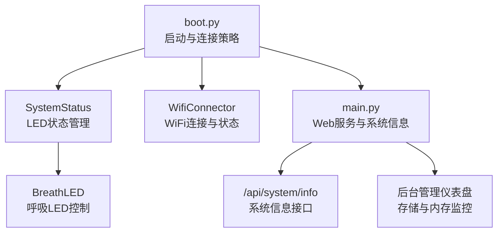
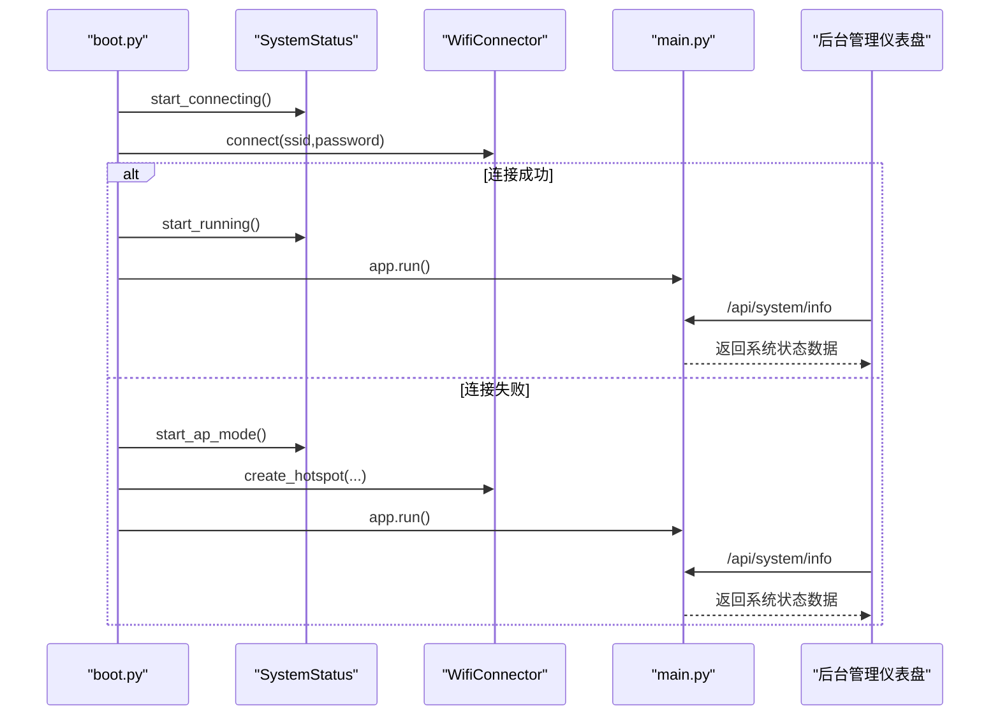
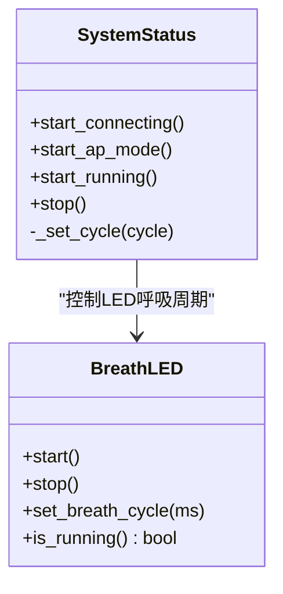
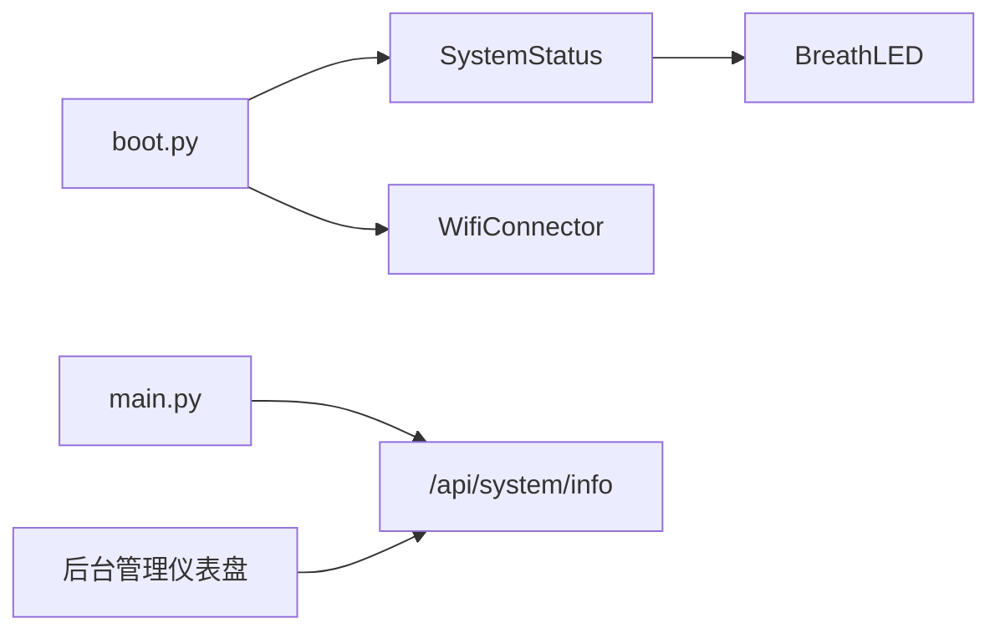

# 系统监控

<cite>
**本文引用的文件**
- [boot.py](file://src/boot.py)
- [main.py](file://src/main.py)
- [lib/SystemStatus.py](file://src/lib/SystemStatus.py)
- [lib/BreathLED.py](file://src/lib/BreathLED.py)
- [lib/WifiConnector.py](file://src/lib/WifiConnector.py)
- [lib/WifiConnector_min.py](file://src/lib/WifiConnector_min.py)
- [lib/BreathLED_min.py](file://src/lib/BreathLED_min.py)
- [lib/WifiConnector_README.md](file://src/lib/WifiConnector_README.md)
- [lib/BreathLED_README.md](file://src/lib/BreathLED_README.md)
- [data/config.json](file://src/data/config.json)
- [static/index.html](file://src/static/index.html)
- [static/app.js](file://src/static/app.js)
</cite>

## 更新摘要
**变更内容**
- 新增系统信息API接口，提供完整的设备状态监控
- 增强前端后台管理仪表盘，实时显示存储空间和内存使用情况
- 完善系统健康检查功能，包括存储空间、内存使用和运行时状态监控
- 新增设备状态LED指示器的详细工作机制说明

## 目录
1. [简介](#简介)
2. [项目结构](#项目结构)
3. [核心组件](#核心组件)
4. [架构总览](#架构总览)
5. [详细组件分析](#详细组件分析)
6. [系统监控功能](#系统监控功能)
7. [依赖关系分析](#依赖关系分析)
8. [性能考量](#性能考量)
9. [故障排查指南](#故障排查指南)
10. [结论](#结论)
11. [附录](#附录)

## 简介
本指南面向"围炉诗社·理事台"项目，围绕系统监控与状态指示展开，重点说明以下内容：
- 系统状态LED指示器工作机制：连接中、AP模式、运行中等状态下的LED表现与控制逻辑
- SystemStatus类的状态管理与LED控制流程
- 系统健康检查方法：内存使用、CPU频率、网络连接状态、存储空间监控
- 系统信息API接口的使用与监控数据解读
- 日志分析技巧、性能指标监控与系统资源评估方法

## 项目结构
项目采用"引导层 + 应用层 + 库层"的组织方式：
- 引导层：boot.py负责系统启动、WiFi连接策略与AP降级、LED状态指示
- 应用层：main.py提供Web服务与系统信息接口，便于远程监控
- 库层：SystemStatus、BreathLED、WifiConnector等模块封装LED呼吸、WiFi连接与状态查询



**图表来源**
- [boot.py](file://src/boot.py#L1-L122)
- [main.py](file://src/main.py#L847-L858)
- [lib/SystemStatus.py](file://src/lib/SystemStatus.py#L1-L61)
- [lib/BreathLED.py](file://src/lib/BreathLED.py#L1-L633)
- [lib/WifiConnector.py](file://src/lib/WifiConnector.py#L1-L1930)
- [static/index.html](file://src/static/index.html#L83-L106)
- [static/app.js](file://src/static/app.js#L1358-L1381)

**章节来源**
- [boot.py](file://src/boot.py#L1-L122)
- [main.py](file://src/main.py#L1-L867)
- [lib/SystemStatus.py](file://src/lib/SystemStatus.py#L1-L61)
- [lib/BreathLED.py](file://src/lib/BreathLED.py#L1-L633)
- [lib/WifiConnector.py](file://src/lib/WifiConnector.py#L1-L1930)
- [static/index.html](file://src/static/index.html#L83-L106)
- [static/app.js](file://src/static/app.js#L1358-L1381)

## 核心组件
- SystemStatus：封装LED状态指示，提供"连接中/AP模式/运行中"三种状态的呼吸周期控制，并通过全局实例在引导与应用阶段共享调用
- BreathLED：实现WS2812与普通LED的呼吸效果，支持周期、亮度范围、颜色等动态配置，以及定时器驱动的亮度插值更新
- WifiConnector：封装WiFi连接、热点创建、网络信息同步、连接状态监控与诊断，提供丰富的状态查询与便捷访问器
- 系统信息API：提供完整的设备状态监控接口，包括平台信息、存储空间、内存使用情况

**章节来源**
- [lib/SystemStatus.py](file://src/lib/SystemStatus.py#L1-L61)
- [lib/BreathLED.py](file://src/lib/BreathLED.py#L1-L633)
- [lib/WifiConnector.py](file://src/lib/WifiConnector.py#L1-L1930)
- [main.py](file://src/main.py#L847-L858)

## 架构总览
系统启动流程与LED状态联动如下：
- boot.py在启动时设置CPU频率，加载配置，尝试连接WiFi；若失败则进入AP模式
- 在连接中、AP模式、运行中三个阶段分别调用SystemStatus设置LED呼吸周期
- main.py提供系统信息接口，便于远程监控内存、存储、运行时状态
- 前端通过后台管理仪表盘实时显示设备状态信息



**图表来源**
- [boot.py](file://src/boot.py#L22-L87)
- [lib/SystemStatus.py](file://src/lib/SystemStatus.py#L33-L46)
- [lib/WifiConnector.py](file://src/lib/WifiConnector.py#L610-L763)
- [main.py](file://src/main.py#L847-L858)
- [static/index.html](file://src/static/index.html#L83-L106)
- [static/app.js](file://src/static/app.js#L1358-L1381)

## 详细组件分析

### SystemStatus：LED状态指示与控制
- 设计目标：通过单一板载LED（GPIO 15）指示系统状态，区分"连接中（快速呼吸）"、"AP模式（中速呼吸）"、"运行中（极慢呼吸）"
- 关键行为：
  - start_connecting：设置呼吸周期为快速（短周期），提示系统忙碌
  - start_ap_mode：设置呼吸周期为中速，提示等待连接
  - start_running：设置呼吸周期为极慢，提示稳定运行
  - stop：停止LED指示
  - 内部_set_cycle：设置周期并启动LED（若未运行）
- 性能优化：通过BreathLED.UPDATE_INTERVAL_MIN与UPDATE_INTERVAL_DIVISOR平衡效果与CPU占用



**图表来源**
- [lib/SystemStatus.py](file://src/lib/SystemStatus.py#L19-L60)
- [lib/BreathLED.py](file://src/lib/BreathLED.py#L344-L481)

**章节来源**
- [lib/SystemStatus.py](file://src/lib/SystemStatus.py#L1-L61)
- [lib/BreathLED.py](file://src/lib/BreathLED.py#L1-L633)

### BreathLED：呼吸LED控制
- 支持两种LED类型：WS2812（彩色）与普通LED（PWM）
- 核心机制：
  - 正弦查找表：预计算360°正弦值，避免实时三角函数计算
  - 定时器回调：按更新间隔计算当前亮度，WS2812写入RGB，普通LED设置PWM占空比
  - 呼吸周期与更新间隔：update_interval = max(UPDATE_INTERVAL_MIN, breath_cycle // UPDATE_INTERVAL_DIVISOR)
- 状态与查询：
  - is_running：检查是否正在运行
  - get_current_brightness：获取当前亮度
  - get_status：返回完整状态字典（包含引脚、类型、颜色、亮度范围、周期、定时器状态等）

**章节来源**
- [lib/BreathLED.py](file://src/lib/BreathLED.py#L1-L633)
- [lib/BreathLED_README.md](file://src/lib/BreathLED_README.md#L325-L336)

### WifiConnector：WiFi连接与状态监控
- 连接流程：
  - scan_networks：扫描可用网络并按信号强度排序
  - connect：连接指定网络，支持静态IP配置、自动重连、错误状态检查
  - reconnect：使用已保存凭据重连
  - disconnect/forget_network：断开与清除凭据
- 状态与诊断：
  - get_connection_status：返回连接状态、SSID、IP、MAC、错误信息
  - get_network_info：返回网络信息与信号质量描述
  - get_ip_address/get_mac_address/get_gateway_ip：便捷访问器
  - get_last_error：最近错误
- 热点管理（v1.2.0起增强）：
  - create_hotspot：创建AP，支持认证模式、信道、最大客户端数、IP配置
  - get_hotspot_info：获取热点状态、客户端数、认证模式名称
  - stop_hotspot：停止热点

**章节来源**
- [lib/WifiConnector.py](file://src/lib/WifiConnector.py#L518-L800)
- [lib/WifiConnector_README.md](file://src/lib/WifiConnector_README.md#L146-L278)

## 系统监控功能

### 系统信息API接口
项目新增了完整的系统信息API接口，提供设备状态监控能力：

#### 接口定义
- **URL**: `/api/system/info`
- **方法**: GET
- **功能**: 返回设备的系统状态信息，包括平台信息、存储空间、内存使用情况

#### 返回数据结构
```json
{
    "platform": "ESP32",
    "free_storage": 1048576,
    "total_storage": 4194304,
    "free_ram": 819200
}
```

#### 字段说明
- `platform`: 设备平台信息（固定为"ESP32"）
- `free_storage`: 可用存储空间（字节）
- `total_storage`: 总存储空间（字节）
- `free_ram`: 可用内存大小（字节）

#### 实现细节
- 使用`os.statvfs('/')`获取文件系统统计信息
- 通过`gc.mem_free()`获取当前可用内存
- 执行垃圾回收以确保准确的内存统计

**章节来源**
- [main.py](file://src/main.py#L847-L858)

### 前端监控界面
项目新增了后台管理仪表盘，实时显示设备状态信息：

#### 仪表盘布局
- **设备名称**: 显示平台信息
- **总存储 (Flash)**: 显示总存储容量
- **剩余存储**: 显示可用存储空间
- **当前内存 (RAM)**: 显示可用内存大小

#### 数据展示逻辑
- 前端通过`loadSystemInfo()`函数定期调用系统信息API
- 自动将字节转换为KB单位进行显示
- 支持首页简单信息和后台管理页面的双重展示

**章节来源**
- [static/index.html](file://src/static/index.html#L83-L106)
- [static/app.js](file://src/static/app.js#L1358-L1381)

### 设备状态LED指示器
系统状态LED指示器提供直观的设备状态反馈：

#### 状态定义
- **连接中**: 快速呼吸（周期500ms），表示正在尝试连接WiFi
- **AP模式**: 中速呼吸（周期1500ms），表示热点模式已启动
- **运行中**: 极慢呼吸（周期4000ms），表示WiFi连接成功且系统稳定运行

#### 控制逻辑
- 通过`SystemStatus`类管理LED状态
- 呼吸周期通过`BreathLED`类实现
- 支持手动停止LED指示

**章节来源**
- [lib/SystemStatus.py](file://src/lib/SystemStatus.py#L19-L60)
- [lib/BreathLED.py](file://src/lib/BreathLED.py#L1-L633)

## 依赖关系分析
- boot.py依赖SystemStatus与WifiConnector，负责启动阶段的LED状态与连接策略
- main.py依赖microdot框架与数据库封装，提供系统信息接口
- SystemStatus依赖BreathLED实现LED控制
- WifiConnector为独立模块，提供WiFi连接与状态查询能力
- 前端通过JavaScript调用系统信息API获取实时监控数据



**图表来源**
- [boot.py](file://src/boot.py#L1-L122)
- [main.py](file://src/main.py#L847-L858)
- [lib/SystemStatus.py](file://src/lib/SystemStatus.py#L1-L61)
- [lib/BreathLED.py](file://src/lib/BreathLED.py#L1-L633)
- [lib/WifiConnector.py](file://src/lib/WifiConnector.py#L1-L1930)
- [static/index.html](file://src/static/index.html#L83-L106)
- [static/app.js](file://src/static/app.js#L1358-L1381)

**章节来源**
- [boot.py](file://src/boot.py#L1-L122)
- [main.py](file://src/main.py#L847-L858)
- [lib/SystemStatus.py](file://src/lib/SystemStatus.py#L1-L61)
- [lib/BreathLED.py](file://src/lib/BreathLED.py#L1-L633)
- [lib/WifiConnector.py](file://src/lib/WifiConnector.py#L1-L1930)
- [static/index.html](file://src/static/index.html#L83-L106)
- [static/app.js](file://src/static/app.js#L1358-L1381)

## 性能考量
- CPU频率：启动时设置为240 MHz，有助于提升网络与Web服务响应速度
- LED控制：BreathLED通过正弦查找表与定时器回调实现平滑呼吸，UPDATE_INTERVAL_MIN与DIVISOR用于平衡效果与CPU占用
- 内存管理：main.py在系统信息接口中调用gc.collect()，并在状态打印中输出可用内存，便于监控内存压力
- 网络同步：WifiConnector对网络信息采用缓存与定时同步策略，避免频繁底层查询
- 系统信息API：每次调用都会执行垃圾回收，确保内存统计准确性

**章节来源**
- [boot.py](file://src/boot.py#L8-L9)
- [lib/SystemStatus.py](file://src/lib/SystemStatus.py#L13-L18)
- [lib/BreathLED.py](file://src/lib/BreathLED.py#L30-L66)
- [main.py](file://src/main.py#L850-L851)
- [lib/WifiConnector.py](file://src/lib/WifiConnector.py#L253-L326)

## 故障排查指南

### 系统状态LED不亮或异常
- 检查SystemStatus初始化是否成功，若LED初始化失败会记录错误并跳过LED控制
- 确认GPIO 15可用且未被其他外设占用
- 若LED异常闪烁或停止，检查BreathLED定时器是否被其他模块抢占或资源释放

**章节来源**
- [lib/SystemStatus.py](file://src/lib/SystemStatus.py#L25-L31)
- [lib/BreathLED.py](file://src/lib/BreathLED.py#L115-L127)

### WiFi连接失败
- 使用WifiConnector的get_last_error获取最近错误信息
- 检查配置文件data/config.json中的SSID与密码是否正确
- 使用scan_networks确认目标网络可见，get_network_info查看信号强度与认证模式
- 如需静态IP，使用connect_with_static_ip或switch_to_static_ip进行配置

**章节来源**
- [data/config.json](file://src/data/config.json#L1-L6)
- [lib/WifiConnector.py](file://src/lib/WifiConnector.py#L518-L800)
- [lib/WifiConnector_README.md](file://src/lib/WifiConnector_README.md#L197-L234)

### 系统健康检查清单
- **内存使用**: 调用/api/system/info接口获取free_ram，或在main.py中打印可用内存
- **存储空间**: 通过系统信息接口获取free_storage与total_storage
- **CPU频率**: 启动日志显示当前CPU频率
- **网络状态**: 通过get_connection_status与get_network_info获取连接状态、IP、MAC、信号质量
- **设备状态**: 通过后台管理仪表盘实时监控存储和内存使用情况

**章节来源**
- [main.py](file://src/main.py#L847-L858)
- [boot.py](file://src/boot.py#L8-L9)
- [lib/WifiConnector.py](file://src/lib/WifiConnector.py#L436-L477)
- [static/index.html](file://src/static/index.html#L83-L106)
- [static/app.js](file://src/static/app.js#L1358-L1381)

### 系统信息API使用指南
- **接口调用**: 通过HTTP GET请求访问`/api/system/info`
- **数据解析**: 前端自动将字节转换为KB单位显示
- **监控频率**: 建议每30-60秒调用一次以获取实时状态
- **错误处理**: API调用失败时返回空对象，前端应进行适当的错误处理

**章节来源**
- [main.py](file://src/main.py#L847-L858)
- [static/app.js](file://src/static/app.js#L1358-L1381)

### 日志分析技巧
- 启用调试模式：WifiConnector构造函数支持debug参数，SystemStatus与BreathLED均提供调试输出
- 关键日志位置：
  - boot.py：连接尝试、AP启动、启动完成等
  - main.py：系统状态打印、API请求处理
  - lib/WifiConnector.py：连接状态变化、错误信息
  - lib/BreathLED.py：LED启动/停止、定时器配置、亮度更新
  - 系统信息API：内存统计、存储空间查询

**章节来源**
- [boot.py](file://src/boot.py#L12-L122)
- [main.py](file://src/main.py#L349-L363)
- [lib/WifiConnector.py](file://src/lib/WifiConnector.py#L135-L148)
- [lib/BreathLED.py](file://src/lib/BreathLED.py#L130-L133)

## 结论
本项目通过SystemStatus与BreathLED实现了直观的系统状态LED指示，结合WifiConnector的连接与状态监控能力，配合main.py提供的系统信息接口，形成了完整的系统监控体系。新增的系统信息API和后台管理仪表盘进一步增强了系统的可观测性。建议在生产部署中：
- 使用/api/system/info接口定期采集内存、存储与运行时状态
- 在关键节点启用调试输出，便于定位问题
- 合理设置LED呼吸周期与更新间隔，平衡视觉效果与CPU占用
- 利用后台管理仪表盘实时监控设备状态，及时发现资源瓶颈

## 附录

### 系统状态LED对照表
- **连接中**: 快速呼吸（周期500ms）
- **AP模式**: 中速呼吸（周期1500ms）
- **运行中**: 极慢呼吸（周期4000ms）

**章节来源**
- [lib/SystemStatus.py](file://src/lib/SystemStatus.py#L20-L23)

### 系统信息API数据字段说明
- **platform**: 设备平台标识（固定值）
- **free_storage**: 可用存储空间（字节）
- **total_storage**: 总存储空间（字节）
- **free_ram**: 可用内存大小（字节）

**章节来源**
- [main.py](file://src/main.py#L847-L858)

### 关键接口与方法索引
- **SystemStatus**: start_connecting、start_ap_mode、start_running、stop、_set_cycle
- **BreathLED**: start、stop、set_breath_cycle、is_running、get_current_brightness、get_status
- **WifiConnector**: connect、disconnect、reconnect、get_connection_status、get_network_info、create_hotspot、get_hotspot_info、get_last_error
- **系统信息API**: /api/system/info

**章节来源**
- [lib/SystemStatus.py](file://src/lib/SystemStatus.py#L33-L57)
- [lib/BreathLED.py](file://src/lib/BreathLED.py#L344-L633)
- [lib/WifiConnector.py](file://src/lib/WifiConnector.py#L595-L763)
- [main.py](file://src/main.py#L847-L858)