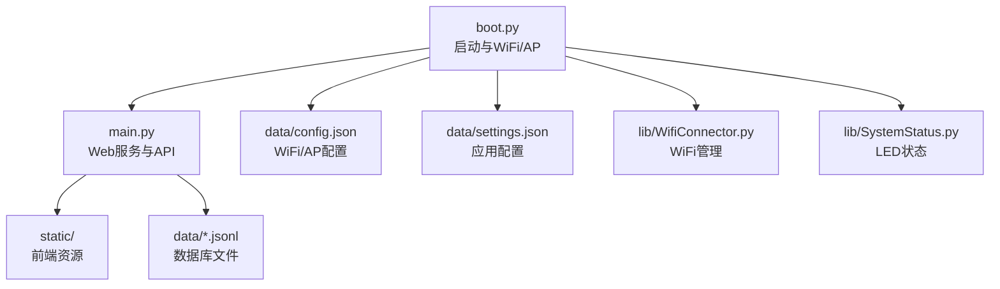
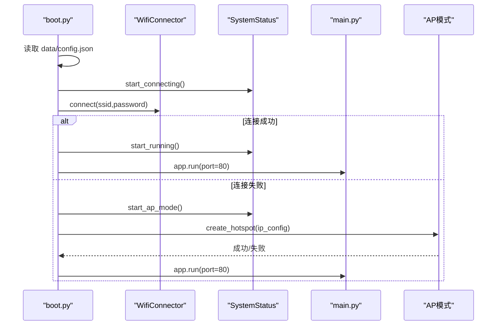
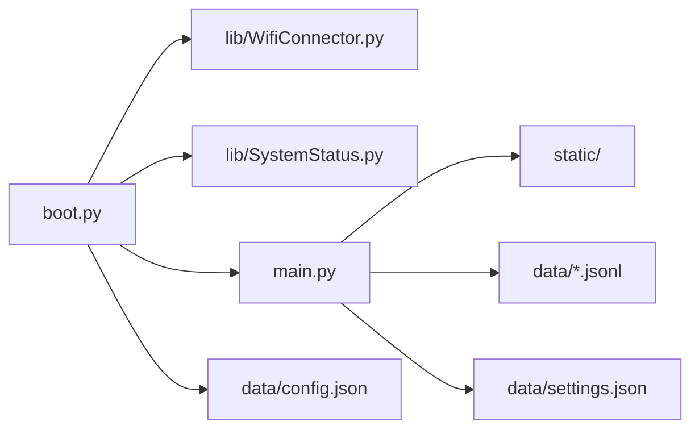

# 软件配置

<cite>
**本文引用的文件**
- [boot.py](file://boot.py)
- [main.py](file://main.py)
- [data/config.json](file://data/config.json)
- [data/settings.json](file://data/settings.json)
- [lib/WifiConnector.py](file://lib/WifiConnector.py)
- [lib/SystemStatus.py](file://lib/SystemStatus.py)
- [lib/BreathLED.py](file://lib/BreathLED.py)
- [lib/wifi_connector_example.py](file://lib/wifi_connector_example.py)
- [lib/WifiConnector_README.md](file://lib/WifiConnector_README.md)
- [lib/BreathLED_README.md](file://lib/BreathLED_README.md)
</cite>

## 目录
1. [简介](#简介)
2. [项目结构](#项目结构)
3. [核心组件](#核心组件)
4. [架构总览](#架构总览)
5. [详细组件分析](#详细组件分析)
6. [依赖关系分析](#依赖关系分析)
7. [性能考虑](#性能考虑)
8. [故障排查指南](#故障排查指南)
9. [结论](#结论)
10. [附录](#附录)

## 简介
本指南面向“围炉诗社·理事台”项目，提供完整的软件配置说明，涵盖：
- MicroPython 环境安装与基础配置
- mpremote 工具使用方法
- config.json 的 WiFi 与 AP 模式配置详解
- settings.json 的应用配置说明
- 代码上传流程与文件系统管理
- 配置文件格式要求与最佳实践

## 项目结构
项目采用“引导层 + 应用层 + 配置数据 + 库模块”的分层组织：
- 引导层：boot.py 负责系统启动、WiFi 连接与 AP 模式降级、LED 状态指示
- 应用层：main.py 提供 Web API 与前端静态资源服务
- 配置数据：data/ 目录存放 config.json 与 settings.json
- 库模块：lib/ 目录封装 WiFi 管理、LED 呼吸控制、Web 框架等

图表来源
- [boot.py](file://boot.py#L1-L122)
- [main.py](file://main.py#L1-L548)
- [data/config.json](file://data/config.json#L1-L6)
- [data/settings.json](file://data/settings.json#L1-L1)
- [lib/WifiConnector.py](file://lib/WifiConnector.py#L1-L120)
- [lib/SystemStatus.py](file://lib/SystemStatus.py#L1-L61)

章节来源
- [boot.py](file://boot.py#L1-L122)
- [main.py](file://main.py#L1-L548)

## 核心组件
- 引导与网络：boot.py 通过 WifiConnector 连接 WiFi；若失败则进入 AP 模式，并通过 SystemStatus 控制 LED 状态
- Web 应用：main.py 提供路由、API、静态资源服务与 JSONL 数据库
- 配置文件：config.json 管理 WiFi 与 AP 参数；settings.json 管理应用字段等运行参数
- LED 指示：SystemStatus 与 BreathLED 提供呼吸灯状态反馈

章节来源
- [boot.py](file://boot.py#L1-L122)
- [main.py](file://main.py#L1-L548)
- [lib/WifiConnector.py](file://lib/WifiConnector.py#L1-L120)
- [lib/SystemStatus.py](file://lib/SystemStatus.py#L1-L61)
- [lib/BreathLED.py](file://lib/BreathLED.py#L1-L120)

## 架构总览
系统启动流程与网络连接策略如下：

图表来源
- [boot.py](file://boot.py#L22-L87)
- [lib/WifiConnector.py](file://lib/WifiConnector.py#L595-L696)
- [lib/SystemStatus.py](file://lib/SystemStatus.py#L33-L46)

章节来源
- [boot.py](file://boot.py#L22-L87)
- [lib/WifiConnector.py](file://lib/WifiConnector.py#L595-L696)
- [lib/SystemStatus.py](file://lib/SystemStatus.py#L33-L46)

## 详细组件分析

### 配置文件：config.json
- 作用：存储 WiFi 名称与密码、AP 名称与密码
- 字段说明
  - wifi_ssid：路由器 SSID
  - wifi_password：路由器密码（建议≥8位）
  - ap_ssid：热点 SSID
  - ap_password：热点密码（建议≥8位）
- 格式要求
  - 必须为合法 JSON 对象
  - 字段名严格匹配，大小写敏感
  - 建议使用英文字符与数字，避免特殊字符导致解析异常
- 读取位置：boot.py 在启动时从根目录 data/config.json 读取

章节来源
- [data/config.json](file://data/config.json#L1-L6)
- [boot.py](file://boot.py#L14-L39)

### 配置文件：settings.json
- 作用：应用运行参数与功能开关（当前示例为自定义成员字段）
- 字段说明
  - custom_member_fields：自定义成员字段数组，每项包含 id、type、label 等
- 格式要求
  - 必须为合法 JSON 对象
  - custom_member_fields 为数组，元素为对象
- 读取与保存：main.py 提供 /api/settings/fields 接口读取与保存

章节来源
- [data/settings.json](file://data/settings.json#L1-L1)
- [main.py](file://main.py#L518-L526)

### WiFi 连接与 AP 模式
- 连接流程
  - boot.py 读取 config.json，提取 wifi_ssid 与 wifi_password
  - 若 SSID 仍为默认占位符，则直接进入 AP 模式
  - 使用 WifiConnector.connect() 连接，失败则进入 AP 模式
- AP 模式
  - 通过 WifiConnector.create_hotspot() 创建热点
  - 默认 IP 为 192.168.18.1，子网掩码 255.255.255.0，DNS 8.8.8.8
- LED 状态
  - 正在连接：快速呼吸
  - AP 模式：中速呼吸
  - 连接成功：慢速呼吸

章节来源
- [boot.py](file://boot.py#L22-L87)
- [lib/WifiConnector.py](file://lib/WifiConnector.py#L595-L696)
- [lib/SystemStatus.py](file://lib/SystemStatus.py#L33-L46)

### Web 应用与静态资源
- 路由与 API
  - /：返回静态首页
  - /static/*：返回静态样式与脚本
  - /api/*：提供诗歌、活动、任务、成员、财务、登录、系统信息等 API
- JSONL 数据库
  - poems.jsonl、members.jsonl、activities.jsonl、finance.jsonl、tasks.jsonl
  - main.py 提供增删改查与分页检索

章节来源
- [main.py](file://main.py#L299-L540)

### LED 呼吸控制
- SystemStatus
  - 提供 start_connecting/start_ap_mode/start_running 三种状态指示
  - 呼吸周期分别为快速、中速、慢速
- BreathLED
  - 支持 WS2812 与普通 LED
  - 提供 start/breath/breath_once/stop/cleanup 等方法
  - v2.1.0 新增精确次数控制与智能优先级

章节来源
- [lib/SystemStatus.py](file://lib/SystemStatus.py#L1-L61)
- [lib/BreathLED.py](file://lib/BreathLED.py#L1-L120)

## 依赖关系分析

图表来源
- [boot.py](file://boot.py#L1-L12)
- [main.py](file://main.py#L1-L17)

章节来源
- [boot.py](file://boot.py#L1-L12)
- [main.py](file://main.py#L1-L17)

## 性能考虑
- WiFi 连接参数
  - boot.py 中已提升连接超时与重试次数，降低首次启动失败概率
  - 建议在网络信号较弱时适当增大超时与重试次数
- LED 呼吸算法
  - v2.1.0 采用预计算正弦查找表与自适应更新间隔，兼顾效果与 CPU 占用
- 静态资源与 API
  - main.py 对 JSONL 数据库采用按页扫描与偏移定位，避免一次性加载大文件
  - 建议前端分页请求，避免一次性传输过多数据

章节来源
- [boot.py](file://boot.py#L40-L63)
- [lib/BreathLED.py](file://lib/BreathLED.py#L70-L120)
- [main.py](file://main.py#L113-L185)

## 故障排查指南
- WiFi 连接失败
  - 检查 config.json 中的 SSID 与密码是否正确
  - 使用 WifiConnector 的诊断接口获取 last_error
  - 参考 README 的常见问题与错误代码说明
- AP 模式无法访问
  - 确认热点创建成功，IP 地址为 192.168.18.x
  - 检查设备是否连接到正确的热点 SSID
- LED 不工作
  - 确认 SystemStatus 初始化成功，引脚与硬件一致
  - 使用 BreathLED 的调试输出查看初始化与运行状态
- 配置文件格式错误
  - 确保 JSON 语法正确，字段名与类型符合预期
  - 使用在线 JSON 校验工具辅助检查

章节来源
- [lib/WifiConnector_README.md](file://lib/WifiConnector_README.md#L355-L379)
- [lib/WifiConnector.py](file://lib/WifiConnector.py#L140-L148)
- [lib/SystemStatus.py](file://lib/SystemStatus.py#L25-L31)
- [lib/BreathLED_README.md](file://lib/BreathLED_README.md#L358-L359)

## 结论
本指南提供了从 MicroPython 环境到项目配置、上传与运行的全流程说明。建议在部署前完成以下准备：
- 正确填写 config.json 与 settings.json
- 使用 mpremote 完成文件系统与代码上传
- 在弱信号环境下适当调整 WiFi 连接参数
- 通过 AP 模式验证热点与 Web 服务可用性

## 附录

### MicroPython 环境安装与 mpremote 使用
- 安装 MicroPython
  - 从官方下载对应开发板固件并烧录
  - 安装串口驱动与终端工具（如 esptool、screen、PuTTY）
- 安装 mpremote
  - 使用 pip 安装：pip install mpremote
  - 连接开发板串口，确认设备识别
- 常用命令
  - mpremote connect <端口>：连接设备
  - mpremote exec <命令>：执行单行 Python 代码
  - mpremote put <本地文件>：<远程路径>：上传单个文件
  - mpremote rsync <本地目录>：<远程目录>：同步目录
  - mpremote repl：进入交互式 REPL
  - mpremote disconnect：断开连接

章节来源
- [lib/WifiConnector_README.md](file://lib/WifiConnector_README.md#L304-L336)

### 代码上传流程与文件系统管理
- 上传顺序建议
  - 先上传 lib/ 库文件（如 WifiConnector、SystemStatus、BreathLED）
  - 再上传 boot.py、main.py
  - 最后上传 data/ 配置文件与 static/ 静态资源
- 文件系统管理
  - 使用 mpremote rsync 同步整个项目目录，覆盖旧文件
  - 上传后可通过 mpremote exec 查看文件是否存在
  - 首次运行前确保 data/ 目录存在且包含 config.json 与 settings.json

章节来源
- [boot.py](file://boot.py#L88-L122)
- [main.py](file://main.py#L1-L17)

### 配置文件格式要求与校验
- config.json
  - 字段：wifi_ssid、wifi_password、ap_ssid、ap_password
  - 建议：密码长度≥8位；避免特殊字符；英文或数字组合
- settings.json
  - 字段：custom_member_fields（数组）
  - 建议：每项包含 id、type、label；保持结构一致性
- 校验方法
  - 在本地使用 JSON 校验工具
  - 上传后通过 main.py 的 /api/system/info 检查系统状态

章节来源
- [data/config.json](file://data/config.json#L1-L6)
- [data/settings.json](file://data/settings.json#L1-L1)
- [main.py](file://main.py#L528-L540)