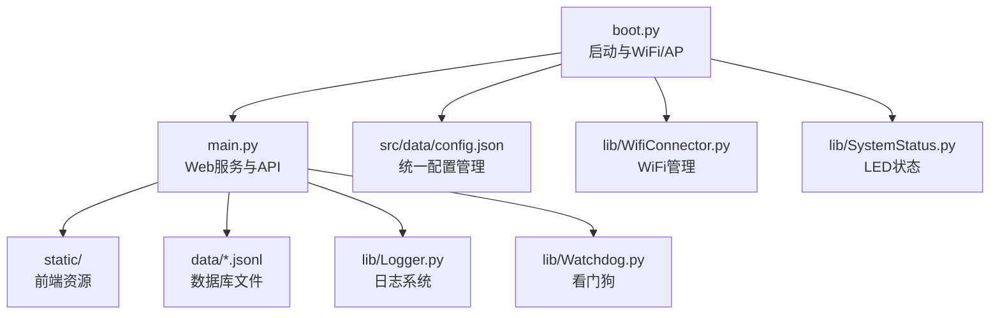
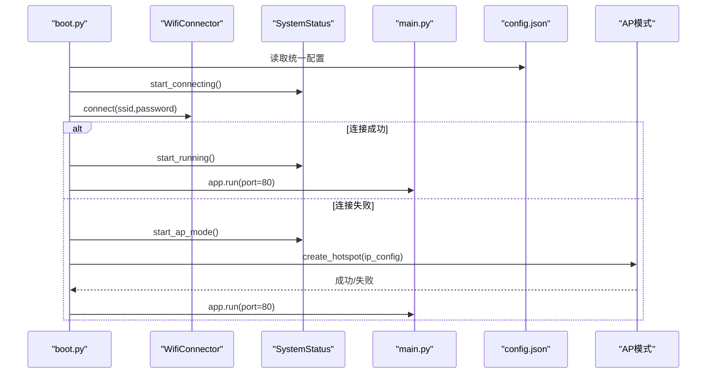
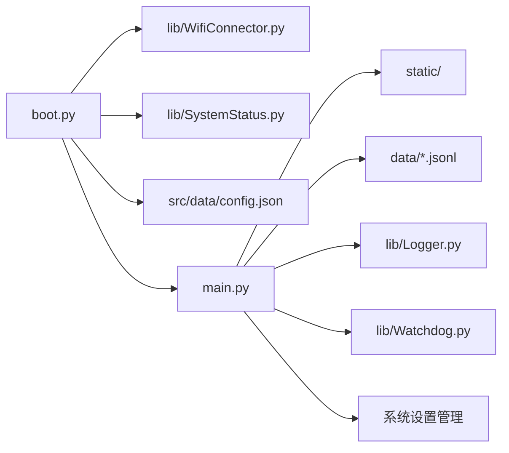

# 软件配置

<cite>
**本文引用的文件**
- [boot.py](file://src/boot.py)
- [main.py](file://src/main.py)
- [data/config.json](file://src/data/config.json)
- [lib/WifiConnector.py](file://src/lib/WifiConnector.py)
- [lib/SystemStatus.py](file://src/lib/SystemStatus.py)
- [lib/BreathLED.py](file://src/lib/BreathLED.py)
- [lib/Watchdog.py](file://src/lib/Watchdog.py)
- [lib/Logger.py](file://src/lib/Logger.py)
- [static/index.html](file://src/static/index.html)
- [static/app.js](file://src/static/app.js)
</cite>

## 更新摘要
**变更内容**
- 配置文件整合：将系统设置、调试模式、看门狗配置等统一到 data/config.json 中
- 移除了独立的 settings.json 文件，所有系统配置集中管理
- 新增静态IP配置选项，支持 DHCP 和静态IP两种网络模式
- 增强了 WiFi 连接稳定性，包含重试机制和错误处理
- 完善了看门狗和日志系统的配置化管理

## 目录
1. [简介](#简介)
2. [项目结构](#项目结构)
3. [核心组件](#核心组件)
4. [架构总览](#架构总览)
5. [详细组件分析](#详细组件分析)
6. [依赖关系分析](#依赖关系分析)
7. [性能考虑](#性能考虑)
8. [故障排查指南](#故障排查指南)
9. [结论](#结论)
10. [附录](#附录)

## 简介
本指南面向"围炉诗社·理事台"项目，提供完整的软件配置说明，涵盖：
- MicroPython 环境安装与基础配置
- mpremote 工具使用方法
- config.json 的 WiFi 与 AP 模式配置详解
- 系统设置、调试模式、看门狗配置的统一管理
- 代码上传流程与文件系统管理
- 配置文件格式要求与最佳实践

## 项目结构
项目采用"引导层 + 应用层 + 配置数据 + 库模块"的分层组织：
- 引导层：boot.py 负责系统启动、WiFi 连接与 AP 模式降级、LED 状态指示
- 应用层：main.py 提供 Web API 与前端静态资源服务
- 配置数据：src/data/ 目录存放统一的 config.json 配置文件
- 库模块：src/lib/ 目录封装 WiFi 管理、LED 呼吸控制、Web 框架等

**图表来源**
- [boot.py](file://src/boot.py#L1-L153)
- [main.py](file://src/main.py#L1-L1789)
- [src/data/config.json](file://src/data/config.json#L1-L1)
- [lib/WifiConnector.py](file://src/lib/WifiConnector.py#L1-L1019)
- [lib/SystemStatus.py](file://src/lib/SystemStatus.py#L1-L146)
- [lib/Logger.py](file://src/lib/Logger.py#L1-L128)
- [lib/Watchdog.py](file://src/lib/Watchdog.py#L1-L119)

**章节来源**
- [boot.py](file://src/boot.py#L1-L153)
- [main.py](file://src/main.py#L1-L1789)

## 核心组件
- 引导与网络：boot.py 通过 WifiConnector 连接 WiFi；若失败则进入 AP 模式，并通过 SystemStatus 控制 LED 状态
- Web 应用：main.py 提供路由、API、静态资源服务与 JSONL 数据库
- 统一配置：config.json 管理 WiFi、AP、系统设置、调试模式、看门狗等所有配置参数
- LED 指示：SystemStatus 与 BreathLED 提供呼吸灯状态反馈
- 系统监控：Logger 和 Watchdog 提供日志记录和系统保护

**章节来源**
- [boot.py](file://src/boot.py#L1-L153)
- [main.py](file://src/main.py#L1-L1789)
- [lib/WifiConnector.py](file://src/lib/WifiConnector.py#L1-L1019)
- [lib/SystemStatus.py](file://src/lib/SystemStatus.py#L1-L146)
- [lib/BreathLED.py](file://src/lib/BreathLED.py#L1-L347)
- [lib/Logger.py](file://src/lib/Logger.py#L1-L128)
- [lib/Watchdog.py](file://src/lib/Watchdog.py#L1-L119)

## 架构总览
系统启动流程与网络连接策略如下：

**图表来源**
- [boot.py](file://src/boot.py#L28-L105)
- [lib/WifiConnector.py](file://src/lib/WifiConnector.py#L315-L375)
- [lib/SystemStatus.py](file://src/lib/SystemStatus.py#L47-L66)

**章节来源**
- [boot.py](file://src/boot.py#L28-L105)
- [lib/WifiConnector.py](file://src/lib/WifiConnector.py#L315-L375)
- [lib/SystemStatus.py](file://src/lib/SystemStatus.py#L47-L66)

## 详细组件分析

### 统一配置文件：config.json
**更新** 配置文件已整合，移除了独立的 settings.json 文件

- 作用：统一管理所有系统配置，包括 WiFi、AP、系统设置、调试模式、看门狗等
- 主要配置类别
  - WiFi 连接配置：wifi_ssid、wifi_password、sta_use_static_ip、sta_ip、sta_subnet、sta_gateway、sta_dns
  - AP 热点配置：ap_ssid、ap_password、ap_ip
  - 系统设置：system_name、points_name、custom_member_fields、password_salt
  - 调试配置：debug_mode
  - 看门狗配置：watchdog_enabled、watchdog_timeout
- 格式要求
  - 必须为合法 JSON 对象
  - 字段名严格匹配，大小写敏感
  - 建议使用英文字符与数字，避免特殊字符导致解析异常
- 读取位置：boot.py、main.py、Logger、Watchdog 等模块从根目录 src/data/config.json 读取

**章节来源**
- [src/data/config.json](file://src/data/config.json#L1-L1)
- [boot.py](file://src/boot.py#L19-L26)
- [lib/Logger.py](file://src/lib/Logger.py#L48-L57)
- [lib/Watchdog.py](file://src/lib/Watchdog.py#L42-L55)

### WiFi 连接与 AP 模式
- 连接流程
  - boot.py 从 config.json 读取 WiFi 配置，提取 wifi_ssid 与 wifi_password
  - 若 SSID 仍为默认占位符，则直接进入 AP 模式
  - 使用 WifiConnector.connect() 连接，失败则进入 AP 模式
  - 支持静态 IP 和 DHCP 两种模式
- AP 模式
  - 通过 WifiConnector.create_hotspot() 创建热点
  - 默认 IP 为 192.168.1.68，子网掩码 255.255.255.0，DNS 8.8.8.8
- LED 状态
  - 正在连接：快速呼吸
  - AP 模式：中速呼吸
  - 连接成功：慢速呼吸

**章节来源**
- [boot.py](file://src/boot.py#L28-L105)
- [lib/WifiConnector.py](file://src/lib/WifiConnector.py#L610-L763)
- [lib/SystemStatus.py](file://src/lib/SystemStatus.py#L47-L66)

### Web 应用与静态资源
- 路由与 API
  - /：返回静态首页
  - /static/*：返回静态样式与脚本
  - /api/*：提供诗歌、活动、任务、成员、财务、登录、系统信息等 API
- JSONL 数据库
  - poems.jsonl、members.jsonl、activities.jsonl、finance.jsonl、tasks.jsonl
  - main.py 提供增删改查与分页检索
- 系统设置管理
  - system_name：系统显示名称
  - points_name：积分名称
  - password_salt：密码加盐值
  - custom_member_fields：自定义成员字段配置

**章节来源**
- [main.py](file://src/main.py#L534-L541)
- [main.py](file://src/main.py#L474-L511)
- [static/index.html](file://src/static/index.html#L244-L259)

### LED 呼吸控制
- SystemStatus
  - 提供 start_connecting/start_ap_mode/start_running 三种状态指示
  - 呼吸周期分别为快速、中速、慢速
- BreathLED
  - 支持 WS2812 与普通 LED
  - 提供 start/breath/breath_once/stop/cleanup 等方法
  - v2.1.0 新增精确次数控制与智能优先级

**章节来源**
- [lib/SystemStatus.py](file://src/lib/SystemStatus.py#L27-L146)
- [lib/BreathLED.py](file://src/lib/BreathLED.py#L1-L347)

### 日志系统与看门狗
- Logger
  - 从 config.json 读取 debug_mode 配置
  - 支持 DEBUG/INFO/WARN/ERROR 四级日志
  - 生产环境默认关闭 DEBUG 日志输出
- Watchdog
  - 从 config.json 读取 watchdog_enabled 和 watchdog_timeout 配置
  - 实现硬件看门狗机制，防止系统锁死
  - 支持动态启用/禁用和超时时间配置

**章节来源**
- [lib/Logger.py](file://src/lib/Logger.py#L29-L128)
- [lib/Watchdog.py](file://src/lib/Watchdog.py#L17-L119)

## 依赖关系分析

**图表来源**
- [boot.py](file://src/boot.py#L1-L18)
- [main.py](file://src/main.py#L1-L16)

**章节来源**
- [boot.py](file://src/boot.py#L1-L18)
- [main.py](file://src/main.py#L1-L16)

## 性能考虑
- WiFi 连接参数
  - boot.py 中已提升连接超时与重试次数，降低首次启动失败概率
  - 建议在网络信号较弱时适当增大超时与重试次数
  - 支持静态 IP 配置，提高网络稳定性
- LED 呼吸算法
  - v2.1.0 采用预计算正弦查找表与自适应更新间隔，兼顾效果与 CPU 占用
- 静态资源与 API
  - main.py 对 JSONL 数据库采用按页扫描与偏移定位，避免一次性加载大文件
  - 建议前端分页请求，避免一次性传输过多数据
- 看门狗与日志
  - 看门狗定时喂狗器每30秒喂一次狗，留足安全裕度
  - 日志系统根据配置动态控制 DEBUG 日志输出，减少生产环境日志开销

**章节来源**
- [boot.py](file://src/boot.py#L48-L88)
- [lib/BreathLED.py](file://src/lib/BreathLED.py#L29-L347)
- [main.py](file://src/main.py#L27-L48)
- [lib/Watchdog.py](file://src/lib/Watchdog.py#L34-L55)

## 故障排查指南
- WiFi 连接失败
  - 检查 config.json 中的 SSID 与密码是否正确
  - 使用 WifiConnector 的诊断接口获取 last_error
  - 检查静态 IP 配置是否正确（IP、子网掩码、网关、DNS）
  - 参考 README 的常见问题与错误代码说明
- AP 模式无法访问
  - 确认热点创建成功，IP 地址为 192.168.1.68
  - 检查设备是否连接到正确的热点 SSID
- LED 不工作
  - 确认 SystemStatus 初始化成功，引脚与硬件一致
  - 使用 BreathLED 的调试输出查看初始化与运行状态
- 配置文件格式错误
  - 确保 JSON 语法正确，字段名与类型符合预期
  - 使用在线 JSON 校验工具辅助检查
- 看门狗问题
  - 检查 watchdog_enabled 配置是否为 true
  - 确认 watchdog_timeout 设置合理（10-300秒）
- 日志问题
  - 检查 debug_mode 配置是否为 true
  - 确认日志输出级别设置正确

**章节来源**
- [lib/WifiConnector.py](file://src/lib/WifiConnector.py#L315-L375)
- [lib/SystemStatus.py](file://src/lib/SystemStatus.py#L47-L66)
- [lib/Watchdog.py](file://src/lib/Watchdog.py#L42-L55)
- [lib/Logger.py](file://src/lib/Logger.py#L48-L57)

## 结论
本指南提供了从 MicroPython 环境到项目配置、上传与运行的全流程说明。配置文件整合后，系统管理更加统一和便捷。建议在部署前完成以下准备：
- 正确填写 config.json 中的所有配置项
- 使用 mpremote 完成文件系统与代码上传
- 在弱信号环境下适当调整 WiFi 连接参数
- 通过 AP 模式验证热点与 Web 服务可用性
- 根据实际需求配置静态 IP 和网络参数

## 附录

### MicroPython 环境安装与 mpremote 使用
- 安装 MicroPython
  - 从官方下载对应开发板固件并烧录
  - 安装串口驱动与终端工具（如 esptool、screen、PuTTY）
- 安装 mpremote
  - 使用 pip 安装：pip install mpremote
  - 连接开发板串口，确认设备识别
- 常用命令
  - mpremote connect <端口>：连接设备
  - mpremote exec <命令>：执行单行 Python 代码
  - mpremote put <本地文件>：<远程路径>：上传单个文件
  - mpremote rsync <本地目录>：<远程目录>：同步目录
  - mpremote repl：进入交互式 REPL
  - mpremote disconnect：断开连接

**章节来源**
- [lib/WifiConnector.py](file://src/lib/WifiConnector.py#L1-L1019)

### 代码上传流程与文件系统管理
- 上传顺序建议
  - 先上传 lib/ 库文件（如 WifiConnector、SystemStatus、BreathLED）
  - 再上传 boot.py、main.py
  - 最后上传 data/ 配置文件与 static/ 静态资源
- 文件系统管理
  - 使用 mpremote rsync 同步整个项目目录，覆盖旧文件
  - 上传后可通过 mpremote exec 查看文件是否存在
  - 首次运行前确保 data/ 目录存在且包含 config.json

**章节来源**
- [boot.py](file://src/boot.py#L130-L153)
- [main.py](file://src/main.py#L1-L16)

### 配置文件格式要求与校验
- config.json
  - 字段：wifi_ssid、wifi_password、ap_ssid、ap_password、system_name、points_name、custom_member_fields、password_salt、debug_mode、watchdog_enabled、watchdog_timeout
  - 网络配置：sta_use_static_ip、sta_ip、sta_subnet、sta_gateway、sta_dns
  - 建议：密码长度≥8位；避免特殊字符；英文或数字组合
- 校验方法
  - 在本地使用 JSON 校验工具
  - 上传后通过 main.py 的 /api/system/info 检查系统状态
  - 检查看门狗和日志配置是否正确加载

**章节来源**
- [src/data/config.json](file://src/data/config.json#L1-L1)
- [main.py](file://src/main.py#L528-L540)
- [lib/Logger.py](file://src/lib/Logger.py#L48-L57)
- [lib/Watchdog.py](file://src/lib/Watchdog.py#L42-L55)