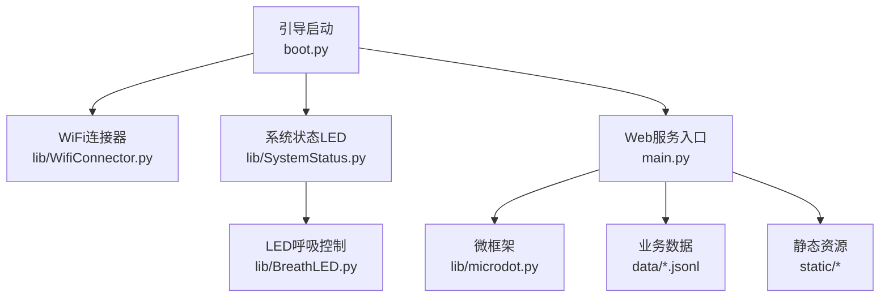
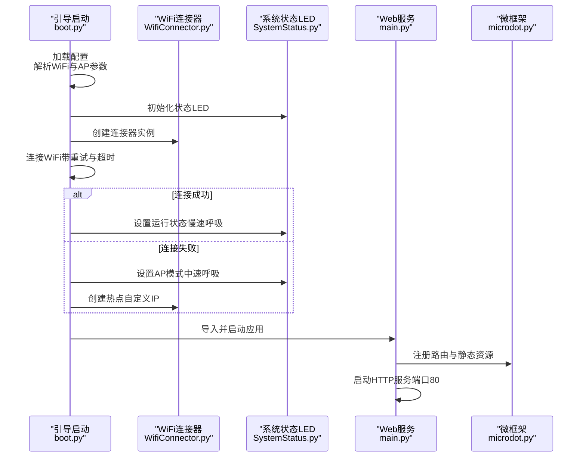
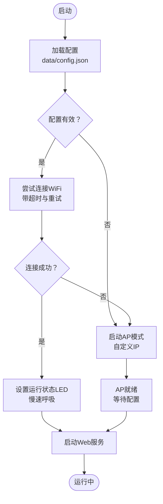
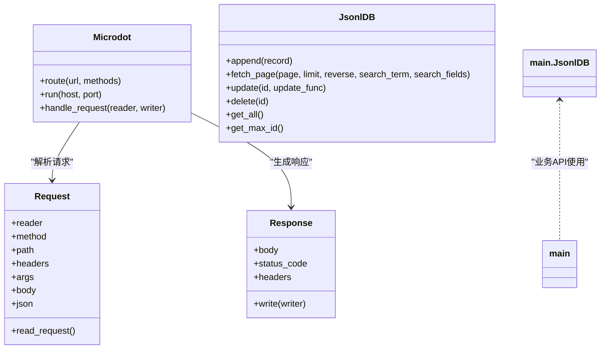
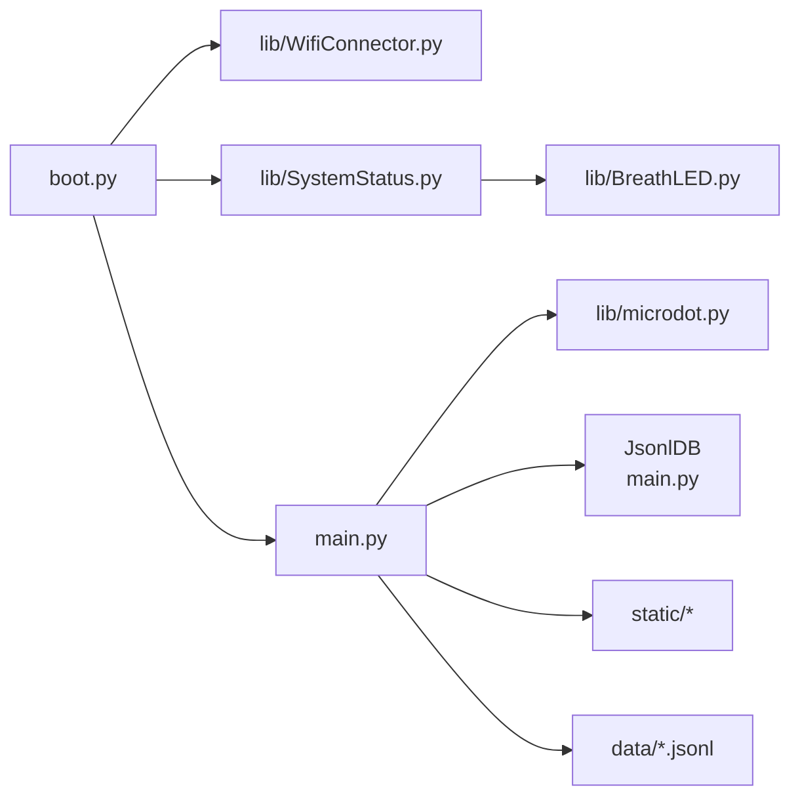

# 部署运维

<cite>
**本文引用的文件**
- [boot.py](file://boot.py)
- [main.py](file://main.py)
- [WifiConnector.py](file://lib/WifiConnector.py)
- [SystemStatus.py](file://lib/SystemStatus.py)
- [BreathLED.py](file://lib/BreathLED.py)
- [microdot.py](file://lib/microdot.py)
- [config.json](file://data/config.json)
- [settings.json](file://data/settings.json)
- [index.html](file://static/index.html)
- [WifiConnector_README.md](file://lib/WifiConnector_README.md)
- [BreathLED_README.md](file://lib/BreathLED_README.md)
</cite>

## 目录
1. [简介](#简介)
2. [项目结构](#项目结构)
3. [核心组件](#核心组件)
4. [架构总览](#架构总览)
5. [详细组件分析](#详细组件分析)
6. [依赖关系分析](#依赖关系分析)
7. [性能考虑](#性能考虑)
8. [故障排查指南](#故障排查指南)
9. [结论](#结论)
10. [附录](#附录)

## 简介
本指南面向“围炉诗社·理事台”项目的部署与运维，覆盖硬件部署、软件配置、网络环境准备、生产部署策略、监控与性能调优、系统健康检查、日志分析、故障诊断、备份与灾难恢复、系统升级以及WiFi配置与系统状态监控的最佳实践。内容基于仓库中的实际代码与配置文件，确保可操作、可落地。

## 项目结构
项目采用“引导启动 + Web服务 + 数据文件 + 硬件状态指示”的分层组织：
- 引导启动：boot.py 负责系统启动、WiFi连接与AP回退、Web服务启动与LED状态指示
- Web服务：main.py 提供REST API与静态资源路由，基于轻量级微框架 microdot
- 硬件与网络：lib/WifiConnector.py 提供WiFi连接、热点、诊断与持久化能力；lib/SystemStatus.py 与 lib/BreathLED.py 提供LED状态指示
- 数据与前端：data/ 存放配置与业务数据；static/ 提供前端页面与静态资源

图表来源
- [boot.py](file://boot.py#L1-L122)
- [main.py](file://main.py#L1-L17)
- [WifiConnector.py](file://lib/WifiConnector.py#L1-L120)
- [SystemStatus.py](file://lib/SystemStatus.py#L1-L61)
- [BreathLED.py](file://lib/BreathLED.py#L1-L120)
- [microdot.py](file://lib/microdot.py#L1-L183)

章节来源
- [boot.py](file://boot.py#L1-L122)
- [main.py](file://main.py#L1-L17)

## 核心组件
- 引导启动与WiFi：boot.py 负责加载配置、连接WiFi、失败回退至AP模式，并启动Web服务
- WiFi连接器：lib/WifiConnector.py 提供扫描、连接、重连、热点、诊断、持久化等能力
- 系统状态LED：lib/SystemStatus.py 与 lib/BreathLED.py 提供单LED呼吸指示，区分连接中、AP模式、运行中三种状态
- Web服务与API：main.py 基于 microdot 提供REST API与静态资源路由
- 数据层：data/ 下的 JSONL 文件承载诗歌、成员、活动、财务、任务等数据；settings.json 存放系统设置

章节来源
- [boot.py](file://boot.py#L14-L87)
- [WifiConnector.py](file://lib/WifiConnector.py#L11-L120)
- [SystemStatus.py](file://lib/SystemStatus.py#L19-L61)
- [BreathLED.py](file://lib/BreathLED.py#L11-L120)
- [main.py](file://main.py#L17-L267)
- [microdot.py](file://lib/microdot.py#L94-L183)
- [config.json](file://data/config.json#L1-L6)
- [settings.json](file://data/settings.json#L1-L1)

## 架构总览
系统启动流程与组件交互如下：

图表来源
- [boot.py](file://boot.py#L22-L87)
- [WifiConnector.py](file://lib/WifiConnector.py#L54-L120)
- [SystemStatus.py](file://lib/SystemStatus.py#L25-L58)
- [main.py](file://main.py#L17-L267)
- [microdot.py](file://lib/microdot.py#L94-L183)

## 详细组件分析

### 引导启动与WiFi连接流程
- 配置加载：从 data/config.json 读取WiFi与AP参数
- 连接策略：若配置为默认占位值则进入AP模式；否则尝试连接，失败后回退AP模式
- 超时与重试：可配置连接超时与最大重试次数
- AP模式：自定义IP段与默认密码，便于首次配置与调试

图表来源
- [boot.py](file://boot.py#L14-L87)
- [config.json](file://data/config.json#L1-L6)

章节来源
- [boot.py](file://boot.py#L22-L87)
- [config.json](file://data/config.json#L1-L6)

### WiFi连接器（WifiConnector）
- 功能要点：网络扫描、连接/断开、自动重连、热点创建与管理、静态IP配置与切换、诊断与持久化
- 静态IP：支持独立配置、便捷连接、运行时切换DHCP/静态IP，具备IP格式校验与网关推断
- 便捷访问器：提供IP、MAC、网关、SSID等常用信息的缓存访问
- 资源管理：提供cleanup，确保断开与停止后释放资源

章节来源
- [WifiConnector.py](file://lib/WifiConnector.py#L11-L120)
- [WifiConnector.py](file://lib/WifiConnector.py#L595-L800)
- [WifiConnector_README.md](file://lib/WifiConnector_README.md#L1-L418)

### 系统状态LED（SystemStatus + BreathLED）
- 单LED模式：GPIO 15，区分三种呼吸周期（快速/中速/慢速），分别指示连接中、AP模式、运行中
- 性能优化：降低更新间隔与除数，平衡效果与CPU占用
- 状态切换：根据网络模式动态设置LED呼吸周期并启动

章节来源
- [SystemStatus.py](file://lib/SystemStatus.py#L19-L61)
- [BreathLED.py](file://lib/BreathLED.py#L11-L120)

### Web服务与API（main + microdot）
- 路由与静态资源：首页与静态CSS/JS/PNG；API涵盖诗歌、活动、任务、成员、财务、系统信息等
- 微框架：基于轻量异步HTTP框架，支持请求解析、响应写入与文件流式发送
- 数据模型：JsonlDB 抽象JSONL文件为数据库，支持追加、更新、删除、分页检索与全文搜索

图表来源
- [microdot.py](file://lib/microdot.py#L5-L183)
- [main.py](file://main.py#L53-L267)

章节来源
- [main.py](file://main.py#L17-L267)
- [microdot.py](file://lib/microdot.py#L94-L183)

### 前端与静态资源
- 首页 index.html 提供导航、搜索、各模块卡片与模态框
- 静态资源路径与内容类型由 microdot 的 send_file 统一处理

章节来源
- [index.html](file://static/index.html#L1-L269)
- [microdot.py](file://lib/microdot.py#L166-L183)

## 依赖关系分析
- 引导启动依赖 WiFi连接器与系统状态LED
- Web服务依赖微框架与数据层（JsonlDB）
- 系统状态LED依赖 LED控制库
- 前端依赖静态资源与API

图表来源
- [boot.py](file://boot.py#L5-L6)
- [main.py](file://main.py#L10-L17)
- [SystemStatus.py](file://lib/SystemStatus.py#L10-L10)
- [BreathLED.py](file://lib/BreathLED.py#L6-L9)

章节来源
- [boot.py](file://boot.py#L5-L6)
- [main.py](file://main.py#L10-L17)

## 性能考虑
- CPU频率：引导阶段将CPU频率提升至240MHz，有助于网络与IO处理
- LED更新节流：SystemStatus 调整 BreathLED 的更新间隔参数，平衡效果与CPU占用
- 分页与搜索：JsonlDB 的分页与搜索在大数据集下需注意内存与磁盘IO，建议合理设置页大小与索引策略
- 静态资源：microdot 的 send_file 支持文件流式传输，避免一次性读取大文件
- 异步处理：基于 uasyncio 的轻量HTTP框架，适合嵌入式环境

章节来源
- [boot.py](file://boot.py#L8-L9)
- [SystemStatus.py](file://lib/SystemStatus.py#L16-L17)
- [main.py](file://main.py#L113-L185)
- [microdot.py](file://lib/microdot.py#L166-L183)

## 故障排查指南
- WiFi连接失败
  - 检查 data/config.json 中的SSID与密码是否正确
  - 使用 WifiConnector 的诊断接口获取最后错误信息
  - 若连接不稳定，启用连接监控与自动重连
- AP模式无法访问
  - 确认AP IP段与默认密码配置
  - 检查引导启动日志中AP创建是否成功
- Web服务不可达
  - 确认端口80是否被占用
  - 检查 main.py 的路由注册与静态资源路径
- LED无指示
  - 确认GPIO 15是否可用
  - 检查 SystemStatus 初始化与 BreathLED 的硬件初始化
- 数据异常
  - 检查 JSONL 文件是否存在与格式是否正确
  - 使用 JsonlDB 的迁移逻辑（.json 到 .jsonl）

章节来源
- [boot.py](file://boot.py#L22-L87)
- [WifiConnector.py](file://lib/WifiConnector.py#L135-L148)
- [WifiConnector_README.md](file://lib/WifiConnector_README.md#L355-L379)
- [main.py](file://main.py#L68-L85)
- [SystemStatus.py](file://lib/SystemStatus.py#L25-L31)
- [BreathLED.py](file://lib/BreathLED.py#L228-L244)

## 结论
本项目以简洁可靠的架构实现了“围炉诗社·理事台”的本地Web服务与状态指示。通过引导启动的WiFi连接与AP回退、LED状态指示、轻量Web服务与JSONL数据模型，满足小型组织的日常运营与管理需求。建议在生产环境中结合静态IP、连接监控与定期备份策略，进一步提升稳定性与可维护性。

## 附录

### 硬件部署步骤
- 准备开发板与LED：确保GPIO 15可用，连接单个LED或WS2812灯带
- 烧录固件：将项目文件上传至ESP32开发板
- 首次配置：通过AP模式连接热点，访问Web界面配置WiFi与系统参数

章节来源
- [boot.py](file://boot.py#L65-L87)
- [config.json](file://data/config.json#L1-L6)

### 软件配置流程
- 配置WiFi：编辑 data/config.json，填写正确的SSID与密码
- 配置AP：可选地设置AP SSID与密码
- 自定义字段：通过 /api/settings/fields 接口管理成员自定义字段

章节来源
- [config.json](file://data/config.json#L1-L6)
- [settings.json](file://data/settings.json#L1-L1)
- [main.py](file://main.py#L518-L527)

### 网络环境准备
- 静态IP（可选）：使用 WifiConnector 的静态IP配置与切换功能，确保与局域网一致
- DHCP/静态切换：运行时可在DHCP与静态IP之间切换
- 热点管理：在无可用WiFi时自动创建热点，便于配置与调试

章节来源
- [WifiConnector.py](file://lib/WifiConnector.py#L432-L502)
- [WifiConnector.py](file://lib/WifiConnector.py#L697-L800)
- [WifiConnector_README.md](file://lib/WifiConnector_README.md#L197-L234)

### 生产部署策略
- 频率与资源：维持引导阶段的CPU频率，确保网络与IO性能
- 连接监控：定期调用连接监控接口，自动重连与诊断
- 日志与诊断：启用调试输出，收集连接状态与错误信息
- 静态资源：确保静态文件存在，避免404

章节来源
- [boot.py](file://boot.py#L8-L9)
- [WifiConnector.py](file://lib/WifiConnector.py#L253-L339)
- [microdot.py](file://lib/microdot.py#L166-L183)

### 监控配置与性能调优
- LED节流：SystemStatus 已优化更新间隔，避免过度占用CPU
- 分页与搜索：合理设置页大小，避免一次性加载大量数据
- 异步处理：利用微框架的异步特性，减少阻塞

章节来源
- [SystemStatus.py](file://lib/SystemStatus.py#L16-L17)
- [main.py](file://main.py#L113-L185)
- [microdot.py](file://lib/microdot.py#L154-L165)

### 系统健康检查
- 系统信息：/api/system/info 返回平台、存储与内存信息
- WiFi状态：通过 WifiConnector 的状态接口获取连接与网络信息
- 前端健康：首页与静态资源加载正常即为健康

章节来源
- [main.py](file://main.py#L528-L540)
- [WifiConnector.py](file://lib/WifiConnector.py#L253-L339)

### 日志分析与故障诊断
- 调试输出：WifiConnector 与 BreathLED 提供调试开关，便于定位问题
- 最后错误：使用 get_last_error 获取最近错误信息
- 连接状态：通过 get_connection_status 与 get_diagnostics 获取详细状态

章节来源
- [WifiConnector.py](file://lib/WifiConnector.py#L135-L148)
- [WifiConnector_README.md](file://lib/WifiConnector_README.md#L280-L284)

### 备份策略与灾难恢复
- 数据备份：定期复制 data/ 下的 JSONL 文件与 settings.json
- 配置备份：备份 data/config.json 与热点配置文件
- 恢复流程：将备份文件恢复到相同路径，重启服务验证

章节来源
- [config.json](file://data/config.json#L1-L6)
- [settings.json](file://data/settings.json#L1-L1)
- [WifiConnector_README.md](file://lib/WifiConnector_README.md#L472-L508)

### 系统升级与版本演进
- WiFi连接器：v1.3.0 增强静态IP管理与DHCP/静态切换
- LED库：v2.1.0 新增精确次数控制与智能优先级
- 建议：升级前备份配置与数据，升级后验证连接与LED指示

章节来源
- [WifiConnector_README.md](file://lib/WifiConnector_README.md#L1-L418)
- [BreathLED_README.md](file://lib/BreathLED_README.md#L1-L442)

### WiFi配置、网络切换与系统状态监控最佳实践
- 首次配置：通过AP模式连接热点，访问Web界面完成WiFi配置
- 网络切换：在运行时使用静态IP连接或切换回DHCP，确保与局域网一致
- 状态监控：LED呼吸周期与运行状态联动，结合日志与诊断接口进行监控

章节来源
- [boot.py](file://boot.py#L65-L87)
- [WifiConnector.py](file://lib/WifiConnector.py#L697-L800)
- [SystemStatus.py](file://lib/SystemStatus.py#L33-L46)