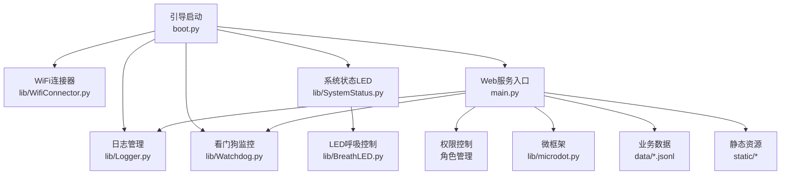
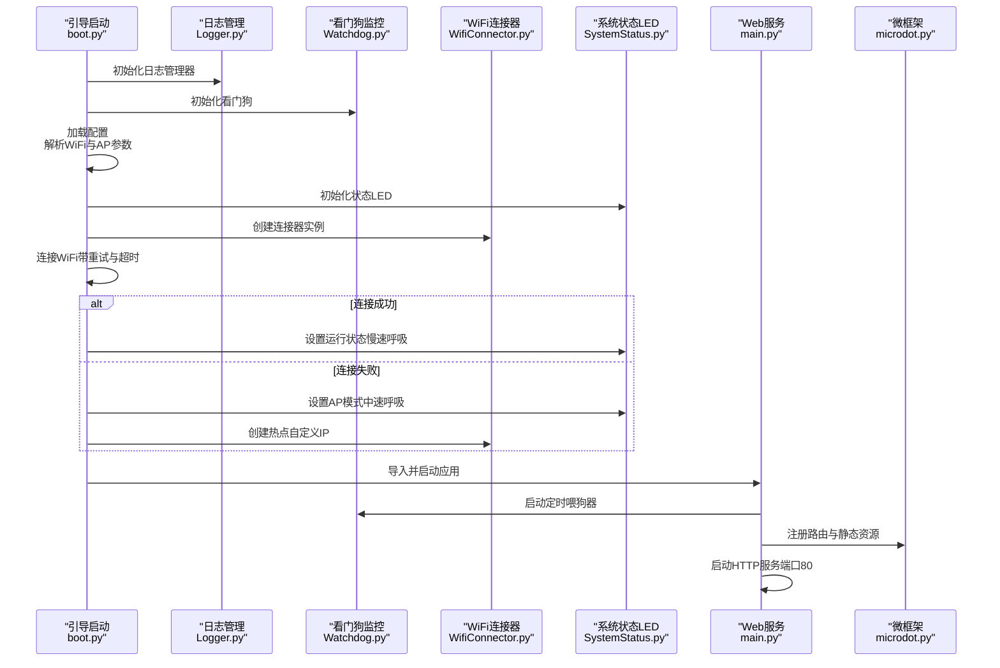
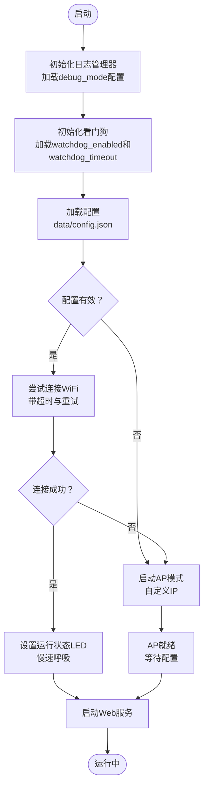
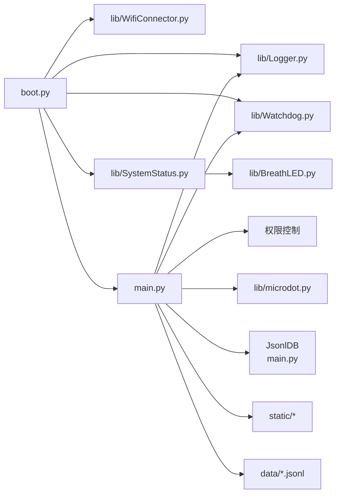

# 部署运维

<cite>
**本文引用的文件**
- [boot.py](file://src/boot.py)
- [main.py](file://src/main.py)
- [Logger.py](file://src/lib/Logger.py)
- [Watchdog.py](file://src/lib/Watchdog.py)
- [WifiConnector.py](file://src/lib/WifiConnector.py)
- [SystemStatus.py](file://src/lib/SystemStatus.py)
- [BreathLED.py](file://src/lib/BreathLED.py)
- [microdot.py](file://src/lib/microdot.py)
- [config.json](file://src/data/config.json)
- [config.json](file://src/data_backup/config.json)
</cite>

## 更新摘要
**变更内容**
- 新增日志管理模块（Logger.py）及其配置选项，提供统一日志记录接口
- 新增看门狗管理模块（Watchdog.py）及其配置选项，实现系统故障保护
- 新增权限控制系统，支持角色分级管理（超级管理员、管理员、理事、财务、成员）
- 优化系统状态LED性能，提升CPU资源利用率
- 简化WiFi连接管理，增强静态IP配置和网络切换能力
- 扩展引导启动流程以集成日志、看门狗和权限管理
- 增强系统监控和故障恢复能力

## 目录
1. [简介](#简介)
2. [项目结构](#项目结构)
3. [核心组件](#核心组件)
4. [架构总览](#架构总览)
5. [详细组件分析](#详细组件分析)
6. [依赖关系分析](#依赖关系分析)
7. [性能考虑](#性能考虑)
8. [故障排查指南](#故障排查指南)
9. [结论](#结论)
10. [附录](#附录)

## 简介
本指南面向"围炉诗社·理事台"项目的部署与运维，覆盖硬件部署、软件配置、网络环境准备、生产部署策略、监控与性能调优、系统健康检查、日志分析、故障诊断、备份与灾难恢复、系统升级以及WiFi配置与系统状态监控的最佳实践。内容基于仓库中的实际代码与配置文件，确保可操作、可落地。

**更新** 本版本新增了日志管理系统、看门狗监控机制、权限控制系统，以及系统状态LED优化、WiFi连接管理简化等改进，显著增强了系统的可观测性和可靠性。

## 项目结构
项目采用"引导启动 + Web服务 + 数据文件 + 硬件状态指示 + 日志管理 + 看门狗监控 + 权限控制"的分层组织：
- 引导启动：boot.py 负责系统启动、WiFi连接与AP回退、Web服务启动与LED状态指示、日志初始化与看门狗启动
- Web服务：main.py 提供REST API与静态资源路由，基于轻量级微框架 microdot，集成日志记录、看门狗监控和权限控制
- 日志管理：lib/Logger.py 提供多级别日志记录，支持调试模式控制
- 看门狗监控：lib/Watchdog.py 实现硬件看门狗机制，防止系统锁死
- 权限控制：main.py 实现角色分级权限管理，支持操作者身份验证和权限检查
- 硬件与网络：lib/WifiConnector.py 提供WiFi连接、热点、诊断与持久化能力；lib/SystemStatus.py 与 lib/BreathLED.py 提供LED状态指示
- 数据与前端：data/ 存放配置与业务数据；static/ 提供前端页面与静态资源

**图表来源**
- [boot.py](file://src/boot.py#L1-L153)
- [Logger.py](file://src/lib/Logger.py#L1-L128)
- [Watchdog.py](file://src/lib/Watchdog.py#L1-L119)
- [WifiConnector.py](file://src/lib/WifiConnector.py#L1-L120)
- [SystemStatus.py](file://src/lib/SystemStatus.py#L1-L146)
- [BreathLED.py](file://src/lib/BreathLED.py#L1-L347)
- [microdot.py](file://src/lib/microdot.py#L1-L204)

**章节来源**
- [boot.py](file://src/boot.py#L1-L153)
- [main.py](file://src/main.py#L1-L1789)

## 核心组件
- 引导启动与WiFi：boot.py 负责加载配置、连接WiFi、失败回退至AP模式，并启动Web服务
- 日志管理器：lib/Logger.py 提供单例模式的日志管理，支持DEBUG/INFO/WARN/ERROR四个级别，可通过配置控制调试模式
- 看门狗监控：lib/Watchdog.py 实现硬件看门狗机制，防止系统锁死，支持超时配置和动态启用/禁用
- 权限控制系统：main.py 实现角色分级权限管理，支持超级管理员、管理员、理事、财务、成员五级权限
- WiFi连接器：lib/WifiConnector.py 提供扫描、连接、重连、热点、诊断、持久化等能力
- 系统状态LED：lib/SystemStatus.py 与 lib/BreathLED.py 提供单LED呼吸指示，区分连接中、AP模式、运行中三种状态
- Web服务与API：main.py 基于 microdot 提供REST API与静态资源路由
- 数据层：data/ 下的 JSONL 文件承载诗歌、成员、活动、财务、任务等数据

**更新** 新增日志管理系统、看门狗监控机制和权限控制系统，提供更完善的系统监控和安全保障。

**章节来源**
- [boot.py](file://src/boot.py#L14-L87)
- [Logger.py](file://src/lib/Logger.py#L29-L98)
- [Watchdog.py](file://src/lib/Watchdog.py#L17-L101)
- [main.py](file://src/main.py#L358-L432)
- [WifiConnector.py](file://src/lib/WifiConnector.py#L11-L120)
- [SystemStatus.py](file://src/lib/SystemStatus.py#L27-L61)
- [BreathLED.py](file://src/lib/BreathLED.py#L1-L347)
- [microdot.py](file://src/lib/microdot.py#L115-L183)

## 架构总览
系统启动流程与组件交互如下：

**图表来源**
- [boot.py](file://src/boot.py#L13-L153)
- [Logger.py](file://src/lib/Logger.py#L42-L61)
- [Watchdog.py](file://src/lib/Watchdog.py#L57-L80)
- [WifiConnector.py](file://src/lib/WifiConnector.py#L54-L120)
- [SystemStatus.py](file://src/lib/SystemStatus.py#L25-L58)
- [main.py](file://src/main.py#L39-L47)
- [microdot.py](file://src/lib/microdot.py#L175-L183)

## 详细组件分析

### 引导启动与WiFi连接流程
- 配置加载：从 data/config.json 读取WiFi与AP参数
- 日志初始化：加载日志配置，设置调试模式
- 看门狗启动：初始化硬件看门狗，设置超时时间
- 连接策略：若配置为默认占位值则进入AP模式；否则尝试连接，失败后回退AP模式
- 超时与重试：可配置连接超时与最大重试次数
- AP模式：自定义IP段与默认密码，便于首次配置与调试

**图表来源**
- [boot.py](file://src/boot.py#L19-L153)
- [Logger.py](file://src/lib/Logger.py#L48-L61)
- [Watchdog.py](file://src/lib/Watchdog.py#L42-L55)
- [config.json](file://src/data/config.json#L1-L1)

**章节来源**
- [boot.py](file://src/boot.py#L28-L153)
- [Logger.py](file://src/lib/Logger.py#L48-L61)
- [Watchdog.py](file://src/lib/Watchdog.py#L42-L55)
- [config.json](file://src/data/config.json#L1-L1)

### 日志管理器（Logger）
- 功能要点：单例模式设计、多级别日志记录（DEBUG/INFO/WARN/ERROR）、配置驱动的调试模式控制
- 配置管理：从config.json读取debug_mode设置，支持运行时重新加载
- 日志级别：DEBUG仅在调试模式输出，INFO/WARN/ERROR始终输出
- 全局实例：提供log全局对象和便捷函数接口

**更新** 新增日志管理模块，提供统一的日志记录接口和配置控制。

**章节来源**
- [Logger.py](file://src/lib/Logger.py#L29-L98)
- [Logger.py](file://src/lib/Logger.py#L101-L128)

### 看门狗监控器（Watchdog）
- 功能要点：硬件看门狗实现、超时配置、动态启用/禁用、定时喂狗机制
- 配置管理：从config.json读取watchdog_enabled和watchdog_timeout设置
- 超时范围：最小10秒，最大300秒，默认300秒
- 定时器：每30秒自动喂狗，留足安全裕度
- 错误处理：喂狗失败静默处理，避免日志刷屏

**更新** 新增看门狗监控模块，提供系统故障恢复保护。

**章节来源**
- [Watchdog.py](file://src/lib/Watchdog.py#L17-L101)
- [Watchdog.py](file://src/lib/Watchdog.py#L104-L119)

### 权限控制系统
- 角色分级：超级管理员（super_admin）、管理员（admin）、理事（director）、财务（finance）、成员（member）
- 权限层级：数字越小权限越高，超级管理员权限最高
- 权限验证：通过check_permission函数验证操作者权限
- 操作者识别：通过operator_id从数据库查询用户角色
- 角色分配：can_assign_role函数检查是否允许分配目标角色

**更新** 新增权限控制系统，实现五级角色权限管理。

**章节来源**
- [main.py](file://src/main.py#L358-L432)
- [main.py](file://src/main.py#L390-L420)
- [main.py](file://src/main.py#L421-L432)

### WiFi连接器（WifiConnector）
- 功能要点：网络扫描、连接/断开、自动重连、热点创建与管理、静态IP配置与切换、诊断与持久化
- 静态IP：支持独立配置、便捷连接、运行时切换DHCP/静态IP，具备IP格式校验与网关推断
- 便捷访问器：提供IP、MAC、网关、SSID等常用信息的缓存访问
- 资源管理：提供cleanup，确保断开与停止后释放资源

**章节来源**
- [WifiConnector.py](file://src/lib/WifiConnector.py#L11-L120)
- [WifiConnector.py](file://src/lib/WifiConnector.py#L595-L800)

### 系统状态LED（SystemStatus + BreathLED）
- 单LED模式：GPIO 15，区分三种呼吸周期（快速/中速/慢速），分别指示连接中、AP模式、运行中
- 性能优化：降低更新间隔与除数，平衡效果与CPU占用
- 状态切换：根据网络模式动态设置LED呼吸周期并启动

**更新** 优化LED性能参数，提升CPU资源利用率。

**章节来源**
- [SystemStatus.py](file://src/lib/SystemStatus.py#L27-L61)
- [BreathLED.py](file://src/lib/BreathLED.py#L1-L347)

### Web服务与API（main + microdot）
- 路由与静态资源：首页与静态CSS/JS/PNG；API涵盖诗歌、活动、任务、成员、财务、系统信息等
- 微框架：基于轻量异步HTTP框架，支持请求解析、响应写入与文件流式发送
- 数据模型：JsonlDB 抽象JSONL文件为数据库，支持追加、更新、删除、分页检索与全文搜索
- 看门狗集成：定时器每30秒自动喂狗，防止空闲超时
- 权限集成：API装饰器自动集成权限验证和日志记录

**更新** Web服务集成了看门狗监控、权限控制和日志记录，在每次API请求时自动喂狗并记录操作。

**章节来源**
- [main.py](file://src/main.py#L49-L80)
- [main.py](file://src/main.py#L24-L48)
- [microdot.py](file://src/lib/microdot.py#L115-L183)

### 前端与静态资源
- 首页 index.html 提供导航、搜索、各模块卡片与模态框
- 静态资源路径与内容类型由 microdot 的 send_file 统一处理

**章节来源**
- [microdot.py](file://src/lib/microdot.py#L187-L204)

## 依赖关系分析
- 引导启动依赖日志管理器、看门狗监控、WiFi连接器与系统状态LED
- Web服务依赖微框架、数据层（JsonlDB）、看门狗监控和权限控制
- 日志管理器依赖配置文件和垃圾回收
- 看门狗监控依赖机器模块和配置文件
- 系统状态LED依赖 LED控制库
- 前端依赖静态资源与API

**图表来源**
- [boot.py](file://src/boot.py#L7-L8)
- [main.py](file://src/main.py#L13-L14)
- [Logger.py](file://src/lib/Logger.py#L12-L13)
- [Watchdog.py](file://src/lib/Watchdog.py#L13-L15)
- [SystemStatus.py](file://src/lib/SystemStatus.py#L10-L10)
- [BreathLED.py](file://src/lib/BreathLED.py#L6-L9)

**章节来源**
- [boot.py](file://src/boot.py#L7-L8)
- [main.py](file://src/main.py#L13-L14)

## 性能考虑
- CPU频率：引导阶段将CPU频率提升至240MHz，有助于网络与IO处理
- LED更新节流：SystemStatus 调整 BreathLED 的更新间隔参数，平衡效果与CPU占用
- 分页与搜索：JsonlDB 的分页与搜索在大数据集下需注意内存与磁盘IO，建议合理设置页大小与索引策略
- 静态资源：microdot 的 send_file 支持文件流式传输，避免一次性读取大文件
- 异步处理：基于 uasyncio 的轻量HTTP框架，适合嵌入式环境
- 日志开销：DEBUG级别日志仅在调试模式输出，生产环境可避免不必要的日志开销
- 看门狗影响：定时喂狗器每30秒执行一次，对系统性能影响极小
- 权限检查：权限验证采用数据库查询，建议缓存常用权限信息以提升性能

**更新** 新增日志和看门狗的性能考虑，包括DEBUG级别的日志开销控制和看门狗定时器的低影响设计，以及权限控制的性能优化建议。

**章节来源**
- [boot.py](file://src/boot.py#L10-L11)
- [SystemStatus.py](file://src/lib/SystemStatus.py#L23-L25)
- [main.py](file://src/main.py#L42-L47)
- [Logger.py](file://src/lib/Logger.py#L74-L76)
- [Watchdog.py](file://src/lib/Watchdog.py#L42-L55)

## 故障排查指南
- WiFi连接失败
  - 检查 data/config.json 中的SSID与密码是否正确
  - 使用 WifiConnector 的诊断接口获取最后错误信息
  - 若连接不稳定，启用连接监控与自动重连
- AP模式无法访问
  - 确认AP IP段与默认密码配置
  - 检查引导启动日志中AP创建是否成功
- Web服务不可达
  - 确认端口80是否被占用
  - 检查 main.py 的路由注册与静态资源路径
- LED无指示
  - 确认GPIO 15是否可用
  - 检查 SystemStatus 初始化与 BreathLED 的硬件初始化
- 数据异常
  - 检查 JSONL 文件是否存在与格式是否正确
  - 使用 JsonlDB 的迁移逻辑（.json 到 .jsonl）
- 日志问题
  - 检查 debug_mode 配置是否正确
  - 确认日志级别设置是否符合预期
- 看门狗问题
  - 检查 watchdog_enabled 和 watchdog_timeout 配置
  - 确认看门狗是否正确初始化
  - 验证定时喂狗器是否正常工作
- 权限问题
  - 检查操作者ID是否有效
  - 确认用户角色是否正确
  - 验证权限分配是否符合预期

**更新** 新增日志、看门狗和权限相关的故障排查指南。

**章节来源**
- [boot.py](file://src/boot.py#L28-L153)
- [WifiConnector.py](file://src/lib/WifiConnector.py#L135-L148)
- [main.py](file://src/main.py#L512-L529)
- [SystemStatus.py](file://src/lib/SystemStatus.py#L25-L31)
- [BreathLED.py](file://src/lib/BreathLED.py#L228-L244)
- [Logger.py](file://src/lib/Logger.py#L48-L61)
- [Watchdog.py](file://src/lib/Watchdog.py#L42-L55)

## 结论
本项目以简洁可靠的架构实现了"围炉诗社·理事台"的本地Web服务与状态指示。通过引导启动的WiFi连接与AP回退、LED状态指示、轻量Web服务与JSONL数据模型，满足小型组织的日常运营与管理需求。**更新** 新增的日志管理系统、看门狗监控机制、权限控制系统进一步提升了系统的可观测性、可靠性和安全性。建议在生产环境中结合静态IP、连接监控、权限验证与定期备份策略，进一步提升稳定性与可维护性。

## 附录

### 硬件部署步骤
- 准备开发板与LED：确保GPIO 15可用，连接单个LED或WS2812灯带
- 烧录固件：将项目文件上传至ESP32开发板
- 首次配置：通过AP模式连接热点，访问Web界面配置WiFi与系统参数

**章节来源**
- [boot.py](file://src/boot.py#L106-L129)
- [config.json](file://src/data/config.json#L1-L1)

### 软件配置流程
- 配置WiFi：编辑 data/config.json，填写正确的SSID与密码
- 配置AP：可选地设置AP SSID与密码
- 配置日志：设置 debug_mode 控制日志输出级别
- 配置看门狗：设置 watchdog_enabled 和 watchdog_timeout 参数
- 配置权限：通过 /api/settings/fields 接口管理成员自定义字段

**更新** 新增日志和看门狗配置选项，以及权限控制配置。

**章节来源**
- [config.json](file://src/data/config.json#L1-L1)
- [config.json](file://src/data_backup/config.json#L1-L1)
- [main.py](file://src/main.py#L494-L511)

### 网络环境准备
- 静态IP（可选）：使用 WifiConnector 的静态IP配置与切换功能，确保与局域网一致
- DHCP/静态切换：运行时可在DHCP与静态IP之间切换
- 热点管理：在无可用WiFi时自动创建热点，便于配置与调试

**章节来源**
- [WifiConnector.py](file://src/lib/WifiConnector.py#L432-L502)
- [WifiConnector.py](file://src/lib/WifiConnector.py#L697-L800)

### 生产部署策略
- 频率与资源：维持引导阶段的CPU频率，确保网络与IO性能
- 连接监控：定期调用连接监控接口，自动重连与诊断
- 日志与诊断：启用调试输出，收集连接状态与错误信息
- 看门狗监控：确保看门狗正确初始化和定时喂狗
- 权限控制：实施严格的权限验证，防止未授权访问
- 静态资源：确保静态文件存在，避免404

**更新** 新增看门狗监控和权限控制作为生产部署策略的一部分。

**章节来源**
- [boot.py](file://src/boot.py#L10-L11)
- [Logger.py](file://src/lib/Logger.py#L48-L61)
- [Watchdog.py](file://src/lib/Watchdog.py#L57-L80)
- [main.py](file://src/main.py#L358-L432)
- [WifiConnector.py](file://src/lib/WifiConnector.py#L253-L339)
- [microdot.py](file://src/lib/microdot.py#L187-L204)

### 监控配置与性能调优
- LED节流：SystemStatus 已优化更新间隔，避免过度占用CPU
- 分页与搜索：合理设置页大小，避免一次性加载大量数据
- 异步处理：利用微框架的异步特性，减少阻塞
- 日志级别：生产环境建议关闭DEBUG级别日志以减少开销
- 看门狗定时：每30秒喂狗留足安全裕度，避免频繁重启
- 权限缓存：建议缓存常用权限信息，提升权限验证性能

**更新** 新增日志级别和看门狗定时的监控配置，以及权限控制的性能优化建议。

**章节来源**
- [SystemStatus.py](file://src/lib/SystemStatus.py#L23-L25)
- [main.py](file://src/main.py#L184-L260)
- [Logger.py](file://src/lib/Logger.py#L74-L76)
- [Watchdog.py](file://src/lib/Watchdog.py#L42-L55)

### 系统健康检查
- 系统信息：/api/system/info 返回平台、存储与内存信息
- WiFi状态：通过 WifiConnector 的状态接口获取连接与网络信息
- 前端健康：首页与静态资源加载正常即为健康
- 日志状态：检查日志级别配置和输出
- 看门狗状态：验证看门狗是否启用和定时喂狗器是否工作
- 权限状态：检查权限验证是否正常工作

**更新** 新增日志、看门狗和权限状态的健康检查。

**章节来源**
- [main.py](file://src/main.py#L528-L540)
- [WifiConnector.py](file://src/lib/WifiConnector.py#L253-L339)
- [Logger.py](file://src/lib/Logger.py#L63-L66)
- [Watchdog.py](file://src/lib/Watchdog.py#L93-L101)

### 日志分析与故障诊断
- 调试输出：Logger 提供调试开关，便于定位问题
- 日志级别：DEBUG/INFO/WARN/ERROR四个级别，生产环境建议使用INFO及以上
- 最后错误：使用 get_last_error 获取最近错误信息
- 连接状态：通过 get_connection_status 与 get_diagnostics 获取详细状态
- 看门狗日志：检查看门狗初始化和喂狗记录
- 权限日志：记录权限验证失败和操作者身份信息

**更新** 新增日志级别控制、看门狗相关的故障诊断方法，以及权限控制的日志记录。

**章节来源**
- [Logger.py](file://src/lib/Logger.py#L63-L66)
- [Logger.py](file://src/lib/Logger.py#L72-L98)
- [WifiConnector.py](file://src/lib/WifiConnector.py#L135-L148)

### 备份策略与灾难恢复
- 数据备份：定期复制 data/ 下的 JSONL 文件与配置文件
- 配置备份：备份 data/config.json 与热点配置文件
- 日志备份：定期备份日志文件，但注意日志轮转策略
- 权限备份：备份权限配置和用户角色信息
- 恢复流程：将备份文件恢复到相同路径，重启服务验证

**更新** 新增日志和权限相关的备份策略。

**章节来源**
- [config.json](file://src/data/config.json#L1-L1)
- [config.json](file://src/data_backup/config.json#L1-L1)

### 系统升级与版本演进
- WiFi连接器：v1.3.0 增强静态IP管理与DHCP/静态切换
- LED库：v2.1.0 新增精确次数控制与智能优先级
- 日志管理：新增Logger模块，提供统一日志接口
- 看门狗监控：新增Watchdog模块，提供系统保护机制
- 权限控制：新增角色分级权限管理
- 建议：升级前备份配置与数据，升级后验证连接、LED指示、日志功能和权限控制

**更新** 新增日志管理、看门狗监控和权限控制的版本信息。

**章节来源**
- [Logger.py](file://src/lib/Logger.py#L1-L10)
- [Watchdog.py](file://src/lib/Watchdog.py#L1-L11)

### WiFi配置、网络切换与系统状态监控最佳实践
- 首次配置：通过AP模式连接热点，访问Web界面完成WiFi配置
- 网络切换：在运行时使用静态IP连接或切换回DHCP，确保与局域网一致
- 状态监控：LED呼吸周期与运行状态联动，结合日志与诊断接口进行监控
- 日志管理：根据部署环境调整日志级别，生产环境建议关闭DEBUG
- 看门狗配置：根据应用场景设置合适的超时时间，确保系统稳定运行
- 权限管理：实施严格的权限验证，防止未授权访问

**更新** 新增日志管理、看门狗配置和权限管理的最佳实践。

**章节来源**
- [boot.py](file://src/boot.py#L106-L129)
- [WifiConnector.py](file://src/lib/WifiConnector.py#L697-L800)
- [SystemStatus.py](file://src/lib/SystemStatus.py#L33-L46)
- [Logger.py](file://src/lib/Logger.py#L63-L66)
- [Watchdog.py](file://src/lib/Watchdog.py#L42-L55)
- [main.py](file://src/main.py#L358-L432)