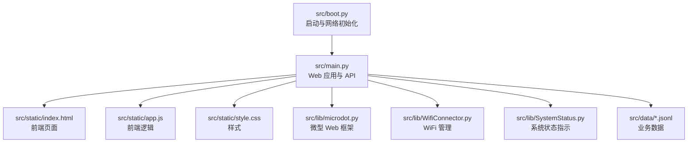
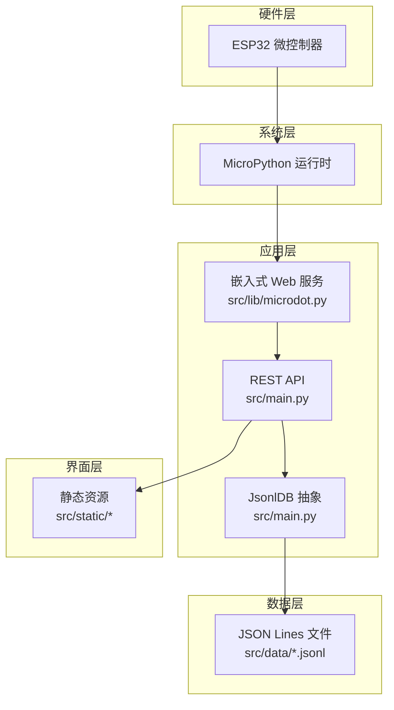
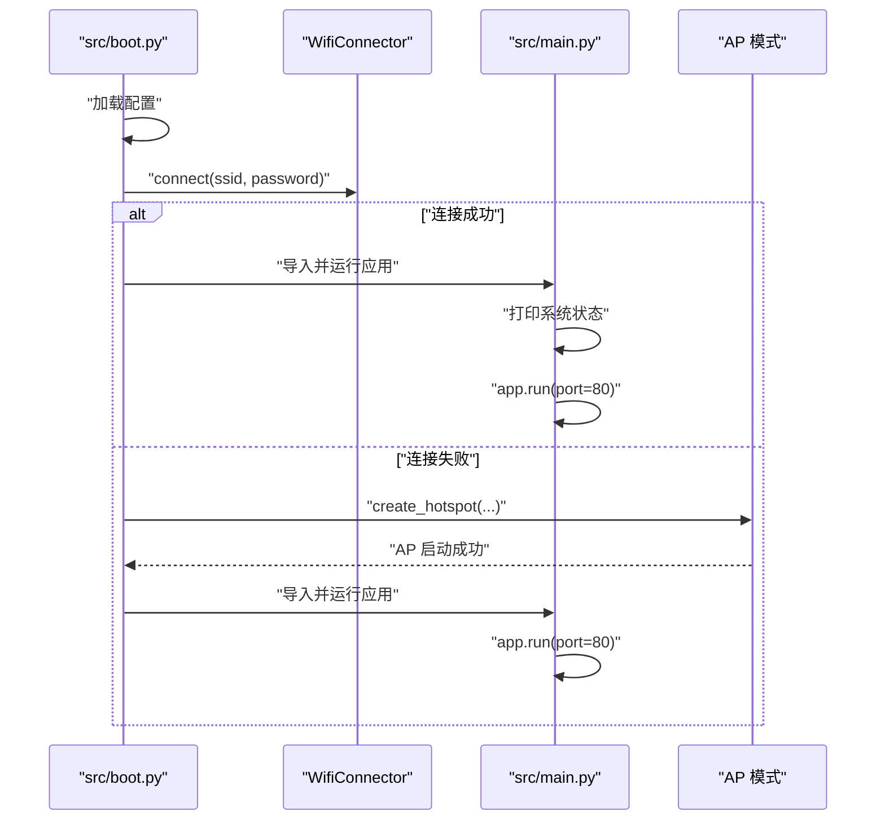
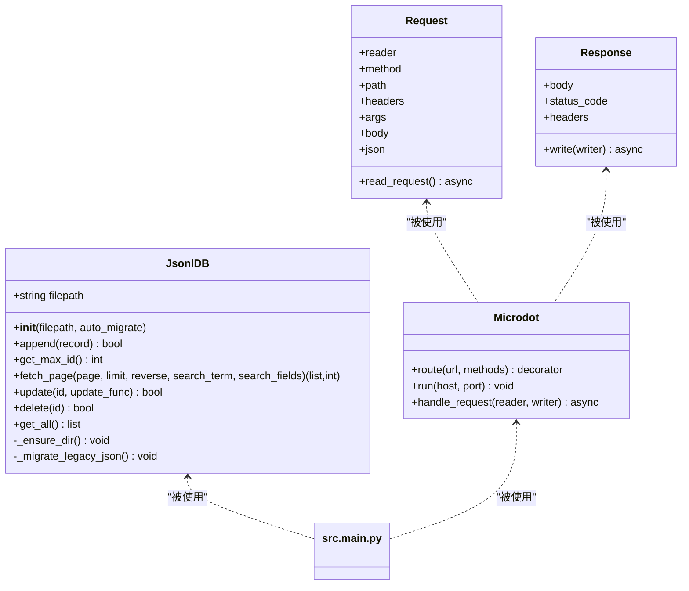
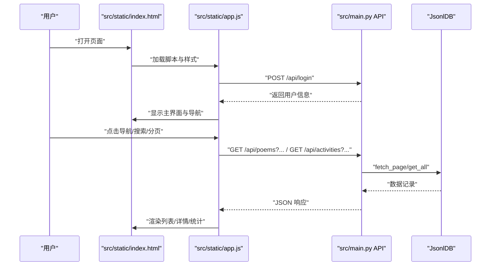
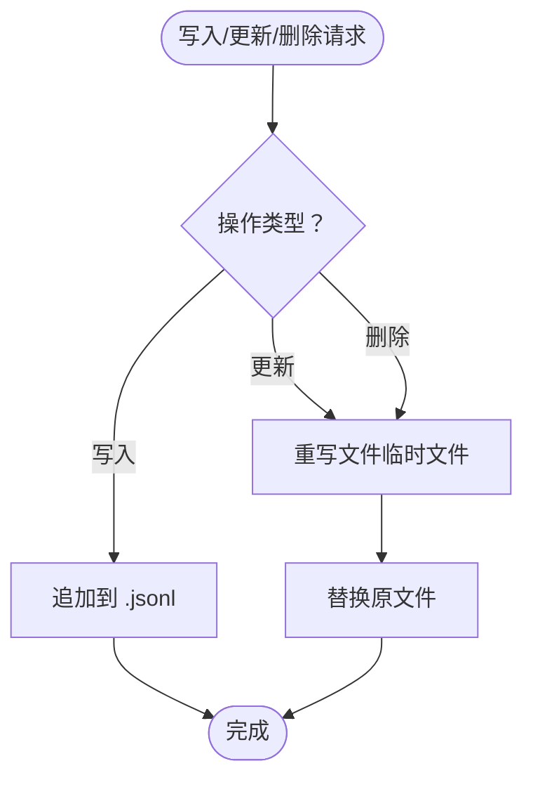
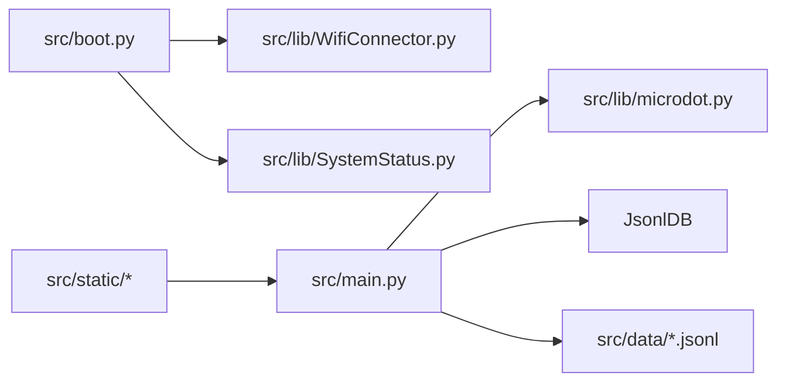

# 项目概述

<cite>
**本文引用的文件**
- [src/boot.py](file://src/boot.py)
- [src/main.py](file://src/main.py)
- [src/static/index.html](file://src/static/index.html)
- [src/static/app.js](file://src/static/app.js)
- [src/static/style.css](file://src/static/style.css)
- [src/lib/WifiConnector.py](file://src/lib/WifiConnector.py)
- [src/lib/SystemStatus.py](file://src/lib/SystemStatus.py)
- [src/lib/microdot.py](file://src/lib/microdot.py)
- [src/data/config.json](file://src/data/config.json)
- [src/data/settings.json](file://src/data/settings.json)
- [src/data/poems.jsonl](file://src/data/poems.jsonl)
- [src/data/members.jsonl](file://src/data/members.jsonl)
- [src/data/activities.jsonl](file://src/data/activities.jsonl)
- [src/data/finance.jsonl](file://src/data/finance.jsonl)
- [src/data/tasks.jsonl](file://src/data/tasks.jsonl)
</cite>

## 更新摘要
**变更内容**
- 更新项目结构以反映所有源文件已移动到src/目录下的重构
- 更新所有文件路径引用以匹配新的src/目录结构
- 更新架构图以反映新的目录组织方式
- 更新项目结构图以展示src/目录的完整布局

## 目录
1. [引言](#引言)
2. [项目结构](#项目结构)
3. [核心组件](#核心组件)
4. [架构总览](#架构总览)
5. [详细组件分析](#详细组件分析)
6. [依赖关系分析](#依赖关系分析)
7. [性能考量](#性能考量)
8. [故障排查指南](#故障排查指南)
9. [结论](#结论)
10. [附录](#附录)

## 引言
围炉诗社·理事台是一个基于 ESP32 微控制器的嵌入式 Web 应用，专为传统诗社管理而设计。项目融合现代技术与传统文化，实现诗歌创作、活动管理、财务管理、成员管理和事务处理的数字化转型。系统通过本地化的嵌入式 Web 服务，提供简洁直观的前端界面与稳定的后端数据持久化能力，既可在局域网内直接访问，也可作为离线或半离线场景下的高效工具。

**更新** 项目已完成结构重构，所有源文件已移动到src/目录下，包括启动引导、主应用、库文件、数据文件和静态资源，提升了项目的组织性和可维护性。

本项目旨在：
- 以最小硬件成本实现稳定运行；
- 提供贴近传统诗社工作流的功能模块；
- 支持本地化部署与快速迭代；
- 通过可视化与交互设计降低使用门槛。

## 项目结构
**更新** 项目采用"嵌入式 Web + 文件数据库"的轻量架构，现已重构为src/目录结构，核心目录如下：
- src/boot.py：启动引导与网络初始化，负责 Wi-Fi 连接与 AP 模式切换；
- src/main.py：核心应用入口，提供 REST API 与静态资源路由；
- src/static/：前端资源（HTML/CSS/JS），包含登录页、导航、各功能页面与模态框；
- src/lib/：嵌入式运行时与工具库（微 Web 框架、WiFi 管理、系统状态指示等）；
- src/data/：以 JSON Lines（.jsonl）为数据存储格式的业务数据集合。

**图表来源**
- [src/boot.py](file://src/boot.py#L88-L122)
- [src/main.py](file://src/main.py#L17-L642)
- [src/static/index.html](file://src/static/index.html#L1-L302)
- [src/static/app.js](file://src/static/app.js#L1-L800)
- [src/static/style.css](file://src/static/style.css)
- [src/lib/microdot.py](file://src/lib/microdot.py#L1-L183)
- [src/lib/WifiConnector.py](file://src/lib/WifiConnector.py#L1-L800)
- [src/lib/SystemStatus.py](file://src/lib/SystemStatus.py#L1-L61)

**章节来源**
- [src/boot.py](file://src/boot.py#L1-L122)
- [src/main.py](file://src/main.py#L1-L642)

## 核心组件
**更新** 项目核心组件已重构到src/目录结构下：
- 启动引导与网络管理
  - src/boot.py 负责 CPU 频率设置、配置加载、Wi-Fi 连接与 AP 模式切换，确保系统在不同网络环境下稳定启动。
- Web 应用与 API
  - src/main.py 提供完整的 REST API，覆盖诗歌、活动、任务、成员、财务与系统信息等模块，并内置静态资源路由。
- 嵌入式 Web 框架
  - src/lib/microdot.py 实现了轻量级的请求解析、响应封装与异步服务器，适配 MicroPython 环境。
- 前端界面与交互
  - src/static/index.html 定义页面结构与导航；src/static/app.js 实现登录、权限控制、分页、搜索、模态框与 IndexedDB 本地草稿等功能。
- 数据持久化
  - src/data/*.jsonl 采用 JSON Lines 格式存储，便于增量写入与流式读取；src/main.py 内置 JsonlDB 抽象，提供增删改查与分页检索能力。
- 系统状态指示
  - src/lib/SystemStatus.py 通过单 LED 的呼吸周期指示系统状态（连接中、AP 模式、运行中），提升运维可见性。

**章节来源**
- [src/boot.py](file://src/boot.py#L1-L122)
- [src/main.py](file://src/main.py#L53-L642)
- [src/lib/microdot.py](file://src/lib/microdot.py#L1-L183)
- [src/static/index.html](file://src/static/index.html#L1-L302)
- [src/static/app.js](file://src/static/app.js#L1-L800)
- [src/lib/SystemStatus.py](file://src/lib/SystemStatus.py#L1-L61)

## 架构总览
**更新** 系统采用"嵌入式 Web 服务器 + 前后端分离"的架构，现已重构为src/目录结构：
- 硬件层：ESP32 微控制器；
- 系统层：MicroPython 运行时；
- 应用层：嵌入式 Web 服务（microdot）+ REST API；
- 数据层：本地 JSON Lines 文件；
- 界面层：静态 HTML/CSS/JS 前端。

**图表来源**
- [src/lib/microdot.py](file://src/lib/microdot.py#L94-L165)
- [src/main.py](file://src/main.py#L53-L642)
- [src/static/index.html](file://src/static/index.html#L1-L302)

## 详细组件分析

### 启动与网络初始化（src/boot.py）
**更新** 启动组件已重构到src/目录：
- 功能要点
  - 设置 CPU 频率为 240 MHz；
  - 加载配置（Wi-Fi SSID/密码、AP SSID/密码）；
  - 尝试连接 Wi-Fi，失败则进入 AP 模式；
  - 启动 main.py 并运行 Web 服务。
- 关键流程
  - 配置校验与默认值处理；
  - 连接重试与超时控制；
  - AP 模式 IP 与热点信息配置；
  - 启动前文件系统检查与延时等待。

**图表来源**
- [src/boot.py](file://src/boot.py#L22-L87)
- [src/lib/WifiConnector.py](file://src/lib/WifiConnector.py#L595-L696)

**章节来源**
- [src/boot.py](file://src/boot.py#L1-L122)

### Web 应用与 API（src/main.py）
**更新** 应用组件已重构到src/目录：
- 核心职责
  - 定义路由与控制器，提供 REST API；
  - 管理 JsonlDB 数据库抽象；
  - 提供静态资源路由；
  - 输出系统信息与状态。
- 数据模型与 API
  - 诗歌：列表、创建、更新、删除、分页与搜索；
  - 活动：列表、创建、更新、删除；
  - 任务：列表、完成（联动成员积分）；
  - 成员：列表、创建、更新、删除、登录；
  - 财务：列表、记账；
  - 系统：设备信息查询；
  - 设置：自定义成员字段管理。
- 数据持久化
  - JsonlDB 支持追加写入、按 ID 更新/删除、分页读取、全文检索；
  - 自动迁移旧版 .json 到 .jsonl；
  - 大数据集采用流式扫描与行偏移缓存，优化内存占用。

**图表来源**
- [src/main.py](file://src/main.py#L53-L642)
- [src/lib/microdot.py](file://src/lib/microdot.py#L5-L165)

**章节来源**
- [src/main.py](file://src/main.py#L53-L642)

### 前端界面与交互（src/static/index.html + src/static/app.js）
**更新** 前端组件已重构到src/static/目录：
- 页面结构
  - 登录页：手机号+密码登录；
  - 主页：近期活动、今日推荐；
  - 功能页：活动、藏诗阁、事务、财务、社员、系统；
  - 模态框：发布新作、记账、录入社员、发起活动、查看活动详情。
- 交互特性
  - 权限控制：仅管理员/理事可见"发起活动/录入社员"按钮；
  - 分页与搜索：支持全局搜索与分页加载；
  - 本地草稿：使用 IndexedDB 缓存未提交的诗歌草稿；
  - 设备状态：后台管理展示平台、存储、内存信息。

**图表来源**
- [src/static/index.html](file://src/static/index.html#L1-L302)
- [src/static/app.js](file://src/static/app.js#L60-L147)
- [src/main.py](file://src/main.py#L309-L642)

**章节来源**
- [src/static/index.html](file://src/static/index.html#L1-L302)
- [src/static/app.js](file://src/static/app.js#L1-L800)

### 数据持久化（JsonlDB 与 JSON Lines）
**更新** 数据组件已重构到src/data/目录：
- 设计思路
  - 采用 JSON Lines 文本文件存储，每行一条记录，便于增量写入与流式处理；
  - 提供分页与搜索能力，避免一次性加载全部数据；
  - 支持按 ID 精确更新/删除，通过临时文件重写实现一致性。
- 典型场景
  - 诗歌与活动：大量记录，采用分页与搜索；
  - 成员与设置：少量记录，直接全量读取；
  - 财务：近期记录较多，限制查询数量；
  - 任务：简单状态机，支持完成与积分联动。

**图表来源**
- [src/main.py](file://src/main.py#L86-L246)

**章节来源**
- [src/main.py](file://src/main.py#L53-L642)

### 系统状态指示（SystemStatus + LED）
**更新** 系统组件已重构到src/lib/目录：
- 设计逻辑
  - 单 LED（GPIO 15）三种呼吸周期：快速（连接中）、中速（AP 模式）、慢速（运行中）；
  - 通过 SystemStatus 统一管理 LED 周期与启动/停止。
- 适用场景
  - 现场部署时直观反映系统状态；
  - 故障排查阶段快速定位网络问题。

**章节来源**
- [src/lib/SystemStatus.py](file://src/lib/SystemStatus.py#L1-L61)
- [src/boot.py](file://src/boot.py#L110-L119)

## 依赖关系分析
**更新** 依赖关系已重构到src/目录结构：
- 组件耦合
  - src/main.py 依赖 microdot 实现 Web 服务，依赖 JsonlDB 管理数据；
  - src/boot.py 依赖 WifiConnector 管理网络，依赖 SystemStatus 控制 LED；
  - 前端通过 API 与后端交互，不直接依赖后端实现细节。
- 外部依赖
  - MicroPython 标准库（network、os、gc、time 等）；
  - 第三方库（microdot）在 src/lib 目录内，便于移植与维护。

**图表来源**
- [src/boot.py](file://src/boot.py#L1-L122)
- [src/main.py](file://src/main.py#L1-L642)
- [src/lib/microdot.py](file://src/lib/microdot.py#L1-L183)
- [src/lib/WifiConnector.py](file://src/lib/WifiConnector.py#L1-L800)
- [src/lib/SystemStatus.py](file://src/lib/SystemStatus.py#L1-L61)

**章节来源**
- [src/boot.py](file://src/boot.py#L1-L122)
- [src/main.py](file://src/main.py#L1-L642)

## 性能考量
- 内存与存储
  - JsonlDB 在大数据集场景下采用行偏移缓存与流式扫描，减少内存峰值；
  - 通过限制查询数量（如财务列表默认 100 条）避免一次性加载过多数据。
- 网络与并发
  - microdot 为同步风格的异步服务器，适合嵌入式场景；
  - 建议在高并发需求时评估升级方案或引入外部代理。
- 前端体验
  - IndexedDB 本地草稿提升离线写作体验；
  - 分页与搜索减少首屏压力，提升交互流畅度。

## 故障排查指南
- 启动与网络
  - 若无法连接 Wi-Fi，检查配置文件中的 SSID/密码是否正确；
  - 若多次连接失败，系统将自动切换到 AP 模式，可通过热点访问管理界面。
- API 访问
  - 确认端口 80 已被占用，必要时更换端口或关闭冲突服务；
  - 检查路由路径与请求方法是否匹配。
- 数据一致性
  - 更新/删除操作依赖 ID 匹配，确认传入的 id 是否存在；
  - 如遇写入失败，检查文件权限与存储空间。
- 前端问题
  - 登录失败多为账号或密码错误，确认成员数据中是否存在该手机号；
  - 搜索无结果可能由于编码或关键词不匹配，尝试简化关键词。

**章节来源**
- [src/boot.py](file://src/boot.py#L22-L87)
- [src/main.py](file://src/main.py#L309-L642)
- [src/static/app.js](file://src/static/app.js#L75-L98)

## 结论
围炉诗社·理事台以 ESP32 为载体，构建了轻量、稳定、易用的嵌入式 Web 应用。通过将传统诗社管理流程与现代技术结合，系统实现了从"纸质记录"到"数字化协作"的转变。其核心优势包括：
- 低成本、低功耗、即插即用；
- 本地化部署，隐私与可控性强；
- 功能完备，覆盖诗社日常管理的关键环节；
- 前后端分离清晰，易于扩展与维护。

**更新** 项目结构重构进一步提升了系统的组织性和可维护性，src/目录结构使得代码层次更加清晰，便于团队协作和长期维护。

## 附录
- 数据样例
  - 诗歌样例：见 src/data/poems.jsonl；
  - 成员样例：见 src/data/members.jsonl；
  - 活动样例：见 src/data/activities.jsonl；
  - 财务样例：见 src/data/finance.jsonl；
  - 任务样例：见 src/data/tasks.jsonl。
- 配置样例
  - Wi-Fi 与 AP 配置：见 src/data/config.json；
  - 自定义字段：见 src/data/settings.json。

**章节来源**
- [src/data/poems.jsonl](file://src/data/poems.jsonl#L1-L4)
- [src/data/members.jsonl](file://src/data/members.jsonl#L1-L4)
- [src/data/activities.jsonl](file://src/data/activities.jsonl#L1-L7)
- [src/data/finance.jsonl](file://src/data/finance.jsonl#L1-L3)
- [src/data/tasks.jsonl](file://src/data/tasks.jsonl#L1-L2)
- [src/data/config.json](file://src/data/config.json#L1-L6)
- [src/data/settings.json](file://src/data/settings.json#L1-L1)